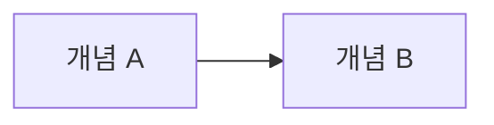

<!--
  개요·로드맵 글 = 리뷰 논문(서베이).
    초록 → 1. 범위 → 2. 분류 → 3. 개념별 요약 → 4. 개념 간 관계 → 5. 흔한 오해 → 6. 결론과 학습 순서
  각 개념의 상세는 단일 개념 글(_TEMPLATE_concept)로 링크하고 여기서는 반복하지 않는다.
  H2 는 번호 붙은 장, H3 는 절. `---` 는 H2 사이에만.
  지우고 쓰기 시작한다.
-->

::: abstract
다루는 개념 목록. 이 개념들을 나누는 기준. 전체를 한 문장으로 연결하는 결론.
:::

## 1. 범위

### 1.1 다루는 개념

### 1.2 다루지 않는 것

### 1.3 선행 지식

---

## 2. 분류

### 2.1 개념 지도



### 2.2 비교 표

| 개념 | 정의 | 언제 동작하나 | 사양 위치 |
| --- | --- | --- | --- |
| A | | | |

---

## 3. 개념별 요약

### 3.1 개념 A

정의 두세 문장. 상세는 [개념 A →](/post/a-slug).

### 3.2 개념 B

---

## 4. 개념 간 관계

### 4.1 실행 순서

```seq
title: 한 번의 실행에서 개념들이 등장하는 순서
lane a  A
lane b  B

step 첫 장면.
  push a 값
```

### 4.2 의존 관계

---

## 5. 흔한 오해

::: warning
오해 한 가지와, 사양 기준으로 실제 동작.
:::

---

## 6. 결론과 학습 순서

- 전체를 연결하는 사실 3~5줄
- 학습 순서: [A →](/post/a-slug) → [B →](/post/b-slug)

## 참고

<ol>
<li><a href="https://html.spec.whatwg.org/" target="_blank">[1] 절 이름 — HTML Standard</a></li>
</ol>

---

## 관련 글

- [개념 A →](/post/a-slug)
