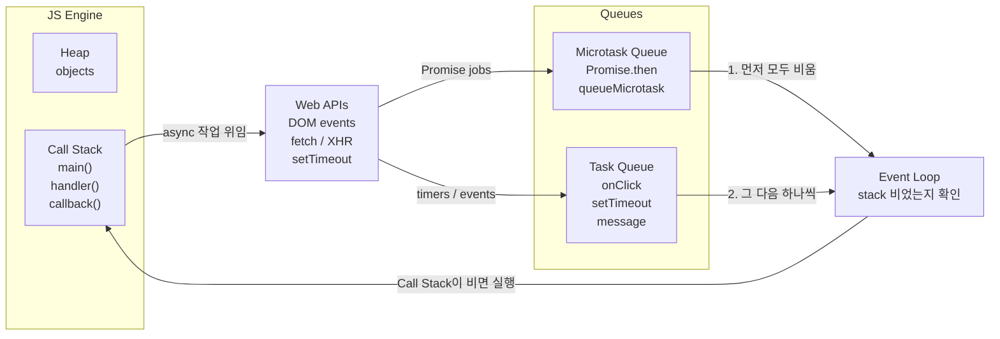

## 이 시리즈 구성

| 포스트 | 내용 |
|---|---|
| [로드맵 인덱스 →](/post/ai-webdev-roadmap-foundation) | 01~19 전체 학습 경로 |
| [01-1. JS 이벤트 루프와 비동기 →](/post/js-event-loop-and-async) | 콜 스택, 큐, 마이크로태스크 |
| [01-2. setTimeout과 Promise →](/post/settimeout-vs-promise) | 비동기 실행 순서 예측 |
| [01-3. React 단방향 데이터 흐름 →](/post/react-component-data-flow) | props/state, state 끌어올리기 |
| [01-4. controlled vs uncontrolled →](/post/react-controlled-vs-uncontrolled) | React 폼 설계 |
| [01-5. TypeScript 타입 시스템 기초 →](/post/typescript-type-system-basics) | any, unknown, union, narrowing |

---

## 개요

JavaScript 엔진은 싱글 스레드로 동작하며 한 시점에 하나의 작업만 실행한다.
그런데도 `setTimeout`, `fetch`, `Promise` 가 동시에 진행되는 것처럼 보이는 이유는,
타이머·네트워크·DOM 이벤트 처리를 엔진 밖의 런타임(브라우저, Node.js)이 담당하고,
완료된 작업의 콜백을 이벤트 루프가 순서대로 엔진에 전달하기 때문이다.

이 구조를 알면 콜백 실행 순서를 규칙에서 바로 도출할 수 있다.

---

## 콜 스택과 큐의 구성



구성 요소는 네 가지다.

- 콜 스택(Call Stack): 현재 실행 중인 함수의 실행 컨텍스트가 쌓이는 LIFO 구조
- Web API: 타이머, 네트워크 요청, DOM 이벤트를 처리하는 런타임 기능
- 태스크 큐(Task Queue): `setTimeout` 콜백, DOM 이벤트 핸들러가 대기하는 큐
- 마이크로태스크 큐(Microtask Queue): `Promise.then`, `queueMicrotask` 콜백이 대기하는 큐. 태스크 큐보다 먼저 처리된다

---

## 콜 스택의 동작

```js
function a() {
  console.log('a 시작')
  b()
  console.log('a 끝')
}

function b() {
  console.log('b 실행')
}

a()
```

실행 순서는 다음과 같다.

1. `a()` 가 호출되어 스택에 push 된다
2. `a` 안에서 `b()` 가 호출되어 그 위에 push 된다
3. `b()` 가 반환되며 pop 된다
4. `a()` 가 반환되며 pop 된다

스택 최상단의 함수가 반환되기 전까지 엔진은 다른 코드를 실행하지 않는다(run-to-completion).

---

## 비동기 작업의 처리 위치

```js
console.log('1')

setTimeout(() => {
  console.log('2')
}, 0)

console.log('3')
```

출력은 `1`, `3`, `2` 다.

`setTimeout` 은 콜백을 즉시 실행하지 않고 브라우저 타이머(Web API)에 등록한 뒤 바로 반환한다.
지연 시간이 지나면 콜백이 태스크 큐에 추가되고, 콜 스택이 비었을 때 이벤트 루프가 이를 꺼내 실행한다.

::: notice
`setTimeout(..., 0)` 은 즉시 실행이 아니라 다음 태스크로 예약하는 것에 가깝다.
현재 실행 중인 동기 코드가 끝나기 전에는 실행되지 않는다.
:::

---

## 마이크로태스크와 태스크의 우선순위

```js
console.log('1')

setTimeout(() => console.log('2'), 0)

Promise.resolve().then(() => console.log('3'))

console.log('4')
```

출력은 `1`, `4`, `3`, `2` 다.

1. 동기 코드가 실행된다 (`1`, `4`)
2. 콜 스택이 빈다
3. 마이크로태스크 큐를 끝까지 비운다 (`3`)
4. 태스크 큐에서 태스크 하나를 꺼내 실행한다 (`2`)

따라서 같은 시점에 예약된 `Promise.then` 콜백은 `setTimeout` 콜백보다 먼저 실행된다.

---

## 이벤트 루프의 처리 순서

이벤트 루프는 다음 과정을 반복한다.

1. 태스크 큐에서 가장 오래된 태스크 하나를 꺼내 콜 스택이 빌 때까지 실행한다
2. 마이크로태스크 큐가 빌 때까지 모두 실행한다
3. 필요하면 렌더링(스타일 계산, 레이아웃, 페인트)을 수행한다
4. 1번으로 돌아간다

스크립트 최초 실행도 하나의 태스크이므로, 동기 코드 → 마이크로태스크 → 다음 태스크 순서가 된다.

---

## 브라우저의 주요 비동기 작업 분류

| 작업 | 분류 |
|---|---|
| `setTimeout`, `setInterval` | 태스크 |
| 클릭, 입력, 스크롤 등 DOM 이벤트 | 태스크 |
| `fetch` 응답 처리 (`.then`) | 마이크로태스크 |
| `Promise.then`, `catch`, `finally` | 마이크로태스크 |
| `queueMicrotask` | 마이크로태스크 |
| `await` 이후의 코드 | 마이크로태스크 |

---

## React 와의 관계

React 의 상태 업데이트, effect 실행, 비동기 데이터 로딩도 모두 이 이벤트 루프 위에서 동작한다.
클릭 핸들러 안에 동기 로그, Promise 콜백, 타이머가 함께 있으면 각각 다른 시점에 실행되므로,
실행 순서를 알아야 렌더링 시점과 상태 값을 정확히 예측할 수 있다.

실행 순서 예측 연습은 [setTimeout과 Promise의 실행 순서 →](/post/settimeout-vs-promise)에서 이어진다.

---

## 정리

비동기 작업은 엔진 밖의 런타임에서 처리되고, 완료된 콜백은 큐에서 대기하다가 콜 스택이 비었을 때
실행된다. 큐 사이의 우선순위는 동기 코드, 마이크로태스크 큐 전체, 태스크 하나 순이다.

이 순서는 이후 `fetch` 응답 처리, React 상태 업데이트, Node.js 이벤트 루프를 이해할 때도 그대로 적용된다.

### 실무에서 자주 발생하는 문제

프론트엔드 버그 중 상당수는 데이터 자체가 아니라 실행 시점을 잘못 예상해서 생긴다. 클릭 핸들러에서
상태를 바꾸고, Promise 콜백에서 다시 상태를 바꾸고, 타이머로 UI 를 닫는 코드가 섞이면
각 코드의 실행 시점이 달라 의도와 다른 화면이 나온다.

가장 흔한 경우는 `setTimeout(..., 0)` 을 즉시 실행으로 생각하는 것이다. 0ms 는 현재 콜 스택과
대기 중인 마이크로태스크가 모두 처리된 뒤 가능한 빨리 실행된다는 의미다.

---

## 참고

<ol>
<li><a href="https://developer.mozilla.org/en-US/docs/Web/API/HTML_DOM_API/Microtask_guide/In_depth" target="_blank">[1] MDN — In depth: Microtasks and the JavaScript runtime environment</a></li>
<li><a href="https://nodejs.org/learn/asynchronous-work/the-nodejs-event-loop" target="_blank">[2] Node.js Learn — The Node.js Event Loop</a></li>
</ol>

---

## 관련 글

- [setTimeout과 Promise의 실행 순서 →](/post/settimeout-vs-promise)
- [Node.js · Bun · Deno 런타임 비교 →](/post/js-runtime-node-bun-deno)
- [React 단방향 데이터 흐름 →](/post/react-component-data-flow)
- [AI 웹개발자 로드맵 Foundation 01~19 →](/post/ai-webdev-roadmap-foundation)
