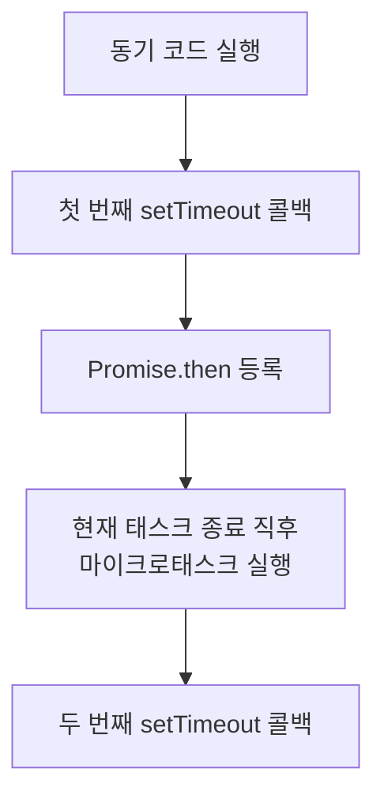

## 이 시리즈 구성

| 포스트 | 내용 |
|---|---|
| [로드맵 인덱스 →](/post/ai-webdev-roadmap-foundation) | 01~19 전체 학습 경로 |
| [01-1. JS 이벤트 루프와 비동기 →](/post/js-event-loop-and-async) | 콜스택, 큐, 마이크로태스크 |
| [01-2. setTimeout과 Promise →](/post/settimeout-vs-promise) | 비동기 실행 순서 예측 |
| [01-3. React 단방향 데이터 흐름 →](/post/react-component-data-flow) | props/state, state 끌어올리기 |
| [01-4. controlled vs uncontrolled →](/post/react-controlled-vs-uncontrolled) | React 폼 설계 |
| [01-5. TypeScript 타입 시스템 기초 →](/post/typescript-type-system-basics) | any, unknown, union, narrowing |

---

## 다루는 내용

이벤트 루프의 구조를 알아도 실제 코드의 출력 순서를 바로 예측하기는 어렵다.
이 글은 다음 세 가지 경우를 예제로 확인한다.

- `setTimeout(..., 0)` 콜백의 실행 시점
- `Promise.then()` 콜백이 실행되는 시점
- Promise 콜백 안의 `setTimeout`, `setTimeout` 콜백 안의 Promise 의 순서

---

## 처리 규칙

예제는 모두 다음 규칙으로 설명된다.

1. 현재 실행 중인 동기 코드를 끝낸다.
2. 콜 스택이 비면 마이크로태스크 큐를 빌 때까지 처리한다.
3. 태스크 큐에서 태스크 하나를 꺼내 실행하고, 다시 2번으로 돌아간다.

API 별 분류는 다음과 같다.

- `Promise.then`, `catch`, `finally`, `queueMicrotask`: 마이크로태스크
- `setTimeout`, `setInterval`, DOM 이벤트 콜백: 태스크

---

## 예제 1: 기본 순서

```js
console.log('A')

setTimeout(() => {
  console.log('B')
}, 0)

Promise.resolve().then(() => {
  console.log('C')
})

console.log('D')
```

출력은 `A`, `D`, `C`, `B` 다.

- `A`, `D` 는 동기 코드이므로 먼저 실행된다.
- `C` 는 마이크로태스크 큐에 등록된다.
- `B` 는 타이머 만료 후 태스크 큐에 등록된다.
- 동기 코드가 끝나면 마이크로태스크(`C`)를 먼저 처리하고, 이후 태스크(`B`)를 처리한다.

---

## 예제 2: Promise 콜백 안의 setTimeout

```js
console.log('1')

Promise.resolve().then(() => {
  console.log('2')
  setTimeout(() => console.log('3'), 0)
})

setTimeout(() => console.log('4'), 0)

console.log('5')
```

출력은 `1`, `5`, `2`, `4`, `3` 이다.

1. 동기 코드 `1`, `5` 가 실행된다.
2. 마이크로태스크 `2` 가 실행된다.
3. `2` 를 실행하는 중에 `3` 의 타이머가 등록된다.
4. `4` 의 타이머가 먼저 등록되었으므로 태스크 큐에서도 `4` 가 `3` 보다 앞선다.

같은 종류의 태스크는 등록된 순서대로 실행된다.

---

## 예제 3: setTimeout 콜백 안의 Promise

```js
console.log('a')

setTimeout(() => {
  console.log('b')
  Promise.resolve().then(() => console.log('c'))
}, 0)

setTimeout(() => console.log('d'), 0)

console.log('e')
```

출력은 `a`, `e`, `b`, `c`, `d` 다.

첫 번째 타이머 콜백(`b`) 안에서 `Promise.then()` 으로 등록한 `c` 는 마이크로태스크다.
이벤트 루프는 태스크 하나를 끝낸 직후 마이크로태스크 큐를 먼저 비우므로, `c` 가 다음 태스크인 `d` 보다 먼저 실행된다.



---

## 예제 4: 마이크로태스크 큐는 빌 때까지 처리된다

```js
console.log('start')

Promise.resolve().then(() => {
  console.log('m1')
  Promise.resolve().then(() => console.log('m2'))
})

setTimeout(() => console.log('t1'), 0)
```

출력은 `start`, `m1`, `m2`, `t1` 이다.

`m1` 실행 중에 등록된 `m2` 도 같은 마이크로태스크 처리 단계에서 실행된다.
이벤트 루프는 마이크로태스크 큐가 완전히 빌 때까지 태스크로 넘어가지 않는다.

::: warning
마이크로태스크가 계속 새 마이크로태스크를 등록하면 태스크 큐의 작업과 렌더링이 그만큼 지연된다.
연쇄가 끝나지 않으면 페이지가 응답하지 않는다.
:::

---

## 실무에서 관련되는 부분

- React 이벤트 핸들러 이후 이어지는 비동기 처리 순서
- 테스트 코드에서 비동기 작업의 완료 시점
- 타이머, API 응답, 상태 업데이트가 섞인 코드의 디버깅

렌더링 문제처럼 보이는 버그가 실제로는 콜백 실행 순서 문제인 경우가 있다.

---

## 연습 방법

1. 코드를 읽고 출력 순서를 적는다.
2. 각 줄이 동기, 마이크로태스크, 태스크 중 어디에 속하는지 표시한다.
3. 실제 실행 결과와 비교한다.

2번에서 분류를 설명할 수 없다면 규칙을 다시 확인한다.

::: tip
각 예제를 Node.js 나 브라우저 콘솔에서 실행해 결과를 비교할 수 있다.
:::

## 추가 내용

### 면접에서 자주 나오는 이유

`setTimeout` 과 `Promise` 의 실행 순서 문제는 JavaScript 를 순차 실행 코드로만 이해하는지,
런타임의 큐와 이벤트 루프를 포함한 실행 모델로 이해하는지 확인하는 데 쓰인다.

### 테스트 코드에서 주의할 점

컴포넌트 테스트에서 클릭 직후 바로 값을 검사하면 Promise 콜백이 아직 실행되지 않았을 수 있다.
타이머 기반 UI 는 fake timer 를 쓰지 않으면 테스트 결과가 실행 환경에 따라 달라질 수 있다.

### 디버깅

로그에 숫자만 남기지 말고 `"sync start"`, `"microtask"`, `"timer"` 처럼 어느 큐에서 실행된 코드인지 함께 남긴다.
등록 순서와 실행 순서는 다르다.

---

## 참고

<ol>
<li><a href="https://developer.mozilla.org/en-US/docs/Web/API/HTML_DOM_API/Microtask_guide/In_depth" target="_blank">[1] MDN — In depth: Microtasks and the JavaScript runtime environment</a></li>
<li><a href="https://developer.mozilla.org/en-US/docs/Web/JavaScript/Reference/Global_Objects/Promise" target="_blank">[2] MDN — Promise</a></li>
</ol>

---

## 관련 글

- [JS 이벤트 루프와 비동기 처리 구조 →](/post/js-event-loop-and-async)
- [React 단방향 데이터 흐름 →](/post/react-component-data-flow)
- [Node.js · Bun · Deno 런타임 비교 →](/post/js-runtime-node-bun-deno)
- [AI 웹개발자 로드맵 (Foundation 01~19) →](/post/ai-webdev-roadmap-foundation)
