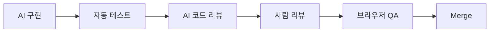

## AI가 만든 코드는 반드시 검증해야 한다

AI 코드의 문제는 "가끔 틀린다"가 아니라, **그럴듯하게 틀릴 수 있다**는 점이다.

따라서 검증 루프가 필요하다.

- 품질: 읽기 쉬운가
- 보안: 민감한 경계가 안전한가
- 성능: 불필요한 비용이 없는가
- UX: 사용자가 실제로 성공할 수 있는가

---

## 코드 리뷰 기준

Google Engineering Practices는 코드 리뷰에서 설계, 기능, 복잡도, 테스트, 이름, 스타일 등을 보라고 정리한다.<a href="https://google.github.io/eng-practices/review/reviewer/looking-for.html" target="_blank"><sup>[1]</sup></a>

AI 코드도 같은 기준으로 봐야 한다.

---

## 보안·성능·UX 검증

보안은 OWASP 기준을, 성능은 Lighthouse/Web Vitals를, 접근성과 UX는 WCAG와 실제 사용자 흐름을 참고한다.

AI 리뷰 프롬프트도 이 축으로 나누는 편이 좋다.

```text
이 diff를 보안 관점에서 검토해줘.
인증/인가, 입력 검증, secret 노출, SSRF/XSS 가능성을 우선으로 봐줘.
```

::: warning
AI 리뷰는 사람 리뷰를 대체하지 않는다. 대신 사람이 놓치기 쉬운 반복 체크를 빠르게 수행하는 보조 리뷰어로 두는 편이 안전하다.
:::

---

## 추천 검증 루프



---

## 참고

<ol>
<li><a href="https://google.github.io/eng-practices/review/reviewer/looking-for.html" target="_blank">[1] Google Engineering Practices — What to look for in a code review</a></li>
<li><a href="https://owasp.org/www-project-top-ten/" target="_blank">[2] OWASP Top 10</a></li>
<li><a href="https://web.dev/vitals/" target="_blank">[3] web.dev — Core Web Vitals</a></li>
<li><a href="https://www.w3.org/WAI/standards-guidelines/wcag/" target="_blank">[4] W3C WAI — WCAG</a></li>
<li><a href="https://docs.github.com/en/copilot/using-github-copilot/code-review/using-copilot-code-review" target="_blank">[5] GitHub Docs — Using Copilot code review</a></li>
</ol>

---

## 관련 글

- [AI 개발 프로세스 →](/post/ai-development-process-spec-tdd-hooks)
- [관측 & 보안 →](/post/observability-security-sentry-posthog-otel-npm-audit)
- [빌드 · 성능 · a11y →](/post/build-performance-a11y-vite-turbopack-lighthouse-wcag)
- [AI 웹개발자 로드맵 — Foundation 01~19 →](/post/ai-webdev-roadmap-foundation)
