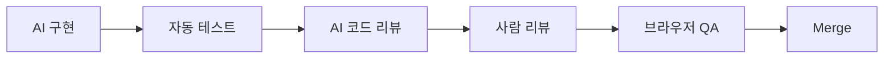

---
title: "AI 코드 검증 — 품질·보안·성능·UX 리뷰 루프"
slug: ai-code-verification-review-quality-security-performance-ux
category: study/ai/review
tags: [ai-review, code-review, quality, security, performance, ux]
author: Seobway
readTime: 12
featured: false
coverImage: /roadmap-thumbnails/step-19-ai-review.svg
createdAt: 2026-04-16
excerpt: >
  Operating & Growing 19 단계. AI가 만든 코드를 품질, 보안, 성능, UX 관점에서
  검증하고 AI 기반 코드 리뷰 루프를 만드는 방법을 정리한다.
---

## 이 시리즈 구성

| 단계 | 포스트 | 내용 |
|---|---|---|
| 15 | [배포 & 운영 →](/post/deployment-vercel-railway-github-actions) | Vercel, Railway, GitHub Actions |
| 16 | [아키텍처 패턴 →](/post/architecture-patterns-layered-component-clean) | 레이어, 컴포넌트 기반 설계, 클린 아키텍처 |
| 17 | [관측 & 보안 →](/post/observability-security-sentry-posthog-otel-npm-audit) | Sentry, PostHog, OpenTelemetry, npm audit |
| 18 | [AI 개발 프로세스 →](/post/ai-development-process-spec-tdd-hooks) | 작업 분할, Spec, TDD Workflow, Hook 설계 |
| 19 | [AI 코드 검증 →](/post/ai-code-verification-review-quality-security-performance-ux) | 품질, 보안, 성능, UX 검증 |

---

## AI가 만든 코드는 반드시 검증해야 한다

AI 코드의 문제는 "가끔 틀린다"가 아니라, **그럴듯하게 틀릴 수 있다**는 점이다.

따라서 검증 루프가 필요하다.

- 품질: 읽기 쉬운가
- 보안: 민감한 경계가 안전한가
- 성능: 불필요한 비용이 없는가
- UX: 사용자가 실제로 성공할 수 있는가

---

## 코드 리뷰 기준

Google Engineering Practices는 코드 리뷰에서 설계, 기능, 복잡도, 테스트, 이름, 스타일 등을 보라고 정리한다.<a href="https://google.github.io/eng-practices/review/reviewer/looking-for.html" target="_blank"><sup>[1]</sup></a>

AI 코드도 같은 기준으로 봐야 한다.

---

## 보안·성능·UX 검증

보안은 OWASP 기준을, 성능은 Lighthouse/Web Vitals를, 접근성과 UX는 WCAG와 실제 사용자 흐름을 참고한다.

AI 리뷰 프롬프트도 이 축으로 나누는 편이 좋다.

```text
이 diff를 보안 관점에서 검토해줘.
인증/인가, 입력 검증, secret 노출, SSRF/XSS 가능성을 우선으로 봐줘.
```

::: warning
AI 리뷰는 사람 리뷰를 대체하지 않는다. 대신 사람이 놓치기 쉬운 반복 체크를 빠르게 수행하는 보조 리뷰어로 두는 편이 안전하다.
:::

---

## 추천 검증 루프



---

## 조금 더 깊게 보기

### AI 코드 리뷰는 다른 관점을 빠르게 추가하는 일이다

AI 리뷰는 사람 리뷰를 대체하지 않는다. 대신 보안, 성능, 접근성, 테스트 누락처럼 반복적으로 확인해야 하는 관점을 빠르게 추가할 수 있다. 특히 diff가 크거나 리뷰어가 피곤할 때 두 번째 시선으로 유용하다.

### 품질 리뷰

품질 리뷰에서는 이름, 책임, 중복, 복잡도, 테스트 가능성을 본다. AI가 만든 코드는 동작은 하지만 불필요하게 복잡하거나, 한 함수에 많은 책임을 몰아넣는 경우가 있다. 이런 구조는 나중에 사람이 유지보수하기 어렵다.

### 보안 리뷰

보안 리뷰에서는 인증/인가, 입력 검증, secret 노출, XSS, SSRF, SQL injection, 권한 우회 가능성을 우선으로 본다. 특히 AI는 happy path 구현에 강하지만 악의적 입력과 권한 경계는 놓칠 수 있다.

### UX 리뷰

UX 리뷰는 화면이 예쁜지보다 사용자가 목표를 달성할 수 있는지를 본다. 로딩, 에러, 빈 상태, 모바일, 키보드 접근, 색 대비를 확인한다. AI가 만든 UI는 정상 데이터가 있을 때만 그럴듯한 경우가 많기 때문에 상태별 검증이 필수다.

---

## 실전 적용 시나리오

AI가 로그인 기능을 구현했다고 하자. 바로 merge하지 않는다. 먼저 테스트를 실행한다. 다음으로 diff를 보며 인증 흐름, 세션 저장, redirect 처리, 에러 메시지를 확인한다. 그 다음 AI에게 보안 관점 리뷰를 시키고, 별도로 UX 관점 리뷰를 시킨다.

AI 리뷰 프롬프트는 한 번에 모든 것을 묻기보다 관점을 나누는 편이 좋다. "보안만 봐줘", "성능만 봐줘", "접근성과 빈 상태만 봐줘"처럼 좁히면 결과가 더 구체적이다.

### 최종 판단은 사람이 한다

AI가 문제 없다고 말해도 사람이 책임을 져야 한다. AI 리뷰 결과는 체크리스트의 입력일 뿐이다. 특히 보안, 결제, 개인정보, 데이터 삭제처럼 위험도가 높은 영역은 사람 리뷰와 테스트, 가능하면 별도 QA를 거쳐야 한다.

## 참고

<ol>
<li><a href="https://google.github.io/eng-practices/review/reviewer/looking-for.html" target="_blank">[1] Google Engineering Practices — What to look for in a code review</a></li>
<li><a href="https://owasp.org/www-project-top-ten/" target="_blank">[2] OWASP Top 10</a></li>
<li><a href="https://web.dev/vitals/" target="_blank">[3] web.dev — Core Web Vitals</a></li>
<li><a href="https://www.w3.org/WAI/standards-guidelines/wcag/" target="_blank">[4] W3C WAI — WCAG</a></li>
<li><a href="https://docs.github.com/en/copilot/using-github-copilot/code-review/using-copilot-code-review" target="_blank">[5] GitHub Docs — Using Copilot code review</a></li>
</ol>

---

## 관련 글

- [AI 개발 프로세스 →](/post/ai-development-process-spec-tdd-hooks)
- [관측 & 보안 →](/post/observability-security-sentry-posthog-otel-npm-audit)
- [빌드 · 성능 · a11y →](/post/build-performance-a11y-vite-turbopack-lighthouse-wcag)
- [AI 웹개발자 로드맵 — Foundation 01~19 →](/post/ai-webdev-roadmap-foundation)
