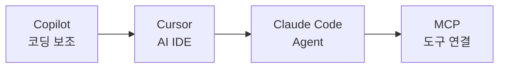

---
title: "AI 코딩 도구 기초 — Cursor, Copilot, Claude Code, MCP를 어떻게 구분할까"
slug: ai-coding-tools-cursor-copilot-claude-code-mcp
category: study/ai/workflow
tags: [ai-workflow, cursor, github-copilot, claude-code, mcp, ai-ide, agent]
author: Seobway
readTime: 12
featured: false
coverImage: /roadmap-thumbnails/step-06-ai-tools.svg
createdAt: 2026-04-16
excerpt: >
  Foundation 06 단계의 AI Workflow 입문 글. AI IDE, 코딩 보조 도구, 에이전트형 도구,
  MCP를 서로 구분하고 어떤 순서로 익히면 좋은지 정리한다.
---

## 이 시리즈 구성

| 단계 | 포스트 | 내용 |
|---|---|---|
| 01 | [브라우저 & 클라이언트 →](/post/js-event-loop-and-async) | JS 비동기, React 설계, TypeScript |
| 02 | [서버 & 데이터 →](/post/js-runtime-node-bun-deno) | 런타임, HTTP, Hono, SQL |
| 03 | [코드 품질 →](/post/code-quality-eslint-prettier-biome) | 가독성, 리팩토링, ESLint, Prettier, Biome |
| 04 | [Git & 릴리즈 →](/post/git-branching-conventional-commits-husky) | 브랜치 전략, Conventional Commits, Husky |
| 05 | [UI & 스타일링 →](/post/modern-css-tailwind-shadcn) | 모던 CSS, Tailwind, shadcn/ui |
| 06 | [AI 코딩 도구 →](/post/ai-coding-tools-cursor-copilot-claude-code-mcp) | Cursor, Copilot, Claude Code, MCP |
| 07 | [DB & ORM →](/post/db-orm-postgres-drizzle-neon-supabase) | PostgreSQL, Drizzle, Neon, Supabase |

---

## AI 도구는 전부 같은 챗봇이 아니다

AI 코딩 도구를 처음 보면 전부 "코드 짜 주는 도구"처럼 보인다.

하지만 실제로는 역할이 다르다.

- IDE 안에서 제안해 주는 도구
- 파일과 터미널을 직접 다루는 에이전트
- 외부 도구와 연결하는 프로토콜
- 팀 규칙과 메모리를 읽는 워크플로

Foundation 단계에서는 기능을 많이 쓰기보다 **각 도구가 어디까지 할 수 있는지**를 구분하는 것이 먼저다.

---

## GitHub Copilot — IDE 안의 코딩 보조자

GitHub Copilot은 에디터 안에서 코드 제안, 채팅, 설명, 테스트 생성 등을 도와주는 도구다.<a href="https://docs.github.com/en/copilot" target="_blank">[1]</a>

잘 맞는 일:

- 반복 코드 자동완성
- 함수 설명 받기
- 테스트 초안 만들기
- 작은 리팩토링 힌트 얻기

Copilot은 "같이 타이핑하는 페어"에 가깝게 생각하면 좋다.

---

## Cursor — AI IDE

Cursor는 AI 기능을 중심에 둔 코드 에디터다.<a href="https://docs.cursor.com/" target="_blank">[2]</a>

특히 Rules 파일, 코드베이스 검색, 파일 단위 수정 같은 흐름을 통해 "프로젝트 맥락을 읽고 수정하는 IDE" 경험을 제공한다.

잘 맞는 일:

- 코드베이스를 보며 질문하기
- 여러 파일 수정 초안 만들기
- 프로젝트 규칙을 IDE에 알려주기

---

## Claude Code — 에이전트형 개발 도구

Claude Code는 터미널에서 동작하는 에이전트형 코딩 도구다.<a href="https://docs.anthropic.com/en/docs/claude-code/overview" target="_blank">[3]</a>

IDE 보조자보다 한 단계 더 나아가, 파일을 읽고 수정하고 명령을 실행하며 작업을 이어갈 수 있다.

잘 맞는 일:

- 기능 구현 흐름 전체 맡기기
- 테스트 실행과 수정 반복
- 리팩토링 계획 수립
- 문서와 코드 동시 정리

::: warning
에이전트형 도구는 강력하지만, 그만큼 권한과 검증이 중요하다. 파일 수정, 셸 명령, Git 작업은 항상 결과를 확인해야 한다.
:::

---

## MCP — 도구 연결을 위한 프로토콜

MCP(Model Context Protocol)는 모델과 외부 도구, 데이터 소스를 연결하기 위한 프로토콜이다.<a href="https://modelcontextprotocol.io/introduction" target="_blank">[4]</a>

예를 들어 AI가 다음을 안전한 방식으로 사용할 수 있게 하는 연결층으로 볼 수 있다.

- 문서 저장소
- 이슈 트래커
- 데이터베이스
- 브라우저 자동화
- 사내 도구

MCP는 특정 AI IDE 하나의 기능이라기보다, AI 도구 생태계가 외부 시스템과 연결되는 방식에 가깝다.

---

## 하네스라는 관점

AI 도구를 이해할 때는 모델만 보면 부족하다.

실제 제품에는 보통 다음 레이어가 붙는다.

- 파일 읽기/쓰기
- 셸 명령 실행
- 권한 확인
- 컨텍스트 관리
- 메모리와 규칙
- 외부 도구 연동

이런 오케스트레이션 레이어를 넓게 **하네스**로 볼 수 있다. 이 관점은 이미 정리해 둔 [Claude Code 하네스 유출이 말해 주는 것 →](/post/claude-code-harness-leak-architecture) 글과도 연결된다.

---

## 추천 학습 순서

1. Copilot류 도구로 작은 보조 경험을 익힌다
2. Cursor처럼 프로젝트 맥락을 읽는 IDE를 써 본다
3. Claude Code 같은 에이전트 도구로 작업 단위를 맡겨 본다
4. MCP로 외부 도구 연결 구조를 이해한다

::: tip
AI Workflow의 핵심은 "AI가 코드를 대신 짠다"가 아니라, **작업을 잘 쪼개고, 맥락을 제공하고, 결과를 검증하는 루프**를 만드는 것이다.
:::

---

## 조금 더 깊게 보기

### AI 도구의 차이는 권한의 차이다

Copilot, Cursor, Claude Code, MCP를 구분할 때 핵심은 모델 이름이 아니다. 어떤 도구가 어떤 컨텍스트를 읽고, 어떤 파일을 수정하고, 어떤 외부 시스템에 접근할 수 있는지가 더 중요하다. 권한이 커질수록 생산성도 올라가지만 검증 책임도 커진다.

### Copilot과 Agent의 차이

Copilot은 보통 개발자 옆에서 제안하는 보조자에 가깝다. 반면 Claude Code 같은 에이전트는 파일을 읽고, 수정하고, 명령을 실행하며 작업 흐름을 이어갈 수 있다. 이 차이를 모르면 AI에게 맡길 수 있는 작업 단위를 잘못 잡게 된다.

### MCP가 중요한 이유

MCP는 AI가 외부 도구와 연결되는 표준화된 통로다. 문서, 이슈, DB, 브라우저, 사내 API가 모델과 연결되면 AI는 단순 코드 생성기를 넘어 작업 환경의 일부가 된다. 그래서 앞으로는 "프롬프트를 잘 쓰는 사람"보다 "도구와 컨텍스트를 잘 설계하는 사람"의 생산성이 커진다.

### 실무 안전장치

AI 도구에는 항상 권한 경계가 필요하다. 쓰기 가능한 폴더, 실행 가능한 명령, 접근 가능한 secret을 제한해야 한다. AI가 빠르게 코드를 고쳐도, 테스트와 diff 리뷰 없이 merge하면 위험하다.

## 참고

<ol>
<li><a href="https://docs.github.com/en/copilot" target="_blank">[1] GitHub Docs — GitHub Copilot</a></li>
<li><a href="https://docs.cursor.com/" target="_blank">[2] Cursor Docs</a></li>
<li><a href="https://docs.anthropic.com/en/docs/claude-code/overview" target="_blank">[3] Anthropic Docs — Claude Code overview</a></li>
<li><a href="https://modelcontextprotocol.io/introduction" target="_blank">[4] Model Context Protocol — Introduction</a></li>
</ol>

---

## 관련 글

- [Claude Code 하네스 유출이 말해 주는 것 →](/post/claude-code-harness-leak-architecture)
- [gstack 개요 — 전체 구조와 철학 →](/post/gstack-overview)
- [AI 웹개발자 로드맵 — Foundation 01~07 →](/post/ai-webdev-roadmap-foundation)
