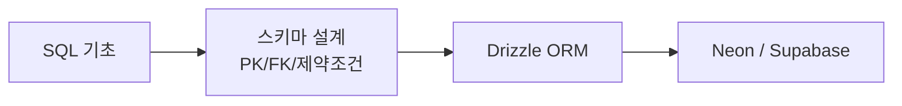

## DB는 ORM보다 먼저 이해해야 한다

ORM은 편하지만, ORM이 만들어 내는 SQL과 테이블 구조를 모르면 금방 막힌다.

Foundation 단계에서는 다음 순서가 좋다.

1. PostgreSQL의 테이블과 제약조건을 이해한다
2. 스키마 설계에서 관계를 잡는다
3. ORM이 SQL을 어떻게 감싸는지 본다
4. 서버리스 DB 플랫폼을 비교한다

---

## PostgreSQL — 기준이 되는 관계형 DB

PostgreSQL은 오픈소스 관계형 데이터베이스로, 웹 백엔드에서 널리 쓰인다. 공식 문서는 `CREATE TABLE`, 제약조건, SELECT, JOIN 등 SQL의 기준 문법을 자세히 제공한다.<a href="https://www.postgresql.org/docs/current/ddl-constraints.html" target="_blank"><sup>[1]</sup></a>

입문 단계에서 먼저 익힐 개념:

- table
- row
- column
- primary key
- foreign key
- unique constraint
- index

```sql
CREATE TABLE users (
  id serial PRIMARY KEY,
  email text UNIQUE NOT NULL,
  name text NOT NULL
);

CREATE TABLE posts (
  id serial PRIMARY KEY,
  author_id integer REFERENCES users(id),
  title text NOT NULL
);
```

---

## 스키마 설계 — 데이터의 모양을 정하는 일

스키마 설계는 "테이블을 몇 개 만들까"가 아니라, 데이터의 관계와 제약을 정하는 일이다.

좋은 스키마는 다음 질문에 답한다.

- 이 값은 반드시 있어야 하는가
- 중복되면 안 되는가
- 어떤 테이블과 관계를 맺는가
- 삭제될 때 연결된 데이터는 어떻게 되는가

::: notice
스키마 설계는 나중에 고치기 어렵다. 그래서 처음부터 완벽할 필요는 없지만, **PK/FK/unique/not null** 같은 기본 제약은 의식적으로 설계해야 한다.
:::

---

## Drizzle ORM — SQL에 가까운 TypeScript ORM

Drizzle ORM은 TypeScript 친화적인 ORM으로, SQL에 가까운 쿼리 작성 경험을 강조한다.<a href="https://orm.drizzle.team/docs/overview" target="_blank"><sup>[2]</sup></a>

예시:

```ts
import { pgTable, serial, text } from 'drizzle-orm/pg-core'

export const users = pgTable('users', {
  id: serial('id').primaryKey(),
  email: text('email').notNull().unique(),
  name: text('name').notNull(),
})
```

Drizzle을 배울 때 중요한 것은 "ORM을 쓰면 SQL을 몰라도 된다"가 아니다. 오히려 SQL과 스키마를 알고 있으면 Drizzle 코드가 더 잘 읽힌다.

---

## Neon — 서버리스 PostgreSQL

Neon은 서버리스 PostgreSQL 플랫폼이다.<a href="https://neon.com/docs/introduction" target="_blank"><sup>[3]</sup></a>

특징:

- PostgreSQL 호환
- serverless 환경에 맞춘 연결과 확장
- 브랜칭 같은 개발 워크플로 지원

개인 프로젝트나 Vercel 같은 환경과 연결해서 빠르게 Postgres를 붙이고 싶을 때 후보가 된다.

---

## Supabase — Postgres 기반 백엔드 플랫폼

Supabase는 PostgreSQL을 중심으로 인증, 스토리지, Realtime, Edge Functions 등을 제공하는 백엔드 플랫폼이다.<a href="https://supabase.com/docs/guides/database/overview" target="_blank"><sup>[4]</sup></a>

특징:

- Postgres 기반
- Auth, Storage, Realtime 등 통합 기능
- SQL Editor와 대시보드 제공
- 빠른 프로토타입에 유리

Supabase는 "DB만 빌리는 서비스"라기보다, Postgres 위에 여러 백엔드 기능을 함께 제공하는 플랫폼으로 이해하면 좋다.

---

## 추천 학습 순서



1. SQL SELECT/JOIN/GROUP BY를 익힌다
2. PostgreSQL 테이블과 제약조건을 읽는다
3. Drizzle로 같은 스키마를 TypeScript로 표현한다
4. Neon 또는 Supabase에 연결해 작은 API를 만든다

::: tip
DB 학습의 핵심은 도구 이름이 아니라 **데이터 관계를 안전하게 표현하는 힘**이다. ORM과 서버리스 DB는 그 다음에 붙는 생산성 도구다.
:::

---

## 참고

<ol>
<li><a href="https://www.postgresql.org/docs/current/ddl-constraints.html" target="_blank">[1] PostgreSQL Docs — Constraints</a></li>
<li><a href="https://orm.drizzle.team/docs/overview" target="_blank">[2] Drizzle ORM Docs — Overview</a></li>
<li><a href="https://neon.com/docs/introduction" target="_blank">[3] Neon Docs — Introduction</a></li>
<li><a href="https://supabase.com/docs/guides/database/overview" target="_blank">[4] Supabase Docs — Database Overview</a></li>
<li><a href="https://www.postgresql.org/docs/current/indexes.html" target="_blank">[5] PostgreSQL Docs — Indexes</a></li>
</ol>

---

## 관련 글

- [SQL JOIN · WHERE · HAVING · GROUP BY →](/post/sql-joins-where-having-group-by)
- [Django ORM 심층 — QuerySet, lazy evaluation, N+1 →](/post/django-orm-deep)
- [AI 웹개발자 로드맵 — Foundation 01~07 →](/post/ai-webdev-roadmap-foundation)
