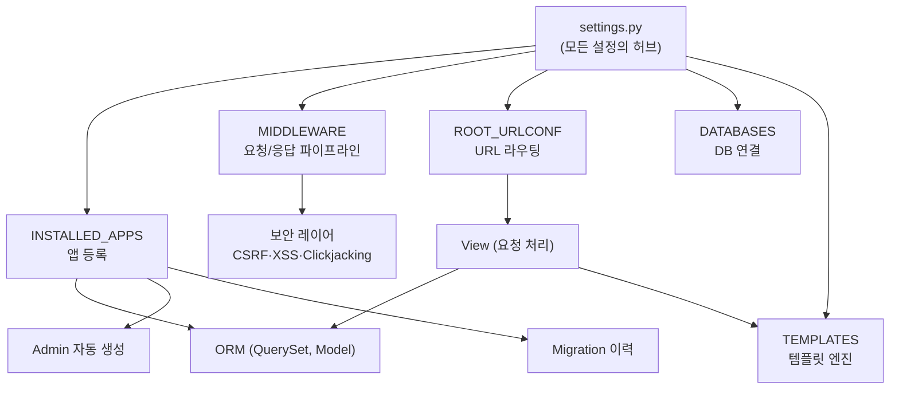
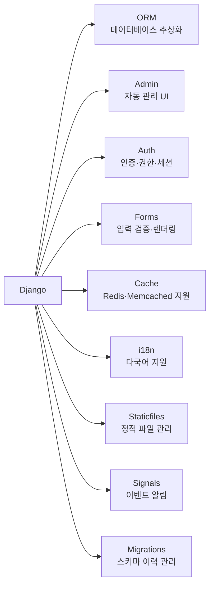
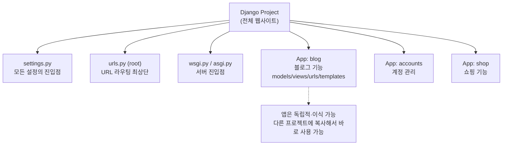

## Django란 무엇인가

2003년 미국 신문사 **Lawrence Journal-World**의 Adrian Holovaty와 Simon Willison이 만든 Python 웹 프레임워크다.[^django-history]

태그라인: **"The web framework for perfectionists with deadlines"**
마케팅 문구가 아니다. 신문사 마감이라는 실제 압박에서 나온 말이다. 완벽하게 만들어야 하지만 지금 당장 나가야 한다 — 그 긴장감이 Django의 설계 방향을 만들었다.



## Django의 7가지 설계 철학

2005년 오픈소스 공개 당시부터 공식 문서에 명시된 원칙들이다.[^design-philosophies]

### 1. DRY — Don't Repeat Yourself

"모든 개념과 데이터는 단 한 곳에만 존재해야 한다."

실제 적용:

```python
# 모델을 한 번 정의하면...
class Article(models.Model):
    title = models.CharField(max_length=200)
    body = models.TextField()
    published_at = models.DateTimeField()

# Admin 인터페이스가 자동 생성됨
# Form 검증 로직이 자동 파생됨
# Migration 파일이 자동 생성됨
# REST API 시리얼라이저도 ModelSerializer로 자동 파생됨
```

### 2. Loose Coupling (느슨한 결합)

각 레이어는 서로를 모른다:
- Template은 DB를 모른다
- DB 레이어는 화면을 모른다
- View는 어떤 Template 엔진이 쓰이는지 신경 안 쓴다

이것이 Template 엔진을 DTL에서 Jinja2로 교체할 수 있는 이유다.

### 3. Explicit is Better than Implicit

Python의 `import this`에서 직접 가져온 원칙이다.

```python
# Django는 이렇게 하지 않는다 (암묵적 자동 저장)
article.title = "새 제목"
# 자동으로 DB에 저장되면 위험

# Django는 이렇게 한다 (명시적 저장)
article.title = "새 제목"
article.save()  # 개발자가 명시해야만 저장됨
```

뒤에서 몰래 일어나는 일이 없다.

### 4. Less Code + Fast Development

"웹 프레임워크의 핵심은 반복적인 작업을 빠르게 만드는 것이다."

보일러플레이트를 최대한 없애고, 같은 기능을 가장 짧은 코드로 표현할 수 있도록 설계됐다.

### 5. Batteries Included

Python의 철학을 그대로 가져왔다. 외부 라이브러리 없이 웬만한 웹 기능이 기본 포함됐다.



### 6. Clean URL

URL은 깔끔해야 한다. `.php`, `?id=123`, `.asp` 같은 구현 세부사항을 URL에 노출하지 않는다.

```python
# Django URL 설계 — 완전한 자유
urlpatterns = [
    path("articles/<int:year>/<slug:slug>/", views.article_detail),
    path("users/@<str:username>/", views.profile),
]
```

### 7. 일관성 (Consistency)

QuerySet API, URL 리졸버, 템플릿 태그, 관리 명령어 — 모두 일관된 네이밍과 동작 규칙을 따른다.

## MTV — Django의 아키텍처 패턴

Django는 MVC가 아니라 **MTV (Model-Template-View)**다.

| MVC | Django MTV | 역할 |
|-----|------------|------|
| Model | **Model** | 데이터 구조 + 비즈니스 로직 + DB 매핑 |
| View | **Template** | 화면 렌더링 (HTML 생성) |
| Controller | **View** | 요청 처리, 데이터 선택, 응답 생성 |
| (없음) | **URL Dispatcher** | URL → View 연결 (Django에서 독립 레이어) |

Django 공식 FAQ: *"Django appears to be an MVC framework, but it calls the Controller the 'view', and the View the 'template'."*[^django-faq]

URL Dispatcher를 별도 레이어로 분리한 점이 Django의 특징이다. 고전 MVC에서 Controller 안에 묻혀있던 라우팅을 독립시켜 URL 설계를 완전히 자유롭게 만들었다.

## Project vs App — Django의 모듈화 단위



- **Project**: 웹사이트 전체. `settings.py`, `manage.py`, root `urls.py` 포함. 보통 하나.
- **App**: 특정 기능을 담당하는 독립 단위. 한 프로젝트에 여러 앱. **한 앱이 여러 프로젝트에서 재사용 가능**.

## 각 개념 심층 탐구

이 개요를 바탕으로 각 주제를 더 깊이 알고 싶다면:

## 관련 글

- [Django 요청-응답 라이프사이클 →](/post/django-lifecycle) — HTTP 요청이 Django를 통과하는 전체 흐름 — Middleware → URL → View → ORM → Template
- [Django MTV 아키텍처와 앱 구조 →](/post/django-architecture) — MTV 패턴 심층, Project vs App, settings.py의 역할, WSGI vs ASGI
- [Django ORM — QuerySet과 지연 실행 →](/post/django-orm-deep) — Active Record 패턴, QuerySet 지연 실행, Manager, N+1 문제
- [Django 보안 — 기본 탑재된 방어 →](/post/django-security) — CSRF, XSS, SQL Injection, Clickjacking 각각 어떻게 막는가

---

[^django-history]: Simon Willison, <a href="https://simonwillison.net/2005/Jul/17/django/" target="_blank">Introducing Django (2005)</a>
[^design-philosophies]: Django Project, <a href="https://docs.djangoproject.com/en/5.2/misc/design-philosophies/" target="_blank">Design philosophies — Django Docs</a>
[^django-faq]: Django Project, <a href="https://docs.djangoproject.com/en/5.2/faq/general/" target="_blank">FAQ: General — Django Docs</a>
[^dsf]: Django Software Foundation, <a href="https://www.djangoproject.com/foundation/" target="_blank">About the DSF</a>
