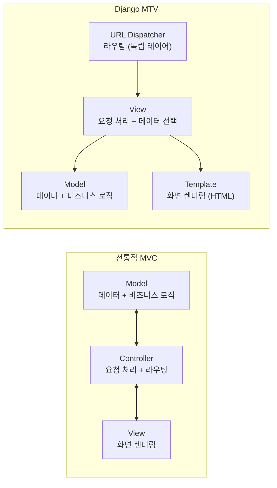
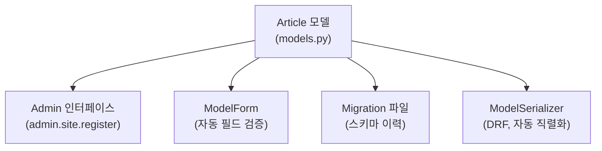
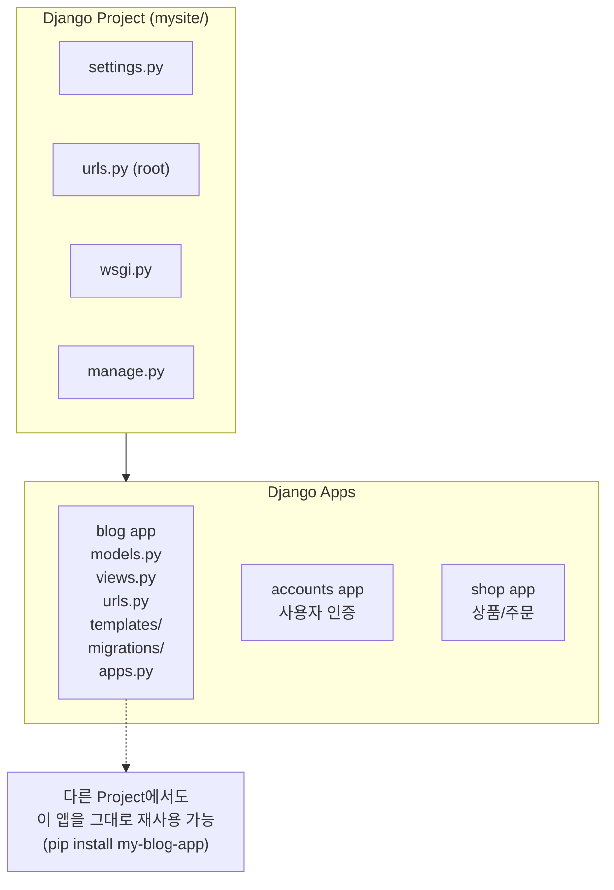
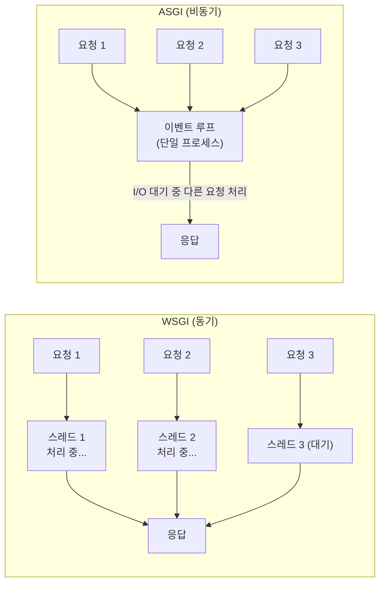

## MTV 패턴 — 이름이 다른 이유

Django를 처음 배울 때 혼란이 오는 지점이다. "MVC인데 왜 View가 Controller 역할을 하지?"

Django 공식 FAQ의 답변:[^django-faq]

> *"Django appears to be an MVC framework, but it calls the Controller the 'view', and the View the 'template'. Why does Django use these names?"*

이름을 다르게 쓴 건 우연이 아니다. Django 팀은 용어를 **역할 중심**으로 재정의했다.



핵심 차이: Django는 **URL 라우팅을 Controller에서 분리**해 독립 레이어로 만들었다. 덕분에 URL 설계가 View 코드와 완전히 분리되고, 같은 View를 여러 URL 패턴에 연결할 수 있다.

| 개념 | Django에서 | 역할 |
|------|-----------|------|
| **Model** | `models.py` | DB 스키마 정의, 데이터 접근, 비즈니스 로직 |
| **Template** | `templates/*.html` | 화면 렌더링. context 데이터를 HTML로 변환 |
| **View** | `views.py` | 요청을 받아 데이터 조회/처리 후 Template에 context 전달 |
| **URL Dispatcher** | `urls.py` | URL 패턴 → View 함수 매핑 |

## Model — 데이터와 로직의 집합

```python
# articles/models.py
from django.db import models

class Article(models.Model):
    title = models.CharField(max_length=200)
    body = models.TextField()
    author = models.ForeignKey("auth.User", on_delete=models.CASCADE)
    created_at = models.DateTimeField(auto_now_add=True)
    is_published = models.BooleanField(default=False)

    class Meta:
        ordering = ["-created_at"]
        verbose_name = "기사"

    def __str__(self):
        return self.title

    def publish(self):
        """비즈니스 로직도 모델에 포함"""
        self.is_published = True
        self.save()
```

Model에서 정의한 내용이 파생시키는 것들:



## Template — 화면 렌더링 전용

Django Template Language(DTL)는 의도적으로 **제한된** 언어다.[^dtl-docs]

```django
{# articles/templates/articles/detail.html #}



  <h1>{{ article.title }}</h1>
  <p>{{ article.body }}</p>

  
    <span>게시됨</span>
  

  
    <p>{{ comment.text }}</p>
  

```

DTL의 설계 원칙: "프레젠테이션 관련 결정만 할 수 있을 정도의 로직만 허용한다."
DB 삭제, 파일 접근 같은 사이드이펙트 있는 작업은 Template에서 불가능하다.

> 기본 Template 엔진은 DTL이지만, Jinja2로 교체 가능하다. Loose Coupling의 실제 사례다.

## View — 요청 처리의 핵심

View는 `HttpRequest`를 받아 `HttpResponse`를 반환하는 callable이다.[^view-docs]

```python
# articles/views.py

# Function-Based View (FBV) — 단순하고 명시적
def article_list(request):
    articles = Article.objects.filter(is_published=True)
    return render(request, "articles/list.html", {"articles": articles})

# Class-Based View (CBV) — 재사용 가능한 공통 패턴
from django.views.generic import ListView, DetailView

class ArticleListView(ListView):
    model = Article
    queryset = Article.objects.filter(is_published=True)
    template_name = "articles/list.html"
    context_object_name = "articles"
    paginate_by = 20
```

FBV vs CBV:

| | FBV | CBV |
|-|-----|-----|
| 코드 스타일 | 함수 | 클래스 (상속) |
| 가독성 | 높음 (선형적) | 낮음 (메서드 분산) |
| 재사용 | mixins 필요 | 상속으로 쉬움 |
| 적합한 경우 | 단순 뷰, 복잡한 커스텀 로직 | CRUD 반복 패턴 |

## Project vs App — 경계 나누는 기준



**앱 분리 기준**: 한 앱이 "하나의 명확한 역할"을 담당해야 한다. 기능이 독립적으로 존재할 수 있는가? 다른 프로젝트에 복사해서 쓸 수 있는가?

### apps.py — 앱 설정과 등록

```python
# blog/apps.py
from django.apps import AppConfig

class BlogConfig(AppConfig):
    default_auto_field = "django.db.models.BigAutoField"
    name = "blog"
    verbose_name = "블로그"

    def ready(self):
        """앱이 로드될 때 실행 — 시그널 등록 등"""
        import blog.signals  # noqa
```

```python
# settings.py
INSTALLED_APPS = [
    "django.contrib.admin",
    "django.contrib.auth",
    ...
    "blog.apps.BlogConfig",   # 앱 등록
]
```

`INSTALLED_APPS`에 등록돼야 모델·Admin·시그널·관리명령어가 활성화된다.

## settings.py — 모든 것의 허브

`settings.py`는 INI나 YAML이 아니라 **Python 모듈**이다.[^settings-docs]

```python
# settings.py는 실행되는 Python 코드
import os

BASE_DIR = Path(__file__).resolve().parent.parent

# 동적 설정 가능
INSTALLED_APPS = [
    "django.contrib.admin",
    ...
]
if os.environ.get("ENABLE_DEBUG_TOOLBAR"):
    INSTALLED_APPS += ["debug_toolbar"]
```

주요 설정:

| 설정키 | 역할 |
|--------|------|
| `INSTALLED_APPS` | 활성화된 앱 목록 (모델·Admin·시그널 활성화) |
| `MIDDLEWARE` | 요청/응답 파이프라인 구성 |
| `DATABASES` | DB 연결 설정 |
| `TEMPLATES` | 템플릿 엔진과 경로 |
| `ROOT_URLCONF` | URL 설정 파일 경로 |
| `STATIC_URL` | 정적 파일 URL |
| `SECRET_KEY` | 암호화·세션·CSRF에 사용 |
| `DEBUG` | 개발/운영 모드 분리 |

## WSGI vs ASGI



```python
# config/asgi.py
import os
from django.core.asgi import get_asgi_application

os.environ.setdefault("DJANGO_SETTINGS_MODULE", "config.settings.local")
application = get_asgi_application()
```

**주의**: ASGI 성능을 100% 이용하려면 **미들웨어 전체**가 async-compatible이어야 한다. 단 하나의 sync-only 미들웨어가 있으면 Django가 자동으로 스레드를 쓰게 돼 ASGI 이점이 사라진다.

Django의 async 지원 진화:

| 버전 | 변화 |
|------|------|
| 3.0 | ASGI 진입점 지원 시작 |
| 3.1 | async FBV / CBV 지원 |
| 4.1 | async ORM (`aget()`, `acreate()` 등) |
| 5.0 | async 시그널, async 인증 |
| **5.2 (현재 LTS)** | async 전반 성숙 단계 |

## 관련 글

- [Django 프레임워크 큰 그림 →](/post/django-overview) — 전체 철학과 구조 개요
- [Django 요청-응답 라이프사이클 →](/post/django-lifecycle) — MTV 각 레이어가 요청 처리에서 어떤 순서로 개입하는가
- [Django ORM — QuerySet과 지연 실행 →](/post/django-orm-deep) — Model 레이어 심층 탐구

---

[^django-faq]: Django Project, <a href="https://docs.djangoproject.com/en/5.2/faq/general/#django-appears-to-be-a-mvc-framework-but-you-call-the-controller-the-view-and-the-view-the-template" target="_blank">FAQ: MVC — Django Docs</a>
[^dtl-docs]: Django Project, <a href="https://docs.djangoproject.com/en/5.2/ref/templates/language/" target="_blank">The Django template language — Django Docs</a>
[^view-docs]: Django Project, <a href="https://docs.djangoproject.com/en/5.2/topics/http/views/" target="_blank">Writing views — Django Docs</a>
[^settings-docs]: Django Project, <a href="https://docs.djangoproject.com/en/5.2/topics/settings/" target="_blank">Django settings — Django Docs</a>
[^apps-docs]: Django Project, <a href="https://docs.djangoproject.com/en/5.2/ref/applications/" target="_blank">Applications — Django Docs</a>
