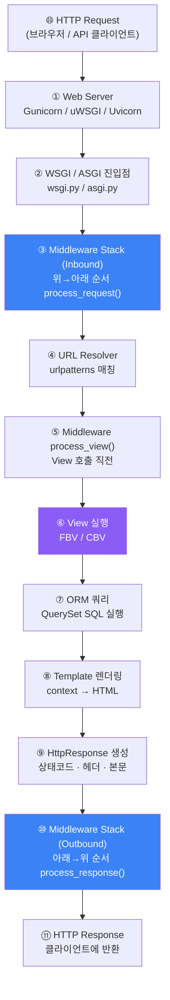
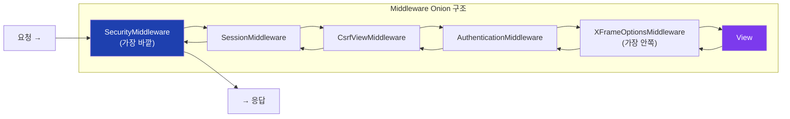
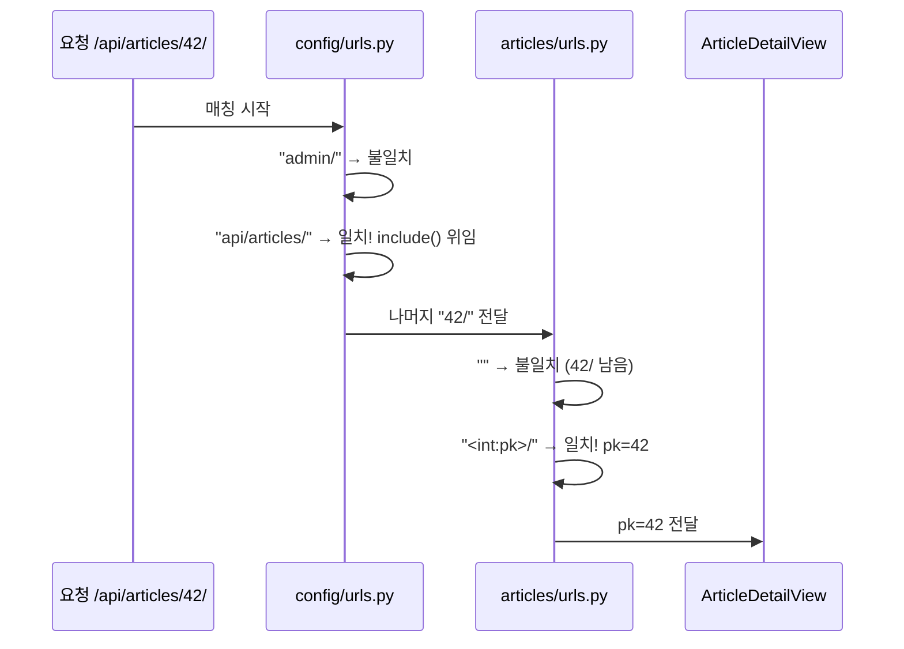
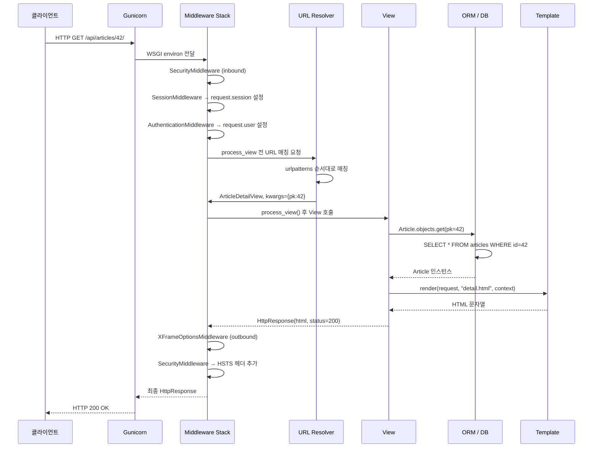

## 왜 라이프사이클을 알아야 하는가

Django를 쓰다 보면 이런 상황을 만난다:

- 로그인 체크가 왜 특정 요청에선 안 되지?
- 미들웨어 순서가 왜 중요한가?
- `request.user`는 언제 채워지는가?
- 내 View가 호출되기 전에 무슨 일이 일어나는가?

이 모든 질문의 답이 **라이프사이클** 안에 있다.

## 전체 흐름 — 11단계



## ① Web Server

Gunicorn(WSGI), Uvicorn/Daphne(ASGI) 같은 웹 서버가 TCP 소켓을 열고 HTTP 요청을 받는다.

Django 자체는 HTTP 파싱을 하지 않는다. 웹 서버가 HTTP를 파싱하고 WSGI/ASGI 인터페이스로 Django에 전달한다.

## ② WSGI / ASGI 진입점

```python
# config/wsgi.py
import os
from django.core.wsgi import get_wsgi_application

os.environ.setdefault("DJANGO_SETTINGS_MODULE", "config.settings.local")
application = get_wsgi_application()   # ← 웹 서버가 호출하는 callable
```

`application` 객체가 웹 서버와 Django 사이의 계약(Contract)이다.[^pep3333]

| | WSGI | ASGI |
|-|------|------|
| 표준 | PEP 3333 | ASGI Specification |
| 동작 | 동기 (요청 1개 = 스레드 1개) | 비동기 (이벤트 루프) |
| 서버 | Gunicorn, uWSGI | Uvicorn, Daphne |
| Django 지원 | Django 1.0~ | Django 3.0~ |

## ③ Middleware Stack — Inbound (위→아래)

Django의 `MIDDLEWARE` 설정에 나열된 순서대로 실행된다.

```python
# settings.py
MIDDLEWARE = [
    "django.middleware.security.SecurityMiddleware",      # 1번
    "django.contrib.sessions.middleware.SessionMiddleware",  # 2번
    "django.middleware.common.CommonMiddleware",          # 3번
    "django.middleware.csrf.CsrfViewMiddleware",          # 4번
    "django.contrib.auth.middleware.AuthenticationMiddleware",  # 5번
    "django.contrib.messages.middleware.MessageMiddleware",  # 6번
    "django.middleware.clickjacking.XFrameOptionsMiddleware",  # 7번
]
```



### 왜 순서가 중요한가

`SessionMiddleware`는 반드시 `AuthenticationMiddleware`보다 앞에 있어야 한다.

```
요청 처리 순서:
SessionMiddleware → 세션 쿠키를 읽어 request.session 채움
AuthenticationMiddleware → request.session을 읽어 request.user 채움
```

`AuthenticationMiddleware`가 먼저 오면 `request.session`이 아직 없어서 `request.user`를 설정할 수 없다.

각 미들웨어의 역할:

| 미들웨어 | 역할 |
|----------|------|
| `SecurityMiddleware` | HTTPS 리디렉션, HSTS 헤더, SECURE 쿠키 |
| `SessionMiddleware` | 세션 쿠키 읽기/쓰기, `request.session` 제공 |
| `CommonMiddleware` | URL 정규화 (`/blog` → `/blog/`), ETags |
| `CsrfViewMiddleware` | CSRF 토큰 검증 |
| `AuthenticationMiddleware` | `request.user` 설정 (세션 기반 인증) |
| `MessageMiddleware` | 1회성 플래시 메시지 |
| `XFrameOptionsMiddleware` | Clickjacking 방어 (`X-Frame-Options`) |

### 미들웨어가 요청을 중단시키는 경우

미들웨어가 `HttpResponse`를 반환하면 이후 스택이 모두 건너뛰어진다.

```python
class MaintenanceModeMiddleware:
    def __call__(self, request):
        if settings.MAINTENANCE_MODE:
            return HttpResponse("점검 중입니다.", status=503)  # ← View까지 가지 않음
        return self.get_response(request)
```

## ④ URL Resolver

`ROOT_URLCONF`에 지정된 파일의 `urlpatterns`를 위에서부터 순서대로 검사한다.[^url-dispatcher]

```python
# config/urls.py
urlpatterns = [
    path("admin/", admin.site.urls),
    path("api/articles/", include("articles.urls")),  # 앱 URLconf 위임
    path("api/users/", include("users.urls")),
]

# articles/urls.py
urlpatterns = [
    path("", views.ArticleListView.as_view()),
    path("<int:pk>/", views.ArticleDetailView.as_view()),
    path("<int:pk>/comments/", views.CommentListView.as_view()),
]
```



매칭 실패 시 `Http404` 예외 발생 → 404 응답 반환.

## ⑤ Middleware process_view()

View가 호출되기 **직전**에 실행된다. View 함수와 인자를 받는다.
`CsrfViewMiddleware`의 CSRF 검증이 여기서 일어난다.

## ⑥ View 실행

요청을 실제로 처리하는 곳이다.

```python
# Function-Based View
def article_detail(request, pk):
    article = Article.objects.get(pk=pk)      # ⑦ ORM
    return render(request, "detail.html", {"article": article})  # ⑧ Template

# Class-Based View
class ArticleDetailView(DetailView):
    model = Article
    template_name = "detail.html"
```

View의 책임:
- 요청 파라미터 검증
- ORM으로 데이터 조회/변경
- 비즈니스 로직 처리
- Template에 context 전달
- `HttpResponse` 반환

## ⑦ ORM 쿼리

View 안에서 QuerySet을 **평가(evaluate)**하는 시점에 SQL이 실행된다.

```python
# SQL 실행 안 됨 — QuerySet은 lazy
qs = Article.objects.filter(is_published=True).order_by("-created_at")

# 이 시점에 SELECT 실행
articles = list(qs)           # 명시적 평가
article = qs.get(pk=pk)       # .get()
count = qs.count()             # .count()
for a in qs:                   # 반복
    ...
```

## ⑧ Template 렌더링

```python
render(request, "articles/detail.html", {"article": article})
```

내부 동작:
1. `TEMPLATES` 설정에서 엔진(DTL 또는 Jinja2) 선택
2. 템플릿 파일 로드
3. ``, `` 상속 관계 해석
4. context 변수를 템플릿 코드에 바인딩
5. 모든 변수 **자동 이스케이프** (XSS 방어)
6. HTML 문자열 반환

## ⑩ Middleware Stack — Outbound (아래→위)

응답 경로는 요청과 반대 방향이다.

```python
class TimingMiddleware:
    def __call__(self, request):
        start = time.time()
        response = self.get_response(request)  # 아래 스택 전체 실행
        duration = time.time() - start
        response["X-Response-Time"] = f"{duration:.3f}s"  # 응답에 헤더 추가
        return response
```

`TemplateResponse`를 사용하면 `process_template_response()`도 이 단계에서 호출된다.

## 전체 시퀀스 다이어그램



## 관련 글

- [Django 프레임워크 큰 그림 →](/post/django-overview) — Django 철학과 전체 구조 개요
- [Django MTV 아키텍처와 앱 구조 →](/post/django-architecture) — MTV 패턴, Project vs App, WSGI vs ASGI 상세
- [Django ORM — QuerySet과 지연 실행 →](/post/django-orm-deep) — ⑦단계 ORM 동작 심층 탐구

---

[^pep3333]: Python, <a href="https://peps.python.org/pep-3333/" target="_blank">PEP 3333 — Python Web Server Gateway Interface v1.0.1</a>
[^middleware-docs]: Django Project, <a href="https://docs.djangoproject.com/en/5.2/topics/http/middleware/" target="_blank">Middleware — Django Docs</a>
[^url-dispatcher]: Django Project, <a href="https://docs.djangoproject.com/en/5.2/topics/http/urls/" target="_blank">URL dispatcher — Django Docs</a>
[^request-response]: Django Project, <a href="https://docs.djangoproject.com/en/5.2/ref/request-response/" target="_blank">Request and response objects — Django Docs</a>
