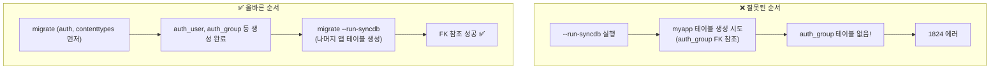
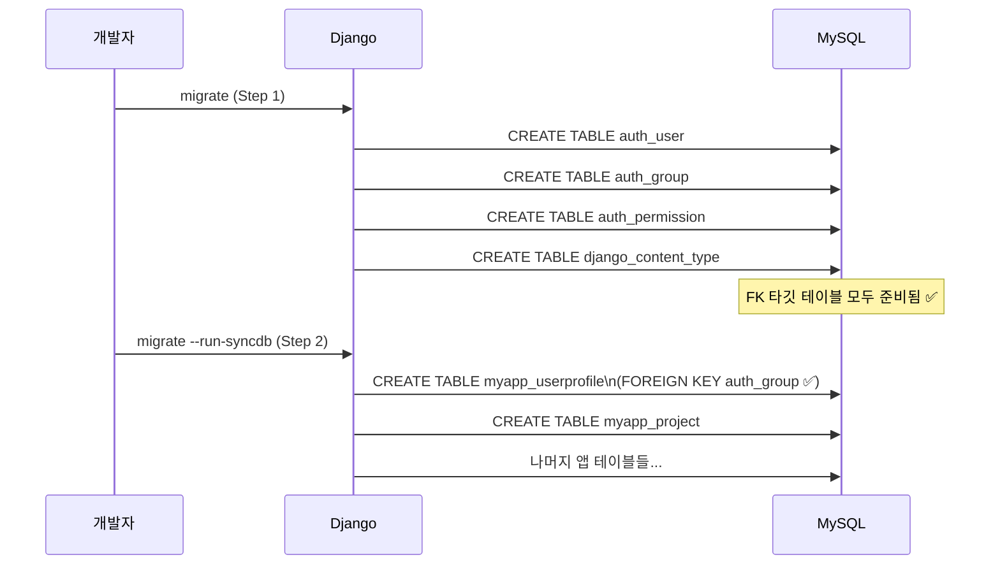

## 마이그레이션이 뭔가

Django ORM에서 모델을 변경하면 DB 스키마도 바꿔야 한다.
이 변경 이력을 Python 파일로 관리하는 시스템이 **Migration**이다.[^django-migration-docs]


`makemigrations`는 **파일을 만드는 것**이고,
`migrate`는 **DB에 실제로 적용하는 것**이다.

## makemigrations vs migrate

```bash
# 모델 변경사항을 감지해 migration 파일 생성
python manage.py makemigrations

# 특정 앱만
python manage.py makemigrations myapp

# 아직 적용 안 된 migration 목록 확인
python manage.py showmigrations

# DB에 migration 적용
python manage.py migrate

# 특정 앱만
python manage.py migrate myapp

# 특정 앱의 특정 migration까지만 적용
python manage.py migrate myapp 0003
```

migration 파일 구조:

```python
# myapp/migrations/0001_initial.py
from django.db import migrations, models

class Migration(migrations.Migration):
    initial = True

    dependencies = [
        ("auth", "0012_alter_user_first_name_max_length"),  # FK 의존성
    ]

    operations = [
        migrations.CreateModel(
            name="UserProfile",
            fields=[
                ("id", models.BigAutoField(primary_key=True)),
                ("user", models.OneToOneField("auth.User", on_delete=models.CASCADE)),
                ("bio", models.TextField(blank=True)),
            ],
        ),
    ]
```

`dependencies`에 명시된 migration이 먼저 적용돼야 이 migration이 실행될 수 있다.

## run-syncdb — migration 파일 없는 앱 처리

일부 프로젝트는 migration 파일을 생성하지 않았다.
`makemigrations`를 실행하지 않았거나, 파일이 삭제된 경우다.

이때 `migrate`만 실행하면 Django 기본 앱(auth, admin 등)만 적용되고
**migration 파일 없는 앱의 테이블은 생성되지 않는다**.

`--run-syncdb` 옵션은 migration 파일이 없는 앱을 위해 직접 `CREATE TABLE`을 실행한다.[^run-syncdb]

```bash
python manage.py migrate --run-syncdb
```

## FK 순서 문제 — 1824 에러

`--run-syncdb`를 사용할 때 가장 흔히 만나는 에러:

```
django.db.utils.OperationalError: (1824, "Failed to open the referenced table 'auth_group'")
```

**원인**: 앱 A의 테이블이 `auth_group`을 FK로 참조하는데,
syncdb가 앱 A 테이블을 먼저 만들려 할 때 `auth_group`이 아직 없어서 실패한다.



## 올바른 마이그레이션 순서

migration 파일이 없는 앱이 있는 프로젝트의 안전한 초기화 순서:

```bash
# Step 0: DB 완전 초기화 (꼬인 상태 리셋)
docker compose down -v
docker compose up -d db redis
# db가 healthy 상태가 될 때까지 대기

# Step 1: Django 기본 앱 먼저 적용
# (auth_user, auth_group 등 FK 타깃 테이블 생성)
docker compose exec web python manage.py migrate

# Step 2: migration 없는 앱 테이블 + 나머지 migration 적용
docker compose exec web python manage.py migrate --run-syncdb
```

왜 이 순서가 동작하는가:



## django_migrations 테이블

Django는 `django_migrations` 테이블로 적용된 migration을 추적한다.

```sql
SELECT * FROM django_migrations;
-- app | name | applied
-- auth | 0001_initial | 2026-03-26 ...
-- auth | 0002_... | 2026-03-26 ...
```

migration 상태 확인:

```bash
# 전체 migration 상태 (applied/unapplied)
python manage.py showmigrations

# SQL 미리 보기 (실제 실행 X)
python manage.py sqlmigrate myapp 0001
```

## migration 롤백

```bash
# 특정 migration으로 롤백
python manage.py migrate myapp 0002

# 앱의 모든 migration 취소
python manage.py migrate myapp zero
```

## fake migration — 이미 적용된 스키마 처리

DB에 테이블이 이미 있는데 `django_migrations`에 기록이 없을 때 사용한다.

```bash
# migration을 DB에 실제 적용하지 않고 "적용됨"으로 표시만
python manage.py migrate --fake myapp 0001

# 초기 상태만 fake (이미 있는 테이블에 대한 initial migration)
python manage.py migrate --fake-initial
```

## 관련 글

- [Django settings 분리와 환경변수 관리](/post/django-settings): migrate 실행 전 DATABASE_URL 설정법
- [Docker Compose로 Django 5개 서비스 띄우기](/post/docker-compose-django): Docker 환경에서의 마이그레이션 실행 순서
- [Django 버전 호환성과 내부 API 위험](/post/django-version-compatibility): 마이그레이션 외에 버전 업그레이드 시 주의할 점

---

[^django-migration-docs]: Django Project, <a href="https://docs.djangoproject.com/en/5.2/topics/migrations/" target="_blank">Migrations — Django Docs</a>
[^run-syncdb]: Django Project, <a href="https://docs.djangoproject.com/en/5.2/ref/django-admin/#migrate" target="_blank">migrate --run-syncdb — Django Admin Docs</a>
[^migration-operations]: Django Project, <a href="https://docs.djangoproject.com/en/5.2/ref/migration-operations/" target="_blank">Migration Operations — Django Docs</a>
[^showmigrations]: Django Project, <a href="https://docs.djangoproject.com/en/5.2/ref/django-admin/#showmigrations" target="_blank">showmigrations — Django Admin Docs</a>
