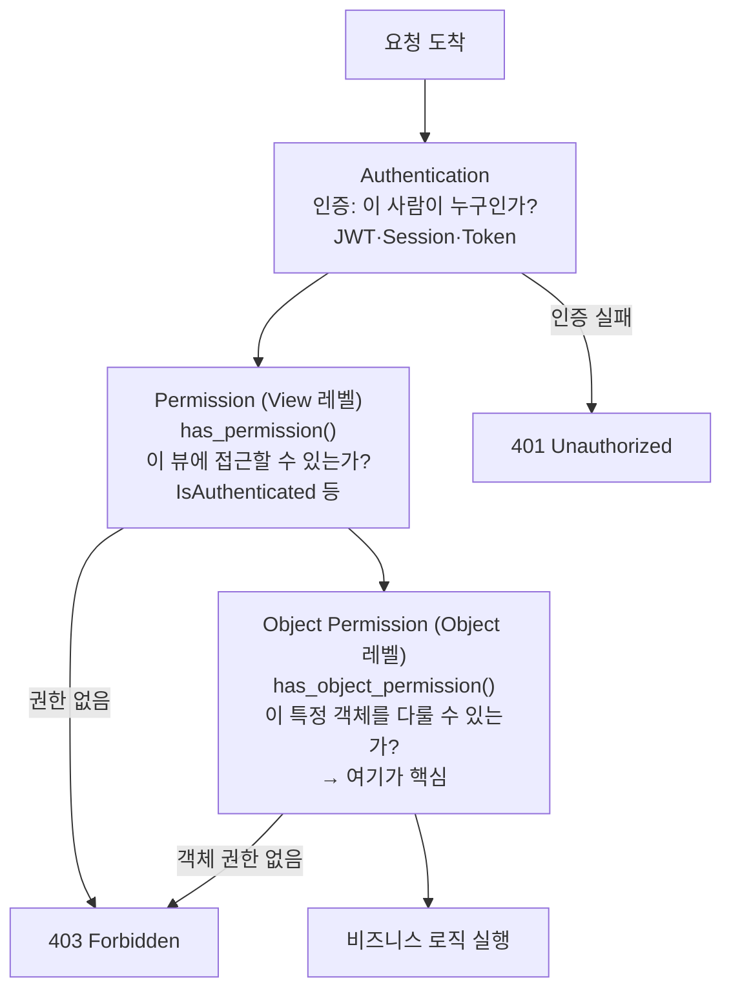
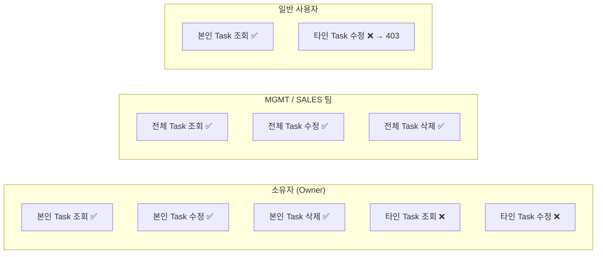

## 왜 IsAuthenticated만으로는 부족한가

```python
# 이 코드의 구멍은?
class TaskViewSet(ModelViewSet):
    permission_classes = [IsAuthenticated]
    queryset = Task.objects.all()
    serializer_class = TaskSerializer
```

로그인한 사용자라면 **누구든** 모든 Task를 수정·삭제할 수 있다.
`IsAuthenticated`는 "로그인했는가"만 확인하지, "이 데이터의 주인인가"를 확인하지 않는다.



---

## Step 1: 모델에 소유자 필드 추가

누가 만들었는지 모르면 소유권 검사가 불가능하다. `created_by`를 먼저 추가한다.<a href="https://docs.djangoproject.com/en/5.0/ref/models/fields/#django.db.models.ForeignKey" target="_blank"><sup>[1]</sup></a>

```python
# models.py
from django.db import models
from django.contrib.auth import get_user_model

User = get_user_model()

class Task(models.Model):
    title = models.CharField(max_length=200)
    description = models.TextField(blank=True)
    category = models.ForeignKey('Category', on_delete=models.SET_NULL, null=True)
    due_date = models.DateField(null=True, blank=True)

    # ── 소유권 필드 ───────────────────────────────────────────────────
    created_by = models.ForeignKey(
        User,
        on_delete=models.SET_NULL,
        null=True,       # 기존 데이터 호환: null 허용
        blank=True,
        related_name='created_tasks',
        verbose_name='작성자',
    )

    created_at = models.DateTimeField(auto_now_add=True)
    updated_at = models.DateTimeField(auto_now=True)

    class Meta:
        ordering = ['-created_at']
```

> **null=True가 필요한 이유**: 기존에 데이터가 있는 테이블에 ForeignKey를 추가하면 기존 행에 넣을 값이 없다. `null=True`를 지정하지 않으면 `makemigrations` 시 기본값을 요구하고, 잘못된 값을 입력하면 DB 무결성이 깨진다.

### 마이그레이션 생성

```bash
python manage.py makemigrations tasks --name task_auditing_fields
python manage.py migrate
```

생성되는 `0003_task_auditing_fields.py`:

```python
from django.conf import settings
from django.db import migrations, models
import django.db.models.deletion

class Migration(migrations.Migration):

    dependencies = [
        ('tasks', '0002_previous_migration'),
        migrations.swappable_dependency(settings.AUTH_USER_MODEL),
    ]

    operations = [
        migrations.AddField(
            model_name='task',
            name='created_by',
            field=models.ForeignKey(
                blank=True,
                null=True,
                on_delete=django.db.models.deletion.SET_NULL,
                related_name='created_tasks',
                to=settings.AUTH_USER_MODEL,
                verbose_name='작성자',
            ),
        ),
    ]
```

---

## Step 2: 커스텀 Permission 클래스 작성

DRF의 `BasePermission`을 상속한다.<a href="https://www.django-rest-framework.org/api-guide/permissions/#custom-permissions" target="_blank"><sup>[2]</sup></a>

```python
# permissions.py
from rest_framework.permissions import BasePermission, SAFE_METHODS

# 승인된 팀 코드 목록
PRIVILEGED_TEAMS = {'MGMT', 'SALES'}  # 경영지원, 기술영업


class IsOwnerOrPrivilegedTeam(BasePermission):
    """
    접근 허용 조건 (OR 관계):
    1. 이 객체를 만든 사람 (Owner)
    2. MGMT / SALES 팀 소속 (상위 권한 보유 팀)
    """

    def has_permission(self, request, view):
        """뷰 접근 자체: 로그인만 확인"""
        return request.user and request.user.is_authenticated

    def has_object_permission(self, request, view, obj):
        """객체 수준 권한: 읽기는 허용, 쓰기는 조건 확인"""

        # 읽기(GET, HEAD, OPTIONS)는 항상 허용
        if request.method in SAFE_METHODS:
            return True

        # 조건 1: 소유자 본인
        if obj.created_by == request.user:
            return True

        # 조건 2: 상위 권한 팀 (User 모델에 team/department 필드가 있다고 가정)
        user_team = getattr(request.user, 'team', None)
        if user_team and user_team.upper() in PRIVILEGED_TEAMS:
            return True

        return False
```

### 팀 정보를 어디서 가져오는가

```python
# User 모델 확장 예시 (Profile 또는 AbstractUser)
class UserProfile(models.Model):
    user = models.OneToOneField(User, on_delete=models.CASCADE, related_name='profile')
    team = models.CharField(
        max_length=20,
        choices=[
            ('MGMT', '경영지원'),
            ('SALES', '기술영업'),
            ('DEV', '개발'),
            ('OPS', '운영'),
        ],
        default='DEV',
    )

# Permission에서 접근
user_team = getattr(request.user.profile, 'team', None)
```

---

## Step 3: ViewSet에 권한 적용

```python
# views.py
from rest_framework import viewsets, status
from rest_framework.permissions import IsAuthenticated
from rest_framework.response import Response
from .models import Task
from .serializers import TaskModelSerializer
from .permissions import IsOwnerOrPrivilegedTeam


class TaskViewSet(viewsets.ModelViewSet):
    serializer_class = TaskModelSerializer

    # ── 권한: 로그인 + 객체 레벨 권한 ────────────────────────────────
    permission_classes = [IsOwnerOrPrivilegedTeam]

    def get_queryset(self):
        """
        일반 사용자: 본인이 만든 태스크만 조회
        MGMT/SALES: 전체 조회
        """
        user = self.request.user
        team = getattr(getattr(user, 'profile', None), 'team', '')

        if team.upper() in {'MGMT', 'SALES'}:
            return Task.objects.all().select_related('created_by', 'category')

        return Task.objects.filter(
            created_by=user
        ).select_related('created_by', 'category')

    def perform_create(self, serializer):
        """생성 시 자동으로 created_by 주입"""
        serializer.save(created_by=self.request.user)

    def get_permissions(self):
        """
        액션별 권한 클래스를 다르게 설정할 수 있다.
        create는 로그인만 확인, update/delete는 객체 권한 필요
        """
        if self.action == 'create':
            return [IsAuthenticated()]
        return [IsOwnerOrPrivilegedTeam()]
```

---

## 권한 매트릭스



| 액션 | 본인(Owner) | MGMT/SALES | 타팀 일반 사용자 |
|---|---|---|---|
| List (GET) | 본인 것만 | 전체 | 본인 것만 |
| Retrieve (GET) | ✅ | ✅ | ❌ 403 |
| Create (POST) | ✅ | ✅ | ✅ |
| Update (PUT/PATCH) | ✅ | ✅ | ❌ 403 |
| Destroy (DELETE) | ✅ | ✅ | ❌ 403 |

---

## Step 4: Serializer에서 created_by 읽기 전용 처리

```python
class TaskModelSerializer(serializers.ModelSerializer):
    # 소유자 정보: 읽기 전용으로 노출
    created_by = serializers.SerializerMethodField()

    class Meta:
        model = Task
        fields = ['id', 'title', 'category', 'due_date', 'created_by', ...]
        read_only_fields = ['id', 'created_by']

    def get_created_by(self, obj):
        if obj.created_by:
            return {
                'id': obj.created_by.id,
                'username': obj.created_by.username,
                'team': getattr(getattr(obj.created_by, 'profile', None), 'team', None),
            }
        return None
```

---

## 다중 날짜 일정 지원

오늘 구현한 다른 기능: 달력에서 여러 날짜를 선택해 일정 범위를 지정하는 기능.

```python
# 모델에 start_date, end_date 추가
class Task(models.Model):
    # 기존 필드...
    start_date = models.DateField(null=True, blank=True)
    end_date = models.DateField(null=True, blank=True)
```

```python
# Serializer: 날짜 범위 교차 검증
def validate(self, data):
    start = data.get('start_date')
    end = data.get('end_date')

    if start and end and start > end:
        raise serializers.ValidationError({
            'end_date': "종료일은 시작일 이후여야 합니다."
        })

    return data  # ✅ 반드시 return
```

```tsx
// Frontend: ScheduleCalendar.tsx — 2번 클릭으로 범위 지정
const [rangeStart, setRangeStart] = useState<Date | null>(null)

const handleDateClick = (date: Date) => {
  if (!rangeStart) {
    setRangeStart(date)       // 첫 번째 클릭: 시작일 설정
  } else {
    const start = rangeStart < date ? rangeStart : date
    const end = rangeStart < date ? date : rangeStart

    openNewScheduleModal({ start_date: start, end_date: end })
    setRangeStart(null)       // 선택 완료 후 초기화
  }
}
```

---

## 권한 테스트 작성

```python
from rest_framework.test import APITestCase
from rest_framework import status
from django.contrib.auth import get_user_model
from .models import Task

User = get_user_model()


class TaskPermissionTest(APITestCase):

    def setUp(self):
        self.owner = User.objects.create_user('owner', password='pass')
        self.other = User.objects.create_user('other', password='pass')
        self.mgmt_user = User.objects.create_user('mgmt', password='pass')
        # mgmt_user.profile.team = 'MGMT' 설정 가정

        self.task = Task.objects.create(
            title='Test Task',
            created_by=self.owner
        )

    def test_owner_can_update(self):
        self.client.force_authenticate(user=self.owner)
        res = self.client.patch(f'/api/tasks/{self.task.id}/', {'title': 'Updated'})
        self.assertEqual(res.status_code, status.HTTP_200_OK)

    def test_other_user_cannot_update(self):
        self.client.force_authenticate(user=self.other)
        res = self.client.patch(f'/api/tasks/{self.task.id}/', {'title': 'Hacked'})
        self.assertEqual(res.status_code, status.HTTP_403_FORBIDDEN)

    def test_mgmt_can_update_any(self):
        self.client.force_authenticate(user=self.mgmt_user)
        res = self.client.patch(f'/api/tasks/{self.task.id}/', {'title': 'Managed'})
        self.assertEqual(res.status_code, status.HTTP_200_OK)
```

---

## 참고

<ol>
<li><a href="https://docs.djangoproject.com/en/5.0/ref/models/fields/#django.db.models.ForeignKey" target="_blank">[1] Django ForeignKey — 공식 문서</a></li>
<li><a href="https://www.django-rest-framework.org/api-guide/permissions/#custom-permissions" target="_blank">[2] DRF Custom Permissions — 공식 문서</a></li>
<li><a href="https://www.django-rest-framework.org/api-guide/permissions/#object-level-permissions" target="_blank">[3] DRF Object Level Permissions — 공식 문서</a></li>
</ol>

---

## 관련 글

- [DRF Serializer 검증 완전 정복 →](/post/drf-serializer-validation)
- [Django Migration 완전 정복 →](/post/django-migration)
