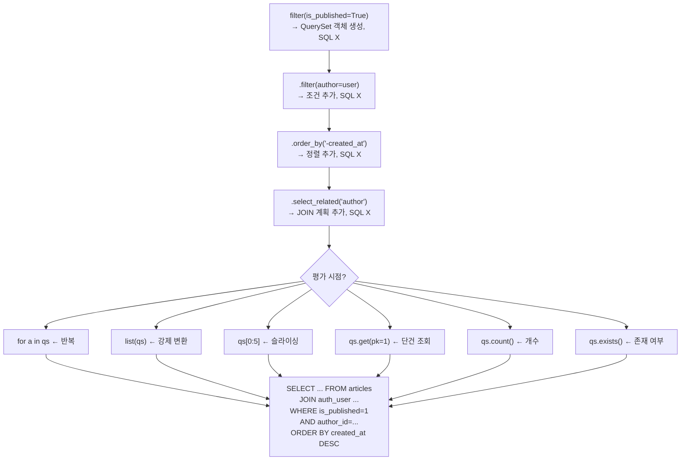
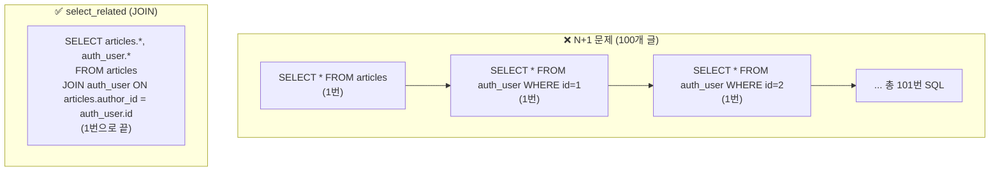

## Django ORM이 특별한 이유

```python
# 이게 전부다
articles = Article.objects.filter(is_published=True).order_by("-created_at")[:10]
```

SQL 한 줄 안 쓰고 위와 같이 데이터를 조회할 수 있다.
하지만 이 코드가 **언제** SQL을 실행하는지 모르면 심각한 성능 문제를 만든다.

## Active Record 패턴

Django ORM은 **Active Record** 패턴을 구현한다.[^fowler-ar]

모델 클래스 = DB 테이블, 인스턴스 = 행(Row). 데이터와 DB 조작 로직이 같은 객체에 존재한다.

```python
# 모델 클래스 = 테이블
class Article(models.Model):
    title = models.CharField(max_length=200)
    body = models.TextField()

# 인스턴스 = 행
article = Article(title="제목", body="내용")
article.save()           # INSERT INTO articles ...
article.title = "새 제목"
article.save()           # UPDATE articles SET title=...
article.delete()         # DELETE FROM articles WHERE id=...
```

SQLAlchemy의 **Data Mapper** 패턴과 대비된다.
Data Mapper는 모델과 DB 매핑 로직이 분리돼 있어 더 유연하지만 복잡하다.
Django의 Active Record는 단순하고 직관적이지만 대규모 도메인 로직에서 모델이 비대해질 수 있다.

## QuerySet — 지연 실행(Lazy Evaluation)

Django ORM의 핵심 설계 결정이다.[^queryset-docs]

```python
# 이 시점에서 SQL이 실행되지 않는다
qs = Article.objects.filter(is_published=True)
qs = qs.filter(author__username="seobway")
qs = qs.order_by("-created_at")
qs = qs.select_related("author")
```

**아직 DB에 아무것도 안 했다.** QuerySet은 조건을 기억하고 있을 뿐이다.



### 왜 지연 실행인가

```python
def get_articles(is_published=True):
    qs = Article.objects.filter(is_published=is_published)
    return qs

def get_recent(qs, limit=10):
    return qs.order_by("-created_at")[:limit]

def get_by_author(qs, username):
    return qs.filter(author__username=username)

# 조합해서 사용 — SQL은 최종 평가 시 단 한 번만 실행
articles = get_by_author(get_recent(get_articles()), "seobway")
for a in articles:   # ← 이 시점에 SELECT 실행
    print(a.title)
```

QuerySet을 함수 사이에 자유롭게 전달하며 조건을 합성할 수 있다.
SQL은 마지막에 한 번만 실행된다.

### QuerySet 캐싱

한 번 평가된 QuerySet은 결과를 캐시한다.

```python
qs = Article.objects.filter(is_published=True)

# 첫 번째 반복 — SQL 실행
for a in qs:
    print(a.title)

# 두 번째 반복 — 캐시 사용, SQL 실행 안 됨
for a in qs:
    print(a.body)
```

주의: 슬라이싱은 캐시를 만들지 않는다.

```python
qs = Article.objects.all()
print(qs[0])  # SQL 실행
print(qs[0])  # 다시 SQL 실행! (캐시 없음)

# 평가 후 캐시 사용
articles = list(qs)  # SQL 실행
print(articles[0])   # 캐시
print(articles[0])   # 캐시
```

## Manager — 테이블 레벨 작업의 진입점

`Model.objects`가 기본 Manager다.[^manager-docs]

**Manager는 인스턴스가 아닌 클래스에서만 접근 가능하다.**

```python
Article.objects.all()      # ✅ 클래스에서 접근
article = Article()
article.objects.all()      # ❌ AttributeError — 인스턴스에서 접근 불가
```

이 제약은 의도된 설계다. "테이블 전체를 다루는 작업"과 "개별 행을 다루는 작업"을 구분한다.

### 커스텀 Manager

반복되는 필터 로직을 Manager로 캡슐화한다.

```python
class PublishedManager(models.Manager):
    def get_queryset(self):
        return super().get_queryset().filter(is_published=True)

class RecentManager(models.Manager):
    def get_queryset(self):
        return super().get_queryset().order_by("-created_at")

class Article(models.Model):
    title = models.CharField(max_length=200)
    is_published = models.BooleanField(default=False)

    objects = models.Manager()              # 기본 Manager (전체)
    published = PublishedManager()          # 게시된 글만
    recent = RecentManager()                # 최신순 정렬
```

```python
# View에서 반복 없이 사용
Article.published.all()                    # 게시된 글만
Article.published.filter(author=user)      # 게시된 + 특정 작성자
Article.recent.filter(is_published=True)   # 최신순 + 게시된
```

## N+1 문제와 해결

Django ORM의 가장 흔한 성능 함정이다.

```python
# N+1 문제 발생 — 절대 이렇게 하지 말 것
articles = Article.objects.all()  # SQL 1번

for article in articles:
    print(article.author.username)  # 매번 SQL 1번 → N번 추가 실행!
    # 100개 글이면 101번 SQL 실행
```



### 해결: select_related vs prefetch_related

```python
# select_related — ForeignKey, OneToOne (SQL JOIN)
articles = Article.objects.select_related("author").all()
# SELECT articles.*, auth_user.* FROM articles JOIN auth_user ...

# prefetch_related — ManyToMany, reverse FK (별도 쿼리 후 Python에서 연결)
articles = Article.objects.prefetch_related("tags").all()
# SELECT * FROM articles
# SELECT * FROM tags WHERE article_id IN (1, 2, 3, ...)

# 중첩 관계
articles = Article.objects.select_related("author__profile").prefetch_related("comments__author")
```

| | `select_related` | `prefetch_related` |
|-|------------------|-------------------|
| 관계 타입 | FK, OneToOne | ManyToMany, reverse FK |
| SQL 방식 | JOIN (1개 쿼리) | 별도 쿼리 후 Python 조합 |
| 결과 | SQL 수 감소 | SQL 수 감소 |

## 주요 QuerySet 메서드

```python
# 조회
Article.objects.all()
Article.objects.filter(is_published=True, author=user)
Article.objects.exclude(is_published=False)
Article.objects.get(pk=1)           # 1개, 없거나 2개 이상이면 예외
Article.objects.first()             # 첫 번째 또는 None
Article.objects.last()

# 집계
Article.objects.count()
Article.objects.exists()            # bool, count()보다 빠름
Article.objects.aggregate(Count("id"), Avg("view_count"))

# 정렬 / 슬라이싱
Article.objects.order_by("-created_at")[:10]   # LIMIT 10

# 수정 / 삭제
Article.objects.filter(author=user).update(is_published=True)  # 한 번의 UPDATE
Article.objects.filter(created_at__lt=cutoff).delete()         # 한 번의 DELETE

# 필드 조회
Article.objects.values("title", "author__username")   # dict QuerySet
Article.objects.values_list("id", "title")            # tuple QuerySet
Article.objects.only("title", "created_at")           # 특정 필드만 로드
Article.objects.defer("body")                         # 특정 필드 지연 로드
```

## Raw SQL 탈출구

Django ORM으로 표현하기 어려운 복잡한 쿼리는 Raw SQL로 처리한다.

```python
from django.db import connection

# QuerySet.raw() — 모델 인스턴스 반환
articles = Article.objects.raw("SELECT * FROM articles WHERE id = %s", [article_id])

# connection.execute() — 완전한 Raw SQL
with connection.cursor() as cursor:
    cursor.execute("""
        SELECT a.title, COUNT(c.id) as comment_count
        FROM articles a
        LEFT JOIN comments c ON a.id = c.article_id
        GROUP BY a.id
        ORDER BY comment_count DESC
        LIMIT %s
    """, [10])
    rows = cursor.fetchall()
```

Raw SQL을 쓸 때는 반드시 **파라미터 바인딩**을 사용해야 한다. 문자열 포맷팅으로 SQL을 조합하면 SQL Injection에 취약하다.

## 관련 글

- [Django 프레임워크 큰 그림](/post/django-overview): ORM을 포함한 전체 Django 구조
- [Django 요청-응답 라이프사이클](/post/django-lifecycle): View에서 ORM이 호출되는 시점
- [Django 보안 — 기본 탑재된 방어](/post/django-security): ORM의 SQL Injection 방어 원리

---

[^queryset-docs]: Django Project, <a href="https://docs.djangoproject.com/en/5.2/topics/db/queries/" target="_blank">Making queries — Django Docs</a>
[^manager-docs]: Django Project, <a href="https://docs.djangoproject.com/en/5.2/topics/db/managers/" target="_blank">Managers — Django Docs</a>
[^fowler-ar]: Martin Fowler, <a href="https://www.martinfowler.com/eaaCatalog/activeRecord.html" target="_blank">Active Record — Patterns of Enterprise Application Architecture</a>
[^queryset-api]: Django Project, <a href="https://docs.djangoproject.com/en/5.2/ref/models/querysets/" target="_blank">QuerySet API reference — Django Docs</a>
[^select-related]: Django Project, <a href="https://docs.djangoproject.com/en/5.2/ref/models/querysets/#select-related" target="_blank">select_related() — Django Docs</a>
