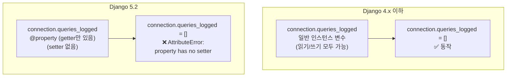
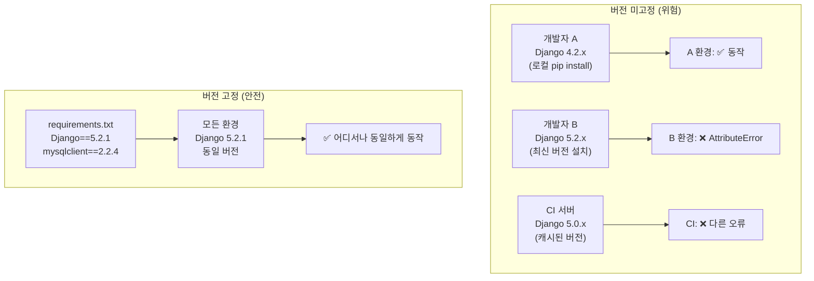
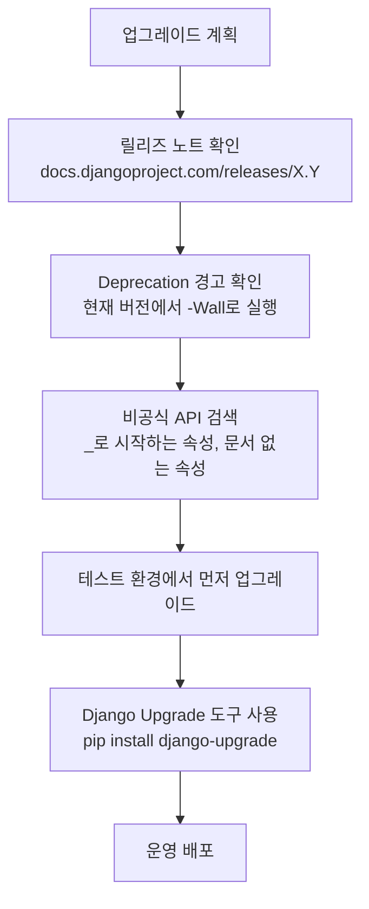

## 사건 발단

```
AttributeError: property 'queries_logged' of 'DatabaseWrapper' object has no setter
```

Django 5.2로 업그레이드한 직후, `/api/docs`가 500 에러를 냈다.
`DEBUG=True` 환경에서도 동일했다.

스택 트레이스를 따라가면:

```python
# apps/infrastructure/logging/middleware.py
class QueryLoggingMiddleware:
    def process_request(self, request):
        connection.queries_logged = []   # ← 여기서 AttributeError
```

## 원인 분석

`connection.queries_logged`는 Django의 `DatabaseWrapper` 내부에서 사용하는 **비공식 속성**이다.



이 속성은 Django 공식 문서에 등장하지 않는다.
**내부 구현 세부사항**이기 때문이다.

Django 코어 팀이 리팩토링하면서 `@property`로 바꿨고,
setter를 노출하지 않기로 결정했다.
그 결과 이전에 "우연히" 동작하던 코드가 갑자기 깨졌다.

## 해결 방법

공식 API만 사용하도록 수정한다.

```python
# 수정 전 (Django 5.2에서 깨짐)
class QueryLoggingMiddleware:
    def process_request(self, request):
        connection.queries_logged = []  # 비공식 내부 속성 직접 대입

# 수정 후 (공식 API 사용)
class QueryLoggingMiddleware:
    def process_request(self, request):
        # connection.queries는 공식 API (쿼리 로그 리스트)
        if hasattr(connection, "queries_log"):
            connection.queries_log.clear()  # 내부 버퍼 직접 클리어
```

`connection.queries`는 공식 Django 문서에 명시된 공개 API다.[^django-db-connection]
`queries_logged`는 내부 구현이므로 절대 대입하지 않는다.

## 내부 API 의존의 위험성

### Django 공식 API vs 비공식 내부 구현

| 구분 | 예시 | 안정성 |
|------|------|--------|
| **공식 API** | `connection.queries`, `connection.cursor()`, `Model.objects.all()` | 버전 간 호환 보장 |
| **비공식 내부** | `connection.queries_logged`, `connection._queries`, `Model._meta.pk` | 버전 업 시 깨질 수 있음 |

Django는 공식 API에 대해서만 하위 호환성을 보장한다.[^django-api-stability]
내부 속성(`_` 접두사, 문서에 없는 것)은 예고 없이 바뀔 수 있다.

### 자주 보이는 위험 패턴

```python
# ❌ 위험: 비공식 내부 속성 직접 접근
connection.queries_logged = []
request._messages._queued_messages = []
user._password = "hashed"

# ❌ 위험: Django 내부 모듈 직접 임포트
from django.db.backends.base.base import BaseDatabaseWrapper

# ✅ 안전: 공식 API 사용
from django.db import connection
connection.queries  # 공식 문서에 있음

from django.contrib import messages
messages.get_messages(request)  # 공식 API
```

## 협업에서 버전 고정이 왜 중요한가



### requirements.txt 관리

```bash
# requirements.txt — 버전 고정 (권장)
Django==5.2.1
celery==5.6.1
mysqlclient==2.2.4
django-environ==0.12.0
djangorestframework==3.16.0
```

```bash
# 현재 환경의 정확한 버전 고정
pip freeze > requirements.txt
```

```bash
# requirements.in → requirements.txt 자동 관리 (pip-tools)
pip install pip-tools
echo "Django>=5.2,<6.0" > requirements.in
pip-compile requirements.in    # requirements.txt 자동 생성 (하위 의존성 포함)
pip-sync requirements.txt       # 환경을 requirements.txt와 동기화
```

## Django LTS 버전

Django는 2년마다 LTS(Long-Term Support) 버전을 출시한다.[^django-lts]

| 버전 | 출시 | 지원 종료 | LTS |
|------|------|-----------|-----|
| 4.2 | 2023.04 | 2026.04 | ✅ LTS |
| 5.0 | 2023.12 | 2025.04 | - |
| 5.1 | 2024.08 | 2026.04 | - |
| 5.2 | 2025.04 | 2028.04 | ✅ LTS |

운영 환경에서는 LTS 버전을 사용하는 것이 안전하다.
LTS 버전은 보안 패치와 버그 수정이 더 오래 제공된다.

## 버전 업그레이드 전 체크리스트

Django 버전 업그레이드 전에 반드시 확인해야 할 것들:



```bash
# Deprecation 경고 활성화 (업그레이드 전 실행)
python -W error::DeprecationWarning manage.py check

# django-upgrade: 코드 자동 마이그레이션 도구
pip install django-upgrade
django-upgrade --target-version 5.2 **/*.py
```

## 핵심 교훈 2가지

**1. 내부 API는 건드리지 않는다**

공식 문서에 없는 속성이나 메서드는 언제든지 바뀔 수 있다.
`_` 접두사가 붙은 것, 문서에 없는 것은 내부 구현으로 간주하고 사용하지 않는다.

**2. 버전 고정이 협업의 기본**

`pip freeze > requirements.txt`는 습관이다.
Docker를 쓰는 이유도 결국 환경 고정이다.
"내 컴퓨터에선 됐는데"는 `requirements.txt`로 예방할 수 있다.

## 관련 글

- [Django Migration 완전 정복 →](/post/django-migration) — 버전 업그레이드 후 migration 상태 확인 방법
- [Django settings 분리와 환경변수 관리 →](/post/django-settings) — 환경별로 다른 Django 설정을 안전하게 관리
- [Docker Compose로 Django 5개 서비스 띄우기 →](/post/docker-compose-django) — Docker로 모든 팀원이 같은 환경을 쓰는 방법

---

[^django-db-connection]: Django Project, <a href="https://docs.djangoproject.com/en/5.2/topics/db/instrumentation/" target="_blank">Database instrumentation — Django Docs</a>
[^django-api-stability]: Django Project, <a href="https://docs.djangoproject.com/en/5.2/misc/api-stability/" target="_blank">API stability — Django Docs</a>
[^django-lts]: Django Project, <a href="https://docs.djangoproject.com/en/dev/internals/release-process/#long-term-support-lts-releases" target="_blank">Long-term support (LTS) releases — Django Docs</a>
[^django-52-release]: Django Project, <a href="https://docs.djangoproject.com/en/5.2/releases/5.2/" target="_blank">Django 5.2 release notes</a>
[^pip-tools]: Jazzband, <a href="https://github.com/jazzband/pip-tools" target="_blank">pip-tools — GitHub</a>
