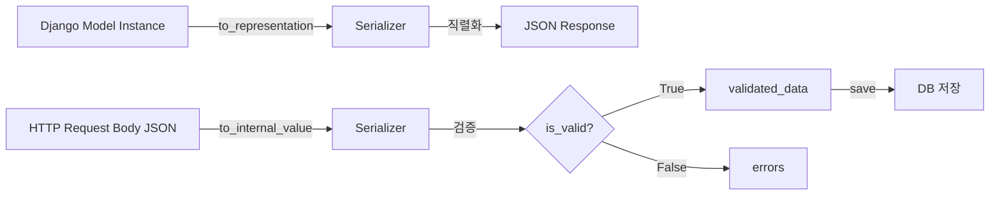

## DRF가 필요한 이유

Django 기본 View로도 JSON API를 만들 수 있다.

```python
# Django 기본으로 JSON API 만들기
import json
from django.http import JsonResponse
from django.views import View
from .models import Task

class TaskListView(View):
    def get(self, request):
        tasks = Task.objects.all()
        data = []
        for task in tasks:
            data.append({
                'id': task.id,
                'title': task.title,
                'status': task.status,
                'created_at': task.created_at.isoformat(),
            })
        return JsonResponse({'results': data})

    def post(self, request):
        body = json.loads(request.body)
        # 검증 없음, 오류 처리 없음, 직렬화 없음
        task = Task.objects.create(**body)
        return JsonResponse({'id': task.id}, status=201)
```

이 코드에는 문제가 많다:
- 직렬화/역직렬화를 손으로 구현해야 한다
- 입력값 검증이 없다
- 인증/권한 로직이 없다
- 오류 응답 형식이 일관되지 않는다
- 파일 업로드, 중첩 객체 등 처리가 복잡하다

DRF는 이 모든 것을 체계적으로 해결한다.

---

## 시리즈 구성

| 순서 | 제목 | 설명 |
|------|------|------|
| **7** | **DRF 기초** ← | **Serializer, ModelSerializer** |
| 8 | DRF Views | APIView, ViewSet, Router |
| 9 | DRF 인증 | Token, JWT, SimpleJWT |
| 10 | DRF Serializer 검증 심화 | validate_<field>, 3단계 검증 |
| 11 | Django 객체 레벨 권한 | Owner, 팀 기반 접근 제어 |

앞선 시리즈:

| 순서 | 제목 |
|------|------|
| 1 | Django 큰 그림 |
| 2 | MTV 아키텍처 |
| 3 | 요청-응답 라이프사이클 |
| 4 | Django 모델 |
| 5 | Django URL 라우팅 |
| 6 | Django ORM 심층 |

---

## REST API란

REST는 HTTP를 올바르게 쓰는 규칙이다.

| HTTP 메서드 | 의미 | 예시 |
|------------|------|------|
| GET | 조회 | `GET /api/tasks/` |
| POST | 생성 | `POST /api/tasks/` |
| PUT | 전체 수정 | `PUT /api/tasks/42/` |
| PATCH | 부분 수정 | `PATCH /api/tasks/42/` |
| DELETE | 삭제 | `DELETE /api/tasks/42/` |

HTTP 상태 코드로 결과를 표현한다:

| 상태 코드 | 의미 |
|----------|------|
| 200 OK | 성공 (GET, PUT, PATCH) |
| 201 Created | 생성 성공 (POST) |
| 204 No Content | 삭제 성공 (DELETE) |
| 400 Bad Request | 잘못된 요청 (검증 오류) |
| 401 Unauthorized | 인증 필요 |
| 403 Forbidden | 권한 없음 |
| 404 Not Found | 리소스 없음 |
| 500 Internal Server Error | 서버 오류 |

---

## Serializer의 역할

Serializer는 두 가지 방향으로 동작한다.

```
Python 객체 → Serializer → JSON (직렬화, Serialization)
JSON       → Serializer → Python 객체 (역직렬화, Deserialization + 검증)
```



### 기본 Serializer 작성

```python
# tasks/serializers.py
from rest_framework import serializers

class TaskSerializer(serializers.Serializer):
    id = serializers.IntegerField(read_only=True)
    title = serializers.CharField(max_length=200)
    status = serializers.ChoiceField(choices=['todo', 'in_progress', 'done'])
    priority = serializers.IntegerField(min_value=0, max_value=2)
    created_at = serializers.DateTimeField(read_only=True)

    def create(self, validated_data):
        return Task.objects.create(**validated_data)

    def update(self, instance, validated_data):
        instance.title = validated_data.get('title', instance.title)
        instance.status = validated_data.get('status', instance.status)
        instance.save()
        return instance
```

기본 `Serializer`는 모든 필드를 직접 선언해야 하고, `create()`와 `update()`를 직접 구현해야 한다.

---

## ModelSerializer — 빠른 CRUD

`ModelSerializer`는 모델을 기반으로 필드를 자동 생성하고, `create()`와 `update()`를 기본 구현해준다.

```python
from rest_framework import serializers
from .models import Task, Category, Tag

class TagSerializer(serializers.ModelSerializer):
    class Meta:
        model = Tag
        fields = ['id', 'name']


class CategorySerializer(serializers.ModelSerializer):
    class Meta:
        model = Category
        fields = ['id', 'name']


class TaskSerializer(serializers.ModelSerializer):
    # 중첩 직렬화: category 객체를 JSON으로 펼쳐서 출력
    category = CategorySerializer(read_only=True)
    # 쓰기 전용: category_id로 FK 설정
    category_id = serializers.PrimaryKeyRelatedField(
        queryset=Category.objects.all(),
        source='category',
        write_only=True,
        required=False,
    )
    tags = TagSerializer(many=True, read_only=True)

    class Meta:
        model = Task
        fields = [
            'id', 'title', 'description', 'status', 'priority',
            'due_date', 'category', 'category_id', 'tags', 'created_at',
        ]
        read_only_fields = ['id', 'created_at']
```

### Meta.fields 설정 방식

```python
class Meta:
    model = Task
    fields = '__all__'          # 모든 필드 (권장하지 않음 — 민감 필드 노출 위험)
    fields = ['id', 'title']    # 명시적 목록 (권장)
    exclude = ['password']      # 특정 필드만 제외
```

`fields = '__all__'`은 개발 편의를 위해 쓰지만, 나중에 모델에 민감한 필드가 추가될 경우 자동으로 노출된다.
**실제 서비스에서는 명시적 목록을 쓰는 것이 안전하다.**

---

## read_only / write_only 패턴

```python
class UserSerializer(serializers.ModelSerializer):
    # write_only: 요청에서는 받지만 응답에는 포함하지 않음
    password = serializers.CharField(write_only=True, min_length=8)

    # read_only: 응답에는 포함하지만 수정 불가
    created_at = serializers.DateTimeField(read_only=True)

    class Meta:
        model = User
        fields = ['id', 'email', 'password', 'created_at']
        read_only_fields = ['id', 'created_at']  # Meta에서 일괄 설정도 가능
```

---

## 검증 흐름

```python
# views.py
from rest_framework.views import APIView
from rest_framework.response import Response
from rest_framework import status

class TaskListView(APIView):
    def post(self, request):
        serializer = TaskSerializer(data=request.data)

        # is_valid() — 검증 실행
        if not serializer.is_valid():
            # 검증 실패: 400 + errors 반환
            return Response(serializer.errors, status=status.HTTP_400_BAD_REQUEST)

        # validated_data — 검증된 데이터 (안전하게 사용 가능)
        task = serializer.save(created_by=request.user)

        return Response(TaskSerializer(task).data, status=status.HTTP_201_CREATED)
```

`raise_exception=True`를 쓰면 DRF가 자동으로 400 응답을 돌려준다.

```python
# 더 간결한 방식
def post(self, request):
    serializer = TaskSerializer(data=request.data)
    serializer.is_valid(raise_exception=True)  # 검증 실패 시 자동 400
    task = serializer.save(created_by=request.user)
    return Response(TaskSerializer(task).data, status=status.HTTP_201_CREATED)
```

`serializer.errors`가 반환하는 형태:

```json
{
    "title": ["이 필드는 필수입니다."],
    "status": ["\"invalid_status\"은(는) 올바른 선택이 아닙니다."],
    "priority": ["유효한 정수(integer)를 넣어주세요."]
}
```

---

## save() 내부 동작

`serializer.save()`는 인스턴스 여부에 따라 `create()` 또는 `update()`를 호출한다.

```python
# 생성 (instance 없음)
serializer = TaskSerializer(data=request.data)
serializer.is_valid(raise_exception=True)
serializer.save()   # → create(validated_data) 호출

# 수정 (instance 있음)
task = Task.objects.get(pk=pk)
serializer = TaskSerializer(task, data=request.data, partial=True)
serializer.is_valid(raise_exception=True)
serializer.save()   # → update(task, validated_data) 호출
```

`save()`에 키워드 인자를 추가하면 `validated_data`에 병합된다.

```python
# request.user를 created_by로 자동 설정
serializer.save(created_by=request.user)

# 뷰에서 URL 파라미터로 받은 값 주입
serializer.save(task=task)  # Comment 생성 시 부모 Task 연결
```

---

## 중첩 Serializer

관계된 객체를 JSON에 포함할 때 중첩 시리얼라이저를 쓴다.

```python
class CommentSerializer(serializers.ModelSerializer):
    author_name = serializers.CharField(source='author.username', read_only=True)

    class Meta:
        model = Comment
        fields = ['id', 'body', 'author_name', 'created_at']


class TaskDetailSerializer(serializers.ModelSerializer):
    category = CategorySerializer(read_only=True)
    tags = TagSerializer(many=True, read_only=True)
    comments = CommentSerializer(many=True, read_only=True)
    comment_count = serializers.SerializerMethodField()

    class Meta:
        model = Task
        fields = [
            'id', 'title', 'description', 'status', 'priority',
            'category', 'tags', 'comments', 'comment_count', 'created_at',
        ]

    def get_comment_count(self, obj):
        return obj.comments.count()
```

`SerializerMethodField`는 모델에 없는 계산 값을 응답에 포함할 때 쓴다.
`get_{field_name}` 메서드를 정의하면 된다.

---

## 실전: Task CRUD 시리얼라이저 전체

```python
# tasks/serializers.py
from rest_framework import serializers
from .models import Task, Category, Tag


class TagSerializer(serializers.ModelSerializer):
    class Meta:
        model = Tag
        fields = ['id', 'name']


class CategorySerializer(serializers.ModelSerializer):
    task_count = serializers.SerializerMethodField()

    class Meta:
        model = Category
        fields = ['id', 'name', 'task_count']

    def get_task_count(self, obj):
        return obj.tasks.count()


class TaskListSerializer(serializers.ModelSerializer):
    """목록 조회용 — 경량 버전"""
    category_name = serializers.CharField(source='category.name', read_only=True)
    tag_names = serializers.SlugRelatedField(
        source='tags', many=True, read_only=True, slug_field='name'
    )
    is_overdue = serializers.BooleanField(read_only=True)

    class Meta:
        model = Task
        fields = [
            'id', 'title', 'status', 'priority',
            'category_name', 'tag_names', 'due_date', 'is_overdue', 'created_at',
        ]


class TaskDetailSerializer(serializers.ModelSerializer):
    """단건 조회용 — 상세 버전"""
    category = CategorySerializer(read_only=True)
    category_id = serializers.PrimaryKeyRelatedField(
        queryset=Category.objects.all(),
        source='category',
        write_only=True,
        required=False,
        allow_null=True,
    )
    tags = TagSerializer(many=True, read_only=True)
    tag_ids = serializers.PrimaryKeyRelatedField(
        queryset=Tag.objects.all(),
        source='tags',
        many=True,
        write_only=True,
        required=False,
    )

    class Meta:
        model = Task
        fields = [
            'id', 'title', 'description', 'status', 'priority', 'due_date',
            'category', 'category_id', 'tags', 'tag_ids', 'created_at', 'updated_at',
        ]
        read_only_fields = ['id', 'created_at', 'updated_at']

    def validate_title(self, value):
        if len(value.strip()) < 2:
            raise serializers.ValidationError('제목은 2자 이상이어야 합니다.')
        return value.strip()
```

---

## 마치며

DRF Serializer 핵심 요약:
- `Serializer` = Python 객체 ↔ JSON 변환 + 검증 레이어
- `ModelSerializer` = 모델 기반 자동 필드 생성, create()/update() 기본 구현
- `is_valid(raise_exception=True)` = 검증 + 자동 400 응답
- `save(**kwargs)` = create 또는 update 호출, kwargs는 validated_data에 병합
- 목록/상세 용도에 따라 시리얼라이저를 분리하는 것이 관리하기 좋다

---

## 관련 글

- [DRF Views →](/post/drf-views) — APIView, ViewSet, Router
- [DRF 인증 →](/post/drf-authentication) — Token, JWT, SimpleJWT
- [DRF Serializer 검증 심화 →](/post/drf-serializer-validation) — validate_<field> 완전 정복

[^drf-serializers]: <a href="https://www.django-rest-framework.org/api-guide/serializers/" target="_blank">DRF Documentation — Serializers</a>
[^drf-fields]: <a href="https://www.django-rest-framework.org/api-guide/fields/" target="_blank">DRF Documentation — Fields</a>
[^drf-relations]: <a href="https://www.django-rest-framework.org/api-guide/relations/" target="_blank">DRF Documentation — Relations</a>
[^rest-tutorial]: <a href="https://www.django-rest-framework.org/tutorial/quickstart/" target="_blank">DRF Tutorial — Quickstart</a>
