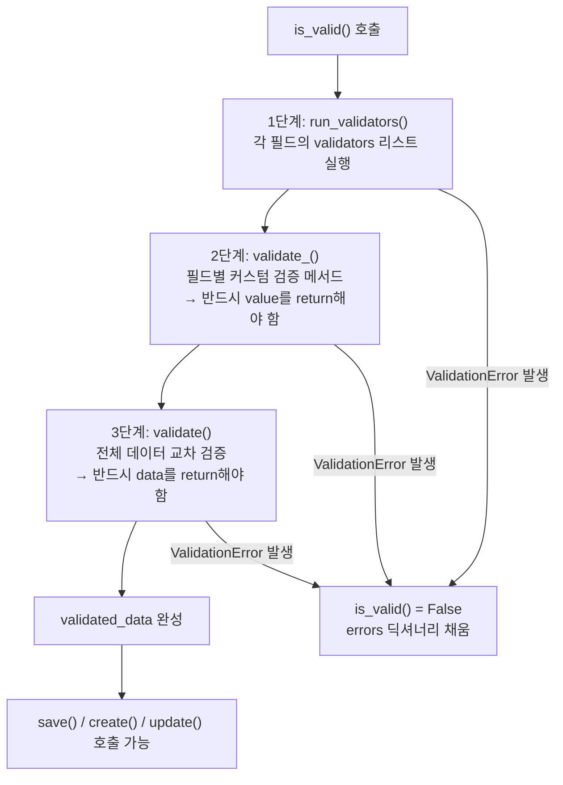

## 오늘의 시행착오: 검증 통과 → 데이터 유실

```python
# ❌ 이 코드의 문제가 보이는가?
def validate_category(self, value):
    if not Category.objects.filter(id=value).exists():
        raise serializers.ValidationError("존재하지 않는 카테고리입니다.")
    # return이 없다!
```

카테고리 검증 로직을 완성했고, ValidationError도 잘 발생시킨다. 그런데 정작 유효한 값으로 저장을 시도하면 **category 필드가 빠진 채로 저장**된다.

에러도 없다. 경고도 없다. 그냥 조용히 사라진다.

---

## Serializer 검증 라이프사이클

DRF가 `.is_valid()`를 호출할 때 내부에서 어떤 일이 벌어지는지 전체 흐름을 이해해야 한다.<a href="https://www.django-rest-framework.org/api-guide/serializers/#validation" target="_blank"><sup>[1]</sup></a>



**핵심**: 각 단계는 **검증 + 값 변환**을 동시에 수행한다. 값을 return하지 않으면 `None`이 반환되어 `validated_data`에서 해당 필드가 `None`으로 덮어씌워진다.

---

## 1단계: 필드 레벨 validators

```python
from rest_framework import serializers
from rest_framework.validators import UniqueValidator

class TaskSerializer(serializers.ModelSerializer):
    title = serializers.CharField(
        validators=[
            UniqueValidator(
                queryset=Task.objects.all(),
                message="이미 존재하는 제목입니다."
            )
        ]
    )
```

`validators` 리스트는 `validate_<field>` 메서드보다 먼저 실행된다. 값을 **반환하지 않고 에러만 raise**한다.

---

## 2단계: validate_\<field\>() — 반드시 return

```python
class TaskSerializer(serializers.ModelSerializer):

    def validate_category(self, value):
        """
        value: 클라이언트가 보낸 category 값 (이미 타입 변환 완료)
        반드시 value를 return해야 validated_data에 들어간다.
        """
        if not Category.objects.filter(id=value).exists():
            raise serializers.ValidationError("존재하지 않는 카테고리입니다.")

        # ✅ 이 한 줄이 없으면 validated_data['category'] = None
        return value

    def validate_due_date(self, value):
        """날짜 검증 + 변환 예시"""
        if value < date.today():
            raise serializers.ValidationError("과거 날짜는 설정할 수 없습니다.")
        return value  # ✅ 반드시 return

    def validate_priority(self, value):
        """값을 변환해서 반환하는 예시"""
        # 입력값을 정규화하여 반환할 수도 있다
        return value.upper()  # 'high' → 'HIGH'
```

### Python에서 return이 없으면 어떻게 되는가

```python
def validate_category(self, value):
    if not Category.objects.filter(id=value).exists():
        raise serializers.ValidationError("...")
    # return 없음 → Python이 암묵적으로 None 반환

# DRF 내부 동작 (간략화):
validated_value = self.validate_category(raw_value)  # None 반환
validated_data['category'] = validated_value          # None 저장됨
```

Python의 모든 함수는 `return` 없으면 `None`을 반환한다. DRF는 이것을 "의도적인 None 설정"으로 해석한다.

---

## 3단계: validate() — 교차 검증

복수 필드 간의 관계를 검증할 때 사용한다.

```python
class TaskSerializer(serializers.ModelSerializer):

    def validate(self, data):
        """
        data: 모든 필드 레벨 검증이 완료된 validated_data
        반드시 data를 return해야 한다.
        """
        start_date = data.get('start_date')
        end_date = data.get('end_date')

        if start_date and end_date and start_date > end_date:
            raise serializers.ValidationError(
                "종료일은 시작일 이후여야 합니다."
            )

        # 비즈니스 로직: 마감일 기본값 설정
        if not data.get('due_date') and start_date:
            data['due_date'] = start_date + timedelta(days=7)

        return data  # ✅ 반드시 return
```

---

## 전체 예시: TaskModelSerializer

```python
from rest_framework import serializers
from datetime import date, timedelta
from .models import Task, Category

class TaskModelSerializer(serializers.ModelSerializer):

    class Meta:
        model = Task
        fields = [
            'id', 'title', 'description',
            'category', 'priority', 'due_date',
            'start_date', 'end_date', 'created_by',
        ]
        read_only_fields = ['id', 'created_by']

    # ── 필드 레벨 검증 ────────────────────────────────────────────────

    def validate_title(self, value):
        """빈 문자열·공백 차단"""
        if not value.strip():
            raise serializers.ValidationError("제목은 공백일 수 없습니다.")
        return value.strip()  # 앞뒤 공백 제거 후 반환

    def validate_category(self, value):
        """카테고리 존재 여부 확인"""
        if not Category.objects.filter(id=value).exists():
            raise serializers.ValidationError("존재하지 않는 카테고리입니다.")
        return value  # ✅ 핵심

    def validate_priority(self, value):
        VALID = ['LOW', 'MEDIUM', 'HIGH', 'CRITICAL']
        if value.upper() not in VALID:
            raise serializers.ValidationError(
                f"우선순위는 {VALID} 중 하나여야 합니다."
            )
        return value.upper()

    def validate_due_date(self, value):
        if value and value < date.today():
            raise serializers.ValidationError("과거 날짜는 설정할 수 없습니다.")
        return value

    # ── 교차 검증 ────────────────────────────────────────────────────

    def validate(self, data):
        start = data.get('start_date')
        end = data.get('end_date')

        if start and end and start > end:
            raise serializers.ValidationError({
                'end_date': "종료일은 시작일 이후여야 합니다."
            })

        return data

    # ── 저장 시 created_by 주입 ──────────────────────────────────────

    def create(self, validated_data):
        """request.user를 created_by에 자동 주입"""
        request = self.context.get('request')
        if request and request.user.is_authenticated:
            validated_data['created_by'] = request.user
        return super().create(validated_data)
```

---

## 검증 에러 응답 구조

```python
# 단일 필드 에러
raise serializers.ValidationError("메시지")
# → {"category": ["메시지"]}

# non_field_errors (교차 검증)
raise serializers.ValidationError("메시지")  # validate() 안에서
# → {"non_field_errors": ["메시지"]}

# 특정 필드 지정
raise serializers.ValidationError({"end_date": "종료일이 잘못됐습니다."})
# → {"end_date": ["종료일이 잘못됐습니다."]}
```

```json
// 실제 API 응답 예시 (HTTP 400)
{
  "category": ["존재하지 않는 카테고리입니다."],
  "due_date": ["과거 날짜는 설정할 수 없습니다."],
  "non_field_errors": ["종료일은 시작일 이후여야 합니다."]
}
```

---

## 검증 흐름 요약표

| 메서드 | 실행 시점 | 입력 | 반드시 return |
|---|---|---|---|
| `validators` 리스트 | 가장 먼저 | 개별 필드 값 | 불필요 (에러만 raise) |
| `validate_<field>()` | 필드별 순서대로 | 해당 필드 값 | **반드시 value return** |
| `validate()` | 마지막 | 전체 validated_data | **반드시 data return** |

---

## 흔한 실수 목록

```python
# ❌ 1. return 없음 → 필드가 None으로 저장
def validate_category(self, value):
    if not Category.objects.filter(id=value).exists():
        raise serializers.ValidationError("없는 카테고리")
    # return 없음!

# ❌ 2. validate()에서 data 대신 None 반환
def validate(self, data):
    if data['start'] > data['end']:
        raise serializers.ValidationError("날짜 오류")
    # return 없음! → validated_data 전체가 None

# ❌ 3. validate()에서 수정한 data를 반환 안 함
def validate(self, data):
    data['slug'] = slugify(data['title'])
    # return data 빠짐 → slug 변환 안 됨

# ✅ 올바른 패턴
def validate_category(self, value):
    # ... 검증 ...
    return value  # 항상 return

def validate(self, data):
    # ... 교차 검증 ...
    data['computed_field'] = some_value
    return data  # 항상 return
```

---

## 참고

<a href="https://www.django-rest-framework.org/api-guide/serializers/#validation" target="_blank">[1] DRF Serializers — Validation — 공식 문서</a>

<a href="https://www.django-rest-framework.org/api-guide/validators/" target="_blank">[2] DRF Validators — 공식 문서</a>

<a href="https://www.django-rest-framework.org/api-guide/fields/#field-level-validation" target="_blank">[3] DRF Field-level validation — 공식 문서</a>

---

## 관련 글

- [Django 객체 레벨 권한 — Owner와 팀 기반 접근 제어 →](/post/django-object-permissions)
- [Django Migration 완전 정복 →](/post/django-migration)
