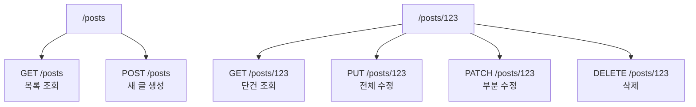

## API를 배우기 전에 HTTP부터

REST API를 공부할 때 프레임워크 문법부터 외우면 금방 헷갈린다.

먼저 이해해야 할 것은 **HTTP가 원래 어떤 약속을 가지고 있는가**다. 메서드와 상태 코드는 서버와 클라이언트가 주고받는 기본 언어다.

---

## HTTP 메서드의 기본 의미

### GET — 조회

리소스를 읽을 때 쓴다.

```http
GET /posts/123
```

게시글 123번을 조회하는 느낌이다.

### POST — 생성

새 리소스를 만들 때 자주 쓴다.

```http
POST /posts
```

새 게시글을 생성하는 느낌이다.

### PUT — 전체 수정

리소스를 **통째로 교체**한다는 의미에 가깝다.

```http
PUT /posts/123
```

보내는 표현이 전체 데이터라는 전제가 있다.

### PATCH — 부분 수정

일부 필드만 바꿀 때 쓴다.

```http
PATCH /posts/123
```

예를 들어 제목만 바꾸거나 상태만 바꾸는 경우다.

### DELETE — 삭제

리소스를 삭제할 때 쓴다.

```http
DELETE /posts/123
```

---

## PUT과 PATCH를 왜 구분해야 하는가

입문 단계에서 가장 많이 섞이는 두 메서드다.

- `PUT`: 전체 교체
- `PATCH`: 일부 수정

예를 들어 게시글에 `title`, `body`, `published` 필드가 있는데 제목만 바꾸고 싶다면, 일반적으로 `PATCH`가 더 자연스럽다.

::: notice
실무 API에서는 PUT과 PATCH가 엄격하게 구분되지 않는 경우도 있다. 그래도 기초 단계에서는 **전체 교체 vs 부분 수정**의 원래 의미를 먼저 잡아 두는 편이 좋다.
:::

---

## 상태 코드 그룹은 무엇을 말하는가

상태 코드는 세 자리 숫자지만, 입문 단계에서는 먼저 **그룹의 의미**를 보는 것이 좋다.

| 그룹 | 의미 |
|--|--|
| `2xx` | 성공 |
| `4xx` | 클라이언트 요청 문제 |
| `5xx` | 서버 내부 문제 |

### 자주 보는 2xx

- `200 OK` — 일반적인 성공
- `201 Created` — 생성 성공
- `204 No Content` — 성공했지만 응답 본문 없음

### 자주 보는 4xx

- `400 Bad Request` — 요청 형식이 잘못됨
- `401 Unauthorized` — 인증 필요
- `403 Forbidden` — 권한 없음
- `404 Not Found` — 리소스를 찾지 못함

### 자주 보는 5xx

- `500 Internal Server Error` — 서버 내부 에러
- `502 Bad Gateway`
- `503 Service Unavailable`

---

## REST API에서는 어떻게 읽으면 좋은가

리소스를 중심으로 보면 이해가 쉽다.



중요한 것은 URL만 보는 것이 아니라 **메서드와 함께 읽는 것**이다.

---

## 프론트엔드와도 바로 연결된다

프론트엔드에서도 이 개념은 중요하다.

- `GET` 응답은 화면 조회에 연결
- `POST`, `PATCH`, `DELETE`는 mutation에 연결
- `404`면 없는 데이터, `401`이면 로그인 흐름, `500`이면 서버 문제 대응

즉 HTTP 기초를 알면 API 에러 메시지도 더 정확하게 읽을 수 있다.

::: tip
API 문서를 볼 때는 URL보다 먼저 **메서드와 예상 상태 코드**를 보자. 그 두 가지가 엔드포인트의 의도를 가장 빨리 드러낸다.
:::

---

## 마치며

HTTP 메서드와 상태 코드는 REST API의 문법보다 더 밑바닥에 있는 약속이다.

그래서 프레임워크를 배우기 전에 이 의미부터 잡아 두면, 어떤 백엔드 기술을 보더라도 API를 읽는 속도가 훨씬 빨라진다.

## 참고

<ol>
<li><a href="https://developer.mozilla.org/en-US/docs/Web/HTTP/Methods" target="_blank">[1] MDN — HTTP request methods</a></li>
<li><a href="https://developer.mozilla.org/en-US/docs/Web/HTTP/Reference/Status" target="_blank">[2] MDN — HTTP response status codes</a></li>
</ol>

---

## 관련 글

- [Hono로 REST API 시작하기 →](/post/hono-rest-api-overview)
- [HTTP와 HTTPS — 웹을 움직이는 프로토콜 →](/post/micro-http-https)
- [Node.js · Bun · Deno 런타임 비교 →](/post/js-runtime-node-bun-deno)
- [AI 웹개발자 로드맵 — Foundation 01~19 →](/post/ai-webdev-roadmap-foundation)
