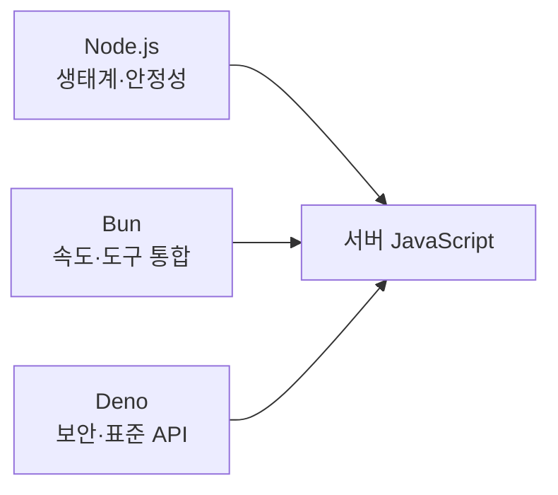

---
title: "Node.js · Bun · Deno — 서버 JavaScript 런타임은 무엇이 다른가"
slug: js-runtime-node-bun-deno
category: study/backend/runtime
tags: [javascript, runtime, nodejs, bun, deno, backend]
author: Seobway
readTime: 11
featured: false
coverImage: /roadmap-thumbnails/step-02-server-data.svg
createdAt: 2026-04-16
excerpt: >
  브라우저 밖에서 JavaScript를 실행하는 대표 런타임인 Node.js, Bun, Deno를 비교한다.
  각 런타임이 어떤 철학과 장점을 가지는지 기초 단계에서 필요한 만큼만 정리한다.
---

## 이 시리즈 구성

| 포스트 | 내용 |
|---|---|
| [로드맵 인덱스 →](/post/ai-webdev-roadmap-foundation) | 01~19 전체 학습 경로 |
| [02-1. Node.js · Bun · Deno →](/post/js-runtime-node-bun-deno) | 서버 JavaScript 런타임 비교 |
| [02-2. HTTP 메서드와 상태 코드 →](/post/http-methods-and-status-codes) | REST API의 기본 언어 |
| [02-3. Hono로 REST API 시작하기 →](/post/hono-rest-api-overview) | 경량 서버 프레임워크 실습 |
| [02-4. SQL JOIN · WHERE · HAVING · GROUP BY →](/post/sql-joins-where-having-group-by) | 쿼리 결과 예측과 집계 |

---

## 브라우저 JavaScript와 서버 JavaScript는 무엇이 다른가

문법 자체는 같아 보여도, JavaScript가 어디서 실행되느냐에 따라 할 수 있는 일이 달라진다.

브라우저에서는 DOM, 이벤트, 렌더링에 가깝고, 서버에서는 파일 시스템, 네트워크, 프로세스 관리에 가깝다. 이때 서버 쪽 실행 환경을 **런타임(runtime)** 이라고 부른다.

---

## Node.js

Node.js는 가장 널리 쓰이는 JavaScript 런타임이다.<a href="https://nodejs.org/learn/getting-started/introduction-to-nodejs" target="_blank">[1]</a>

특징:

- 거대한 npm 생태계
- 성숙한 서버·도구 체인
- 비동기 I/O 중심 설계

Node.js를 먼저 배우는 이유는 단순하다. 지금도 가장 많은 예제, 라이브러리, 실무 환경이 Node.js를 기준으로 설명되기 때문이다.

---

## Bun

Bun은 빠른 실행 속도와 번들러·테스트·패키지 매니저 같은 도구 통합을 강하게 밀고 있는 런타임이다.

특징:

- 빠른 시작 속도와 개발 체감 성능
- `bun install`, `bun test`, `bun run` 같은 통합 경험
- Node 호환성을 강하게 의식

즉 Bun은 "런타임 + 툴체인을 한 번에 묶어 더 빠르게"라는 방향이 강하다.

---

## Deno

Deno는 Node.js의 창시자 Ryan Dahl이 만든 런타임으로, 보안과 표준 Web API 경험을 더 강하게 가져간다.

특징:

- 기본 보안 권한 모델
- TypeScript 친화적 경험
- 표준 Web API를 적극 채택

즉 Deno는 "처음부터 다시 설계한 서버 JavaScript 환경"에 가깝다.

---

## 한 장으로 비교

| | Node.js | Bun | Deno |
|--|--|--|--|
| 강점 | 생태계·안정성 | 속도·도구 통합 | 보안·표준 API |
| 초심자 관점 | 자료가 가장 많음 | 체감이 빠름 | 개념이 깔끔함 |
| 추천 시작점 | 가장 무난 | 실험/개인 프로젝트 | 설계 철학 학습용 |

---

## 처음에는 무엇부터 쓰면 좋은가

입문 단계라면 보통 **Node.js부터** 시작하는 편이 가장 안정적이다.

이유:

- 예제가 가장 많다
- 라이브러리 호환성 문제가 적다
- 이후 Bun, Deno를 비교하기 쉽다

그다음 개인 프로젝트에서 Bun이나 Deno를 써 보면 차이가 더 또렷하게 보인다.

::: notice
런타임 비교의 핵심은 "어느 것이 절대적으로 더 좋다"가 아니다. **어떤 생태계와 실행 경험을 선택하느냐**에 가깝다.
:::

---

## Hono와는 어떻게 연결되는가

Hono는 특정 런타임 하나에만 묶이지 않고 여러 환경에서 동작할 수 있는 경량 웹 프레임워크다. 그래서 Node.js, Bun, Deno를 비교한 뒤 Hono를 보면 "왜 경량 프레임워크가 인기가 있는지"가 더 잘 보인다.

---

## 마치며

서버 JavaScript를 배운다는 것은 단순히 문법을 다시 보는 것이 아니라, **브라우저 밖에서 JavaScript가 어떤 환경 위에서 도는지** 이해하는 일이다.

Node.js, Bun, Deno의 차이를 큰 그림으로 먼저 잡아 두면, 이후 Hono나 API 서버 실습도 훨씬 맥락 있게 들어온다.

## 조금 더 깊게 보기

### 런타임은 언어의 생활 공간이다

JavaScript 문법은 같아도 브라우저, Node.js, Bun, Deno에서 할 수 있는 일은 다르다. 언어는 문법이고, 런타임은 그 문법이 실제로 살아 움직이는 공간이다.

### 개발자가 봐야 할 선택 기준

Node.js는 생태계가 가장 넓고 예제가 많다. Bun은 개발 체감 속도와 도구 통합이 강점이다. Deno는 보안 권한 모델과 표준 Web API 방향성이 선명하다. 선택은 팀의 배포 환경, 패키지 호환성, 운영 경험까지 포함해 결정해야 한다.

### 실무 함정

Bun이나 Deno로 시작했는데 특정 npm 패키지가 Node.js 전용 API에 의존하면 예상치 못한 문제가 생길 수 있다. 그래서 입문은 Node.js로 안정적으로 시작하고, 이후 Bun/Deno를 비교 실험하는 순서가 좋다.

---

## 참고

<ol>
<li><a href="https://nodejs.org/learn/getting-started/introduction-to-nodejs" target="_blank">[1] Node.js Learn — Introduction to Node.js</a></li>
<li><a href="https://bun.sh/docs" target="_blank">[2] Bun Docs</a></li>
<li><a href="https://docs.deno.com/runtime/manual/getting_started/first_steps/" target="_blank">[3] Deno Docs — First Steps</a></li>
</ol>

---

## 관련 글

- [HTTP 메서드와 상태 코드 기초 →](/post/http-methods-and-status-codes)
- [Hono로 REST API 시작하기 →](/post/hono-rest-api-overview)
- [JS 이벤트 루프와 비동기 큰 그림 →](/post/js-event-loop-and-async)
- [AI 웹개발자 로드맵 — Foundation 01~19 →](/post/ai-webdev-roadmap-foundation)
