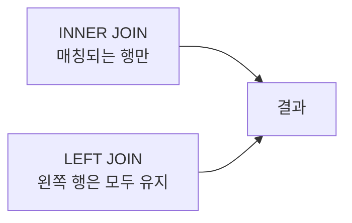

## 왜 SQL은 결과를 예측하는 연습이 중요한가

SQL은 문법만 외우면 금방 막힌다.

정말 중요한 것은 "이 쿼리를 실행하면 표가 어떻게 바뀔까?"를 머릿속으로 그릴 수 있는지다. 그래서 이 글은 `SELECT`, `JOIN`, `WHERE`, `HAVING`, `GROUP BY`를 **결과 중심**으로 설명한다.

---

## 예제 테이블

```sql
-- users
id | name
---+-------
1  | Alice
2  | Bob
3  | Chris

-- orders
id | user_id | amount
---+---------+--------
1  | 1       | 10000
2  | 1       | 15000
3  | 2       | 7000
```

---

## INNER JOIN vs LEFT JOIN

### INNER JOIN

양쪽에 **매칭되는 행만** 남긴다.

```sql
SELECT u.name, o.amount
FROM users u
INNER JOIN orders o ON u.id = o.user_id;
```

결과:

```sql
Alice | 10000
Alice | 15000
Bob   | 7000
```

Chris는 주문이 없으므로 빠진다.

### LEFT JOIN

왼쪽 테이블은 모두 남기고, 오른쪽에서 매칭이 없으면 `NULL`을 채운다.

```sql
SELECT u.name, o.amount
FROM users u
LEFT JOIN orders o ON u.id = o.user_id;
```

결과:

```sql
Alice | 10000
Alice | 15000
Bob   | 7000
Chris | NULL
```



---

## WHERE는 언제 쓰는가

`WHERE`는 **그룹핑하기 전 행(row)을 걸러내는 조건**이다.

```sql
SELECT *
FROM orders
WHERE amount >= 10000;
```

이 쿼리는 개별 주문 행 중에서 금액이 10000 이상인 행만 남긴다.

---

## GROUP BY와 집계 함수

사용자별 총 주문 금액을 보고 싶다면 `GROUP BY`를 쓴다.

```sql
SELECT user_id, SUM(amount) AS total_amount
FROM orders
GROUP BY user_id;
```

결과:

```sql
1 | 25000
2 | 7000
```

대표적인 집계 함수는 다음과 같다.

- `COUNT()`
- `SUM()`
- `AVG()`
- `MIN()`
- `MAX()`

---

## HAVING은 왜 필요한가

`HAVING`은 **그룹핑한 결과에 조건을 거는 것**이다.

```sql
SELECT user_id, SUM(amount) AS total_amount
FROM orders
GROUP BY user_id
HAVING SUM(amount) >= 10000;
```

결과:

```sql
1 | 25000
```

즉 `WHERE`와 `HAVING`의 차이는 다음으로 보면 된다.

- `WHERE` — 그룹핑 전 행을 거름
- `HAVING` — 그룹핑 후 집계 결과를 거름

::: notice
입문 단계에서는 `WHERE = row 필터`, `HAVING = group 필터`로 기억해도 충분하다. 이 한 줄이 SQL 독해 속도를 크게 올려 준다.
:::

---

## JOIN과 GROUP BY를 같이 쓰면 어떻게 읽나

```sql
SELECT u.name, COUNT(o.id) AS order_count, SUM(o.amount) AS total_amount
FROM users u
LEFT JOIN orders o ON u.id = o.user_id
GROUP BY u.id, u.name;
```

이 쿼리는 다음 순서로 읽으면 좋다.

1. `users`를 기준으로 본다
2. `orders`를 `LEFT JOIN`한다
3. 사용자별로 묶는다
4. 주문 개수와 총액을 계산한다

결과는 대략 이렇게 된다.

```sql
Alice | 2 | 25000
Bob   | 1 | 7000
Chris | 0 | NULL
```

---

## 초반에 꼭 해 볼 연습

- JOIN 결과를 실행 전에 표로 그려 보기
- `WHERE`와 `HAVING`을 바꿔 쓰면 왜 달라지는지 비교하기
- `INNER JOIN`과 `LEFT JOIN`이 누굴 빼먹는지 확인하기

::: tip
SQL은 "정답 쿼리 외우기"보다 **중간 결과 테이블을 상상하는 힘**이 중요하다. 손으로 표를 그려 보는 연습이 생각보다 훨씬 효과적이다.
:::

---

## 마치며

백엔드 기초에서 SQL이 어려운 이유는 문법이 많아서가 아니라, **행과 그룹이 어떻게 변하는지 머릿속에서 추적해야 하기 때문**이다.

그래서 JOIN, WHERE, HAVING, GROUP BY를 묶어서 이해하면 훨씬 빨리 감이 온다.

## 참고

<ol>
<li><a href="https://www.postgresql.org/docs/current/sql-select.html" target="_blank">[1] PostgreSQL Docs — SELECT</a></li>
<li><a href="https://www.postgresql.org/docs/current/queries-table-expressions.html" target="_blank">[2] PostgreSQL Docs — Table Expressions and JOINs</a></li>
<li><a href="https://www.postgresql.org/docs/current/tutorial-select.html" target="_blank">[3] PostgreSQL Docs — Tutorial: Queries</a></li>
</ol>

---

## 관련 글

- [HTTP 메서드와 상태 코드 기초 →](/post/http-methods-and-status-codes)
- [Hono로 REST API 시작하기 →](/post/hono-rest-api-overview)
- [Django ORM 심층 — QuerySet, lazy evaluation, N+1 →](/post/django-orm-deep)
- [AI 웹개발자 로드맵 — Foundation 01~19 →](/post/ai-webdev-roadmap-foundation)
