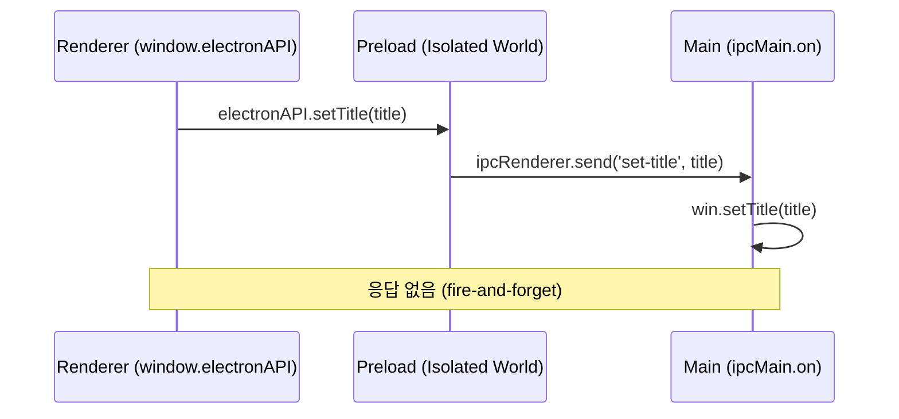
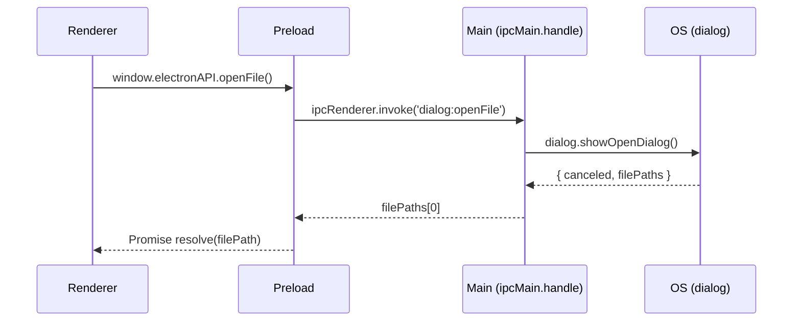
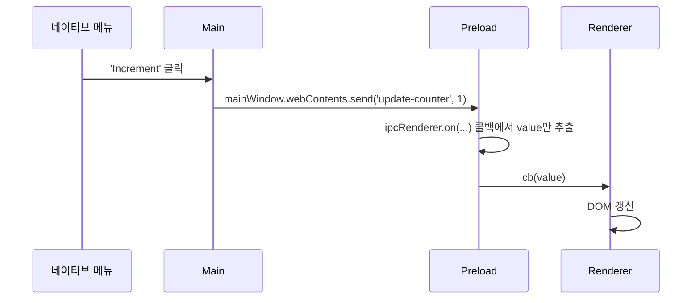
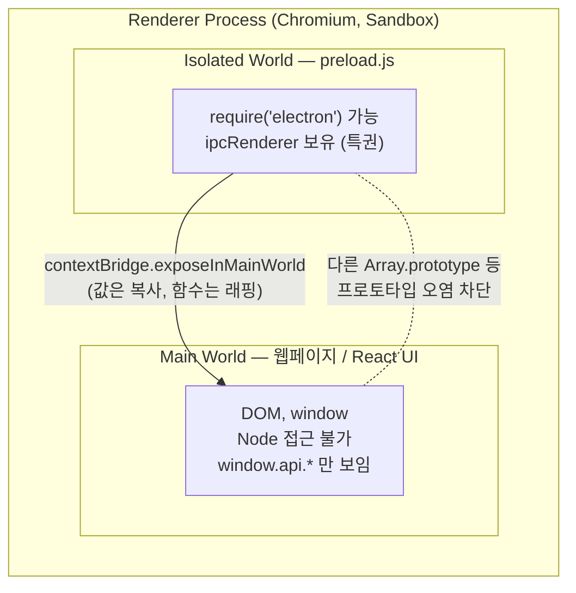
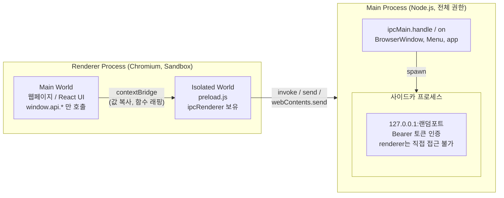

## 왜 IPC가 필요한가 — 프로세스 격리의 직접적 귀결

[1편](/post/electron-multi-process-architecture)에서 봤듯 Electron은 Chromium의 멀티프로세스 모델을 그대로 따른다. 한 앱은 최소 두 종류의 프로세스로 나뉜다.

- **main 프로세스**: Node.js 환경에서 실행된다. 창 관리(`BrowserWindow`), 앱 생명주기, **네이티브 OS API**(메뉴, 다이얼로그, 파일시스템, 자식 프로세스)를 담당한다.
- **renderer 프로세스**: Chromium 위에서 웹 페이지(우리 UI)를 렌더링한다. 기본적으로 **Node.js / Electron 모듈 접근 권한이 없다**.

> "IPC is the only way to perform many common tasks, such as calling a native API from your UI or triggering changes in your web contents from native menus."<a href="https://www.electronjs.org/docs/latest/tutorial/ipc" target="_blank"><sup>[1]</sup></a>

**핵심은 "왜"다.** main과 renderer는 **서로 다른 OS 프로세스**이고, 프로세스는 주소 공간(메모리)을 공유하지 않는다. renderer가 main의 함수를 직접 호출하거나 변수를 직접 읽을 방법은 원천적으로 없다. 둘이 협력하려면 **직렬화된 메시지를 채널로 주고받는 것**, 즉 IPC밖에 없다.

이건 단순한 불편함이 아니라 **보안 경계 그 자체**다. UI(신뢰할 수 없는 외부 콘텐츠를 그릴 수도 있는 면)와 OS 권한(신뢰 영역)을 물리적으로 분리해 둔 것이 IPC가 강제되는 이유다.

::: note
**왜 함수를 그대로 못 보내나** — IPC 인자는 *Structured Clone Algorithm*으로 복사된다. `window.postMessage`와 같은 방식이라 **프로토타입 체인이 포함되지 않으며**, `Function`, `Promise`, `Symbol`, `WeakMap`, `WeakSet`을 보내면 예외가 난다. `ImageBitmap`, `File`, `DOMMatrix` 같은 DOM 객체도 main이 디코딩할 수 없어 전송 시 에러가 난다.<a href="https://www.electronjs.org/docs/latest/api/ipc-renderer" target="_blank"><sup>[2]</sup></a>
:::

---

## IPC 4가지 패턴

채널 이름은 임의 문자열이다. `dialog:openFile`처럼 콜론 접두사를 붙이는 건 가독성을 위한 네임스페이스일 뿐 동작에는 영향을 주지 않는다.<a href="https://www.electronjs.org/docs/latest/tutorial/ipc" target="_blank"><sup>[1]</sup></a>

### 패턴 1 — Renderer → Main (단방향, fire-and-forget)

`ipcRenderer.send` → `ipcMain.on`. UI가 main의 네이티브 API를 "호출만 하고 응답은 안 받는" 경우다. 창 제목 변경이 대표적이다.



```js
// main.js — ipcMain.on 으로 채널 구독
const { app, BrowserWindow, ipcMain } = require('electron')
const path = require('node:path')

function handleSetTitle (event, title) {
  const win = BrowserWindow.fromWebContents(event.sender)
  win.setTitle(title)
}

app.whenReady().then(() => {
  ipcMain.on('set-title', handleSetTitle)
})
```

```js
// preload.js — send 를 래핑해 노출 (ipcRenderer 전체 노출 금지)
const { contextBridge, ipcRenderer } = require('electron')
contextBridge.exposeInMainWorld('electronAPI', {
  setTitle: (title) => ipcRenderer.send('set-title', title)
})
```

```js
// renderer.js — window 전역에 노출된 안전한 API만 호출
document.getElementById('btn').addEventListener('click', () => {
  window.electronAPI.setTitle(document.getElementById('title').value)
})
```

### 패턴 2 — Renderer → Main (양방향, 요청-응답)

`ipcRenderer.invoke` → `ipcMain.handle`. main 모듈을 호출하고 **결과를 Promise로 기다린다**. 네이티브 파일 다이얼로그를 여는 작업이 대표적이며, 실무에서 가장 자주 쓰는 패턴이다.



```js
// main.js
const { app, BrowserWindow, ipcMain, dialog } = require('electron')

async function handleFileOpen () {
  const { canceled, filePaths } = await dialog.showOpenDialog()
  if (!canceled) return filePaths[0]
}

app.whenReady().then(() => {
  ipcMain.handle('dialog:openFile', handleFileOpen)
})
```

```js
// preload.js
const { contextBridge, ipcRenderer } = require('electron')
contextBridge.exposeInMainWorld('electronAPI', {
  openFile: () => ipcRenderer.invoke('dialog:openFile')   // Promise 반환
})
```

```js
// renderer.js
const filePath = await window.electronAPI.openFile()
```

::: warning
**에러 처리 주의** — `handle`에서 던진 에러는 직렬화되어 renderer에는 **`message` 속성만** 전달된다. 스택 트레이스나 커스텀 속성은 전달 과정에서 사라진다. renderer 쪽에서 세밀한 에러 분기를 하려면 main이 처음부터 구조화된 결과 객체(`{ ok, error }`)를 반환하는 편이 안전하다.<a href="https://www.electronjs.org/docs/latest/tutorial/ipc" target="_blank"><sup>[1]</sup></a>
:::

### 패턴 3 — Main → Renderer (푸시)

main이 특정 renderer의 `webContents.send`로 메시지를 민다. 어느 renderer로 보낼지 명시해야 하므로 `WebContents` 인스턴스가 필요하다. 네이티브 메뉴 클릭이 UI를 갱신하는 경우 등에 쓴다.



```js
// main.js — 네이티브 메뉴 → 특정 창의 webContents 로 push
const menu = Menu.buildFromTemplate([{
  label: app.name,
  submenu: [
    { label: 'Increment', click: () => mainWindow.webContents.send('update-counter', 1) },
    { label: 'Decrement', click: () => mainWindow.webContents.send('update-counter', -1) }
  ]
}])
```

```js
// preload.js — 콜백을 래핑해서 노출 (event 객체를 그대로 넘기지 말 것)
const { contextBridge, ipcRenderer } = require('electron')
contextBridge.exposeInMainWorld('electronAPI', {
  onUpdateCounter: (cb) => ipcRenderer.on('update-counter', (_event, value) => cb(value))
})
```

```js
// renderer.js
window.electronAPI.onUpdateCounter((value) => { /* DOM 갱신 */ })
```

::: danger
**보안 함정** — 콜백을 `ipcRenderer.on`에 **그대로 넘기면 안 된다.** `event.sender`를 통해 `ipcRenderer` 자체가 renderer로 누출될 수 있기 때문이다. 반드시 위 예시처럼 `value`만 골라 넘기는 래퍼를 거쳐야 한다.<a href="https://www.electronjs.org/docs/latest/tutorial/ipc" target="_blank"><sup>[1]</sup></a>
:::

### 패턴 4 — Renderer ↔ Renderer (직접 채널: MessagePort)

Electron은 renderer 간 직접 IPC 메서드를 제공하지 않는다. 대신 웹 표준 `MessageChannel`/`MessagePort`<a href="https://developer.mozilla.org/en-US/docs/Web/API/MessageChannel" target="_blank"><sup>[3]</sup></a>를 쓴다. main을 **브로커**로 삼아, 한쪽이 만든 포트를 `ipcRenderer.postMessage`의 `transfer` 인자로 넘겨 소유권을 이전한다.

```js
// Renderer A — 포트 쌍 생성, 한쪽을 main 으로 transfer
const { port1, port2 } = new MessageChannel()
ipcRenderer.postMessage('port', { message: 'hello' }, [port1])

// Main — 전달받은 포트를 다른 renderer 로 중계
ipcMain.on('port', (e, msg) => {
  const [port] = e.ports   // MessagePortMain
  // port 를 다른 webContents 로 다시 transfer → 두 renderer 가 직결
})
```

CPU 집약적이거나 크래시 위험이 있는 작업은 main 대신 `UtilityProcess`(Node 환경)로 분리해 `MessagePort`로 renderer와 직접 연결할 수도 있다.<a href="https://www.electronjs.org/docs/latest/api/ipc-renderer" target="_blank"><sup>[2]</sup></a>

---

## Preload + contextBridge로 안전하게 API 노출하기

renderer는 기본적으로 Node/Electron 모듈에 접근할 수 없다. 어떤 API를 노출할지는 **preload 스크립트에서 개발자가 직접 선택**한다. preload는 renderer 로드 직전에 실행되며, `require`와 Node 기능에 접근할 수 있는 특권 위치다.

`contextBridge.exposeInMainWorld(key, api)`는 **격리된 컨텍스트(preload) → 웹사이트 컨텍스트(renderer)** 사이에 안전한 양방향 동기 다리를 놓는다. 노출된 객체는 renderer에서 `window.<key>`로 보인다.

```js
// Preload (Isolated World)
const { contextBridge, ipcRenderer } = require('electron')
contextBridge.exposeInMainWorld('electron', {
  doThing: () => ipcRenderer.send('do-a-thing')
})
```

```js
// Renderer (Main World)
window.electron.doThing()
```

<a href="https://www.electronjs.org/docs/latest/api/context-bridge" target="_blank"><sup>[4]</sup></a>

::: important
**왜 전체 `ipcRenderer`를 노출하지 않는가** — 공식 문서는 "We don't directly expose the whole `ipcRenderer.send` API for security reasons. Make sure to limit the renderer's access to Electron APIs as much as possible"라고 명시한다. 전체를 노출하면 외부에서 주입된 악성 스크립트가 임의 채널로 임의 메시지를 보낼 수 있다. 최소 권한 원칙에 따라 **딱 필요한 함수만** 래핑해서 노출해야 한다.<a href="https://www.electronjs.org/docs/latest/tutorial/ipc" target="_blank"><sup>[1]</sup></a>
:::

**브릿지를 건너는 값의 타입 제약도 알아둘 필요가 있다.** 인자·반환값·에러는 모두 **복사(copy)**된다. 직렬화 → 역직렬화를 거쳐도 동일한 값이 되는 타입만 안전하게 동작한다.

| 타입 | 지원 | 제약 |
| --- | --- | --- |
| `string` / `number` / `boolean` | 가능 | 없음 |
| `Object` / `Array` | 가능 | 키는 Simple 타입만. 프로토타입 변형은 폐기되며, 커스텀 클래스는 값만 복사되고 프로토타입은 전달되지 않음 |
| `Function` | 가능 | 프로토타입 변형 폐기. 클래스/생성자는 전달 불가 |
| `Promise` / `Error` / `Blob` 등 Cloneable | 가능 | `Error`는 메시지/스택이 컨텍스트 이동으로 바뀔 수 있고 커스텀 속성은 손실됨 |
| `Symbol` | 불가 | 컨텍스트 간 복사 불가 → 폐기 |

<a href="https://www.electronjs.org/docs/latest/api/context-bridge" target="_blank"><sup>[4]</sup></a>

::: caution
Electron 29.0.0부터는 **`ipcRenderer` 자체를 contextBridge로 통째로 넘기는 것이 금지**되었다. 반드시 개별 함수로 래핑해서 노출해야 한다.
:::

---

## Context Isolation — preload와 웹페이지의 JS 컨텍스트 분리

**무엇인가.** Context Isolation은 `preload` 스크립트와 Electron 내부 로직이, 로드된 웹사이트와 **별도의 JavaScript 컨텍스트("Isolated World")**에서 실행되도록 보장하는 기능이다. Electron 12.0.0부터 기본값으로 켜져 있다.<a href="https://www.electronjs.org/docs/latest/tutorial/context-isolation" target="_blank"><sup>[5]</sup></a>

**왜 필요한가 — 프로토타입 오염 방지.** 분리가 없으면 renderer의 웹페이지(또는 거기 주입된 악성 스크립트)와 preload가 **같은 `window`, 같은 `Array.prototype`, 같은 `JSON.parse`**를 공유한다. 공격자가 `Array.prototype.push`나 `JSON.parse`를 재정의(프로토타입 오염)하면, 그 위에서 도는 preload나 Electron 코드가 변조된 빌트인을 그대로 쓰게 되어 권한 탈취로 이어질 수 있다.

Context Isolation은 두 컨텍스트의 전역 객체를 분리해, **renderer가 빌트인을 바꿔도 preload/Electron의 빌트인은 영향받지 않게** 만든다. Chromium의 Content Scripts와 같은 기술이다.<a href="https://www.electronjs.org/docs/latest/tutorial/security" target="_blank"><sup>[6]</sup></a>



::: important
**`nodeIntegration: false`만으로는 부족하다.** 공식 문서는 "Even when `nodeIntegration: false` is used, to truly enforce strong isolation and prevent the use of Node primitives, `contextIsolation` **must** also be used"라고 명시한다.<a href="https://www.electronjs.org/docs/latest/tutorial/security" target="_blank"><sup>[6]</sup></a> Node 통합을 끄는 것과 컨텍스트를 분리하는 것은 서로 다른 방어선이다.
:::

분리되어 있어도 협력은 가능하다. 그 통로가 바로 위에서 본 `contextBridge`다. 다만 커스텀 프로토타입이나 심볼은 이 다리를 건너지 못한다.

---

## Sandbox — renderer를 OS 수준에서 격리

샌드박스는 Chromium의 보안 기능으로, **OS를 이용해 renderer 프로세스가 접근할 수 있는 자원을 크게 제한**한다. 샌드박스화된 프로세스는 CPU/메모리는 자유롭게 쓸 수 있지만, 그 이상의 권한이 필요한 작업은 **전용 통신 채널로 더 높은 권한의 프로세스(main)에 위임**해야 한다. Electron 20부터 renderer는 별도 설정 없이 기본적으로 샌드박스화된다.<a href="https://www.electronjs.org/docs/latest/tutorial/sandbox" target="_blank"><sup>[7]</sup></a>

**Context Isolation과 Sandbox는 다른 계층을 막는다.** 그래서 둘 다 필요하다.

- **Context Isolation** = JS **언어 수준** 격리 (컨텍스트/프로토타입 분리)
- **Sandbox** = OS **프로세스 수준** 격리 (시스템콜/자원 접근 차단)

둘은 서로 다른 계층에서 작동하므로, 함께 켜야 방어선이 겹쳐서(defense in depth) 한쪽이 뚫려도 다른 쪽이 막아준다.

::: danger
**위험한 연쇄를 반드시 기억해야 한다.**

- `nodeIntegration: true`로 Node 통합을 켜면 → **해당 프로세스의 샌드박스가 꺼진다.**
- `contextIsolation`을 끄면 → **샌드박스도 함께 꺼진다** (전역 기본값이나 `sandbox: false` 설정 여부와 무관하게).

세 옵션은 독립적인 스위치가 아니라 서로 얽혀 있는 하나의 보안 경계다.<a href="https://www.electronjs.org/docs/latest/tutorial/sandbox" target="_blank"><sup>[7]</sup></a><a href="https://www.electronjs.org/docs/latest/tutorial/security" target="_blank"><sup>[6]</sup></a>
:::

---

## 보안 체크리스트 — 공식 Security 문서 기반

| # | 권장 | 왜 |
| --- | --- | --- |
| 2 | **원격 콘텐츠에 Node.js 통합 금지** | 원격/외부 콘텐츠가 Node에 닿으면 임의 시스템 작업이 가능해진다. preload + contextBridge로 필요한 것만 노출한다 |
| 3 | **Context Isolation 켜기** (`contextIsolation: true`, 12+ 기본값) | 프로토타입 오염과 Node 프리미티브 접근을 차단한다. `nodeIntegration: false`만으로는 불충분하다 |
| 4 | **프로세스 샌드박스 켜기** (`sandbox: true`, 20+ 기본값) | OS 수준으로 renderer 권한을 축소한다. 신뢰할 수 없는 콘텐츠를 비샌드박스 프로세스에서 처리하면 안 된다 |
| — | **`nodeIntegration: false`** | renderer에서 Node 직접 접근을 제거한다 |
| 17 | **모든 IPC 메시지의 `sender` 검증** | iframe·자식창을 포함한 모든 web frame이 IPC를 보낼 수 있다. `event.reply`로 사용자 데이터를 돌려주거나 권한 작업을 하는 핸들러는 제3자 frame을 신뢰하면 안 된다 |
| — | **전체 `ipcRenderer` 노출 금지** | 필요한 함수만 래핑한다. 콜백을 노출할 때는 `event.sender` 누출에 주의한다 |
| — | **CSP 설정** | `Content-Security-Policy: default-src 'self'; script-src 'self'`처럼 명시적으로 제한한다 |

<a href="https://www.electronjs.org/docs/latest/tutorial/security" target="_blank"><sup>[6]</sup></a>

```js
// Bad — 격리 해제 + Node 통합 (원격 콘텐츠에 절대 금지)
new BrowserWindow({ webPreferences: { contextIsolation: false, nodeIntegration: true } })

// Good — preload 로만 최소 노출
new BrowserWindow({ webPreferences: { preload: path.join(app.getAppPath(), 'preload.js') } })
```

---

## 전체 그림 — Renderer ↔ Preload(Bridge) ↔ Main

지금까지의 패턴과 보안 옵션을 한 장의 흐름으로 정리하면 다음과 같다. 이 구조는 실제 프로젝트에서 **사이드카 프로세스**(예: Python 엔진)를 다룰 때도 그대로 적용된다.



이 그림에서 핵심은, **신뢰할 수 없는 입력을 다루는 면(UI)은 샌드박스와 Context Isolation으로 OS·JS 양쪽에서 갇혀 있고, OS 권한과 외부 프로세스 접근은 main이 독점하며, 그 사이는 명시적으로 화이트리스트된 IPC 채널로만 연결된다**는 점이다. 노출된 API의 개수가 곧 공격 표면의 크기다.

::: tip
실제 프로젝트에서 위 구조를 적용한다면, main의 `webPreferences`는 다음처럼 3중 격리를 동시에 켜는 것이 출발점이다.

```js
webPreferences: {
  preload: path.join(app.getAppPath(), 'preload.js'),
  sandbox: true,          // OS 수준 격리
  contextIsolation: true, // JS 컨텍스트 분리
  nodeIntegration: false  // renderer Node 접근 차단
}
```

그리고 사이드카처럼 외부 프로세스를 띄운다면, **랜덤 포트 + 토큰 인증**으로 같은 머신의 다른 프로세스가 무단으로 접근하지 못하게 막고, `app.on('will-quit', ...)`에서 반드시 자식 프로세스를 정리해 좀비 프로세스를 방지한다.
:::

---

다음 글에서는 이렇게 만든 Electron 앱을 실제로 배포하기 위한 패키징 과정, 즉 [Electron 패키징과 asar — electron-builder로 배포하기](/post/electron-packaging-asar)를 살펴본다.

---

## 참고

<ol>
<li><a href="https://www.electronjs.org/docs/latest/tutorial/ipc" target="_blank">[1] Inter-Process Communication — Electron Docs</a></li>
<li><a href="https://www.electronjs.org/docs/latest/api/ipc-renderer" target="_blank">[2] ipcRenderer — Electron Docs</a></li>
<li><a href="https://developer.mozilla.org/en-US/docs/Web/API/MessageChannel" target="_blank">[3] MessageChannel — MDN Web Docs</a></li>
<li><a href="https://www.electronjs.org/docs/latest/api/context-bridge" target="_blank">[4] contextBridge — Electron Docs</a></li>
<li><a href="https://www.electronjs.org/docs/latest/tutorial/context-isolation" target="_blank">[5] Context Isolation — Electron Docs</a></li>
<li><a href="https://www.electronjs.org/docs/latest/tutorial/security" target="_blank">[6] Security — Electron Docs</a></li>
<li><a href="https://www.electronjs.org/docs/latest/tutorial/sandbox" target="_blank">[7] Process Sandboxing — Electron Docs</a></li>
</ol>

## 관련 글

- [Electron 네이티브 계층 — OS 통합과 C++ 바인딩 →](/post/electron-native-layer-os-integration) — 이전 글, 네이티브 모듈과 OS API 바인딩
- [Electron 패키징과 asar — electron-builder로 배포하기 →](/post/electron-packaging-asar) — 다음 글, 앱 패키징과 배포
- [Electron 멀티 프로세스 아키텍처 — Main, Renderer, Preload, Utility 프로세스 →](/post/electron-multi-process-architecture) — 시리즈 메인 글
