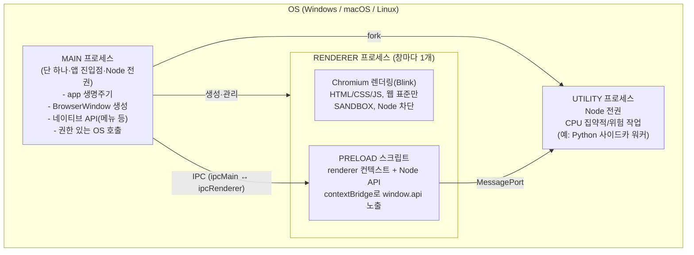

## 이 글에서 다루는 것

Electron으로 데스크톱 앱을 만들다 보면 작업관리자에 똑같은 이름의 프로세스가 여러 개 떠 있는 걸 본 적이 있을 것이다. 신기하게도 이건 버그가 아니라 **의도된 설계**다. Electron은 Chromium의 멀티 프로세스 아키텍처를 그대로 물려받았고, 그 위에 Node.js를 얹어 데스크톱 앱을 만들 수 있게 한 프레임워크다.

> "Electron inherits its multi-process architecture from Chromium, which makes the framework architecturally very similar to a modern web browser."<a href="https://www.electronjs.org/docs/latest/tutorial/process-model" target="_blank"><sup>[1]</sup></a>

이 글에서는 다음을 다룬다.

- 왜 브라우저(그리고 Electron)는 하나의 프로세스로 모든 걸 처리하지 않는가
- **Main** 프로세스 — 앱의 진입점이자 지휘자
- **Renderer** 프로세스 — 웹 표준만 쓰고 Node는 차단된 세계
- **Preload** 스크립트 — 둘을 안전하게 잇는 다리
- **Utility** 프로세스 — Main에서 떼어낸 별도의 Node 워커
- 샌드박스: OS 프로세스 격리 위에 한 겹 더

::: note
이 글은 7부작 Electron 내부 구조 시리즈의 첫 번째 글이다. 전체 그림을 먼저 그려두고, 다음 글들에서 각 프로세스 내부를 하나씩 깊게 파고든다.
:::

---

## 왜 멀티 프로세스인가 — Chromium에서 물려받은 이유

### 단일 프로세스의 근본 한계

웹 브라우저는 단순히 페이지를 그리는 것 외에도 여러 창과 탭을 관리하고, 서드파티 확장을 로딩하는 등 부차적인 책임이 매우 많은 복잡한 애플리케이션이다. 초창기 브라우저는 이 모든 기능을 **하나의 프로세스**에서 처리했다. 탭 하나당 메모리 오버헤드는 작았지만, **한 사이트가 크래시되거나 멈추면 브라우저 전체가 영향을 받는다**는 치명적인 단점이 있었다.<a href="https://www.electronjs.org/docs/latest/tutorial/process-model" target="_blank"><sup>[1]</sup></a>

Chromium 설계 문서는 이 문제를 좀 더 근본적으로 짚는다.

> "It's nearly impossible to build a rendering engine that never crashes or hangs. It's also nearly impossible to build a rendering engine that is perfectly secure."<a href="https://www.chromium.org/developers/design-documents/multi-process-architecture/" target="_blank"><sup>[2]</sup></a>

2006년경 브라우저의 상태는 단일 사용자·협조적 멀티태스킹 OS와 비슷했다. 그런 OS에서는 오작동하는 앱 하나가 시스템 전체를 끌고 내려갔다. 브라우저에서도 마찬가지로, 렌더링 엔진이나 플러그인의 버그 하나가 **브라우저 전체와 모든 탭을 동시에** 다운시킬 수 있었다.

현대 OS가 견고한 이유는 애플리케이션을 **서로 격리된 별도 프로세스**에 넣기 때문이다. 한 앱의 크래시는 일반적으로 다른 앱이나 OS 자체의 무결성을 해치지 않고, 사용자 간 데이터 접근도 제한된다. Chromium의 아키텍처는 바로 이 견고함을 브라우저 안으로 가져오는 것을 목표로 한다.<a href="https://www.chromium.org/developers/design-documents/multi-process-architecture/" target="_blank"><sup>[2]</sup></a>

### 안정성과 보안, 두 가지 이유

멀티 프로세스 아키텍처가 주는 이점은 크게 두 갈래로 나뉜다.

| 이유 | 멀티 프로세스가 주는 것 |
|------|------------------------|
| **안정성(Reliability)** | 탭(렌더러) 하나가 죽어도 나머지 앱과 다른 탭은 살아있다. 버그·행(hang)의 영향 범위를 한 프로세스 안으로 제한한다 |
| **보안 격리(Security)** | 각 렌더링 프로세스가 다른 프로세스나 시스템에 접근하는 것을 제한한다. OS의 메모리 보호·접근 제어를 웹 브라우징에 적용한다 |

> "Chromium uses multiple processes to protect the overall application from bugs and glitches in the rendering engine or other components. It also restricts access from each rendering engine process to other processes and to the rest of the system."<a href="https://www.chromium.org/developers/design-documents/multi-process-architecture/" target="_blank"><sup>[2]</sup></a>

Chrome 팀이 내린 결론은 단순했다. **각 탭을 자기 자신의 프로세스에서 렌더링**해서, 웹 페이지의 버그나 악성 코드가 앱 전체에 끼칠 수 있는 피해를 그 탭 하나로 제한한다. 그리고 **하나의 브라우저 프로세스**가 이 모든 프로세스와 애플리케이션의 생명주기 전체를 통제한다.

> "A single browser process then controls these processes, as well as the application lifecycle as a whole."<a href="https://www.electronjs.org/docs/latest/tutorial/process-model" target="_blank"><sup>[1]</sup></a>

Electron 앱의 구조도 이와 매우 닮아 있다. 앱 개발자가 직접 다루는 것은 두 종류의 프로세스 — **main**과 **renderer** — 이며, 이는 각각 Chrome의 browser 프로세스와 renderer 프로세스에 대응한다.<a href="https://www.electronjs.org/docs/latest/tutorial/process-model" target="_blank"><sup>[1]</sup></a>

---

## Main 프로세스 — 앱의 진입점이자 지휘자

### 핵심 성질

> "Each Electron app has a single main process, which acts as the application's entry point. The main process runs in a Node.js environment, meaning it has the ability to require modules and use all of Node.js APIs."<a href="https://www.electronjs.org/docs/latest/tutorial/process-model" target="_blank"><sup>[1]</sup></a>

Main 프로세스의 성질을 정리하면 다음과 같다.

- **단 하나만 존재한다.** 앱의 진입점(entry point)이다.
- **Node.js 환경에서 실행된다.** `require`로 모듈을 불러오고 파일 시스템, 자식 프로세스, 네이티브 모듈 등 **모든 Node.js API**를 사용할 수 있다.
- 렌더러에서는 금지된 시스템 레벨 작업이 **전부 Main에 모인다.** 강한 권한을 한 곳에만 가두는 것이 이 설계의 핵심이다.

::: important
"왜 Main은 하나뿐인가?"라는 질문의 답은 곧 보안 모델의 답이기도 하다. 윈도우 생성, 생명주기, 권한이 필요한 OS 호출에는 **단일 진실 공급원(single source of truth)**이 있어야 한다. 그래야 "renderer는 격리되어 있고, Main만 시스템에 접근한다"는 격리 모델이 성립한다.
:::

### 윈도우 관리 — BrowserWindow

Main의 1차 목적은 `BrowserWindow` 모듈로 애플리케이션 창을 만들고 관리하는 것이다. `BrowserWindow` 인스턴스 하나가 곧 하나의 창이고, **그 창은 별도의 renderer 프로세스에서 웹 페이지를 로드**한다. Main은 창의 `webContents` 객체를 통해 그 웹 콘텐츠와 상호작용한다.<a href="https://www.electronjs.org/docs/latest/tutorial/process-model" target="_blank"><sup>[1]</sup></a>

```js
// main.js
const { BrowserWindow } = require('electron')

const win = new BrowserWindow({ width: 800, height: 600 })
win.loadFile('index.html')

// 창의 웹 콘텐츠와 상호작용
const contents = win.webContents
console.log(contents)
```

### 애플리케이션 생명주기

Main 프로세스는 Electron의 `app` 모듈로 **앱 생명주기 전체를 통제**한다. 앱이 준비 완료됐는지(`ready`), 모든 창이 닫혔는지(`window-all-closed`), 앱이 다시 활성화됐는지(`activate`) 같은 이벤트가 모두 여기서 처리된다. `BrowserWindow`는 `app`이 `ready` 상태가 된 뒤에야 생성할 수 있다.

```js
// main.js
const { app, BrowserWindow } = require('electron')

function createWindow () {
  const win = new BrowserWindow({
    webPreferences: { preload: 'path/to/preload.js' }
  })
  win.loadFile('index.html')
}

app.whenReady().then(() => {
  createWindow()
  // macOS: dock 아이콘 클릭 시 창이 없으면 다시 생성
  app.on('activate', () => {
    if (BrowserWindow.getAllWindows().length === 0) createWindow()
  })
})

// Windows/Linux: 모든 창이 닫히면 앱 종료
app.on('window-all-closed', () => {
  if (process.platform !== 'darwin') app.quit()
})
```

### 네이티브 API

Main은 메뉴, 다이얼로그, 트레이 아이콘 등 OS의 네이티브 GUI 기능에 접근하는 커스텀 API들을 제공한다. 이런 기능은 **Main에서만** 접근할 수 있다.<a href="https://www.electronjs.org/docs/latest/tutorial/process-model" target="_blank"><sup>[1]</sup></a>

---

## Renderer 프로세스 — 웹 표준만, Node는 차단

### 핵심 성질

각 `BrowserWindow`는 자기만의 renderer 프로세스에서 웹 페이지를 렌더링한다. renderer는 **웹 페이지를 그리는 책임만** 진다. 그래서 사용하는 도구와 패러다임은 일반 웹 개발과 거의 동일하다.<a href="https://www.electronjs.org/docs/latest/tutorial/process-model" target="_blank"><sup>[1]</sup></a>

최소한으로 기억해 둘 것은 세 가지다.

> - "An HTML file is your entry point for the renderer process."
> - "UI styling is added through Cascading Style Sheets (CSS)."
> - "Executable JavaScript code can be added through `<script>` elements."<a href="https://www.electronjs.org/docs/latest/tutorial/process-model" target="_blank"><sup>[1]</sup></a>

### 기본적으로 Node 접근 불가 — 가장 중요한 사실

> "Moreover, this also means that the renderer has no direct access to `require` or other Node.js APIs. In order to directly include NPM modules in the renderer, you must use the same bundler toolchains (for example, webpack or parcel) that you use on the web."<a href="https://www.electronjs.org/docs/latest/tutorial/process-model" target="_blank"><sup>[1]</sup></a>

> "Renderer processes can be spawned with a full Node.js environment for ease of development. Historically this used to be the default, but this feature was disabled for security reasons."<a href="https://www.electronjs.org/docs/latest/tutorial/process-model" target="_blank"><sup>[1]</sup></a>

::: warning
renderer는 임의의 원격 웹 콘텐츠를 띄울 수 있는, **신뢰할 수 없는 코드의 실행 지점**이다. 여기에 `require`나 파일 시스템 접근이 열려 있으면, 악성 스크립트 한 줄이 사용자 컴퓨터 전체를 장악할 수 있다. 그래서 권한은 모두 Main으로 몰고, renderer는 웹 샌드박스 안에 가둔다.
:::

### renderer는 데스크톱 기능을 어떻게 쓰나

renderer의 UI가 Node.js나 Electron의 네이티브 기능에 접근해야 할 때, **직접 import할 방법은 없다.** 다리가 필요하다 — 그것이 바로 다음에 살펴볼 **Preload 스크립트**다.<a href="https://www.electronjs.org/docs/latest/tutorial/process-model" target="_blank"><sup>[1]</sup></a>

---

## Preload 스크립트 — Renderer에 붙지만 Node를 쥔 다리

### 무엇인가

> "Preload scripts contain code that executes in a renderer process before its web content begins loading. These scripts run within the renderer context, but are granted more privileges by having access to Node.js APIs."<a href="https://www.electronjs.org/docs/latest/tutorial/process-model" target="_blank"><sup>[1]</sup></a>

Preload의 핵심은 이 긴장 관계에 있다. preload는 **renderer 컨텍스트에서 실행**되어 `window` 전역을 공유하지만, 동시에 **Node.js API 접근 권한**을 부여받는다. "renderer에 붙어 있으면서 Node를 쥔" 특수한 위치인 것이다.

### 연결 방법

`BrowserWindow` 생성자의 `webPreferences.preload`로 부착한다.

```js
// main.js
const { BrowserWindow } = require('electron')
// ...
const win = new BrowserWindow({
  webPreferences: {
    preload: 'path/to/preload.js'
  }
})
```

### contextIsolation 때문에 직접 붙이면 보이지 않는다

preload가 renderer와 `window` 전역을 공유한다 해도, **`contextIsolation`이 기본값으로 켜져 있기 때문에** preload에서 `window`에 변수를 직접 붙여도 renderer 쪽에서는 보이지 않는다.

```js
// preload.js
window.myAPI = { desktop: true }
```

```js
// renderer.js
console.log(window.myAPI) // => undefined
```

> "Context Isolation means that preload scripts are isolated from the renderer's main world to avoid leaking any privileged APIs into your web content's code."<a href="https://www.electronjs.org/docs/latest/tutorial/process-model" target="_blank"><sup>[1]</sup></a>

만약 preload가 가진 강력한 객체가 renderer의 메인 월드에 그대로 노출된다면, 악성 웹 콘텐츠가 그 권한을 가로챌 수 있다. `contextIsolation`은 preload의 권한 있는 세계와 웹 콘텐츠의 세계를 분리하는 격리벽이다.

### 올바른 다리 — contextBridge

```js
// preload.js
const { contextBridge } = require('electron')

contextBridge.exposeInMainWorld('myAPI', {
  desktop: true
})
```

```js
// renderer.js
console.log(window.myAPI) // => { desktop: true }
```

`contextBridge`로 노출하면 renderer는 **딱 우리가 허용한 API만** 안전하게 볼 수 있다. 이 기능의 주된 용도는 두 가지다.

1. **IPC 헬퍼 노출** — `ipcRenderer` 헬퍼를 renderer에 노출해서, IPC로 main 프로세스의 작업을 renderer에서 (또는 그 반대 방향으로) 트리거한다.
2. **데스크톱 전용 로직 주입** — 기존 원격 웹앱을 Electron으로 감쌀 때, renderer의 `window`에 커스텀 속성을 추가해 데스크톱 전용 분기 처리를 가능하게 한다.<a href="https://www.electronjs.org/docs/latest/tutorial/process-model" target="_blank"><sup>[1]</sup></a>

### 권한이 큰 만큼 책임도 크다

> "Note that because the environment presented to the preload script is substantially more privileged than that of a sandboxed renderer, it is still possible to leak privileged APIs to untrusted code running in the renderer process unless `contextIsolation` is enabled."<a href="https://www.electronjs.org/docs/latest/tutorial/sandbox" target="_blank"><sup>[3]</sup></a>

::: important
preload는 반드시 **최소 권한만, contextBridge로만, contextIsolation을 켠 상태로** 노출해야 한다. 이 세 가지가 Electron 보안의 핵심 규율이다.
:::

---

## Utility 프로세스 — 별도의 Node 워커

### 무엇인가

> "Each Electron app can spawn multiple child processes from the main process using the UtilityProcess API. The utility process runs in a Node.js environment, meaning it has the ability to require modules and use all of Node.js APIs."<a href="https://www.electronjs.org/docs/latest/tutorial/process-model" target="_blank"><sup>[1]</sup></a>

> "`utilityProcess` creates a child process with Node.js and Message ports enabled. It provides the equivalent of `child_process.fork` API from Node.js but instead uses Services API from Chromium to launch the child process."<a href="https://www.electronjs.org/docs/latest/api/utility-process" target="_blank"><sup>[4]</sup></a>

정리하면 다음과 같은 특징을 가진다.

- **Main에서만** spawn할 수 있다.
- 여러 개를 동시에 띄울 수 있다.
- Node.js 전체 API와 **MessagePort**를 사용할 수 있다.
- 내부적으로는 Node의 `child_process.fork`가 아니라 **Chromium의 Services API**로 자식 프로세스를 띄운다.

### 무엇에 쓰나

> "The utility process can be used to host for example: untrusted services, CPU intensive tasks or crash prone components which would have previously been hosted in the main process or process spawned with Node.js `child_process.fork` API."<a href="https://www.electronjs.org/docs/latest/tutorial/process-model" target="_blank"><sup>[1]</sup></a>

대표적인 용도는 세 가지다.

- 신뢰할 수 없는 서비스
- CPU 집약적인 작업
- 크래시가 잦은 컴포넌트

무거운 작업이나 위험한 작업을 Main에 두면, 그 작업이 멈추거나 죽을 때 **앱 전체(모든 창)가 함께** 멈추거나 죽는다. Utility 프로세스로 분리하면 영향 범위가 그 워커 하나로 제한된다.

### child_process.fork보다 UtilityProcess를 권장하는 이유

> "The primary difference between the utility process and process spawned by Node.js `child_process` module is that the utility process can establish a communication channel with a renderer process using MessagePorts. An Electron app can always prefer the UtilityProcess API over Node.js `child_process.fork` API when there is need to fork a child process from the main process."<a href="https://www.electronjs.org/docs/latest/tutorial/process-model" target="_blank"><sup>[1]</sup></a>

핵심은 utility 프로세스가 **MessagePort로 renderer와 직접 통신 채널**을 열 수 있다는 점이다. 그래서 Electron 앱이 Main에서 자식 프로세스를 fork해야 할 때는 **언제나 UtilityProcess를 우선**하라고 공식 문서가 권장한다.

### API 시그니처와 예시

> `utilityProcess.fork(modulePath[, args][, options])`<a href="https://www.electronjs.org/docs/latest/api/utility-process" target="_blank"><sup>[4]</sup></a>

- `modulePath` (string) — 자식 프로세스의 엔트리 스크립트 경로
- `args` (string[]) — `process.argv`로 전달될 인자
- `options.env` — 환경 변수 (기본값은 `process.env`)
- `options.execArgv` — 실행 파일에 넘길 인자
- `options.cwd` — 작업 디렉터리
- `options.session` — 네트워크 요청에 쓸 세션 (기본은 HTTP 캐시 없는 시스템 네트워크 컨텍스트, 세션을 지정하면 HTTP 캐싱이 활성화된다)

```js
// main.js
const { app, utilityProcess } = require('electron')

app.whenReady().then(() => {
  const child = utilityProcess.fork('path/to/worker.js')

  child.on('spawn', () => console.log('utility process started'))
  child.postMessage({ task: 'analyze' })
  child.on('message', (data) => console.log('from worker:', data))
  child.on('exit', (code) => console.log('worker exited', code))
})
```

::: tip
Python 사이드카처럼 Node가 아닌 런타임을 붙여야 한다면, `utilityProcess.fork`로 가벼운 Node 워커를 띄우고 그 워커가 `child_process.spawn('python', ...)`으로 실제 엔진을 구동하는 패턴이 현실적이다. 워커는 MessagePort로 renderer와 진행률·결과를 주고받을 수 있다. CPU 집약적이고 크래시 위험이 있는 작업을 Main에서 떼어내는 것이 공식 설계 철학과 맞는 방향이다.
:::

---

## 프로세스 간 관계 한눈에 보기



대응 관계를 정리하면 다음과 같다.

- Chromium의 "browser process" ↔ Electron의 "main process"
- Chromium의 "renderer process" ↔ Electron의 "renderer process"<a href="https://www.electronjs.org/docs/latest/tutorial/process-model" target="_blank"><sup>[1]</sup></a>

좀 더 저수준으로 들어가면, 각 renderer 프로세스는 부모 browser 프로세스와의 통신·전역 상태를 관리하는 `RenderProcess` 객체를 가지고, browser 프로세스는 각 renderer마다 대응하는 `RenderProcessHost`를 유지한다. 둘은 **Mojo** 또는 Chromium의 레거시 IPC로 통신한다.<a href="https://www.chromium.org/developers/design-documents/multi-process-architecture/" target="_blank"><sup>[2]</sup></a>

---

## 각 프로세스는 실제 OS 프로세스다

위에서 설명한 모든 프로세스는 비유가 아니라 **OS 수준에서 실제로 분리된 별도 프로세스**다. 이것이 격리의 물리적 근거다.

Chromium은 "애플리케이션을 서로 벽으로 분리된 별도 프로세스에 넣는" 현대 OS의 견고함을 그대로 가져온다. 한 프로세스의 크래시가 다른 프로세스로 번지지 않는 이유가 바로 OS 수준의 프로세스 분리다.<a href="https://www.chromium.org/developers/design-documents/multi-process-architecture/" target="_blank"><sup>[2]</sup></a>

그래서 Windows 작업관리자에서 Electron 앱을 하나만 켜도 `electron.exe`(또는 패키징된 앱 이름) 프로세스가 여러 개 보인다. Main 1개, 창마다 Renderer 1개, 그리고 있다면 Utility/GPU 프로세스까지. 각각이 독립된 OS 프로세스이므로 CPU·메모리도 개별로 집계된다.

### 샌드박스 — OS 프로세스 격리 위에 한 겹 더

> "One key security feature in Chromium is that processes can be executed within a sandbox. The sandbox limits the harm that malicious code can cause by limiting access to most system resources — sandboxed processes can only freely use CPU cycles and memory."<a href="https://www.electronjs.org/docs/latest/tutorial/sandbox" target="_blank"><sup>[3]</sup></a>

샌드박스된 프로세스는 **CPU 사이클과 메모리만** 자유롭게 쓸 수 있고, 그 외 시스템 자원 접근은 제한된다. Electron에서 renderer 샌드박싱은 `webPreferences.sandbox` 또는 전역 `app.enableSandbox()`로 제어하며, 공식 문서는 "대부분의 앱에서는 샌드박싱이 최선의 선택"이라고 권장한다.<a href="https://www.electronjs.org/docs/latest/tutorial/sandbox" target="_blank"><sup>[3]</sup></a>

```js
// main.js — 전역 샌드박스 강제 (app ready 이전에 호출)
app.enableSandbox()
app.whenReady().then(() => {
  const win = new BrowserWindow() // 이후 sandbox: false 는 무시됨
  win.loadURL('https://example.com')
})
```

::: warning
샌드박스를 다룰 때 꼭 기억할 세 가지 함정이 있다.

1. renderer에서 `nodeIntegration: true`를 켜면 **샌드박스가 해제된다.**
2. `--no-sandbox` CLI 플래그는 **모든 프로세스(utility 포함)의 샌드박스를 끈다.** 테스트 용도로만 쓰고, 프로덕션에서는 절대 사용하지 않는다.
3. `sandbox: true`라도 renderer의 Node.js 환경은 여전히 비활성화된 상태로 유지된다.<a href="https://www.electronjs.org/docs/latest/tutorial/sandbox" target="_blank"><sup>[3]</sup></a>
:::

---

## 한눈에 보는 요약표

| 프로세스 | 개수 | 실행 환경 | Node 접근 | 샌드박스 | 주 역할 |
|----------|------|-----------|-----------|----------|---------|
| **Main** | 1 | Node.js | 전체 가능 | 해당 없음 | 진입점, 생명주기, BrowserWindow, 네이티브 API |
| **Renderer** | 창마다 1 | Chromium(Blink) | 기본 차단 | 권장 | 웹 표준 UI 렌더링 |
| **Preload** | renderer마다 | renderer 컨텍스트 | 가능 (특권) | renderer에 종속 | contextBridge로 안전한 API 다리 |
| **Utility** | 다수 | Node.js | 전체 가능 | `--no-sandbox` 영향 받음 | CPU 집약적/위험 작업, MessagePort |

이렇게 네 종류의 프로세스가 각자의 역할과 권한 범위를 가지고 OS 수준에서 격리된 채 협력하는 것이 Electron 앱의 전체 그림이다. [다음 글](/post/electron-renderer-chromium-rendering)에서는 이 중 Renderer 프로세스 안으로 들어가서, Chromium의 렌더링 엔진 Blink와 V8이 HTML/CSS/JS를 실제 화면 픽셀로 바꾸는 파이프라인을 살펴본다.

---

## 참고

<ol>
<li><a href="https://www.electronjs.org/docs/latest/tutorial/process-model" target="_blank">[1] Process Model — Electron</a></li>
<li><a href="https://www.chromium.org/developers/design-documents/multi-process-architecture/" target="_blank">[2] Multi-process Architecture — The Chromium Projects</a></li>
<li><a href="https://www.electronjs.org/docs/latest/tutorial/sandbox" target="_blank">[3] Process Sandboxing — Electron</a></li>
<li><a href="https://www.electronjs.org/docs/latest/api/utility-process" target="_blank">[4] utilityProcess — Electron</a></li>
</ol>

---

## 관련 글

- [렌더러 프로세스 내부 — Chromium 렌더링 엔진과 V8, 렌더링 파이프라인 →](/post/electron-renderer-chromium-rendering) — 렌더러 프로세스에서 실제로 무슨 일이 벌어지는지 살펴본다
