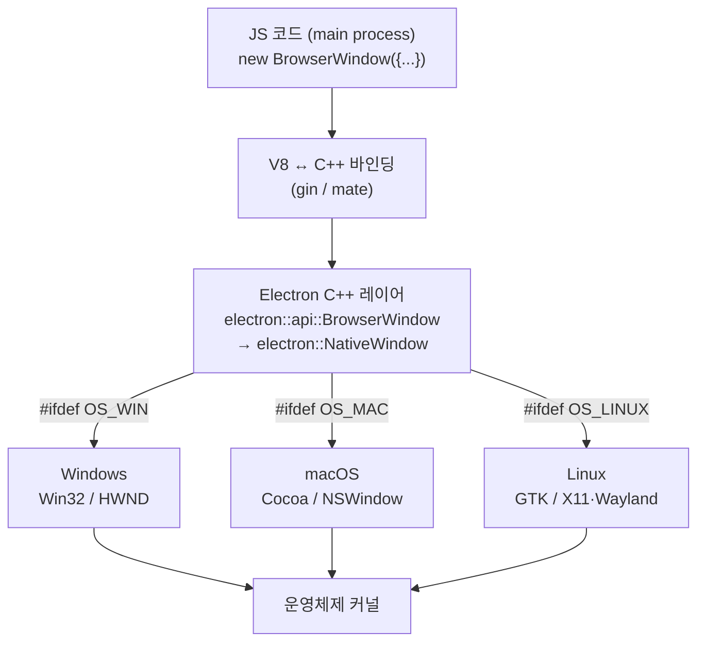
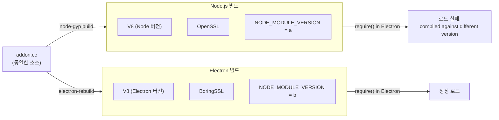

## JS API는 빙산의 일각

`new BrowserWindow({ width: 800, height: 600 })` 한 줄을 쓰면 화면에 창이 뜬다. 너무 당연해서 그 아래에서 무슨 일이 일어나는지 생각해 볼 일이 별로 없다.

하지만 `electron` 모듈에서 가져오는 `app`, `BrowserWindow`, `dialog`, `Tray`, `Notification` 같은 객체들은 사실 **JavaScript로 구현된 것이 아니다.** 이들은 모두 메인 프로세스 전용 API이며<a href="https://www.electronjs.org/docs/latest/api/app" target="_blank"><sup>[1]</sup></a>, 내부적으로는 **Electron이 C++로 작성한 객체에 대한 얇은 바인딩**이다.



핵심은 이렇다. **Electron = Chromium(렌더링) + Node.js(런타임) + Electron 고유 C++ 코드(OS 통합)**. `electron` 모듈은 이 마지막 C++ 코드층으로 들어가는 입구일 뿐이며, 같은 한 줄의 JS가 OS마다 전혀 다른 네이티브 위젯을 만들어낸다.

::: note
이전 글에서 본 메인/렌더러 프로세스 구조와 이중 이벤트 루프 위에, 이번 글은 "메인 프로세스가 OS와 실제로 어떻게 대화하는가"를 한 단계 더 파고든다.
:::

---

## OS 통합 API — 어떤 JS가 어떤 OS를 건드리나

대표적인 OS 통합 API와 그 아래에서 실제로 호출되는 네이티브 대상을 표로 정리하면 다음과 같다.

| JS API | 프로세스 | 건드리는 OS 기능 | 내부 네이티브 대상 |
|---|---|---|---|
| `app` | Main | 앱 생명주기, 단일 인스턴스 락, 기본 프로토콜 핸들러, Dock/Taskbar | OS 세션·런루프, `NSApplication`(mac), 작업표시줄(win) |
| `BrowserWindow` | Main | OS 창 생성·이동·최소화·투명·진동(vibrancy) | `NSWindow`(mac) / `HWND`(win) / GTK·X11·Wayland 표면(linux) |
| `Menu` / `Menu.setApplicationMenu` | Main | 네이티브 메뉴바, 컨텍스트 메뉴 | `NSMenu`(mac, 화면 상단) / 창 내부 메뉴(win·linux) |
| `Tray` | Main | 시스템 알림 영역(트레이/상태표시줄) 아이콘·메뉴 | 상태표시줄(mac) / 시스템 트레이(win) / StatusNotifierItem·GtkStatusIcon(linux) |
| `Notification` | Main | OS 알림 센터(토스트/배너) | `UNUserNotificationCenter`(mac) / WinRT Toast(win) / libnotify(linux) |
| `dialog` | Main | 네이티브 파일 열기/저장·메시지박스·에러 | `NSOpenPanel`/`NSSavePanel`(mac) / `IFileDialog`(win) / GTK 다이얼로그(linux) |
| `nativeImage` | Main+Renderer | 트레이·Dock·앱 아이콘 비트맵, HiDPI, 템플릿 이미지 | `NSImage`(mac) / `HBITMAP`(win) |
| `clipboard` | Main+Renderer | OS 클립보드 읽기/쓰기(텍스트·이미지·HTML) | `NSPasteboard`(mac) / Clipboard API(win) / X11·Wayland 셀렉션 |
| `globalShortcut` | Main | 앱이 비활성일 때도 듣는 전역 단축키 | `RegisterHotKey`(win) / Carbon·Cocoa 이벤트탭(mac) |
| `powerMonitor` | Main | 절전/복귀·화면잠금·배터리·유휴 상태 | 전원 관리 이벤트(`WM_POWERBROADCAST`, IOKit 등) |
| `screen` | Main | 디스플레이 개수·해상도·DPI·배치·커서 위치 | 디스플레이 서버/그래픽 드라이버 질의 |

각 API의 동작 차이는 공식 문서에 명시돼 있다.<a href="https://www.electronjs.org/docs/latest/api/browser-window" target="_blank"><sup>[2]</sup></a><a href="https://www.electronjs.org/docs/latest/api/dialog" target="_blank"><sup>[3]</sup></a><a href="https://www.electronjs.org/docs/latest/api/tray" target="_blank"><sup>[4]</sup></a><a href="https://www.electronjs.org/docs/latest/api/notification" target="_blank"><sup>[5]</sup></a><a href="https://www.electronjs.org/docs/latest/api/native-image" target="_blank"><sup>[6]</sup></a>

### BrowserWindow — 가장 대표적인 "C++ → 플랫폼 창"

`BrowserWindow`는 `BaseWindow`를 확장한 클래스이며, `app`의 `ready` 이벤트 이후에만 생성할 수 있다. 렌더 스택 초기화에 의존하기 때문이다. 옵션 중 상당수가 **특정 OS에서만 의미를 갖는다**는 점이, 내부에 C++ 플랫폼 분기가 존재한다는 직접적인 증거다.

```js
// 메인 프로세스
const { BrowserWindow } = require('electron')

const win = new BrowserWindow({
  width: 800,
  height: 600,
  frame: false,                 // 네이티브 프레임 제거 (모든 OS, 동작은 상이)
  transparent: true,            // 투명 창 (컴포지터 의존)
  titleBarStyle: 'hiddenInset', // macOS 전용 타이틀바 스타일
  vibrancy: 'sidebar',          // macOS 전용 — NSVisualEffectView 블러
})
```

`win.setVibrancy(type[, options])`는 문서에 _macOS_ 전용으로 명시돼 있다. Cocoa의 `NSVisualEffectView`를 직접 제어하는 호출이라, Windows·Linux에는 대응 개념이 없어 그냥 무시된다. `win.getOpacity()`도 마찬가지로 "On Linux, always returns 1"이라고 적혀 있다<a href="https://www.electronjs.org/docs/latest/api/browser-window" target="_blank"><sup>[2]</sup></a> — 같은 API라도 OS별 백엔드의 능력에 따라 결과가 달라진다는 뜻이다.

### dialog — 네이티브 파일 선택기

`dialog.showOpenDialog`, `dialog.showSaveDialog`, `dialog.showMessageBox`는 브라우저의 `<input type="file">`이 아니라 **OS가 직접 그리는** 파일 선택기·메시지박스를 띄운다.

```js
const { dialog } = require('electron')

const result = await dialog.showOpenDialog({
  properties: ['openFile', 'openDirectory', 'multiSelections'],
})

// showMessageBox → Promise<{ response: number, checkboxChecked: boolean }>
```

`properties` 옵션을 조합해 동작을 정의하는데(`openFile`, `openDirectory`, `multiSelections` 등), 일부 조합은 OS에 따라 제한된다. `showHiddenFiles` 옵션은 _macOS_/_Windows_에서만 동작하고 Linux에서는 Deprecated 상태다<a href="https://www.electronjs.org/docs/latest/api/dialog" target="_blank"><sup>[3]</sup></a> — 여기서도 플랫폼 백엔드 차이가 그대로 드러난다.

### Tray — 시스템 알림 영역

```js
const { app, Tray, Menu, nativeImage } = require('electron')

app.whenReady().then(() => {
  const icon = nativeImage.createFromPath('icon.png')
  const tray = new Tray(icon)
  tray.setContextMenu(Menu.buildFromTemplate([{ label: 'Quit', role: 'quit' }]))
})
```

Linux에서는 트레이 아이콘이 기본적으로 **StatusNotifierItem** 스펙을 사용하며, 데스크톱 환경이 이를 지원하지 않으면 **GtkStatusIcon**으로 폴백한다<a href="https://www.electronjs.org/docs/latest/api/tray" target="_blank"><sup>[4]</sup></a>. `click` 이벤트가 좌클릭과 더블클릭 중 무엇으로 발생하는지도 환경마다 다른데, StatusNotifierItem 스펙 자체가 "무엇이 activation인지"를 규정하지 않기 때문이다<a href="https://www.freedesktop.org/wiki/Specifications/StatusNotifierItem/" target="_blank"><sup>[7]</sup></a>. 즉 같은 `tray.on('click')` 코드가 OS/데스크톱 환경에 따라 다르게 트리거될 수 있다.

### Notification — OS 알림 센터로 직결

```js
const { Notification } = require('electron')

new Notification({ title: '빌드 완료', body: 'DXF 변환이 끝났습니다.' }).show()
```

문서에는 명확한 프로세스 경계가 있다. 렌더러에서 알림을 보내려면 웹 표준 Notifications API를 써야 하고, 메인 프로세스에서는 `Notification` 클래스를 쓴다.

macOS에서는 알림이 `UNUserNotificationCenter`(UserNotifications 프레임워크) 위에서 동작한다. 옵션 `id`는 macOS의 `UNNotificationRequest.identifier`, Windows의 토스트 `Tag`로 매핑되고, `groupId`는 macOS의 `threadIdentifier`, Windows의 토스트 `Group`으로 매핑된다<a href="https://www.electronjs.org/docs/latest/api/notification" target="_blank"><sup>[5]</sup></a>. JS에서 던진 옵션 객체의 필드 하나하나가 OS별 네이티브 객체의 필드로 그대로 변환되는 셈이다.

### nativeImage — 아이콘 비트맵 추상화

트레이·Dock·앱 아이콘에 쓰이는 이미지를 OS 비트맵으로 변환해 주는 계층이다.

- 이미지를 받는 API는 **파일 경로 문자열**과 **`NativeImage` 인스턴스**를 모두 허용하며, `null`이면 "빈 투명 이미지"로 처리된다.
- `image.setTemplateImage(true)` / `image.isTemplateImage()`는 macOS의 **template image** 개념을 다룬다. Cocoa의 `NSImage` template으로 표시되면, 라이트/다크 메뉴바에서 OS가 자동으로 색을 반전·조정한다<a href="https://www.electronjs.org/docs/latest/api/native-image" target="_blank"><sup>[6]</sup></a>. Windows/Linux에는 해당 개념이 없다.
- 하나의 `NativeImage`가 여러 스케일 표현(@1x/@2x)을 담아, 디스플레이 DPI에 맞춰 적절한 표현이 자동 선택된다(HiDPI 대응).

::: tip
플랫폼별 차이는 대부분 "공식 문서에 _macOS_/_Windows_/_Linux_ 라벨로 명시돼 있다." 새로운 OS 통합 API를 쓸 때는 문서의 플랫폼 라벨을 먼저 확인하는 습관이 디버깅 시간을 크게 줄여 준다.
:::

---

## 네이티브 노드 모듈(.node) — C/C++ 코드를 JS로 끌어올리기

내장 API로 부족한 경우(OS별 특수 SDK 사용, 고성능 수치 연산, 기존 C++ 라이브러리 재사용 등)에는 직접 **네이티브 애드온**을 작성한다. 결과물은 `.node` 확장자의 동적 라이브러리이며, `require('./addon.node')`로 일반 JS 모듈처럼 로드할 수 있다.

### 노출 메커니즘: V8 / Node-API

C++ 코드가 JS에 함수를 노출하는 방식은 크게 두 가지다.

1. **V8 API 직접 사용** — `NODE_MODULE()` 매크로로 등록한다. V8 내부 타입(`Local<Object>` 등)에 직접 의존하기 때문에, V8/Node 버전이 바뀌면 깨지기 쉽다.
2. **Node-API(N-API) 사용** — ABI가 안정적인 C 인터페이스를 사용한다. Node/Electron 버전이 바뀌어도 재컴파일 없이 동작할 여지가 있다(아래 ABI 안정성 절 참고). C++ 친화적인 래퍼로는 `node-addon-api`가 있다.

Electron 공식 문서는 애드온 작성을 "Native Node.js Addons 위에 구축하는 것"으로 설명하며, **Node-API 애드온 + context-aware 선언**을 권장 패턴으로 제시한다<a href="https://www.electronjs.org/docs/latest/tutorial/native-code-and-electron" target="_blank"><sup>[8]</sup></a>.

### 빌드 도구 체인

네이티브 애드온을 실제로 컴파일·배포하기 위한 도구들은 역할이 조금씩 다르다.

| 도구 | 역할 |
|---|---|
| **node-gyp** | `binding.gyp` 명세를 읽어 플랫폼별로 C++을 컴파일하는 가장 기본적인 도구 |
| **CMake.js** | CMake 기반 프로젝트를 위한 대안 빌드 도구 |
| **node-pre-gyp** | node-gyp 기반 + 빌드된 바이너리를 임의 서버(예: Amazon S3)에 업로드/다운로드 |
| **prebuild** | node-gyp 또는 CMake.js 빌드를 지원, 바이너리를 **GitHub Releases**에만 업로드 |
| **prebuildify** | node-gyp 기반, 빌드 바이너리를 **npm 패키지에 동봉**해 설치 즉시 사용 가능(런타임 빌드 불필요) |

이 도구들의 차이는 한 줄로 요약하면 "**누가, 언제, 어디서 빌드 바이너리를 만드느냐**"의 문제다<a href="https://www.electronjs.org/docs/latest/tutorial/native-code-and-electron" target="_blank"><sup>[8]</sup></a><a href="https://www.electronjs.org/docs/latest/tutorial/using-native-node-modules" target="_blank"><sup>[9]</sup></a>.

### 최소 C++ 애드온 흐름 (Node-API / context-aware)

간단한 Node-API 애드온의 골격은 다음과 같다.

```c++
// addon.cc — context-aware 애드온의 골격
#include <node_api.h>

napi_value Method(napi_env env, napi_callback_info info) {
  napi_value greeting;
  napi_create_string_utf8(env, "world", NAPI_AUTO_LENGTH, &greeting);
  return greeting;
}

// context-aware: NODE_MODULE_INITIALIZER 매크로로 초기화 함수를 선언
NAPI_MODULE_INIT(/* env, exports */) {
  napi_value fn;
  napi_create_function(env, nullptr, 0, Method, nullptr, &fn);
  napi_set_named_property(env, exports, "hello", fn);
  return exports;
}
```

```text
# binding.gyp — node-gyp 빌드 명세
{
  "targets": [{
    "target_name": "addon",
    "sources": ["addon.cc"]
  }]
}
```

```js
// 사용
const addon = require('./build/Release/addon.node')
console.log(addon.hello()) // → "world"
```

::: important
`NODE_MODULE()`(구식 매크로)로 정의한 애드온은 **여러 컨텍스트/스레드에서 동시에 로드될 수 없다**<a href="https://www.electronjs.org/docs/latest/tutorial/native-code-and-electron" target="_blank"><sup>[8]</sup></a>. Electron은 메인 프로세스, 여러 렌더러, 유틸리티 프로세스 등 본질적으로 다중 컨텍스트 환경이기 때문에, 애드온은 `NODE_MODULE_INITIALIZER`(= `NAPI_MODULE_INIT`)로 **context-aware**하게 선언하는 것이 거의 필수다.
:::

---

## 왜 Electron용으로 재빌드해야 하는가 — Node ABI vs Electron ABI

### 증상

Node.js용으로 컴파일된 네이티브 모듈을 Electron에서 그대로 `require`하면 이런 오류를 만나게 된다.

```text
Error: The module '/path/to/native/module.node'
was compiled against a different Node.js version using
NODE_MODULE_VERSION ... This version of Node.js requires
NODE_MODULE_VERSION ... Please try re-compiling or re-installing the module.
```

### 원인: ABI(Application Binary Interface)가 다르다

공식 문서는 이렇게 설명한다.

> "Electron has a different application binary interface (ABI) from a given Node.js binary (due to differences such as using Chromium's BoringSSL instead of OpenSSL), the native modules you use will need to be recompiled for Electron."<a href="https://www.electronjs.org/docs/latest/tutorial/using-native-node-modules" target="_blank"><sup>[9]</sup></a>

같은 버전 번호의 Node.js와 Electron이라도, 내장된 V8 버전, 컴파일러/링커 설정, 암호 라이브러리(BoringSSL vs OpenSSL) 등이 달라 바이너리 인터페이스가 일치하지 않을 수 있다. 네이티브 모듈은 특정 V8/Node 헤더와 심볼에 링크된 기계어이므로, 컴파일 시점의 ABI와 런타임 ABI가 어긋나면 로드 자체가 실패한다. ABI라는 개념 자체에 대한 배경은 위키백과 문서를 참고할 만하다<a href="https://en.wikipedia.org/wiki/Application_binary_interface" target="_blank"><sup>[10]</sup></a>.



### 해결: @electron/rebuild

`npm install` 이후 매번 Electron ABI에 맞춰 네이티브 모듈을 재컴파일해 주면 된다.

```bash
npm install --save-dev @electron/rebuild

# 매 npm install 이후 실행
./node_modules/.bin/electron-rebuild

# Windows에서 문제가 있으면
.\node_modules\.bin\electron-rebuild.cmd
```

`@electron/rebuild`는 내부적으로 node-gyp를 호출하지만, **Electron의 헤더·버전·아키텍처**(`--target`, `--dist-url`, `--arch` 등)를 자동으로 지정해 빌드한다<a href="https://www.electronjs.org/docs/latest/tutorial/using-native-node-modules" target="_blank"><sup>[9]</sup></a>. 즉 같은 소스 코드를 Node가 아니라 Electron 런타임을 겨냥해 다시 컴파일하는 것이 핵심이다.

::: warning
Node-API(N-API) 애드온은 ABI 안정 인터페이스라서 원칙적으로 재빌드 없이도 동작할 여지가 있다. 그러나 실무에서는 안전하게 가져가기 위해 **Electron 타깃으로 재빌드하거나, 사전 빌드된 바이너리(prebuildify 등)를 함께 제공**하는 것이 권장된다. "N-API니까 괜찮겠지"라고 넘겼다가 특정 Electron 버전에서만 깨지는 사례가 드물지 않다.
:::

---

## 플랫폼별 차이 요약

지금까지 살펴본 OS별 차이를 영역별로 한눈에 정리하면 다음과 같다.

| 영역 | Windows | macOS | Linux |
|---|---|---|---|
| 창 백엔드 | Win32 / `HWND` | Cocoa / `NSWindow` | GTK + X11·Wayland |
| 메뉴 | 창 내부 메뉴바 | 화면 상단 글로벌 메뉴바(`NSMenu`) | 창 내부(DE에 따라 글로벌) |
| 트레이 | 시스템 트레이 | 상태표시줄(메뉴바 우측) | StatusNotifierItem → GtkStatusIcon 폴백 |
| 알림 | WinRT Toast (`Tag`/`Group`) | `UNUserNotificationCenter` (`identifier`/`threadIdentifier`) | libnotify 계열 |
| 파일 다이얼로그 | `IFileDialog` | `NSOpenPanel`/`NSSavePanel` | GTK 다이얼로그 |
| 투명/블러 | DWM 합성 | vibrancy(`NSVisualEffectView`) | 컴포지터 의존 |
| 아이콘 | `HBITMAP`/ICO | `NSImage` + template image | 테마 아이콘 |
| 창 투명도 조회 | 실제 값 | 실제 값 | `getOpacity()` 항상 1 |
| 암호 라이브러리(ABI 영향) | BoringSSL(Electron 공통) | 동일 | 동일 |

macOS 전용 기능(vibrancy, titleBarStyle, template image)과 Linux 트레이 폴백, 투명도 조회 차이는 모두 공식 문서에 명시된 사항이다.

---

## 실무 체크리스트

지금까지의 내용을 실제 Electron 앱 개발에 적용한다면 이렇게 정리할 수 있다.

- 다이얼로그, 트레이 상주, 알림 토스트 같은 기능은 전부 위에서 본 **C++ → OS 네이티브** 경로를 탄다. JS는 "의도"만 선언하고, 실제로 화면을 그리는 것은 OS다.
- 고성능 연산을 별도 프로세스(예: Python 사이드카) 대신 **C++ 애드온**으로 내장하고 싶다면, 반드시 `@electron/rebuild`로 Electron ABI에 맞춰 빌드하고, 다중 컨텍스트 안전을 위해 **Node-API + context-aware**(`NAPI_MODULE_INIT`)로 작성해야 한다.
- 배포 단계에서는 `prebuildify`로 빌드 바이너리를 동봉하면, 사용자 환경에 빌드 툴체인이 없어도 설치 즉시 동작한다.
- 트레이·알림·투명 창처럼 플랫폼 분기가 강한 기능은 Windows와 macOS 양쪽에서 실제로 검증해야 한다. 문서상 "동일한 API"가 OS별로 전혀 다르게 동작할 수 있기 때문이다.

지금까지는 메인 프로세스가 OS와 직접 대화하는 경로를 봤다. 다음 글에서는 시선을 안쪽으로 돌려, 메인 프로세스와 렌더러 프로세스가 안전하게 데이터를 주고받는 [Electron IPC와 보안 모델 — contextBridge, Context Isolation, Sandbox →](/post/electron-ipc-security-model)을 살펴본다.

---

## 참고

<ol>
<li><a href="https://www.electronjs.org/docs/latest/api/app" target="_blank">[1] app — Electron Documentation</a></li>
<li><a href="https://www.electronjs.org/docs/latest/api/browser-window" target="_blank">[2] BrowserWindow — Electron Documentation</a></li>
<li><a href="https://www.electronjs.org/docs/latest/api/dialog" target="_blank">[3] dialog — Electron Documentation</a></li>
<li><a href="https://www.electronjs.org/docs/latest/api/tray" target="_blank">[4] Tray — Electron Documentation</a></li>
<li><a href="https://www.electronjs.org/docs/latest/api/notification" target="_blank">[5] Notification — Electron Documentation</a></li>
<li><a href="https://www.electronjs.org/docs/latest/api/native-image" target="_blank">[6] nativeImage — Electron Documentation</a></li>
<li><a href="https://www.freedesktop.org/wiki/Specifications/StatusNotifierItem/" target="_blank">[7] StatusNotifierItem Specification — freedesktop.org</a></li>
<li><a href="https://www.electronjs.org/docs/latest/tutorial/native-code-and-electron" target="_blank">[8] Native Code and Electron — Electron Documentation</a></li>
<li><a href="https://www.electronjs.org/docs/latest/tutorial/using-native-node-modules" target="_blank">[9] Using Native Node Modules — Electron Documentation</a></li>
<li><a href="https://en.wikipedia.org/wiki/Application_binary_interface" target="_blank">[10] Application binary interface — Wikipedia</a></li>
</ol>

## 관련 글

- [Node.js, libuv, Chromium 통합 — Electron의 이중 이벤트 루프 →](/post/electron-nodejs-libuv-integration) — 이전 글, 메인 프로세스의 이벤트 루프 통합
- [Electron IPC와 보안 모델 — contextBridge, Context Isolation, Sandbox →](/post/electron-ipc-security-model) — 다음 글, 프로세스 간 통신과 보안 모델
- [Electron 멀티 프로세스 아키텍처 — Main, Renderer, Preload, Utility 프로세스 →](/post/electron-multi-process-architecture) — 시리즈 메인 글
</content>
