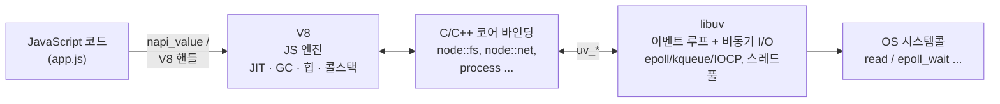
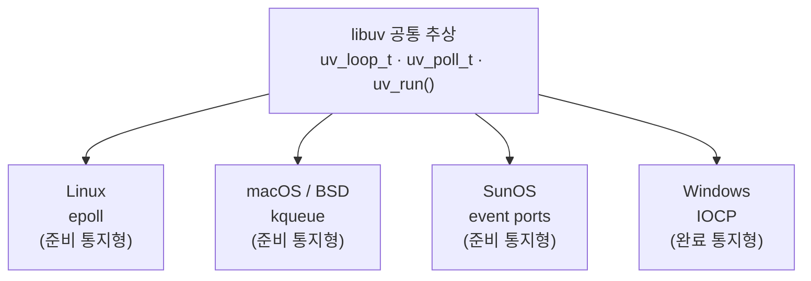
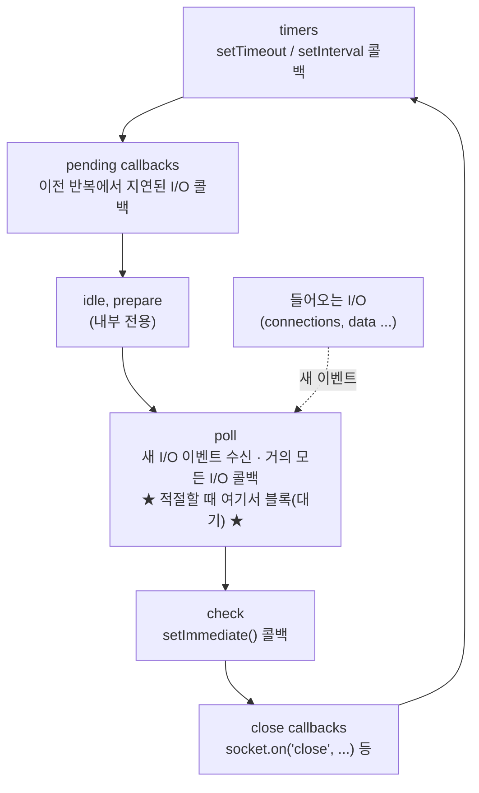
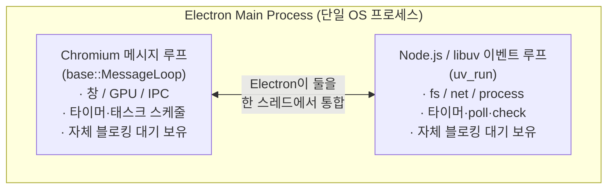
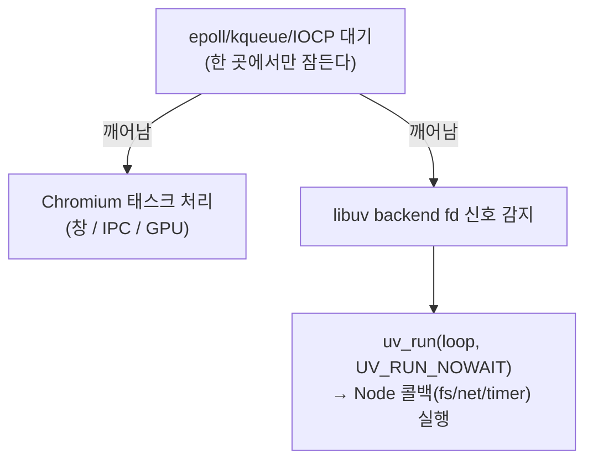
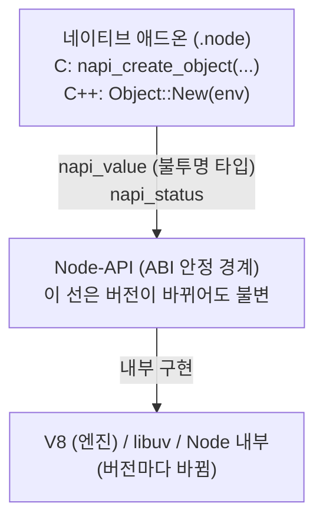
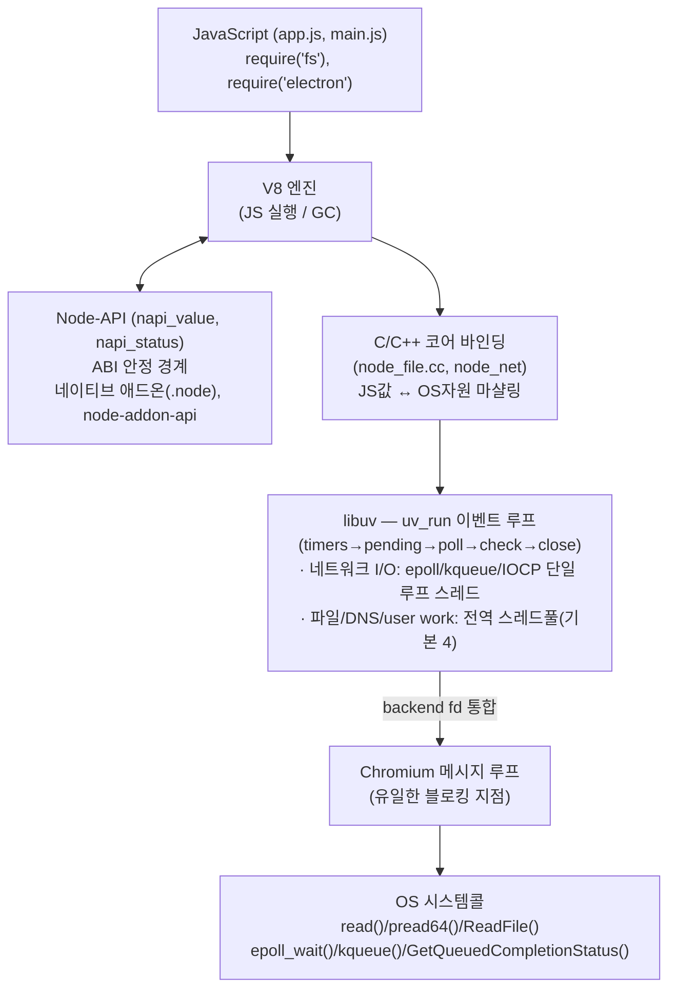

## 이 글에서 다루는 것

Electron의 메인 프로세스는 겉보기엔 그냥 "Node.js로 쓰는 데스크톱 앱"처럼 보인다. 하지만 그 안에는 두 개의 서로 다른 런타임이 동시에 살아있다 — Chromium의 메시지 루프와 Node.js의 libuv 이벤트 루프. 둘 다 "이벤트가 올 때까지 OS에서 잠들고 싶어 하는" 존재라서, 이 둘을 한 스레드에서 충돌 없이 굴리는 것 자체가 Electron이 풀어야 했던 근본적인 통합 문제였다.

이번 글에서는 다음을 차례로 따라간다.

1. Node.js는 내부적으로 무엇으로 구성되는가 (V8 + libuv + core bindings)
2. libuv는 플랫폼마다 다른 비동기 I/O(epoll/kqueue/IOCP)를 어떻게 하나의 모델로 묶는가
3. 이벤트 루프의 단계(timers → poll → check → close)는 왜 이 순서인가
4. Electron은 Chromium 메시지 루프와 libuv 루프를 어떻게 한 프로세스에서 통합하는가
5. `fs.readFile` 한 줄이 OS `read()` 시스템콜까지 내려갔다가 다시 콜백으로 올라오는 전체 경로
6. Node-API(N-API)가 네이티브 애드온을 ABI 변화로부터 어떻게 격리하는가

::: note
이 글은 [Electron 렌더러 프로세스 내부 →](/post/electron-renderer-chromium-rendering)에서 다룬 V8과 렌더링 파이프라인의 "반대편" — 메인 프로세스가 Node.js 런타임을 어떻게 끌어안고 있는지를 다룬다.
:::

---

## 한눈에 보기: 흐름부터 잡고, 그다음 디테일

디테일로 들어가기 전에 전체 그림을 먼저 본다. `fs.readFile` 한 줄을 호출했을 때 무슨 일이 벌어지는지를 6단계로 압축하면 이렇다.

```text
JS 코드 실행                (V8)
   ↓ "파일 읽어줘" 요청
C/C++ 코어 바인딩            (V8 값 ↔ OS 자원 통역)
   ↓
libuv                       (워커 스레드 or OS 폴링으로 분배)
   ↓
OS 커널                      (실제 디스크/네트워크 장치 접근)
   ↓ 완료되면 알림
libuv 이벤트 루프             (완료 이벤트 수거)
   ↓
JS 콜백 실행                 (다시 V8, 메인 스레드)
```

요청을 보낼 때는 아래로 내려가고(descent), 완료되면 다시 위로 올라온다(ascent) — 이 왕복이 Node 비동기 I/O의 전부다. 각 레이어가 "왜 거기 있는지"는 2장부터 하나씩 짚는다.

::: tip
**먼저 헷갈리기 쉬운 것들만 짧게 정리한다.** 아래에서 더 자세히 다룬다.

- **V8**: JS를 실행하는 엔진. 브라우저 전용이 아니라 어디든 끼워 넣을 수 있는 임베더블 엔진이다. 이벤트 루프도, 파일/소켓 I/O도 V8 안에는 없다 — `fs` 같은 API는 ECMAScript 표준이 아니라 Node가 V8 바깥에 얹은 것이다.
- **JIT**: 실행 도중 자주 도는 코드를 기계어로 컴파일해 속도를 높이는 기법. V8은 인터프리터와 여러 단계의 JIT 컴파일러를 함께 쓴다.
- **GC**: V8은 지금도 GC를 쓴다. "GC를 없앴다"가 아니라 "GC 작업을 병렬·동시 처리로 개선했다"가 맞는 말이다.
- **poll**: 설문조사가 아니라 "준비된 이벤트가 있는지 확인하고, 없으면 깨어날 때까지 잠드는" 동작을 가리키는 말이다.
- **워커 스레드의 blocking read**: 워커 스레드 입장에서는 끝날 때까지 멈춰 기다리는 블로킹 호출이다. 다만 그 스레드가 메인 JS 스레드가 아니므로, JS 쪽에서 보면 논블로킹으로 보인다.
- **"JS 이벤트 루프"**: V8 자체에는 없다. Node에서는 Node + libuv가, 브라우저에서는 브라우저 런타임이 제공하는 host 환경의 기능이다.
:::

---

## 1. Node.js의 세 기둥: V8, C/C++ 코어 바인딩, libuv

Node.js는 하나의 바이너리지만, 내부적으로는 역할이 명확히 분리된 세 개의 축으로 이루어진다.



::: note
이 그림이 OSI 7계층과 비슷하게 느껴질 수 있다. "위 계층이 아래 계층의 복잡성을 감추고, 정해진 인터페이스로만 통신한다"는 점은 실제로 같다. 다만 OSI는 **네트워크 프로토콜**을 계층화한 모델이고, 위 그림은 **하나의 런타임 내부 구현**을 계층화한 것이다. 비슷하게 느껴지는 건 우연이 아니라 — 복잡한 시스템을 다룰 때 계층 분리가 가장 흔한 해법이기 때문이다.
:::

- **V8**: 구글의 JS/WebAssembly 엔진. JS 소스를 JIT으로 기계어로 컴파일하고, 힙·GC·콜스택을 관리한다. **V8 자체에는 이벤트 루프도, 파일/소켓 I/O도 없다.** 순수하게 "JS를 실행"하는 엔진일 뿐이다.
- **C/C++ 코어 바인딩**: `fs`, `net`, `http`, `crypto`, `process` 같은 Node 표준 모듈의 네이티브 구현. `fs.readFile` 같은 JS 호출은 결국 이 계층(`node_file.cc` 등)으로 진입하고, 여기서 libuv를 호출한다. **V8 세계(JS 값)와 libuv 세계(OS 자원)를 잇는 다리** 역할이다.
- **libuv**: "비동기 I/O 모델 중심으로 설계된 크로스플랫폼 라이브러리. 원래 Node.js를 위해 작성됐다."<a href="https://docs.libuv.org/en/v1.x/design.html" target="_blank"><sup>[1]</sup></a> 이벤트 루프와 OS I/O 추상화를 전담한다.

핵심은, **JS는 싱글 스레드지만 libuv 덕분에 Node는 동시에 수천 개의 I/O를 비동기로 처리할 수 있다**는 점이다. "이벤트 루프는 기본적으로 단일 JavaScript 스레드만 사용하지만, 가능한 한 작업을 시스템 커널로 떠넘김(offloading)으로써 Node.js가 논블로킹 I/O를 수행할 수 있게 해준다."<a href="https://nodejs.org/en/learn/asynchronous-work/event-loop-timers-and-nexttick" target="_blank"><sup>[2]</sup></a>

### 1.1 V8 안에서 무슨 일이 — JIT 컴파일이란

JIT(Just-In-Time)은 "실행하는 도중에 기계어로 컴파일한다"는 뜻이다. 시작 전에 전부 컴파일(AOT)하지도, 매번 새로 해석(순수 인터프리터)하지도 않고, **자주 실행되는 코드만 골라 더 빠른 형태로 다시 만든다.**

```js
function add(a, b) {
  return a + b;
}
```

이런 함수가 호출 한두 번이면 V8은 바이트코드를 그냥 해석해서 실행한다. 하지만 루프 안에서 수천 번 불리는 게 관찰되면, V8은 이 함수를 기계어로 다시 컴파일해 다음부터는 그 기계어를 직접 실행한다. V8은 이 과정을 단일 단계가 아니라 여러 단계로 나눠 처리한다.

| 단계 | 역할 |
|------|------|
| **Ignition** | 바이트코드 인터프리터. 모든 코드가 처음엔 여기서 실행된다 |
| **Sparkplug** | 빠르게 동작하는 비최적화 컴파일러 |
| **Maglev** | 중간 수준으로 최적화하는 컴파일러 |
| **TurboFan** | 가장 강하게 최적화하는 컴파일러 |

<a href="https://v8.dev/blog/launching-ignition-and-turbofan" target="_blank"><sup>[7]</sup></a><a href="https://v8.dev/blog/sparkplug" target="_blank"><sup>[8]</sup></a><a href="https://v8.dev/blog/maglev" target="_blank"><sup>[9]</sup></a>

실행 빈도가 올라갈수록 더 강하게 최적화된 단계로 옮겨가고, "이 타입은 항상 숫자다" 같은 최적화 전제가 깨지면(예: 갑자기 문자열이 들어옴) 다시 느린 단계로 내려가는 **deoptimization**도 일어난다.

### 1.2 "V8이 이제 GC를 안 쓴다"? — 아니다, 여전히 쓴다

V8은 지금도 가비지 컬렉션(GC)을 한다.

```js
let obj = { huge: new Array(1_000_000) };

obj = null;
// 이후 더 이상 참조되지 않는 이 객체를 V8의 GC가 정리한다
```

JS에서 더 이상 접근할 수 없게 된 객체는 V8 힙에 그대로 남아있다가, GC가 주기적으로 찾아서 메모리를 회수한다. 들었을 수 있는 말은 아마 다음 중 하나일 것이다.

```text
"GC를 없앴다"                         ❌ — 사실이 아니다
"GC 작업 일부를 병렬·동시 처리한다"   ✅ — 이게 맞는 말이다
"긴 stop-the-world 시간을 줄였다"     ✅ — 이것도 맞는 말이다
```

V8의 **Orinoco** GC는 마킹·스위핑 같은 작업을 메인 스레드를 막지 않는 별도 스레드에서 병렬·동시(parallel/concurrent)로 처리하도록 개선됐다.<a href="https://v8.dev/blog/trash-talk" target="_blank"><sup>[10]</sup></a> 이건 GC를 없앤 게 아니라, GC가 JS 실행을 멈추는 시간(stop-the-world)을 줄인 것이다 — 일부 단계에서는 여전히 짧게나마 실행이 멈출 수 있다.

---

## 2. libuv는 OS의 비동기 I/O를 어떻게 추상화하는가

그런데 왜 파일이나 소켓은 꼭 OS까지 내려가야 할까? V8이 "네이티브 접근을 못 해서"가 아니라, **파일 시스템과 네트워크 장치 자체를 OS 커널이 관리하기 때문**이다. 권한, 경로, 디스크 장치, 페이지 캐시, 동시 접근 제어, 보안 격리 — 이런 건 어떤 언어를 쓰든 결국 OS에 위임해야 한다.

```text
JavaScript → Node fs API → OS
C          → libc read()  → OS
Java       → JVM File API → OS
Python     → open()       → OS
```

V8은 브라우저 전용 엔진이 아니다. C++ 애플리케이션이라면 어디든 끼워 넣을 수 있는 **임베더블 JS 엔진**이고,<a href="https://v8.dev/docs/embed" target="_blank"><sup>[11]</sup></a> ECMAScript 표준 자체에는 파일·네트워크 API가 없다. 브라우저에서는 Chromium이 DOM과 `fetch` 같은 API를 V8에 붙이고, Node.js에서는 Node가 `fs`/`net`을 붙인다 — `fs`가 항상 "V8 바깥"(C/C++ 코어 바인딩 → libuv → OS)을 거치는 이유다.

### 2.1 플랫폼별 폴링 메커니즘을 하나로

운영체제마다 "여러 파일 디스크립터/소켓의 준비 상태를 한 번에 감시하는" 메커니즘이 다르다.

> "모든 (네트워크) I/O는 논블로킹 소켓 위에서 수행되며, 해당 플랫폼에서 사용 가능한 최선의 메커니즘으로 폴링된다: **Linux는 epoll, macOS 및 기타 BSD는 kqueue, SunOS는 event ports, Windows는 IOCP**."<a href="https://docs.libuv.org/en/v1.x/design.html" target="_blank"><sup>[1]</sup></a>



여기서 미묘한 차이가 하나 있다. epoll/kqueue/event ports는 "준비됨(readiness) 통지" 모델 — 읽을 준비가 됐다고 알려주면 그때 직접 `read()`를 호출한다 — 이고, Windows의 IOCP는 "완료(completion) 통지" 모델 — `read`를 미리 걸어두면 끝났을 때 통지받는다. libuv는 근본적으로 다른 이 두 모델을 같은 `uv_run()` 시맨틱으로 보이도록 흡수한다.<a href="https://docs.libuv.org/en/v1.x/design.html" target="_blank"><sup>[1]</sup></a>

### 2.2 스레드풀: "비동기가 아닌 것"을 비동기로 위장

네트워크 소켓은 OS가 논블로킹 + 폴링을 지원하지만, **파일 I/O에는 그런 플랫폼 공통 비동기 프리미티브가 없다.**

> "네트워크 I/O와 달리, libuv가 의존할 수 있는 플랫폼별 파일 I/O 프리미티브가 없으므로, 현재 접근 방식은 **블로킹 파일 I/O 연산을 스레드풀에서 실행**하는 것이다."<a href="https://docs.libuv.org/en/v1.x/design.html" target="_blank"><sup>[1]</sup></a>

libuv는 **전역(global) 스레드풀**을 두고, 블로킹 작업을 워커 스레드에 던진 뒤 완료되면 루프 스레드에 통지한다. 풀에서 도는 작업은 크게 세 종류다.

| 종류 | 예 |
|------|-----|
| File system operations | `fs.readFile`, `fs.stat`, `fs.open` ... |
| DNS | `getaddrinfo`, `getnameinfo` (즉 `dns.lookup`) |
| 사용자 코드 (user work) | `uv_queue_work` / N-API `AsyncWorker`, `crypto.pbkdf2`, `zlib` 등 |

<a href="https://docs.libuv.org/en/v1.x/threadpool.html" target="_blank"><sup>[3]</sup></a>

::: important
"libuv는 비동기 파일 I/O를 가능하게 하기 위해 스레드풀을 사용하지만, **네트워크 I/O는 항상 단일 스레드(각 루프의 스레드)에서 수행된다.**"<a href="https://docs.libuv.org/en/v1.x/design.html" target="_blank"><sup>[1]</sup></a> 즉 `fs`와 `net`은 완전히 다른 경로를 탄다 — 이 차이를 모르면 §5의 호출 스택 추적이 헷갈린다.
:::

기본 스레드풀 크기는 **4개**이며 환경변수 `UV_THREADPOOL_SIZE`로 조정한다(상한은 libuv 버전에 따라 1024). 즉 `fs`/`dns.lookup`/`crypto.pbkdf2`를 동시에 5개 이상 띄우면 5번째부터는 워커가 빌 때까지 큐에서 대기한다. "디스크/암호 연산이 갑자기 느려진다"는 흔한 함정의 원인이 바로 여기다.

```text
JS:  fs.readFile() × 6 동시 호출
            │
            ▼
   libuv work queue ── [작업1][작업2][작업3][작업4][작업5][작업6]
            │              │     │     │     │      └─ 대기 ─┘
            ▼              ▼     ▼     ▼     ▼
   thread pool (기본 4) [T1]  [T2]  [T3]  [T4]   ← 동시 4개만 처리
```

### 2.3 "블로킹"이라는 말, 어느 쪽 기준인가 — 그리고 왜 스레드인가

워커 스레드 안에서 `read()`를 부르면, 그 스레드는 결과가 나올 때까지 다음 줄로 진행하지 않는다. 이게 **blocking read**다 — 워커 스레드 기준으로는 분명히 블로킹이다.

```text
워커 스레드: read() 호출 → 디스크 응답 대기 → 반환 → 완료 통지
```

그런데도 "Node는 논블로킹 I/O를 한다"고 부르는 건 **메인 JS 스레드 기준**으로 하는 말이기 때문이다.

| 관점 | blocking 여부 |
|------|----------------|
| 워커 스레드 안에서의 `read()` 자체 | blocking |
| JS API (`fs.readFile`) | non-blocking — 콜백으로 결과를 나중에 받음 |
| 메인 이벤트 루프 | 막히지 않음 — 그동안 타이머·네트워크·다른 콜백을 계속 처리 |

프로세스가 아니라 스레드를 쓰는 이유는 **같은 프로세스의 메모리를 공유**할 수 있기 때문이다.

| | 스레드 | 프로세스 |
|---|---|---|
| 메모리 | 공유 | 격리 |
| 생성·전환 비용 | 작음 | 큼 |
| 데이터 전달 | 포인터·버퍼 그대로 | 복사·직렬화(IPC) 필요 |
| 장애 격리 | 약함 — 하나가 죽으면 영향 가능 | 강함 |

파일 읽기처럼 짧고 빈번하게 도는 작업에는 격리보다 비용이 더 중요해서, libuv는 무거운 프로세스 대신 소수의 고정 스레드풀을 선택했다.

---

## 3. 이벤트 루프 단계: timers → pending → poll → check → close

여기서 "이벤트 루프"는 크론(cron)처럼 정해진 시각마다 깨어나는 스케줄러가 아니다. **들어오는 이벤트(완료된 I/O, 만료된 타이머)를 큐에서 꺼내 콜백을 실행하고, 할 일이 없으면 다음 이벤트가 올 때까지 잠드는 반복(loop)**이다. 그리고 다시 한번 강조하면 — 이 루프는 V8의 것이 아니다. §1에서 본 대로 V8에는 이벤트 루프가 없고, 이건 Node.js와 libuv가 함께 제공하는 host 환경의 기능이다.

libuv 루프는 한 번의 반복(iteration)에서 정해진 순서로 단계를 통과한다. Node.js는 이 위에 자기만의 단계 다이어그램을 노출한다.

### 3.1 Node.js 관점의 단계 흐름



<a href="https://nodejs.org/en/learn/asynchronous-work/event-loop-timers-and-nexttick" target="_blank"><sup>[2]</sup></a>

각 단계는 **FIFO 콜백 큐**를 가진다. 루프가 한 단계에 들어가면 그 단계 고유의 작업을 수행한 뒤, 큐가 빌 때까지(또는 콜백 상한에 도달할 때까지) 콜백을 실행하고 다음 단계로 넘어간다.

| 단계 | 하는 일 |
|------|---------|
| **timers** | `setTimeout()` / `setInterval()` 만료 콜백 실행 |
| **pending callbacks** | 다음 반복으로 미뤄진 I/O 콜백 실행 |
| **idle, prepare** | libuv 내부 전용 |
| **poll** | 새 I/O 이벤트를 가져오고 거의 모든 I/O 콜백 실행. **적절할 때 여기서 블록(대기)** |
| **check** | `setImmediate()` 콜백 실행 |
| **close callbacks** | `socket.on('close', ...)` 같은 종료 콜백 |

::: tip
**poll 단계가 핵심이다.** 여기서 "poll"은 설문조사가 아니라 "준비된 이벤트가 있는지 확인한다"는 뜻이다. CPU를 계속 돌려가며 검사하는 busy-waiting(`while (true) { 확인; 확인; ... }`)이 아니라, OS에 "이벤트가 생기면 깨워 줘"라고 맡겨두고 그 사이엔 스레드를 재워 둔다. 할 일이 없으면 루프는 poll 단계에서 OS의 epoll/kqueue/IOCP에 "I/O 이벤트가 올 때까지 깨우지 마"라며 잠든다. 이것이 Node가 CPU를 낭비하지 않고 idle 상태로 대기하는 메커니즘이다. 대기 시간(poll timeout)은 "가장 가까운 타이머까지의 시간, 타이머가 없으면 무한대"로 계산된다.<a href="https://docs.libuv.org/en/v1.x/design.html" target="_blank"><sup>[1]</sup></a>
:::

### 3.2 libuv 루프 반복의 정밀한 순서

libuv 문서의 단계 설명은 Node의 추상보다 더 세밀하다. 요약하면:

1. 루프의 '현재(now)' 시각 갱신
2. 만료된 타이머 콜백 실행
3. 루프가 alive인지 확인 (active handle/request/closing handle이 있으면 alive)
4. pending 콜백 실행
5. idle 핸들 콜백 실행
6. **prepare 핸들 콜백 실행 (I/O 블록 직전)**
7. **poll timeout 계산** (위 규칙대로)
8. **I/O 블록** — epoll/kqueue/IOCP에서 대기, 준비된 fd의 콜백 실행
9. **check 핸들 콜백 실행 (I/O 블록 직후)** — prepare의 짝
10. close 콜백 실행
11. 반복 종료 / 다시 처음으로

<a href="https://docs.libuv.org/en/v1.x/design.html" target="_blank"><sup>[1]</sup></a>

::: warning
**버전 주의:** libuv 1.45.0 (Node.js 20)부터 이벤트 루프 동작이 바뀌어, 타이머를 **poll 단계 이후에만** 실행한다(이전에는 전후 양쪽). 이 변화는 `setImmediate()` 콜백의 타이밍에 영향을 줄 수 있으니, 정확한 실행 순서에 의존하는 코드라면 Electron이 내장한 Node 버전을 확인해야 한다.<a href="https://nodejs.org/en/learn/asynchronous-work/event-loop-timers-and-nexttick" target="_blank"><sup>[2]</sup></a>
:::

### 3.3 `process.nextTick`과 마이크로태스크 — 단계 *사이*에 끼어드는 큐

`process.nextTick()` 콜백과 Promise 마이크로태스크는 위 6단계 *어디에도 속하지 않는다*. 이들은 **각 단계 전환 사이마다(그리고 현재 동기 코드가 끝날 때마다) 큐가 빌 때까지 먼저 비워진다.**

```text
[현재 JS 동기 실행 종료]
        │
        ▼
  ┌─ process.nextTick 큐 전부 소진 ─┐
  └─ Promise 마이크로태스크 전부 소진 ┘   ← 다음 단계로 넘어가기 전에 매번
        │
        ▼
[다음 이벤트 루프 단계로 이동]
```

구체적인 예로 보면 더 명확하다.

```js
console.log('A');

process.nextTick(() => console.log('nextTick'));
Promise.resolve().then(() => console.log('promise'));

console.log('B');
```

실행 순서는 다음과 같다.

```text
A
B
nextTick
promise
```

동기 코드(`A`, `B`)가 먼저 끝나고, 그다음 `nextTick` 큐가 전부 비워지고, 그다음 Promise 마이크로태스크 큐가 비워진다. `process.nextTick` 큐는 Node가 직접 관리하고, Promise/`queueMicrotask` 큐는 V8이 관리한다 — Node에서는 보통 `nextTick` 큐가 먼저 처리된다.

`process.nextTick`은 기술적으로 이벤트 루프의 일부가 아니다. 어느 단계든 현재 연산이 끝나면 즉시 처리되는 별도 큐다.<a href="https://nodejs.org/en/learn/asynchronous-work/event-loop-timers-and-nexttick" target="_blank"><sup>[2]</sup></a>

::: danger
`process.nextTick`을 재귀적으로 계속 큐잉하면 **이벤트 루프가 poll 단계로 진행하지 못해 I/O가 굶는다(starvation).** Electron 메인 프로세스에서 이런 패턴은 UI/IPC 응답성을 직접 망가뜨린다 — `ipcMain` 핸들러나 네이티브 모듈 콜백 안에서 `nextTick`을 무한 재귀하는 코드는 특히 주의해야 한다.
:::

---

## 4. Electron의 핵심 난제: Chromium 메시지 루프 × Node(libuv) 이벤트 루프

### 4.1 문제 정의

Electron의 메인 프로세스는 **두 개의 서로 다른 런타임**을 한 OS 프로세스 안에서 동시에 살려야 한다.



둘 다 **각자 "이벤트가 올 때까지 OS에서 블록(잠듦)"**하려고 한다. 순진하게 둘을 번갈아 돌리면, 한쪽이 잠든 동안 다른 쪽이 못 깨어나 데드락처럼 멈춘다. 이것이 Electron이 처음부터 풀어야 했던 근본 통합 문제다.

::: note
과거 Electron 문서에는 `tutorial/electron-vs-nodejs` 페이지가 두 이벤트 루프 통합을 직접 설명했지만, 현재 최신 문서에서는 이 페이지가 제거(404)되었고 관련 내용은 `process-model` 및 `using-native-node-modules` 문서로 흡수됐다(2026-06 기준 확인). 아래 통합 모델은 현존하는 두 문서의 사실로부터 도출한 개념 설명이다.
:::

### 4.2 통합 방식 — backend fd를 Chromium이 감시한다

핵심 아이디어는 **libuv의 "백엔드 fd(backend file descriptor)"를 Chromium 메시지 루프가 감시하게 만드는 것**이다.

libuv의 이벤트 루프는 내부적으로 단 하나의 fd(epoll/kqueue 인스턴스 등, `uv_backend_fd()`)에 모든 I/O를 집약한다. Electron은:

1. Node/libuv가 직접 잠들어 블록하지 않게 하고,
2. 대신 libuv의 backend fd를 **Chromium의 메시지 루프(Poller)에 등록**한다.
3. Chromium이 자기 이벤트나 libuv의 backend fd 중 무엇이든 깨어나면, Electron이 libuv에게 "지금 한 번 반복 돌려(`UV_RUN_NOWAIT` 류)"라고 알려 Node 콜백을 처리시킨다.

이렇게 하면 두 루프가 **단일 OS 스레드, 단일 블로킹 지점(Chromium 쪽)**으로 통합되어 서로를 굶기지 않는다.



::: tip
메인 프로세스가 Node.js 환경이라는 사실은 공식 문서로 확정된다: "메인 프로세스는 Node.js 환경에서 실행되며, 이는 모듈을 require하고 모든 Node.js API를 사용할 수 있음을 의미한다."<a href="https://www.electronjs.org/docs/latest/tutorial/process-model" target="_blank"><sup>[4]</sup></a> 반면 렌더러 프로세스는 보안 격리를 위해 기본적으로 "`require`나 다른 Node.js API에 직접 접근할 수 없다."<a href="https://www.electronjs.org/docs/latest/tutorial/process-model" target="_blank"><sup>[4]</sup></a> 렌더러 쪽 이야기는 [Electron 렌더러 프로세스 내부 →](/post/electron-renderer-chromium-rendering)에서 다뤘다.
:::

### 4.3 ABI 문제 — 왜 네이티브 모듈을 재컴파일해야 하나

Electron은 자체 Node를 내장하지만 Chromium과 빌드를 공유하기 때문에, 일반 Node.js 바이너리와 **ABI(Application Binary Interface)가 다르다.**

> "네이티브 Node.js 모듈은 Electron에서 지원되지만, Electron은 주어진 Node.js 바이너리와 **다른 ABI를 가지므로**(예: OpenSSL 대신 Chromium의 BoringSSL을 사용하는 등의 차이), 사용하는 네이티브 모듈을 **Electron용으로 재컴파일해야 한다.**"<a href="https://www.electronjs.org/docs/latest/tutorial/using-native-node-modules" target="_blank"><sup>[5]</sup></a>

재컴파일하지 않으면 다음과 같은 `NODE_MODULE_VERSION` 불일치 오류가 난다.

```text
Error: The module '/path/to/native/module.node'
was compiled against a different Node.js version using
NODE_MODULE_VERSION $XYZ. This version of Node.js requires
NODE_MODULE_VERSION $ABC. Please try re-compiling or re-installing
the module (for instance, using `npm rebuild` or `npm install`).
```

해법은 `@electron/rebuild`다 — Electron 버전을 감지해 헤더 다운로드와 재빌드를 자동화한다(Electron Forge는 이를 자동 적용한다).<a href="https://www.electronjs.org/docs/latest/tutorial/using-native-node-modules" target="_blank"><sup>[5]</sup></a> 이 ABI 문제는 §6의 Node-API(N-API)가 왜 중요한지로 직결된다 — N-API로 작성된 애드온은 V8/Node 버전에 ABI 독립적이라 이런 재컴파일 고통을 크게 줄여준다.

---

## 5. 호출 스택 추적: `fs.readFile` 한 줄이 OS `read()`까지 내려가는 길

지금까지의 개념을 하나의 실제 호출로 묶어보자. 이것이 "네이티브 단까지 내려간다"는 말의 실체다.

```js
const fs = require('node:fs');

fs.readFile('/data/site.dxf', (err, buf) => {
  if (err) throw err;
  console.log('읽음:', buf.length, '바이트');
});

console.log('이 줄이 콜백보다 먼저 출력된다');  // 논블로킹 증명
```

### 5.1 내려가는 길 (descent) — JS → OS 시스템콜

```text
[1] JS 레이어
    fs.readFile('/data/site.dxf', cb)
        │  lib/fs.js — 인자 검증, 콜백 래핑
        ▼
[2] C++ Core Binding 레이어  (node::fs, src/node_file.cc)
    binding.read(...) / FSReqCallback
        │  V8 값(napi_value/Local<Value>)을 C 타입으로 언마샬
        │  libuv 요청 구조체(uv_fs_t) 생성, 콜백 포인터 저장
        ▼
[3] libuv 요청 레이어
    uv_fs_read(loop, req, fd, bufs, ..., on_complete)
        │  "파일 I/O는 플랫폼 공통 비동기 프리미티브가 없다"
        │  → 블로킹 연산이므로 스레드풀에 큐잉
        ▼
[4] libuv 스레드풀 (워커 스레드, 메인 JS 스레드 아님)
    uv__work_submit → work queue → [Worker Thread]
        │
        ▼
[5] OS 시스템콜 레이어  ★여기가 네이티브 단의 바닥★
    Linux:   pread64() / read()      ← 실제 디스크에서 바이트를 읽는 커널 진입
    macOS:   read()/pread()
    Windows: ReadFile() (IOCP 경유)
        │  커널이 디스크/페이지캐시에서 데이터를 버퍼로 복사
        ▼
   (워커 스레드에서 read 완료)
```

### 5.2 올라오는 길 (ascent) — OS → JS 콜백

```text
[5'] 워커 스레드: read() 반환(완료)
        │  결과/에러를 uv_fs_t req에 기록
        ▼
[4'] libuv: 워커가 루프 스레드에 완료 통지 (uv_async 신호로 backend fd를 깨움)
        │
        ▼
[3'] 이벤트 루프: 다음 반복의 poll/pending 단계에서 완료를 수거
        │  (§4 통합 모델에서는 Chromium 메시지 루프가 backend fd를
        │   감지 → uv_run(NOWAIT) → 이 단계 실행)
        ▼
[2'] C++ Core Binding: on_complete 콜백
        │  C 결과 버퍼를 V8 값으로 마샬(Buffer 객체 생성)
        │  저장해둔 JS 콜백을 MakeCallback으로 호출 준비
        ▼
[1'] V8: JS 콜백 실행
    cb(null, buf)   →  console.log('읽음: ... 바이트')
        │  (콜백 실행 전후로 nextTick + Promise 마이크로태스크 큐 소진)
        ▼
   완료
```

### 5.3 왜 `console.log('이 줄이...')`가 먼저 찍히나

`fs.readFile` 호출은 **요청을 스레드풀에 던지고 즉시 반환**한다(§5.1의 [3] 단계에서 큐잉만 하고 끝). 동기 코드가 계속 진행되어 `console.log('이 줄이...')`가 먼저 실행되고, 디스크 read가 끝난 *뒤* 이벤트 루프가 콜백을 [1'] 단계에서 호출한다. 이것이 "단일 JS 스레드 + 논블로킹 I/O"의 실제 동작 메커니즘이다.

> "이벤트 루프는 ... 가능한 한 작업을 시스템 커널로 떠넘김으로써 Node.js가 논블로킹 I/O를 수행할 수 있게 한다. ... 연산이 완료되면 커널이 Node.js에게 알려, 해당 콜백이 poll 큐에 추가되어 결국 실행되도록 한다."<a href="https://nodejs.org/en/learn/asynchronous-work/event-loop-timers-and-nexttick" target="_blank"><sup>[2]</sup></a>

### 5.4 네트워크 I/O는 경로가 다르다

`net`/`http` 소켓 읽기는 §5.1의 [4] 스레드풀을 거치지 **않는다.** 소켓 fd를 epoll/kqueue/IOCP에 등록해두고, poll 단계에서 "읽을 준비됨" 통지를 받아 루프 스레드가 직접 read한다. 네트워크 I/O는 항상 단일 루프 스레드라는 §2.2의 원칙이 여기서도 그대로 적용된다.

---

## 6. Node-API(N-API): 네이티브 애드온의 ABI 안정 계층

### 6.1 무엇이고 왜 필요한가

C/C++로 네이티브 애드온을 쓸 때 과거에는 V8 헤더를 직접 썼다. 문제는 **V8 API가 메이저 버전마다 바뀌어** 애드온을 매번 재컴파일해야 했다는 것이다(§4.3의 ABI 고통과 같은 뿌리다). Node-API는 이를 해결하는 **C 기반의 ABI 안정 API**다.

> "Node-API ... 는 Node.js 버전 전반에 걸쳐 **안정적인(stable across versions)** API다. 이는 애드온을 기저 JavaScript 엔진의 변화로부터 **격리(insulate)**하고, 한 메이저 버전용으로 컴파일된 모듈이 **재컴파일 없이** 이후 메이저 버전에서 실행되게 하기 위한 것이다."<a href="https://nodejs.org/api/n-api.html" target="_blank"><sup>[6]</sup></a>



### 6.2 API의 형태

Node-API의 특성은 공식 문서에 따르면 다음과 같다.<a href="https://nodejs.org/api/n-api.html" target="_blank"><sup>[6]</sup></a>

- 모든 Node-API 호출은 `napi_status` 타입의 상태 코드를 반환한다 (성공/실패 표시)
- API의 반환값은 out 파라미터로 전달된다
- 모든 JavaScript 값은 **`napi_value`라는 불투명(opaque) 타입** 뒤에 추상화된다
- 에러 시 `napi_get_last_error_info`로 추가 정보를 얻는다

불투명 타입 `napi_value`가 핵심이다 — 애드온은 V8의 `Local<Value>` 같은 구체 타입을 절대 보지 않으므로, V8 내부가 바뀌어도 애드온 바이너리는 깨지지 않는다.

### 6.3 node-addon-api — C++ 래퍼

C API는 장황하다. **node-addon-api**는 Node-API 위에 얹은 공식 C++ 헤더-온리 래퍼로, 같은 일을 간결하게 표현한다.

> "node-addon-api는 Node-API를 호출하는 C++ 코드를 더 효율적으로 작성하는 공식 C++ 바인딩이다. 헤더-온리 라이브러리이며, **node-addon-api로 빌드된 바이너리는 Node.js가 export하는 Node-API C 함수 심볼에 의존한다.**"<a href="https://nodejs.org/api/n-api.html" target="_blank"><sup>[6]</sup></a>

같은 동작을 C++과 C로 비교하면 이렇다.

```cpp
// node-addon-api (C++) — 간결
Object obj = Object::New(env);
obj["foo"] = String::New(env, "bar");
```

```c
// 동등한 순수 Node-API (C) — 장황, 상태 코드 수동 처리
napi_status status;
napi_value object, string;
status = napi_create_object(env, &object);
if (status != napi_ok) { napi_throw_error(env, ...); return; }
status = napi_create_string_utf8(env, "bar", ...);
// ... obj["foo"] = string 설정
```

### 6.4 비동기 네이티브 작업과 libuv의 재등장

네이티브 애드온이 무거운 CPU 작업을 메인 JS 스레드에서 하면 §3.3의 starvation처럼 이벤트 루프를 막는다. 그래서 Node-API는 **AsyncWorker / `napi_async_execute_callback`**을 제공해, 작업을 §2.2의 libuv 스레드풀("user work")에서 돌리고 완료 시 JS 콜백으로 돌아오게 한다. 즉 §5의 `fs.readFile` 경로와 **똑같은 스레드풀 + 이벤트 루프 통합 구조**를 애드온 개발자도 그대로 쓰는 셈이다.<a href="https://nodejs.org/api/n-api.html" target="_blank"><sup>[6]</sup></a>

### 6.5 Electron에서의 의미

Electron 메인 프로세스는 Node 환경이므로 N-API 애드온을 그대로 쓸 수 있고, ABI 안정성 덕분에 §4.3의 `NODE_MODULE_VERSION` 재컴파일 부담이 크게 줄어든다. 다만 BoringSSL 등 빌드 차이로 인한 재빌드는 여전히 케이스별로 필요할 수 있어, `@electron/rebuild`가 안전판 역할을 한다.

---

## 7. 전체 레이어 통합 다이어그램

지금까지 다룬 모든 레이어를 한 장으로 모으면 다음과 같다.



| 질문 | 답 |
|------|-----|
| Node = ? | V8(JS) + C/C++ 코어 바인딩(다리) + libuv(이벤트 루프 + OS I/O) |
| OS I/O 추상화 | Linux=epoll, mac/BSD=kqueue, SunOS=event ports, Win=IOCP를 `uv_run`으로 단일화 |
| 파일 I/O | 플랫폼 공통 비동기 프리미티브 없음 → **스레드풀**(기본 4, `UV_THREADPOOL_SIZE`) |
| 네트워크 I/O | 스레드풀 안 씀, **단일 루프 스레드** + epoll/kqueue/IOCP |
| 루프 단계 | timers → pending → (idle/prepare) → **poll(여기서 블록)** → check → close |
| 단계 사이 | `process.nextTick` 큐 → Promise 마이크로태스크 큐를 매번 먼저 소진 |
| Electron 통합 | libuv backend fd를 Chromium 메시지 루프가 감시 → 한 스레드/한 블로킹 지점 |
| Electron ABI | Chromium과 빌드 공유(BoringSSL 등) → 네이티브 모듈 `@electron/rebuild` 재컴파일 |
| Node-API | `napi_value`(불투명) + `napi_status`로 V8 변화에서 애드온을 ABI 격리 |

여기까지가 메인 프로세스 "안"의 그림이다. 다음 글에서는 이 메인 프로세스가 **OS와 직접 맞닿는 네이티브 계층** — 트레이 아이콘, 파일 시스템 대화상자, 알림 같은 OS 통합 기능이 C++ 바인딩을 통해 어떻게 동작하는지를 [Electron 네이티브 계층 — OS 통합과 C++ 바인딩 →](/post/electron-native-layer-os-integration)에서 살펴본다.

---

## 참고

<ol>
<li><a href="https://docs.libuv.org/en/v1.x/design.html" target="_blank">[1] Design overview — libuv documentation</a></li>
<li><a href="https://nodejs.org/en/learn/asynchronous-work/event-loop-timers-and-nexttick" target="_blank">[2] The Node.js Event Loop, Timers, and process.nextTick() — Node.js</a></li>
<li><a href="https://docs.libuv.org/en/v1.x/threadpool.html" target="_blank">[3] Thread pool work scheduling — libuv documentation</a></li>
<li><a href="https://www.electronjs.org/docs/latest/tutorial/process-model" target="_blank">[4] Process Model — Electron</a></li>
<li><a href="https://www.electronjs.org/docs/latest/tutorial/using-native-node-modules" target="_blank">[5] Using Native Node Modules — Electron</a></li>
<li><a href="https://nodejs.org/api/n-api.html" target="_blank">[6] Node-API — Node.js</a></li>
<li><a href="https://v8.dev/blog/launching-ignition-and-turbofan" target="_blank">[7] Launching Ignition and TurboFan — V8</a></li>
<li><a href="https://v8.dev/blog/sparkplug" target="_blank">[8] Sparkplug — a non-optimizing JavaScript compiler — V8</a></li>
<li><a href="https://v8.dev/blog/maglev" target="_blank">[9] Maglev — V8's fast-but-not-too-optimizing JS compiler — V8</a></li>
<li><a href="https://v8.dev/blog/trash-talk" target="_blank">[10] Trash talk: the Orinoco garbage collector — V8</a></li>
<li><a href="https://v8.dev/docs/embed" target="_blank">[11] Embedder's Guide — V8</a></li>
</ol>

## 관련 글

- [렌더러 프로세스 내부 — Chromium 렌더링 엔진과 V8, 렌더링 파이프라인 →](/post/electron-renderer-chromium-rendering) — 이전 글, 렌더러 프로세스의 렌더링 파이프라인
- [Electron 네이티브 계층 — OS 통합과 C++ 바인딩 →](/post/electron-native-layer-os-integration) — 다음 글, 네이티브 모듈과 OS API 바인딩
- [Electron 멀티 프로세스 아키텍처 — Main, Renderer, Preload, Utility 프로세스 →](/post/electron-multi-process-architecture) — 시리즈 메인 글
- [JS 런타임 비교 — Node, Bun, Deno →](/post/js-runtime-node-bun-deno) — 이벤트 루프와 런타임 구조를 다른 런타임과 비교
