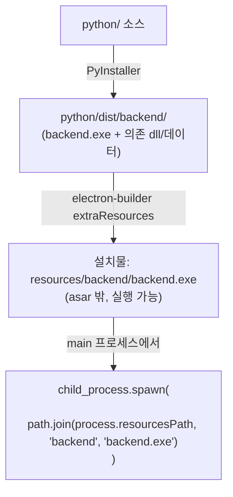
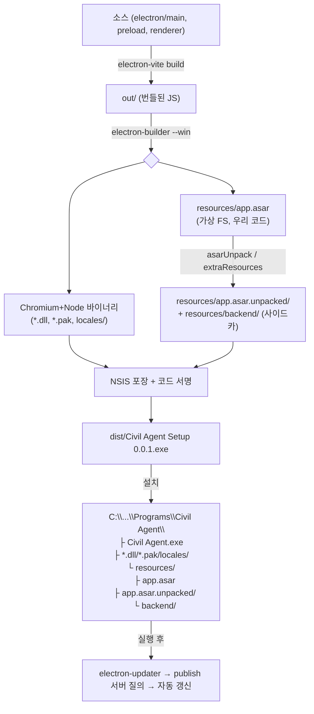

## 패키징, 무엇을 한 덩어리로 묶는가

지금까지 이 시리즈에서는 main·renderer·preload 프로세스가 어떻게 나뉘고([Electron 멀티 프로세스 아키텍처 →](/post/electron-multi-process-architecture)), 그 사이를 어떻게 안전하게 연결하는지([Electron IPC와 보안 모델 →](/post/electron-ipc-security-model))를 살펴봤다. 이번에는 그렇게 완성된 앱을 **사용자에게 어떻게 전달하는가**를 다룬다.

Electron 코어 자체에는 패키징·배포 도구가 없다. 개발 모드에서 잘 동작하는 앱을 실제 설치 파일로 만들려면 별도 도구(Electron Forge 또는 electron-builder)가 필요하다.<a href="https://www.electronjs.org/docs/latest/tutorial/tutorial-packaging" target="_blank"><sup>[1]</sup></a>

Electron 배포물은 개념적으로 세 덩어리로 나뉜다.

1. **런타임** — Chromium + Node.js + Electron 네이티브 바이너리. 사용자 PC에 Node나 Chrome이 없어도 동작하도록, 앱이 자기 런타임을 통째로 들고 다닌다.
2. **앱 코드** — 우리가 작성한 main/preload/renderer JS·HTML·CSS·에셋. `app.asar`라는 단일 가상 파일시스템 아카이브로 봉인된다.
3. **곁다리** — 네이티브 모듈(`.node`), 외부 실행 파일(`.exe`), Python 사이드카, 대용량 에셋. asar 밖(`app.asar.unpacked/`, `resources/`)에 풀어둔다. 실행 가능해야 하기 때문이다.

::: note
Docker 이미지가 "앱 + 의존성 + OS 런타임"을 한 레이어 묶음으로 봉인한다면, Electron은 "앱 + 의존성 + (Chromium + Node) 런타임"을 한 디렉터리/인스톨러로 봉인한다. 이 글에서 등장하는 asar, asarUnpack, extraResources, electron-builder는 모두 그 봉인 과정의 부품들이다.
:::

---

## 패키징된 앱의 실제 디렉터리 구조

### 수동 패키징의 골격

Electron의 prebuilt 바이너리를 받아 손으로 포장한다면, 우리 앱 폴더를 `app`이라는 이름으로 **Electron의 `resources` 디렉터리** 안에 넣는다.<a href="https://www.electronjs.org/docs/latest/tutorial/application-distribution" target="_blank"><sup>[2]</sup></a>

```text
# Windows / Linux
electron/resources/app
├── package.json
├── main.js
└── index.html

# macOS (.app 번들 내부)
electron/Electron.app/Contents/Resources/app/
├── package.json
├── main.js
└── index.html
```

그 다음 `electron.exe`(Windows) / `electron`(Linux) / `Electron.app`(macOS)을 실행하면, Electron이 `resources/app`을 읽어 우리 앱으로 부팅한다. 이 `electron/` 디렉터리 전체가 곧 배포물이다.<a href="https://www.electronjs.org/docs/latest/tutorial/application-distribution" target="_blank"><sup>[2]</sup></a>

### asar로 봉인한 형태

`app/` 폴더를 통째로 복사하는 대신, asar 아카이브 하나로 치환할 수 있다. 아카이브 이름을 `app.asar`로 바꿔 `resources` 밑에 두면 Electron이 그것을 읽고 부팅한다.<a href="https://www.electronjs.org/docs/latest/tutorial/application-distribution" target="_blank"><sup>[2]</sup></a>

```text
# Windows
electron/resources/
└── app.asar          ← app/ 폴더 전체가 이 한 파일로 봉인됨

# macOS
electron/Electron.app/Contents/Resources/
└── app.asar
```

### 실전 산출물 — Windows 설치 후 디렉터리

electron-builder/NSIS로 설치하면 사용자 PC에는 대략 이런 트리가 깔린다(이름은 `productName`으로 리브랜딩된다).

```text
C:\Users\<user>\AppData\Local\Programs\Civil Agent\
├── Civil Agent.exe              ← [런타임] electron.exe를 리브랜딩한 실행 진입점
├── *.dll                        ← [런타임] Chromium/Node 네이티브
│                                   (ffmpeg.dll, libGLESv2.dll, d3dcompiler_47.dll, libEGL.dll ...)
├── *.pak                        ← [런타임] Chromium 리소스 번들
├── icudtl.dat                   ← [런타임] 유니코드/ICU 데이터
├── v8_context_snapshot.bin      ← [런타임] V8 스냅샷 (빠른 부팅용)
├── chrome_crashpad_handler.exe  ← [런타임] 크래시 리포터
├── locales\                     ← [런타임] Chromium 언어 팩 (en-US.pak, ko.pak, ...)
└── resources\                   ← [앱] 우리 코드/곁다리가 사는 곳
    ├── app.asar                 ← [앱] main/preload/renderer 번들 전부 봉인 (가상 FS)
    ├── app.asar.unpacked\       ← [곁다리] asar에서 풀린 네이티브 파일 (있을 때만 생성)
    │   └── **/*.node ...
    └── (extraResources 대상)    ← [곁다리] 예: backend\ (Python 사이드카)
```

macOS의 `.app` 번들도 구조는 비슷하다. `Contents/MacOS/`에 실행 바이너리, `Contents/Frameworks/`에 Chromium+Node 본체와 헬퍼 프로세스들, `Contents/Resources/`에 `app.asar`와 `app.asar.unpacked/`가 들어간다. 리브랜딩할 때는 `Info.plist`의 `CFBundleDisplayName`, `CFBundleIdentifier`, `CFBundleName`을 본체와 Helper 양쪽에서 바꿔야 하는데, electron-builder는 이를 자동으로 처리한다.<a href="https://www.electronjs.org/docs/latest/tutorial/application-distribution" target="_blank"><sup>[2]</sup></a>

::: tip
위 트리에서 `*.dll`/`*.pak`/`locales/`/`Frameworks/`는 **고정 런타임 레이어**고, `resources/app.asar`만이 **우리가 만든 앱 레이어**다. 빌드할 때마다 실질적으로 바뀌는 건 사실상 `app.asar` 하나뿐이다.
:::

---

## asar란 무엇인가 — 가상 파일시스템 봉인

### 정의와 목적

> "the app's source code is usually bundled into an ASAR archive, which is a simple extensive archive format designed for Electron apps. By bundling the app we can mitigate issues around long path names on Windows, speed up `require` and conceal your source code from cursory inspection." <a href="https://www.electronjs.org/docs/latest/tutorial/asar-archives" target="_blank"><sup>[3]</sup></a>

asar는 `tar`와 비슷한 **무압축 연결(concatenation) 아카이브 + JSON 헤더** 포맷이다. 한 디렉터리의 수천 개 파일을 한 파일로 이어붙이고, 맨 앞 헤더에 "각 파일이 이 아카이브의 몇 byte offset부터 몇 byte인지"를 기록한다.

봉인하는 이유는 세 가지다.

1. **Windows 긴 경로(long path) 문제 완화** — `node_modules`는 경로 깊이가 수백 글자에 달해 Windows의 (구) 260자 경로 한계에 걸리기 쉽다. 한 파일로 묶으면 내부 경로는 아카이브가 관리하므로 OS 경로 한계를 우회한다.
2. **`require`/파일 읽기 속도 향상** — 파일 수천 개를 OS 파일시스템에서 일일이 `open`하는 대신, 아카이브 하나만 열고 offset으로 점프한다. 설치 시 파일 개수가 줄어 설치도 빨라진다.
3. **소스 코드의 가벼운 은닉** — 평범한 사용자가 폴더를 열어 우리 `.js`를 바로 들여다보긴 어렵게 만든다.

### 한계 — asar는 암호화가 아니다

여기가 가장 흔한 오해 지점이다. 공식 문서의 표현은 "conceal from **cursory** inspection"(겉핥기 검사로부터 숨김)이다. electron-builder 문서도 "to **prevent casual** file inspection"이라고 명시한다.<a href="https://www.electron.build/configuration" target="_blank"><sup>[4]</sup></a>

::: warning
asar는 **무압축·무암호화** 포맷이다. `npx asar extract app.asar out/` 한 줄이면 누구나 원본 소스를 그대로 복원할 수 있다. 따라서 **API 키, 비밀번호, 라이선스 검증 로직 같은 민감 정보를 asar에 넣어도 전혀 안전하지 않다.** 보안이 필요하면 서버 측 처리, 네이티브 모듈, 별도 암호화가 필요하다. asar는 "패키징 편의(파일 수↓·경로 문제↓·로딩↑) + 약한 난독화"일 뿐, 절대 보안 경계가 아니다.
:::

asar에는 Node API 레벨에서도 몇 가지 한계가 있다.<a href="https://www.electronjs.org/docs/latest/tutorial/asar-archives" target="_blank"><sup>[3]</sup></a>

| 한계 | 내용 |
|---|---|
| 읽기 전용 | 아카이브는 수정 불가. 파일에 *쓰는* 모든 `fs` API는 asar 내부에서 동작하지 않는다. |
| cwd로 못 씀 | 실제 디렉터리가 아니므로 작업 디렉터리(cwd)를 asar 내부로 설정할 수 없다. `cwd` 옵션에 넘기면 에러. |
| 가짜 stat | `fs.stat`의 `Stats`는 추측으로 생성된다. 파일 크기·타입 외에는 신뢰하지 않는다. |
| 추가 unpack 오버헤드 | 실제 파일 경로가 필요한 일부 API(`fs.open`, `child_process.execFile`, `process.dlopen` 등)는 임시 파일로 추출 후 그 경로를 넘긴다. 약간의 오버헤드와 백신 오탐을 유발할 수 있다. |
| 바이너리 실행 제약 | asar 내부 바이너리는 `execFile`만 실행 가능하다. `exec`/`spawn`은 셸 명령이라 asar 경로 치환이 불가능해 지원되지 않는다. |

### asar 안에서 `require`가 동작하는 원리

순정 Node.js는 asar를 모른다. **Electron이 Node와 Chromium에 특수 패치**를 넣어, asar 아카이브를 "가상 디렉터리"로, 그 안의 파일을 "보통 파일"처럼 다루게 만든다.

> "With special patches in Electron, Node APIs like `fs.readFile` and `require` treat ASAR archives as virtual directories, and the files in it as normal files in the filesystem." <a href="https://www.electronjs.org/docs/latest/tutorial/asar-archives" target="_blank"><sup>[3]</sup></a>

동작 메커니즘은 다음과 같다.

- Electron은 Node의 `fs` 모듈(과 그 위에 얹힌 모듈 로더)을 가로채서, 경로에 `*.asar`가 끼어 있으면 실제 디스크 접근 대신 그 asar의 **헤더(JSON)에서 파일 offset/size를 찾아** 아카이브의 해당 구간만 읽어 반환한다.
- 그래서 `require('/path/to/example.asar/dir/module.js')`도, `fs.readFileSync('/path/to/example.asar/file.txt')`도 평소처럼 동작한다.
- Renderer(웹) 쪽에서도 `file://` 프로토콜로 asar 내부 파일을 디렉터리처럼 요청할 수 있다. 예: `win.loadURL('file:///.../app.asar/static/index.html')`.<a href="https://www.electronjs.org/docs/latest/tutorial/asar-archives" target="_blank"><sup>[3]</sup></a>
- asar 지원을 끄려면 `original-fs` 모듈(asar 미지원 순정 fs)을 쓰거나 `process.noAsar = true`로 설정한다. 예컨대 asar 자체의 체크섬을 *파일로서* 읽고 싶을 때 사용한다.<a href="https://www.electronjs.org/docs/latest/tutorial/asar-archives" target="_blank"><sup>[3]</sup></a>

```js
// asar를 "가상 디렉터리"로 — Electron 패치 덕분에 그냥 됨
const fs = require('node:fs')
fs.readFileSync('/path/to/example.asar/file.txt')   // OK
require('./path/to/example.asar/dir/module.js')      // OK

// asar 자체를 "한 개의 파일"로 다루고 싶을 때
const originalFs = require('original-fs')
originalFs.readFileSync('/path/to/example.asar')     // 아카이브 통째로
```

---

## asarUnpack / extraResources — 네이티브·사이드카를 asar 밖으로

### 왜 밖으로 빼야 하나

asar 안의 바이너리(`.node` 네이티브 모듈, `.exe`, `.dll`)는 직접 실행할 수 없다. OS의 `exec`/`dlopen`은 **실제 디스크 경로**를 요구하기 때문이다. asar 내부 파일에는 실제 경로가 없으므로, Electron이 매번 임시 파일로 추출해 경로를 넘기게 되는데, 이는 느리고 백신 오탐을 부를 수 있다.<a href="https://www.electronjs.org/docs/latest/tutorial/asar-archives" target="_blank"><sup>[3]</sup></a> 따라서 **네이티브/실행 바이너리는 asar 밖에 풀어두는 것이 정석**이다.

### asarUnpack — 논리적으로는 안, 물리적으로는 밖

`asar pack app app.asar --unpack *.node`를 실행하면 `app.asar`와 나란히 **`app.asar.unpacked/`** 폴더가 생긴다. 풀린 파일들이 거기 들어가며, `app.asar`와 **함께 배포되어야** 한다.<a href="https://www.electronjs.org/docs/latest/tutorial/asar-archives" target="_blank"><sup>[3]</sup></a>

electron-builder에서는 다음처럼 지정한다.

```yaml
asarUnpack:
  - "**/*.node"          # 모든 네이티브 모듈
  - "resources/ffmpeg"   # 대용량 바이너리
```

`app.asar.unpacked/`에 있는 파일은 asar 안에 있는 것과 **동일한 경로로 접근 가능**하다. Electron이 읽기 요청을 투명하게 리다이렉트해주기 때문이다.<a href="https://www.electron.build/configuration" target="_blank"><sup>[4]</sup></a> 즉 코드에서의 경로는 그대로(논리적으로는 asar 안인 척), 물리적 실체만 풀려 있어 실행 가능해진다. electron-builder는 "Smart Unpack"으로 실행 파일/네이티브 모듈을 **자동 감지해 unpack**하므로 보통 수동 설정이 불필요하다.<a href="https://www.electron.build/configuration" target="_blank"><sup>[4]</sup></a>

### extraResources — 앱 코드와 분리해 resources/에 복사

asar와 무관하게, **프로젝트 디렉터리의 파일/폴더를 통째로 `resources/`(macOS는 `Contents/Resources`) 밑에 복사**하는 방법도 있다.

> "copy the file or directory ... directly into the app's resources directory (`Contents/Resources` for macOS, `resources` for Linux and Windows)." <a href="https://www.electron.build/configuration" target="_blank"><sup>[4]</sup></a>

네이티브 바이너리, CLI 도구, 런타임에 접근해야 하는 데이터 파일에 적합하다. 앱에서는 `process.resourcesPath`를 통해 접근한다.<a href="https://www.electron.build/configuration" target="_blank"><sup>[4]</sup></a>

```yaml
files:
  - "**/*"
  - "!videos/**"        # asar에서 제외
extraResources:
  - from: videos/
    to: videos          # asar 밖, 런타임에 process.resourcesPath 로 접근
```

`extraFiles`는 동일하되 **content 디렉터리**(Windows/Linux는 루트, macOS는 `Contents`)에 복사한다는 점만 다르다.<a href="https://www.electron.build/configuration" target="_blank"><sup>[4]</sup></a>

### 사이드카 번들의 핵심 연결점

구조 계산 엔진처럼 무거운 작업을 **별도 프로세스(사이드카)**로 돌리는 구성을 생각해보자. Python 인터프리터나 PyInstaller 산출물은 실행 가능한 바이너리이므로 asar 안에 넣으면 안 된다. 정석 흐름은 다음과 같다.



핵심 규칙은 두 줄로 요약된다.

- **실행돼야 하는 것(`.exe`/`.node`/사이드카) → asar 밖**(`extraResources` 또는 `asarUnpack`).
- **런타임 접근 경로는 항상 `process.resourcesPath` 기준**(개발/패키지 환경에서 경로가 달라지므로 하드코딩 금지).

::: important
사이드카를 spawn할 때 경로를 `process.resourcesPath`가 아니라 개발 환경 기준 상대 경로로 하드코딩하면, 패키징된 앱에서는 경로가 어긋나 실행 자체가 실패한다. 개발/패키지 양쪽 경로를 분기 처리하는 헬퍼 함수를 만들어두는 편이 안전하다. Python 사이드카를 실제로 동봉하는 전체 과정은 [Python 사이드카 번들링 — PyInstaller로 Electron 앱에 Python 백엔드 넣기 →](/post/electron-python-sidecar-bundling)에서 다룬다.
:::

---

## 런타임 동봉 — 사용자가 Node/Chrome을 설치하지 않아도 되는 이유

> "Distributables can be either installers (e.g. MSI on Windows) or portable executable files (e.g. `.app` on macOS)." / "bundles your app code together with the Electron binary." <a href="https://www.electronjs.org/docs/latest/tutorial/tutorial-packaging" target="_blank"><sup>[1]</sup></a>

패키징이란 `electron-forge package`(또는 electron-builder의 내부 packager)가 **우리 앱 코드를 Electron 바이너리와 함께 묶는 것**이다. 여기서 Electron 바이너리는 Chromium(렌더링/웹 API) + Node.js(시스템/파일/프로세스 API) + Electron 자체 네이티브로 구성된다.

그래서 앞서 본 디렉터리 트리의 `*.dll`/`*.pak`/`locales/`/`Frameworks/`가 **전부 동봉**된다. 결과적으로 사용자 PC에 Node.js나 Chrome을 따로 설치할 필요가 없다. 앱이 자기 전용 Chromium+Node를 들고 다니기 때문이다. 대가는 용량(빈 앱도 100~200MB대)과 앱마다 런타임이 중복된다는 점이다. "한 번 설치/실행에 모든 의존성이 봉인되어 환경 편차가 없다"는 이점을 용량으로 사는 셈이다.

Docker와 비교하면 대응 관계가 뚜렷하다.

| Docker | Electron |
|---|---|
| base image (OS+런타임 레이어) | 동봉된 Chromium+Node 바이너리(`*.dll`/`Frameworks/`) |
| `COPY app/` (앱 레이어) | `resources/app.asar` |
| 볼륨/외부 마운트 바이너리 | `extraResources` / `app.asar.unpacked` |
| `docker build` → 이미지 | `electron-builder` → 인스톨러(NSIS/DMG) |
| 이미지 서명/레지스트리 신뢰 | 코드 서명(Authenticode/notarization) |
| `docker pull` 새 태그 | electron-updater 자동 업데이트 |

---

## electron-builder 설정 항목 해설

electron-builder 설정은 `package.json`의 `build` 키 또는 별도 `electron-builder.yml` 파일로 정의한다(json/json5/toml/js/ts도 지원).<a href="https://www.electron.build/configuration" target="_blank"><sup>[4]</sup></a>

### files — asar 안에 무엇을 넣을지

> "A glob patterns relative to the app directory, which specifies which files to include when copying files to create the package." <a href="https://www.electron.build/configuration" target="_blank"><sup>[4]</sup></a>

앱 디렉터리 기준 glob 패턴을 사용하며, `!` 접두사로 제외한다. `from`/`to`로 리네임·재배치도 가능한데, 이때 `to`는 **asar 루트 기준**이다. 핵심 동작은 빌드 산출물(`dist/**`)은 넣고 소스·테스트·소스맵(`!src/**`, `!**/*.map`)은 제외하는 식으로 asar를 슬림하게 유지하는 것이다.

### asar — 봉인 on/off 및 옵션

> "Whether to package the application's source code into an archive, using Electron's archive format. Node modules that must be unpacked will be detected automatically. Use `AsarOptions.unpack` to specify additional files to unpack." <a href="https://www.electron.build/configuration" target="_blank"><sup>[4]</sup></a>

기본값은 asar 켜짐(`true`)이다. `false`로 끄면 앞서 본 `app/` 폴더 형태 그대로 배포된다. `asar.ordering`은 부팅 시 순차 읽기를 빠르게 하도록 파일 패킹 순서를 지정해 시작 시간을 최적화하는 옵션이다.<a href="https://www.electron.build/configuration" target="_blank"><sup>[4]</sup></a>

### asarUnpack / extraResources / extraFiles

앞서 다룬 대로, asar 밖으로 빼는 세 가지 수단이다. `asarUnpack`은 asar 옆 `app.asar.unpacked/`로, `extraResources`는 `resources/`로, `extraFiles`는 content 루트로 보낸다.

### 타깃 — win / mac / linux, 그리고 NSIS

`win.target`, `mac.target`, `linux.target`로 OS별 산출 형식을 지정한다. **NSIS**(Nullsoft Scriptable Install System)는 Windows용 표준 인스톨러 생성기이자 electron-builder의 Windows 기본 타깃이다. 주요 `nsis` 옵션은 다음과 같다.

- `oneClick` — `false`면 마법사형(다음→다음) 설치, `true`면 원클릭 자동 설치.
- `perMachine` — `false`면 사용자 단위 설치(관리자 권한 불필요, `AppData\Local\Programs\`), `true`면 머신 단위(`Program Files`, 관리자 권한 필요).
- `allowToChangeInstallationDirectory` — 설치 경로 변경 허용 여부.

---

## 실제 설정 예시 해설

### electron-builder.yml

```yaml
appId: com.daesan.civilagent          # 앱 고유 식별자 (macOS CFBundleIdentifier, 서명/업데이트 식별 기준)
productName: Civil Agent               # 사용자에게 보이는 이름 + exe/번들 리브랜딩 이름
directories:
  buildResources: build                # 아이콘 등 빌드 리소스(코드 아님) 위치
  output: dist                         # 인스톨러 산출 폴더
files:                                 # ── asar 안에 넣을 것 (제외 위주 화이트리스트) ──
  - '!**/.vscode/*'
  - '!src/*'                           # 소스(번들 전 원본) 제외
  - '!electron.vite.config.{js,ts,mjs,cjs}'
  - '!{.eslintrc,.prettierrc,tsconfig.json,tsconfig.*.json}'
  - '!{README.md,*.md}'
  - '!customer-data/*'                 # 고객 민감 데이터 — asar에 절대 넣지 않음
asarUnpack:                            # ── asar 밖(app.asar.unpacked)으로 풀 것 ──
  - resources/**
win:
  target:
    - nsis                             # Windows 인스톨러
  icon: build/icon.png
nsis:
  oneClick: false                      # 마법사형 설치
  perMachine: false                    # 사용자 단위 설치 → 관리자 권한 불필요
  allowToChangeInstallationDirectory: true
# 추후: extraResources 로 Python 사이드카(backend) 동봉
# extraResources:
#   - from: python/dist/backend
#     to: backend
```

왜 이렇게 구성하는지 항목별로 짚어보자.

1. **`files`가 제외(`!`) 위주인 이유** — electron-vite 같은 빌드 도구가 이미 `out/`로 main/preload/renderer를 번들한다. 기본적으로 산출물은 포함되므로, 여기서는 asar를 더럽히는 원본 소스/설정/문서/**고객 데이터**만 골라낸다. 특히 고객 데이터 디렉터리를 제외하는 것은 **민감 정보가 asar(=난독화일 뿐 암호화 아님)에 박제되는 사고를 막는 보안 조치**다.
2. **`asarUnpack: resources/**`** — `resources/` 밑에 들어갈 바이너리·데이터(네이티브/사이드카 보조물)를 asar 밖으로 풀어, 실행/직접 접근이 가능하게 한다. Smart Unpack에 더해 명시적으로 보장하는 셈이다.
3. **`nsis: oneClick:false / perMachine:false`** — 사용자가 설치 경로를 고를 수 있게 하고(`allowToChangeInstallationDirectory`), 관리자 권한 없이 자기 계정에 설치하는 사내 배포 친화 구성이다. `Program Files`가 아닌 `AppData\Local\Programs\Civil Agent\`에 깔린다.
4. **주석 처리된 `extraResources`** — Python 구조계산 엔진을 PyInstaller로 빌드해 `python/dist/backend`에 만든 뒤 `resources/backend/`로 동봉하는 계획이다. 이것이 앞서 본 사이드카 번들의 실제 연결 지점이다. 활성화되면 main 프로세스가 `path.join(process.resourcesPath, 'backend', 'backend.exe')`로 사이드카를 spawn한다.

### package.json 관련 항목

```json
{
  "name": "civil-agent",
  "version": "0.0.1",
  "main": "./out/main/index.js",
  "type": "module",
  "scripts": {
    "build": "electron-vite build",
    "build:win": "electron-vite build && electron-builder --win"
  },
  "devDependencies": {
    "electron": "^33.2.0",
    "electron-builder": "^25.1.8",
    "electron-vite": "^2.3.0"
  }
}
```

- **`main: ./out/main/index.js`** — Electron이 부팅 시 읽는 진입점. 패키징되면 이 경로는 `app.asar` *내부* 경로가 된다. asar 가상 FS 덕분에 코드 수정 없이 그대로 동작한다.
- **2단계 빌드 파이프라인** — `electron-vite build`(소스 → `out/` 번들) 다음 `electron-builder --win`(`out/` + 런타임 → `app.asar` + NSIS 인스톨러)을 실행한다. vite가 "빌드 스테이지"라면, electron-builder는 "이미지로 봉인 + 배포 포맷 생성" 단계다.
- electron / electron-builder / electron-vite는 모두 `devDependencies`다. 빌드 도구일 뿐 런타임 의존성이 아니다(런타임은 Electron 바이너리로 동봉된다).

---

## 코드 서명, 공증, 자동 업데이트

### 코드 서명 — 왜 필요한가

> "Code signing is a security technology to certify that an app was created by you. You should sign your application so it does not trigger any operating system security warnings. Both Windows and macOS prevent users from running unsigned applications." <a href="https://www.electronjs.org/docs/latest/tutorial/code-signing" target="_blank"><sup>[5]</sup></a>

서명하지 않으면 사용자는 OS 경고(Windows SmartScreen, macOS Gatekeeper의 "손상됨" 경고)를 만나고, 실행하려면 수동 우회를 거쳐야 한다.

**macOS — 서명 + 공증(notarization) 2단계**<a href="https://www.electronjs.org/docs/latest/tutorial/code-signing" target="_blank"><sup>[5]</sup></a>

1. 앱을 code sign 한다(Apple Developer Program 가입과 인증서가 필요).
2. Apple 서버에 업로드해 notarize 한다. 자동 시스템이 악성 여부를 추가로 검증한다. macOS 서명은 **앱 패키징 레벨**에서 이뤄진다.
3. 도구로는 `@electron/osx-sign` + `@electron/notarize`(Forge/Packager가 내부 사용)를 쓰며, electron-builder도 동등한 기능을 제공한다.

**Windows — 인스톨러 서명**<a href="https://www.electronjs.org/docs/latest/tutorial/code-signing" target="_blank"><sup>[5]</sup></a>

Windows는 macOS와 달리 **distributable 인스톨러**를 서명한다(macOS는 앱 본체를 서명한다).

::: caution
2023년 6월부터 EV(Extended Validation) 인증서가 필수가 됐다. 구형 OV/Authenticode 인증서는 이제 미서명과 동일하게 취급되어 경고가 뜬다. EV 인증서는 FIPS 140 Level 2 등급의 하드웨어 모듈(USB 토큰류)에 저장돼야 해 CI에 단순 다운로드가 불가능하다. 이 때문에 많은 업체가 DigiCert KeyLocker 같은 **클라우드 서명**을 제공해 CI에서 원격 서명을 한다. Azure Artifact Signing(구 Azure Trusted Signing)은 MS의 클라우드 서명 서비스로 가장 저렴하고 SmartScreen 경고를 없애주지만 국가 제한이 있다. 도구로는 `@electron/windows-sign`(보통 `windowsSign` 설정으로 노출)을 사용한다.
:::

위 예시의 `electron-builder.yml`에는 아직 서명 설정이 없다(사내/개발 배포 단계 기준). 외부 배포 전에는 Windows EV 인증서(또는 Azure Artifact Signing) 구성이 필요하다.

### 자동 업데이트 — electron-updater

> "Auto updates are enabled by the `electron-updater` package." <a href="https://www.electron.build/auto-update" target="_blank"><sup>[6]</sup></a>

동작 흐름은 다음과 같다.<a href="https://www.electron.build/auto-update" target="_blank"><sup>[6]</sup></a>

1. 빌드 시 릴리스 메타데이터(`latest.yml`, macOS는 `latest-mac.yml`)를 생성한다.
2. electron-builder가 실제 릴리스 산출물 + 메타데이터를 publish 타깃(GitHub Releases, S3, generic 서버 등)에 업로드한다(generic 서버는 수동 업로드).
3. 앱이 실행 중 publish 서버에 질의해, 새 버전이 있으면 다운로드/설치한다.

핵심 제약은 다음과 같다.

- Windows는 기본 NSIS 타깃이면 자동 업데이트를 지원한다(Squirrel.Windows는 미지원).<a href="https://www.electron.build/auto-update" target="_blank"><sup>[6]</sup></a>
- macOS는 코드 서명이 필수다. 서명하지 않으면 autoUpdater가 동작하지 않는다.<a href="https://www.electron.build/auto-update" target="_blank"><sup>[6]</sup></a>
- `electron-updater`는 Electron 내장 `autoUpdater`와 다른 패키지로, Linux 지원 등 기능이 더 넓다.<a href="https://www.electron.build/auto-update" target="_blank"><sup>[6]</sup></a>
- 업데이트 채널은 버전의 pre-release 성분(`0.12.1-alpha.1` → `alpha`)으로 자동 추론된다(단 GitHub publish는 채널을 자동 추론하지 않는다).<a href="https://www.electron.build/configuration" target="_blank"><sup>[4]</sup></a>

---

## 전체 흐름 한눈에 보기

지금까지 설명한 단계를 하나의 파이프라인으로 그리면 다음과 같다.



정리하면, Electron의 "한 덩어리화"는 다섯 단계로 완성된다.

1. asar로 앱 코드를 가상 FS 단일 파일에 봉인한다.
2. Chromium+Node 런타임을 통째로 동봉해 런타임 설치를 불필요하게 만든다.
3. 실행 바이너리·사이드카는 asar 밖(`asarUnpack`/`extraResources`)에 풀어 실행 가능하게 한다.
4. electron-builder가 NSIS 인스톨러 하나로 포장한다.
5. 코드 서명으로 신뢰를 증명하고, electron-updater로 갱신한다.

Docker가 "환경째 봉인"이라면, Electron은 "런타임째 봉인"이다. 다음 글에서는 이 파이프라인에 실제로 Python 백엔드를 끼워 넣는 과정, 즉 [Python 사이드카 번들링 — PyInstaller로 Electron 앱에 Python 백엔드 넣기 →](/post/electron-python-sidecar-bundling)를 살펴본다.

---

## 참고

<ol>
<li><a href="https://www.electronjs.org/docs/latest/tutorial/tutorial-packaging" target="_blank">[1] Packaging Your Application — Electron Docs</a></li>
<li><a href="https://www.electronjs.org/docs/latest/tutorial/application-distribution" target="_blank">[2] Application Distribution — Electron Docs</a></li>
<li><a href="https://www.electronjs.org/docs/latest/tutorial/asar-archives" target="_blank">[3] ASAR Archives — Electron Docs</a></li>
<li><a href="https://www.electron.build/configuration" target="_blank">[4] Configuration — electron-builder</a></li>
<li><a href="https://www.electronjs.org/docs/latest/tutorial/code-signing" target="_blank">[5] Code Signing — Electron Docs</a></li>
<li><a href="https://www.electron.build/auto-update" target="_blank">[6] Auto Update — electron-builder</a></li>
</ol>

---

## 관련 글

- [Electron IPC와 보안 모델 — contextBridge, Context Isolation, Sandbox →](/post/electron-ipc-security-model) — 이전 글, 프로세스 간 통신과 보안 모델
- [Python 사이드카 번들링 — PyInstaller로 Electron 앱에 Python 백엔드 넣기 →](/post/electron-python-sidecar-bundling) — 다음 글, Python 백엔드를 Electron 앱에 함께 배포하기
- [Electron 멀티 프로세스 아키텍처 — Main, Renderer, Preload, Utility 프로세스 →](/post/electron-multi-process-architecture) — 시리즈 메인 글
