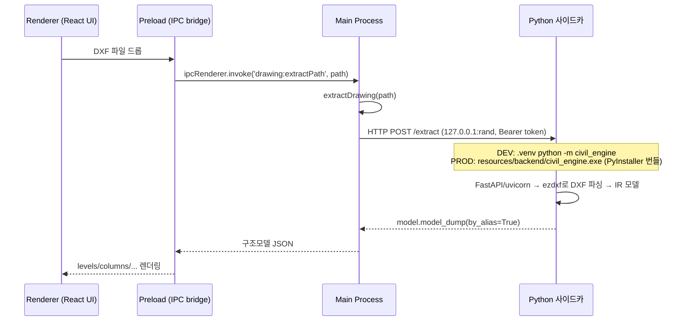
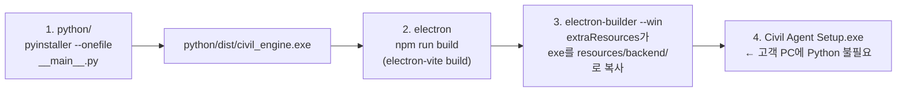

## 시리즈 마지막 빈칸 — "엔진 오프라인"을 없애기

이 시리즈에서 지금까지 Electron의 멀티 프로세스 구조, 렌더러의 Chromium 렌더링, 네이티브 OS 통합, IPC 보안, 패키징과 asar까지 다뤘다. 이번 글은 그 마지막 조각이다. **CAD 도면(DXF)을 구조모델로 변환하는 Python 엔진을 어떻게 Electron 앱 안에 넣어서, Python이 설치되지 않은 사용자 PC에서도 동작시키는가**를 다룬다.

`civil_agent`는 Electron(메인+렌더러) 위에서 2D 도면(DXF) → 구조모델 IR 변환을 Python 엔진(`civil_engine`)이 담당한다. 통신은 stdin/stdout이 아니라 **로컬 HTTP(127.0.0.1 + 랜덤 포트 + Bearer 토큰)** 방식이다.

현재 `src/main/sidecar.ts`는 개발 환경에서 레포의 venv 파이썬으로 모듈을 띄운다.

```ts
// 개발: 레포의 venv 파이썬으로 모듈 실행. 배포: 추후 번들 backend(resources) — TODO
const pyRoot = join(process.cwd(), 'python')
const venvPy =
  process.platform === 'win32'
    ? join(pyRoot, '.venv', 'Scripts', 'python.exe')
    : join(pyRoot, '.venv', 'bin', 'python')
const pyExe = existsSync(venvPy) ? venvPy : 'python'

if (isPackaged && !existsSync(venvPy)) {
  console.warn('[sidecar] packaged backend 미동봉 — 엔진 오프라인')
  return false   // ← 지금은 prod 패키징 시 엔진이 꺼진다(미완)
}
```

개발 PC에서는 venv 파이썬이 잘 돈다. 하지만 **고객 PC(파이썬 미설치)에 그대로 패키징하면 `pyExe`가 시스템 `python`을 찾다 실패하거나, `isPackaged && !venv` 가드에 걸려 "엔진 오프라인"이 된다.** 이 글은 그 빈칸을 채운다.

::: notice
이 글은 `civil_agent` 프로젝트의 현재 `sidecar.ts` / `electron-builder.yml` 코드를 기준으로, **PyInstaller 번들 backend를 동봉하는 구체적인 변경안**을 다룬다.
:::

---

## 왜 파이썬이 없어도 도는가

Python 스크립트가 실행되려면 세 가지가 PC에 있어야 한다.

1. **Python 인터프리터** (`python.exe` / `libpython3xx.dll`)
2. **표준 라이브러리** (`os`, `json`, `argparse`, `encodings`, …)
3. **서드파티 패키지** (`ezdxf`, `fastapi`, `pydantic`, `uvicorn`, 그 의존성)

일반적인 "PC에 Python 설치"는 이 셋을 시스템 전역(`C:\Python311`, `site-packages`)에 깔아 두는 방식이다. 그래서 앱이 **시스템에 의존**한다.

번들링은 발상을 뒤집는다. **이 셋을 전부 앱 배포물 안에 복사해 넣는다.** 그러면 실행 파일은 시스템의 `PATH`·레지스트리·`site-packages`를 전혀 보지 않고, 자기 안에 든 인터프리터와 라이브러리만으로 동작한다. 이것이 "self-contained(자급자족)"의 의미이며, 파이썬이 설치되지 않은 PC에서도 앱이 도는 이유다.

```text
[일반 설치]                          [번들(PyInstaller)]
시스템 python.exe ── site-packages   civil_engine.exe
   ↑ 앱이 시스템에 의존              ├─ python311.dll (인터프리터 동봉)
                                     ├─ 표준 라이브러리 (.pyc 동봉)
                                     └─ ezdxf/fastapi/... (동봉)
                                        ↑ 시스템에 전혀 의존하지 않음
```

---

## PyInstaller 동작 원리

PyInstaller는 "Analysis(의존성 추적) → 인터프리터+모듈 수집 → 부트로더로 포장"의 파이프라인이다. 핵심 메커니즘은 **bootloader**다.<a href="https://pyinstaller.org/en/stable/operating-mode.html" target="_blank"><sup>[1]</sup></a>

### One-Folder 모드 (`onedir`)

결과물은 **폴더 하나**다. `civil_engine.exe`(부트로더) + 동봉된 `python3xx.dll`, `.pyc`, DLL들이 같은 폴더에 들어간다. 실행 시 부트로더가 먼저 뜨고, 폴더 안에서 모든 모듈/라이브러리를 찾도록 임시 Python 환경을 구성한 뒤, 동봉된 인터프리터 복사본으로 스크립트를 실행한다.

> "A bundled program always starts execution in the PyInstaller bootloader. … The bootloader creates a temporary Python environment such that the Python interpreter will find all imported modules and libraries in the myscript folder. The bootloader starts a copy of the Python interpreter to execute your script." — PyInstaller 공식 문서<a href="https://pyinstaller.org/en/stable/operating-mode.html" target="_blank"><sup>[1]</sup></a>

### One-File 모드 (`onefile`)와 `_MEIPASS`

결과물은 **단일 `.exe` 하나**다. 모든 것이 압축되어 들어간다. 실행 시 부트로더가 OS 임시 폴더에 `_MEIxxxxxx`(xxxxxx는 난수) 폴더를 만들고, 압축된 인터프리터·모듈을 그 폴더에 풀어쓴(uncompress) 다음 onedir와 동일하게 진행한다. 프로그램이 종료되면 그 임시 폴더를 삭제한다.

> "When started it creates a temporary folder … named `_MEIxxxxxx` … The bootloader uncompresses the support files and writes copies into the temporary folder. This can take a little time. That is why a one-file app is a little slower to start than a one-folder app. … When the bundled code terminates, the bootloader deletes the temporary folder." — PyInstaller 공식 문서<a href="https://pyinstaller.org/en/stable/operating-mode.html" target="_blank"><sup>[1]</sup></a>

런타임 코드는 이 추출 경로를 `sys._MEIPASS`로 알 수 있다(데이터 파일 접근에 사용). 추출 위치는 `--runtime-tmpdir`로 제어할 수 있다. 다중 인스턴스를 실행해도 각자 다른 `_MEIxxxxxx`를 쓰므로 서로 간섭하지 않는다. 단, `/tmp`가 `noexec`로 마운트된 리눅스에서는 onefile이 실패할 수 있어 onedir이 권장되는 환경도 있다.

### spec 파일 — 커스터마이즈 지점

`pyinstaller myscript.py`를 실행하면 먼저 `myscript.spec`이 생성된다. 이 spec의 `Analysis(...)`에서 `datas`(추가 데이터 파일), `binaries`(추가 DLL), `hiddenimports`(정적 분석이 못 잡는 동적 import)를 지정한다.<a href="https://pyinstaller.org/en/stable/spec-files.html" target="_blank"><sup>[2]</sup></a> `uvicorn`, `fastapi`처럼 동적 import가 많은 패키지는 `hiddenimports`나 `--collect-all`이 필요할 때가 잦다.

::: tip
PyInstaller는 "Docker 이미지"와 비슷한 발상이다. 다만 **PyInstaller가 가두는 건 Python 런타임 + 라이브러리뿐**이고, Docker처럼 **커널 네임스페이스/cgroup으로 프로세스·FS·네트워크를 격리하지는 않는다.** PyInstaller로 만든 exe는 호스트의 평범한 프로세스로 실행된다 — 보안 경계는 애플리케이션 코드가 직접 만들어야 한다.
:::

| 개념 | Docker 이미지 | PyInstaller 번들 |
|------|---------------|------------------|
| 무엇을 가두나 | OS 유저랜드 + 런타임 + 앱 + 라이브러리 | Python 런타임 + 앱 + 라이브러리 |
| 자급자족성 | 호스트에 런타임 불필요 | 호스트에 Python 불필요 |
| "이미지 풀기" | 레이어 → 컨테이너 rootfs | onefile 부트로더 → `_MEIxxxxxx`로 추출 |
| 시작 비용 | 컨테이너 생성 | onefile은 추출 때문에 살짝 느림(onedir은 빠름) |
| 격리 | 커널 네임스페이스/cgroup로 프로세스·FS·네트워크 격리 | **격리 없음** — 호스트의 평범한 프로세스 |

---

## 대안 비교 — 왜 PyInstaller인가

| 방식 | 동봉 내용 | 장점 | 단점 | civil_agent 적합도 |
|------|-----------|------|------|---------------------|
| **PyInstaller** | 인터프리터+표준+서드파티 | 성숙·문서 풍부, spec로 세밀 제어, ezdxf/numpy류 잘 잡음 | onefile 시작 지연, 백신 오탐, hiddenimports 손봐야 할 때 있음 | 권장(1순위) |
| **Nuitka** | C로 컴파일된 모듈+런타임 | 실행 빠름, 코드 보호 우수 | 빌드 느림/복잡, C 컴파일러 필요, 호환성 함정 | 성능 절실해지면 검토 |
| **embeddable Python / python-build-standalone** | 공식 임베드 배포본 + pip로 깐 패키지를 그대로 동봉 | "진짜 파이썬 트리"라 디버깅 직관적, 동적 import 걱정↓ | 용량 큼, 경로/`._pth` 수작업, 직접 트리 관리 | 번들 트러블 시 안전한 대안 |
| **시스템 Python 의존** | 아무것도 안 동봉 | 배포물 작음 | 고객 PC에 Python 강제 — MVP 실격 | 부적합 |

우선 PyInstaller로 진행하되, `ezdxf`·`uvicorn` 관련 `hiddenimports`에서 막히면 python-build-standalone 트리 동봉으로 빠르게 우회할 수 있다. 둘 다 "Electron에서 보는 외형"은 동일하다 — `resources/` 안의 실행 가능한 backend라는 점은 같다.

---

## Electron 연결 — 번들을 어떻게 붙이나

### 왜 extraResources인가 (asar 밖)

Electron은 앱 코드를 `app.asar`(가상 tar)로 묶는다. **asar 안의 파일은 OS가 직접 실행할 수 없다.** 네이티브 exe·DLL은 실제 파일시스템에 풀려 있어야 한다. 그래서 PyInstaller 번들은 asar에 넣지 않고 `extraResources`로 `resources/` 아래 평범한 파일로 복사한다.<a href="https://www.electron.build/configuration" target="_blank"><sup>[3]</sup></a>

전 글([Electron 패키징과 asar →](/post/electron-packaging-asar))에서 다룬 asarUnpack과 같은 결이다. 현재 `electron-builder.yml`도 `asarUnpack: resources/**`로 언팩을 보장하고 있고, `extraResources`는 아직 주석으로만 존재한다.

```yaml
# 추후: extraResources 로 Python 사이드카(backend) 동봉
# extraResources:
#   - from: python/dist/backend
#     to: backend
asarUnpack:
  - resources/**
```

### dev vs prod 경로 분기

핵심은 `app.isPackaged`와 `process.resourcesPath`다.

```ts
import { app } from 'electron'
import { join } from 'path'

function resolveBackend(): { cmd: string; args: string[] } {
  if (!app.isPackaged) {
    // DEV: 레포 venv 파이썬으로 모듈 실행 (현재 sidecar.ts 그대로)
    const pyRoot = join(process.cwd(), 'python')
    const venvPy = process.platform === 'win32'
      ? join(pyRoot, '.venv', 'Scripts', 'python.exe')
      : join(pyRoot, '.venv', 'bin', 'python')
    return { cmd: venvPy, args: ['-m', 'civil_engine'] }
  }
  // PROD: 번들된 단일 exe (PyInstaller 산출물, resources/backend/ 아래)
  const exe = process.platform === 'win32' ? 'civil_engine.exe' : 'civil_engine'
  const bin = join(process.resourcesPath, 'backend', exe)
  return { cmd: bin, args: [] }
}
```

- `app.isPackaged`는 패키징 여부 분기의 표준 신호다. 현재 `index.ts`에서도 `const isDev = !app.isPackaged`로 이미 쓰고 있다.
- `process.resourcesPath`는 패키징된 앱의 `resources/` 절대경로다. `extraResources`의 `to: backend`와 합쳐져 `resources/backend/...`가 된다.

::: important
`app.isPackaged`는 "asar로 패키징됐는가"를 보는 신호이고, `process.resourcesPath`는 "그 패키지의 resources 폴더가 어디인가"를 알려준다. **이 둘을 묶어야 dev에서는 venv 파이썬, prod에서는 동봉된 exe를 정확히 가리킬 수 있다.** 둘 중 하나만 보고 분기하면 개발 중에는 되던 게 패키징 후 깨지는 전형적인 버그가 된다.
:::

### spawn인가, utilityProcess인가

현재 `sidecar.ts`는 `child_process.spawn`을 쓴다. 임의의 외부 프로그램을 실행할 수 있으므로 PyInstaller exe에 그대로 적합하다.

- **`child_process.spawn(cmd, args, opts)`**: 임의의 외부 프로그램을 실행한다. `stdio: 'pipe'`로 stdout/stderr을 캡처하고, `cwd`/`env`를 지정할 수 있다. 우리 사이드카(exe)에 맞는 선택이다.<a href="https://nodejs.org/api/child_process.html" target="_blank"><sup>[4]</sup></a>
- **`utilityProcess.fork(modulePath)`**: Electron 전용 API로, Node.js + MessagePort가 켜진 자식 프로세스를 만든다.<a href="https://www.electronjs.org/docs/latest/api/utility-process" target="_blank"><sup>[5]</sup></a> 다만 이건 **Node 모듈 경로를 forking**하는 것이라 "임의의 exe"엔 부적합하다.

결론적으로 **파이썬 사이드카에는 `spawn`이 정답**이다. `utilityProcess`는 Node 워커를 분리할 때 쓰는 도구이고, 이 케이스에서는 불필요하다.

### 통신 방식 — 로컬 HTTP

stdin/stdout JSON 대신 로컬 HTTP(FastAPI)를 쓴다. 이미 구현돼 있다.

```ts
const r = await fetch(`http://127.0.0.1:${state.port}/extract`, {
  method: 'POST',
  headers: { 'Content-Type': 'application/json', Authorization: `Bearer ${state.token}` },
  body: JSON.stringify({ path, level_id: levelId, level_elev: levelElev })
})
```

보안 하드닝은 이미 적용돼 있다. **랜덤 빈 포트 + 16바이트 랜덤 토큰(Bearer) + 헬스체크 타임아웃 + 종료 시 kill(좀비 방지).** PyInstaller가 제공하지 못하는 격리를, 이 애플리케이션 레벨 경계가 보완한다.

---

## 전체 데이터 흐름 (DXF 드롭 → 구조모델)



---

## civil_agent에 적용할 구체 구성 — 빈칸 채우기

현재 누락된 prod 경로를 완성하려면 세 가지를 추가한다.

### (A) PyInstaller로 단일 exe 빌드

```bash
# python/ 디렉터리에서, venv 활성화 상태
pip install pyinstaller
pyinstaller --onefile --name civil_engine \
  --collect-all uvicorn --collect-all fastapi --collect-all ezdxf --collect-all pydantic \
  --hidden-import civil_engine.server \
  -p . civil_engine/__main__.py
# 산출물: python/dist/civil_engine.exe   (onedir이면 python/dist/civil_engine/ 폴더)
```

동적 import가 많은 `uvicorn`/`fastapi`는 `--collect-all`로 누락을 방지한다. onefile 시작 지연이 부담이면 `--onedir`로 바꾸고 `from: python/dist/civil_engine`(폴더)을 통째로 동봉한다.

### (B) electron-builder.yml에 extraResources 활성화

주석을 실제 설정으로 바꾼다(onefile 기준 — 폴더 산출이면 `from`을 폴더로).

```yaml
extraResources:
  - from: python/dist/civil_engine.exe   # onedir이면: python/dist/civil_engine
    to: backend                          # → resources/backend/civil_engine.exe
asarUnpack:
  - resources/**
```

### (C) sidecar.ts의 prod 분기 교체

현재의 미완 가드는 prod에서 무조건 "엔진 오프라인"으로 빠진다.

```ts
if (isPackaged && !existsSync(venvPy)) {
  console.warn('[sidecar] packaged backend 미동봉 — 엔진 오프라인')
  return false
}
```

이걸 다음과 같이 교체한다.

```ts
// PROD: 번들된 PyInstaller exe, DEV: venv 파이썬
let cmd: string
let args: string[]
if (isPackaged) {
  const exe = process.platform === 'win32' ? 'civil_engine.exe' : 'civil_engine'
  cmd = join(process.resourcesPath, 'backend', exe)
  args = ['--port', String(port), '--token', token]
  if (!existsSync(cmd)) {
    console.warn('[sidecar] 번들 backend 없음:', cmd)
    return false
  }
} else {
  cmd = pyExe                                  // 기존 venv 경로
  args = ['-m', 'civil_engine', '--port', String(port), '--token', token]
}
proc = spawn(cmd, args, {
  cwd: isPackaged ? join(process.resourcesPath, 'backend') : pyRoot,
  env: { ...process.env, CA_PORT: String(port), CA_TOKEN: token },
  stdio: 'pipe'
})
```

`server.py`의 `main()`은 이미 `--port`/`--token` 인자를 받으므로 **파이썬 측 코드는 변경할 필요가 없다.** PyInstaller가 `__main__.py`를 진입점으로 묶으면, exe가 그대로 같은 CLI를 노출한다.

```python
def main() -> None:
    p = argparse.ArgumentParser(prog="civil_engine")
    p.add_argument("--host", default="127.0.0.1")
    p.add_argument("--port", type=int, default=int(os.environ.get("CA_PORT", "8327")))
    p.add_argument("--token", default=os.environ.get("CA_TOKEN"))
    args = p.parse_args()
    import uvicorn
    uvicorn.run(create_app(token=args.token), host=args.host, port=args.port, log_level="warning")
```

### 빌드 파이프라인 요약



---

## Docker 배포와의 비교

| 항목 | Docker 배포 | Electron + PyInstaller 사이드카 |
|------|-------------|----------------------------------|
| 격리 수준 | 커널 네임스페이스/cgroup (프로세스·FS·네트워크 격리) | 격리 없음 — 호스트의 일반 프로세스 (보안은 앱 레벨 토큰/루프백으로) |
| 동봉 범위 | OS 유저랜드 + 런타임 + 앱 | Python 런타임 + 앱 (OS는 호스트 것 사용) |
| 산출물 크기 | 보통 수백 MB~ (베이스 이미지 포함) | 보통 수십~수백 MB (numpy류 의존 많으면 증가) |
| 시작 속도 | 컨테이너 생성 빠름 | onefile은 `_MEIPASS` 추출로 살짝 느림 / onedir 빠름 |
| 배포 방식 | 레지스트리 pull + 런타임(데몬) 필요 | 단일 인스톨러(NSIS) — 데스크톱 더블클릭 |
| 대상 | 서버/CI | 엔드유저 데스크톱(Windows) ← civil_agent 케이스 |
| 크로스플랫폼 | 이미지 멀티아치 빌드 | OS별 따로 빌드 필수 |

---

## 배포 전 체크리스트

1. **플랫폼별 따로 빌드 필수.** PyInstaller는 크로스컴파일을 하지 않는다. Windows용 `.exe`는 Windows에서, macOS용은 macOS에서 빌드해야 한다. `build:win`이 Windows 산출물만 만든다는 점과 일치한다.
2. **백신 오탐(false positive).** PyInstaller 부트로더+압축 실행 패턴은 휴리스틱 백신이 종종 의심한다. 코드 서명으로 상당 부분 완화할 수 있다.
3. **코드 서명.** Windows는 인증서로 `.exe`/인스톨러를 서명해야 SmartScreen 경고가 줄어들고, macOS는 서명+공증(notarization)이 필요하다. 사이드카 exe도 같이 서명하는 것이 권장된다.
4. **용량.** `uvicorn[standard]`(+websockets, watchfiles), `pydantic`(컴파일 확장) 등으로 번들이 커질 수 있다. 불필요한 의존성을 제거하거나 `--exclude-module`로 다이어트한다. 데스크톱 사이드카에 풀 ASGI 서버가 정말 필요한지도 재검토할 만하다 — 필요하면 stdin/stdout JSON-RPC로 더 가볍게 갈 수 있다.
5. **hidden imports.** 동적 import(특히 `uvicorn`, `ezdxf` 일부 애드온)는 정적 분석에서 누락될 수 있다. spec의 `hiddenimports` 또는 `--collect-all`로 보강하고, **반드시 깨끗한 PC(파이썬 미설치 VM)에서 실행 검증한다.**
6. **데이터 파일 경로.** 번들 안 리소스를 코드에서 열 때는 `sys._MEIPASS`(onefile 추출 경로) 기준으로 접근해야 한다. 상대경로를 가정하면 안 된다.
7. **onefile 임시폴더 제약.** noexec `/tmp`(일부 리눅스) 환경에서는 onefile 실행이 실패할 수 있다. onedir 또는 `--runtime-tmpdir`로 우회한다.
8. **좀비 프로세스.** 이미 `app.on('will-quit', stopSidecar)`로 kill 처리가 돼 있다. 번들 exe로 바뀌어도 이 처리는 동일하게 유지해야 한다.

::: warning
PyInstaller onefile은 **매 실행마다 `_MEIxxxxxx` 임시 폴더에 압축을 풀기 때문에** 시작이 살짝 느리다. 사이드카처럼 앱 시작 시 한 번만 띄우는 구조라면 큰 문제가 안 되지만, 빈번하게 재시작되는 구조라면 onedir 모드를 우선 검토하는 게 좋다.
:::

---

## 현재 코드에서 바꿔야 할 파일 요약

| 파일 | 현재 상태 | 해야 할 일 |
|------|-----------|------------|
| `python/` (신규 빌드) | venv로만 실행 | `pyinstaller --onefile ... __main__.py` → `python/dist/civil_engine.exe` |
| `electron-builder.yml` | `extraResources` 주석 처리 | 주석 해제 + `from: python/dist/civil_engine.exe`, `to: backend` |
| `src/main/sidecar.ts` | `isPackaged && !venv → 오프라인` | prod 분기를 `process.resourcesPath/backend/civil_engine.exe` spawn으로 교체 |
| `src/main/index.ts` | `isDev = !app.isPackaged` | 변경 불필요 (이미 분기 신호 사용) |
| `python/civil_engine/server.py` | `--port`/`--token` CLI 보유 | 변경 불필요 |

---

## 시리즈를 마치며

이번 7부작 시리즈는 Electron 앱을 "GUI 프레임워크"가 아니라 **여러 프로세스가 협력하는 작은 분산 시스템**으로 보는 관점에서 출발했다. Main/Renderer/Preload/Utility의 멀티 프로세스 구조([1편 →](/post/electron-multi-process-architecture))에서 시작해, 렌더러의 Chromium 렌더링 파이프라인, 네이티브 OS 통합, IPC 보안 경계, asar 패키징, 그리고 이번 글의 Python 사이드카 번들링까지 — 각 글은 결국 "이 프로세스/경계의 책임은 무엇이고, 그 경계를 누가/어떻게 지키는가"라는 같은 질문의 변주였다.

::: tip
`civil_agent`처럼 **Electron + 비-Node 백엔드(Python, Go, Rust 등)** 조합을 쓰는 프로젝트라면, 이 글의 패턴(번들링 → `extraResources` → `spawn` + 로컬 HTTP/토큰)은 언어를 바꿔도 거의 그대로 재사용할 수 있다. 핵심은 "OS가 직접 실행할 수 있는 형태로 asar 밖에 두고, 격리가 없는 만큼 애플리케이션 레벨 경계를 직접 만든다"는 두 가지다.
:::

---

## 참고

<ol>
<li><a href="https://pyinstaller.org/en/stable/operating-mode.html" target="_blank">[1] What PyInstaller Does and How It Does It — PyInstaller 공식 문서</a></li>
<li><a href="https://pyinstaller.org/en/stable/spec-files.html" target="_blank">[2] Using Spec Files — PyInstaller 공식 문서</a></li>
<li><a href="https://www.electron.build/configuration" target="_blank">[3] Configuration (extraResources, asarUnpack) — electron-builder</a></li>
<li><a href="https://nodejs.org/api/child_process.html" target="_blank">[4] Child Process — Node.js 공식 문서</a></li>
<li><a href="https://www.electronjs.org/docs/latest/api/utility-process" target="_blank">[5] utilityProcess — Electron 공식 문서</a></li>
<li><a href="https://github.com/indygreg/python-build-standalone" target="_blank">[6] python-build-standalone — GitHub</a></li>
</ol>

## 관련 글

- [Electron 패키징과 asar — electron-builder로 배포하기 →](/post/electron-packaging-asar) — 이전 글, asar 패키징과 extraResources의 기초
- [Electron 멀티 프로세스 아키텍처 — Main, Renderer, Preload, Utility 프로세스 →](/post/electron-multi-process-architecture) — 시리즈 메인 글, 전체 아키텍처 개요로 돌아가기
</content>
