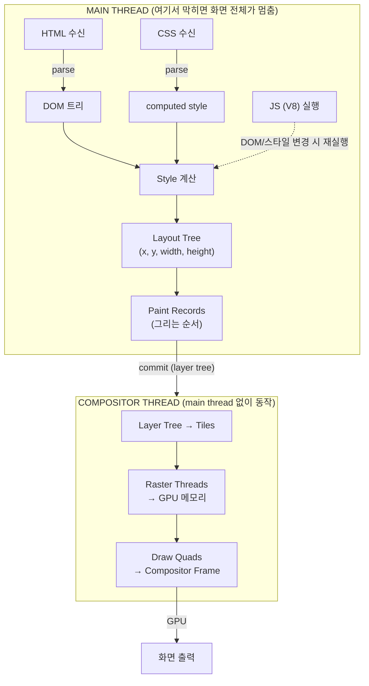

## 이 글에서 다루는 것

[지난 글](/post/electron-multi-process-architecture)에서는 Electron이 main·renderer·preload·utility 프로세스로 어떻게 나뉘는지, 그 전체 그림을 살펴봤다. 이번 글은 그 그림의 한 칸 — **renderer 프로세스 안**으로 들어가서, 우리가 작성한 React 컴포넌트가 실제로 화면의 픽셀이 되기까지 무슨 일이 벌어지는지를 다룬다.

renderer 프로세스는 Chromium의 렌더링 엔진인 **Blink**와 자바스크립트 엔진인 **V8**을 품고 있다. 이 둘이 HTML/CSS/JS를 받아서

**파싱(DOM) → 스타일(computed style) → 레이아웃(geometry) → 페인트(paint record) → 컴포지팅(layer·raster·GPU)**

이라는 5단계 파이프라인을 통해 화면을 그린다. 그리고 이 파이프라인의 대부분은 **단 하나의 main thread**에서 돈다 — 그래서 무거운 JS 한 줄이 화면 전체를 멈추게 할 수 있다. 반면 스크롤이나 `transform` 애니메이션처럼 **compositor thread**가 처리하는 작업은 main thread가 막혀 있어도 부드럽게 동작한다.

::: note
이 글의 핵심 인용은 Chrome 팀의 "Inside look at modern web browser" 시리즈(part 1, part 3)에서 가져왔다. 원문은 영어지만, 렌더링 파이프라인을 설명하는 표준 출처로 자주 인용되는 문서다.
:::

---

## renderer 프로세스 = 탭 하나의 내부 전체

1편에서 본 대로, 각 `BrowserWindow`(=탭)는 자기만의 renderer 프로세스를 가진다. Chrome 공식 문서는 이 프로세스의 역할을 다음과 같이 설명한다.

> "Controls anything inside of the tab where a website is displayed." <a href="https://developer.chrome.com/blog/inside-browser-part1" target="_blank"><sup>[1]</sup></a>

> "The renderer process is responsible for everything that happens inside of a tab." <a href="https://developer.chrome.com/blog/inside-browser-part3" target="_blank"><sup>[2]</sup></a>

즉 우리 React UI — 메뉴, 캔버스, 채팅 패널 전부 — 는 **renderer 프로세스 안에서만** 산다. main 프로세스에는 `DOM`도 `window`도 없다.

### 탭/사이트마다 renderer가 따로 뜬다

Chrome은 탭마다 별도의 renderer 프로세스를 띄우는 것이 기본 모델이다.

> "imagine each tab has its own renderer process." <a href="https://developer.chrome.com/blog/inside-browser-part1" target="_blank"><sup>[1]</sup></a>

> "Site Isolation is a recently introduced feature in Chrome that runs a separate renderer process for each cross-site iframe." <a href="https://developer.chrome.com/blog/inside-browser-part1" target="_blank"><sup>[1]</sup></a>

Electron 앱은 보통 창 하나(=renderer 하나)지만, `<iframe>`이나 `<webview>`로 외부 사이트를 끼우면 Site Isolation에 의해 **별도의 renderer 프로세스**가 추가로 생길 수 있다. 이것이 작업 관리자에서 `Electron.exe` 프로세스가 여러 개 보이는 이유 중 하나다.

### renderer는 샌드박스 안에 있다

1편에서 다룬 보안 모델의 물리적 근거가 바로 여기 있다.

> "[Chrome] can sandbox certain processes from certain features ... arbitrary file access for processes that handle arbitrary user input like the renderer process." <a href="https://developer.chrome.com/blog/inside-browser-part1" target="_blank"><sup>[1]</sup></a>

renderer가 파일 시스템에 직접 접근하지 못하는 이유가 바로 이 샌드박스 정책이다. 그래서 파일 읽기, 외부 프로세스 호출처럼 권한이 필요한 작업은 **전부 IPC를 통해 main 프로세스에 위임**해야 한다 — 이 부분은 시리즈 후반에서 다시 다룬다.

---

## renderer를 구동하는 두 엔진 — Blink와 V8

renderer 프로세스 안에는 두 개의 Chromium 엔진이 함께 들어 있다.

| 엔진 | 역할 | 비유 |
|------|------|------|
| **Blink** | 렌더링 엔진. HTML/CSS를 해석해 DOM·레이아웃·페인트를 만들고 화면을 그린다 | 그림을 그리는 손 |
| **V8** | 자바스크립트(+WebAssembly) 엔진. React 코드를 실제로 실행한다 | 생각하고 명령하는 머리 |

Blink는 Chromium의 렌더링 엔진, V8은 Chromium의 자바스크립트 엔진이라는 구분은 Electron과 Chromium 문서 전반에서 일관되게 쓰인다 <a href="https://www.electronjs.org/docs/latest/tutorial/process-model" target="_blank"><sup>[3]</sup></a><a href="https://v8.dev/docs" target="_blank"><sup>[4]</sup></a>. 1편에서 확인했던 "각 `BrowserWindow`는 웹 표준을 사용해 페이지를 렌더링한다"는 설명이 바로 "renderer 안에서 Blink와 V8이 함께 돈다"는 뜻이다.

::: important
V8은 renderer뿐 아니라 **main 프로세스(Node.js)에도** 들어 있다. 같은 V8 엔진이 양쪽에서 돌지만, renderer의 V8은 **Node API가 차단된** 웹 표준 환경에서, main의 V8은 **Node 전권** 환경에서 동작한다. 엔진은 같고 권한이 다르다 — 이것이 Electron 보안 설계의 뿌리다. 다음 글에서 이 두 V8과 두 이벤트 루프의 통합을 자세히 다룬다.
:::

### 핵심: main thread가 거의 다 한다

renderer 프로세스의 스레드 구성을 보면 이렇게 정리된다.

> "In a renderer process, the main thread handles most of the code you send to the user." <a href="https://developer.chrome.com/blog/inside-browser-part3" target="_blank"><sup>[2]</sup></a>

> "Compositor and raster threads are also run inside of a renderer process to render a page efficiently and smoothly." <a href="https://developer.chrome.com/blog/inside-browser-part3" target="_blank"><sup>[2]</sup></a>

정리하면 renderer 프로세스 = **main thread 1개** + worker threads + **compositor thread** + **raster threads**다. 그런데 아래에서 살펴볼 파이프라인의 Parse·Style·Layout·Paint 단계, 그리고 **우리가 작성한 JS 전부**가 이 **단 하나의 main thread**에서 실행된다. 여기서 무거운 작업을 하면 화면 전체가 멈춘다(jank). 이 사실이 이 글 전체를 관통하는 실무적 핵심이다.

---

## 렌더링 파이프라인 — HTML이 픽셀이 되기까지

> "The renderer process's core job is to turn HTML, CSS, and JavaScript into a web page that the user can interact with." <a href="https://developer.chrome.com/blog/inside-browser-part3" target="_blank"><sup>[2]</sup></a>

순서는 **Parsing(DOM) → Style → Layout → Paint → Compositing**이다. 전체 흐름을 먼저 그림으로 보자.



### Parsing — 텍스트(HTML)를 DOM 트리로

> "When the renderer process receives a commit message for a navigation and starts to receive HTML data, the main thread begins to parse the text string (HTML) and turn it into a Document Object Model (DOM)." <a href="https://developer.chrome.com/blog/inside-browser-part3" target="_blank"><sup>[2]</sup></a>

> "The DOM is a browser's internal representation of the page as well as the data structure and API that web developers interact with via JavaScript." <a href="https://developer.chrome.com/blog/inside-browser-part3" target="_blank"><sup>[2]</sup></a>

#### preload scanner — 동시에 리소스를 미리 긁는다

main thread가 HTML을 파싱하면서 ``나 `<link>` 같은 서브리소스를 한 줄씩 순서대로 요청하면 느리다. 그래서 Chromium은 파서가 만들어내는 토큰을 곁눈질하며 **미리 리소스 요청을 보내는** preload scanner를 동시에 돌린다.

> "in order to speed up, 'preload scanner' is run concurrently. If there are things like `` or `<link>` in the HTML document, preload scanner peeks at tokens generated by the HTML parser and sends requests ..." <a href="https://developer.chrome.com/blog/inside-browser-part3" target="_blank"><sup>[2]</sup></a>

#### JavaScript는 파싱을 막을 수 있다

여기서 중요한 사실이 하나 있다. `<script>` 태그를 만나면 파서가 멈춘다.

> "JavaScript can block the parsing ... because JavaScript can change the shape of the document using things like `document.write()` which changes the entire DOM structure." <a href="https://developer.chrome.com/blog/inside-browser-part3" target="_blank"><sup>[2]</sup></a>

해결책은 스크립트에 `async`나 `defer`를 붙이는 것이다.

> "The browser then loads and runs the JavaScript code asynchronously and does not block the parsing." <a href="https://developer.chrome.com/blog/inside-browser-part3" target="_blank"><sup>[2]</sup></a>

::: tip
Vite로 번들된 React 진입 스크립트는 보통 `type="module"`로 주입되는데, 모듈 스크립트는 기본적으로 `defer`처럼 동작하므로 파싱을 막지 않는다. 다만 `index.html`에 직접 `<script>`를 추가할 일이 생긴다면 `defer` 속성을 챙겨야 한다.
:::

### Style — 각 DOM 노드의 computed style 계산

DOM이 만들어지면, main thread는 CSS를 파싱해서 각 DOM 노드의 **computed style**을 계산한다.

> "The main thread parses CSS and determines the computed style for each DOM node." <a href="https://developer.chrome.com/blog/inside-browser-part3" target="_blank"><sup>[2]</sup></a>

> "Even if you do not provide any CSS, each DOM node has a computed style." <a href="https://developer.chrome.com/blog/inside-browser-part3" target="_blank"><sup>[2]</sup></a>

DOM(구조)과 computed style(외형 규칙)이 합쳐져도 아직 "어디에 얼마 크기로 놓이는가"는 알 수 없다. 그 답은 다음 단계인 Layout에서 나온다.

### Layout — 기하(geometry) 계산

레이아웃은 각 요소의 좌표와 크기를 계산하는 단계다.

> "The layout is a process to find the geometry of elements. The main thread walks through the DOM and computed styles and creates the layout tree which has information like x y coordinates and bounding box sizes." <a href="https://developer.chrome.com/blog/inside-browser-part3" target="_blank"><sup>[2]</sup></a>

레이아웃 트리는 DOM과 비슷한 모양이지만, **화면에 실제로 보이는 것만** 담는다.

> "If `display: none` is applied, that element is not part of the layout tree (however, an element with `visibility: hidden` is in the layout tree)." <a href="https://developer.chrome.com/blog/inside-browser-part3" target="_blank"><sup>[2]</sup></a>

즉 `display: none`은 레이아웃 트리에서 완전히 빠지고(공간을 차지하지 않음), `visibility: hidden`은 트리에 남아 공간은 차지한 채 보이지 않을 뿐이다. UI에서 패널을 숨길 때 둘 중 무엇을 쓰느냐가 레이아웃 비용에 영향을 준다.

### Paint — 그리는 순서(paint record) 결정

레이아웃 트리가 완성되면, main thread는 그 트리를 순회하며 "무엇을 어떤 순서로 그릴지"를 적은 **paint record**를 만든다.

> "At this paint step, the main thread walks the layout tree to create paint records. Paint record is a note of painting process like 'background first, then text, then rectangle'." <a href="https://developer.chrome.com/blog/inside-browser-part3" target="_blank"><sup>[2]</sup></a>

요소들이 겹칠 때는 그리는 **순서**가 결과를 결정한다. `z-index`처럼 쌓임 순서에 영향을 주는 속성이 바뀌면 paint record를 다시 만들어야 한다.

> "For example, `z-index` might be set for certain elements, in that case painting in order of ... [is needed]." <a href="https://developer.chrome.com/blog/inside-browser-part3" target="_blank"><sup>[2]</sup></a>

::: warning
여기까지 — Parse, Style, Layout, Paint — **전부 main thread**에서 일어난다. 무거운 JS 연산이나 대량의 DOM 변경은 이 네 단계 전체를 다시 돌게 만들 수 있고, 그 동안 화면은 멈춘다.
:::

### Compositing — 레이어로 쪼개 별도 스레드에서 합성

마지막 단계는 paint record를 실제 픽셀로 바꾸는 **래스터화(rasterizing)**다.

> "[Turning the paint records into pixels on] the screen is called rasterizing." <a href="https://developer.chrome.com/blog/inside-browser-part3" target="_blank"><sup>[2]</sup></a>

만약 뷰포트 영역만 단순하게 래스터화한다면, 스크롤할 때마다 새로 드러나는 영역을 매번 다시 그려야 한다. 그래서 현대 Chromium은 페이지를 여러 **레이어**로 나누고, 각 레이어를 따로 래스터화한 뒤 별도 스레드에서 합성한다.

> "Compositing is a technique to separate parts of a page into layers, rasterize them separately, and composite as a page in a separate thread called compositor thread." <a href="https://developer.chrome.com/blog/inside-browser-part3" target="_blank"><sup>[2]</sup></a>

> "If scroll happens, since layers are already rasterized, all it has to do is to composite a new frame." <a href="https://developer.chrome.com/blog/inside-browser-part3" target="_blank"><sup>[2]</sup></a>

#### 레이어 트리와 will-change

어떤 요소를 별도 레이어로 분리할지는 main thread가 레이아웃 트리를 순회하며 **레이어 트리**를 만들 때 결정한다.

> "In order to find out which elements need to be in which layers, the main thread walks through the layout tree to create the layer tree." <a href="https://developer.chrome.com/blog/inside-browser-part3" target="_blank"><sup>[2]</sup></a>

슬라이드인 메뉴처럼 별도 레이어가 되어야 할 요소가 자동으로 분리되지 않는다면, `will-change` CSS 속성으로 브라우저에 힌트를 줄 수 있다.

> "If certain parts of a page that should be [a] separate layer (like slide-in side menu) is not getting one, then you can hint to the browser by using `will-change` attribute in CSS." <a href="https://developer.chrome.com/blog/inside-browser-part3" target="_blank"><sup>[2]</sup></a>

다만 레이어를 무분별하게 늘리면 오히려 역효과가 난다.

> "compositing across an excess number of layers could result in slower operation than rasterizing small parts of a page every frame, so it [is recommended to] Stick to Compositor-Only Properties and Manage Layer Count." <a href="https://developer.chrome.com/blog/inside-browser-part3" target="_blank"><sup>[2]</sup></a>

#### main thread를 떠나는 순간 — commit

레이어 트리와 paint 순서가 결정되면, main thread는 그 정보를 **commit**해서 compositor thread로 넘긴다. 이 시점부터는 main thread가 더 이상 필요 없다.

> "Once the layer tree is created and paint orders are determined, the main thread commits that information to the compositor thread. The compositor thread then rasterizes each layer." <a href="https://developer.chrome.com/blog/inside-browser-part3" target="_blank"><sup>[2]</sup></a>

레이어가 페이지 전체 길이만큼 클 수도 있으므로, compositor thread는 레이어를 **타일** 단위로 나눠 raster thread들에게 분배한다.

> "[Layers] could be large like the entire length of a page, so the compositor thread divides them into tiles and sends each tile off to raster threads. Raster threads rasterize each tile and store them in GPU memory." <a href="https://developer.chrome.com/blog/inside-browser-part3" target="_blank"><sup>[2]</sup></a>

타일이 래스터화되면, compositor thread는 **draw quad**라는 타일 정보를 모아 **compositor frame**을 만들고 GPU로 보낸다. 스크롤 이벤트가 들어오면 compositor thread는 main thread를 거치지 않고 새 compositor frame을 만든다.

> "Once tiles are rastered, compositor thread gathers tile information called draw quads to create a compositor frame. [These] compositor frames are sent to the GPU to display it on a screen. If a scroll event comes in, compositor thread creates another compositor frame to be sent to the GPU." <a href="https://developer.chrome.com/blog/inside-browser-part3" target="_blank"><sup>[2]</sup></a>

#### 결론 — 컴포지팅이 부드러운 이유

> "The benefit of compositing is that it is done without involving the main thread. ... compositing only animations are considered the best for smooth performance." <a href="https://developer.chrome.com/blog/inside-browser-part3" target="_blank"><sup>[2]</sup></a>

즉 `transform`이나 `opacity`처럼 **compositor만 건드리는 속성**으로 애니메이션을 구현하면, main thread가 무거운 JS로 막혀 있어도 스크롤과 애니메이션은 부드럽게 동작한다. 반대로 `top`/`left`/`width`/`height`를 애니메이션으로 바꾸면 매 프레임마다 **Layout → Paint → Composite 전체를 main thread에서 다시** 돌려야 해서 버벅인다(jank).

---

## 한눈에 보는 요약표

| 단계 | 입력 → 출력 | 실행 위치 | 무엇이 트리거하나 | 비용 |
|------|-------------|-----------|-------------------|------|
| **Parse** | HTML/CSS → DOM·CSSOM | main thread | 문서 수신, `innerHTML` 변경 | 중 |
| **Style** | DOM+CSS → computed style | main thread | 클래스/스타일 변경 | 중 |
| **Layout** | style → layout tree(x, y, size) | main thread | 기하 변경(width/top/폰트/텍스트) | 높음 |
| **Paint** | layout tree → paint records | main thread | 색·그림자·z-index 등 | 중 |
| **Composite** | layer tree → tiles → GPU frame | compositor/raster thread | `transform`, `opacity`, 스크롤 | 낮음(부드러움) |

::: tip
황금률: 애니메이션은 **compositor-only 속성(`transform`, `opacity`)**으로 만든다. Layout을 건드리는 속성을 애니메이션하면 main thread가 매 프레임 점유된다.
:::

---

## Electron 앱에 적용하기

위 사실들을 실제 Electron 앱의 무거운 화면 작업에 대응해 보면 다음과 같다. 두 가지 대표적인 패턴 모두 **renderer의 main thread**에 부담을 준다.

### 1. 캔버스 줌/팬을 transform으로

PDF 뷰어나 이미지 캔버스에서 확대/이동을 구현할 때, `left`/`top`/`width` 같은 기하 속성을 직접 바꾸면 매 프레임 Layout과 Paint가 main thread에서 다시 돈다. 대신 컨테이너 요소를 `transform: translate() scale()`로 움직이면 컴포지터 경로를 타서 부드럽다.

```js
// 느린 방식 — 매 프레임 Layout/Paint 재계산
canvas.style.left = `${x}px`;
canvas.style.top = `${y}px`;
canvas.style.width = `${scale * baseWidth}px`;

// 빠른 방식 — compositor thread에서만 처리
canvas.style.transform = `translate(${x}px, ${y}px) scale(${scale})`;
```

### 2. 무거운 계산은 Web Worker나 별도 프로세스로

3D 렌더링이나 대량의 캔버스 드로잉이 main thread를 점유하면, 같은 thread에서 처리되는 React 이벤트와 레이아웃까지 함께 멈춘다. 가벼운 계산은 **Web Worker**(별도 thread)로, 더 무거운 작업은 **utility 프로세스나 사이드카 프로세스**(별도 프로세스)로 떼어내 main thread를 비워두는 것이 원칙이다.

::: note
"Worker로 갈지 별도 프로세스로 갈지"를 가르는 기준은 1편에서 다룬 격리 단위·장애 반경의 논리와 같다 — 작업의 무게와 위험도에 따라 thread 격리(Worker)와 프로세스 격리(utility process) 중 적절한 수준을 고른다.
:::

또한 renderer는 샌드박스 안에 있어 파일이나 OS 자원에 직접 접근할 수 없으므로, 파일 읽기나 외부 엔진 호출처럼 권한이 필요한 작업은 preload에서 노출한 최소한의 API를 통해 main 프로세스에 위임해야 한다.

---

이 글에서는 renderer 프로세스 **안**에서 화면이 그려지는 과정 — Blink와 V8, 그리고 main thread 병목 — 을 살펴봤다. [다음 글](/post/electron-nodejs-libuv-integration)에서는 같은 V8이지만 Node 전권 환경에서 동작하는 main 프로세스의 Node.js 런타임과, libuv 이벤트 루프가 Chromium의 메시지 루프와 어떻게 통합되는지를 다룬다.

---

## 참고

<ol>
<li><a href="https://developer.chrome.com/blog/inside-browser-part1" target="_blank">[1] Inside look at modern web browser (part 1) — Chrome Developers</a></li>
<li><a href="https://developer.chrome.com/blog/inside-browser-part3" target="_blank">[2] Inside look at modern web browser (part 3) — Chrome Developers</a></li>
<li><a href="https://www.electronjs.org/docs/latest/tutorial/process-model" target="_blank">[3] Process Model — Electron Docs</a></li>
<li><a href="https://v8.dev/docs" target="_blank">[4] V8 Documentation — v8.dev</a></li>
</ol>

## 관련 글

- [Electron 멀티 프로세스 아키텍처 — Main, Renderer, Preload, Utility 프로세스 →](/post/electron-multi-process-architecture) — 시리즈 첫 글, 프로세스 구조 전체 개요
- [Node.js, libuv, Chromium 통합 — Electron의 이중 이벤트 루프 →](/post/electron-nodejs-libuv-integration) — 메인 프로세스의 Node.js 이벤트 루프와 Chromium 통합
</content>
