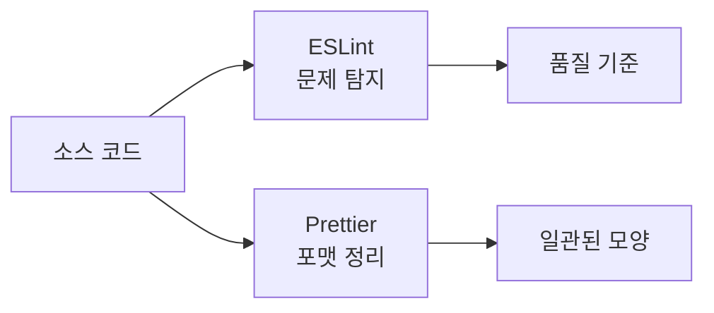

---
title: "코드 품질 기초 — 가독성, 리팩토링, ESLint, Prettier, Biome"
slug: code-quality-eslint-prettier-biome
category: study/engineering/code-quality
tags: [code-quality, refactoring, eslint, prettier, biome, lint, format]
author: Seobway
readTime: 12
featured: false
coverImage: /roadmap-thumbnails/step-03-code-quality.svg
createdAt: 2026-04-16
excerpt: >
  Foundation 03 단계에서 필요한 코드 품질의 기준을 정리한다. 가독성·리팩토링 사고법,
  ESLint와 Prettier의 역할 분리, Biome을 언제 고려하면 좋은지까지 한 번에 본다.
---

## 이 시리즈 구성

| 단계 | 포스트 | 내용 |
|---|---|---|
| 01 | [브라우저 & 클라이언트 →](/post/js-event-loop-and-async) | JS 비동기, React 설계, TypeScript |
| 02 | [서버 & 데이터 →](/post/js-runtime-node-bun-deno) | 런타임, HTTP, Hono, SQL |
| 03 | [코드 품질 →](/post/code-quality-eslint-prettier-biome) | 가독성, 리팩토링, ESLint, Prettier, Biome |
| 04 | [Git & 릴리즈 →](/post/git-branching-conventional-commits-husky) | 브랜치 전략, Conventional Commits, Husky |
| 05 | [UI & 스타일링 →](/post/modern-css-tailwind-shadcn) | 모던 CSS, Tailwind, shadcn/ui |
| 06 | [AI 코딩 도구 →](/post/ai-coding-tools-cursor-copilot-claude-code-mcp) | Cursor, Copilot, Claude Code, MCP |
| 07 | [DB & ORM →](/post/db-orm-postgres-drizzle-neon-supabase) | PostgreSQL, Drizzle, Neon, Supabase |

---

## 코드 품질은 "예쁘게 보이는 코드"가 아니다

코드 품질은 팀원이 코드를 읽고, 고치고, 안전하게 확장할 수 있는 정도다.

초반에는 성능 최적화보다 다음 질문이 더 중요하다.

- 이 함수가 무슨 일을 하는지 바로 보이는가
- 이름만 보고 역할을 추측할 수 있는가
- 같은 규칙으로 포맷팅되어 있는가
- 위험한 패턴을 도구가 미리 잡아 주는가

::: notice
Foundation 단계의 코드 품질 목표는 "완벽한 아키텍처"가 아니라 **읽히는 코드와 자동화된 기본 규칙**을 만드는 것이다.
:::

---

## 가독성은 이름과 구조에서 시작한다

가독성은 주석을 많이 쓰는 것이 아니다. 이름과 구조만 봐도 흐름이 보이게 만드는 것이다.

```ts
// 나쁜 예
function calc(a: number, b: number) {
  return a * b * 0.1
}

// 나은 예
function calculateDiscountAmount(price: number, quantity: number) {
  return price * quantity * 0.1
}
```

좋은 이름은 코드를 설명하고, 좋은 구조는 변경 범위를 줄인다.

---

## 리팩토링은 동작을 바꾸지 않고 구조를 바꾸는 일이다

리팩토링은 "대충 다시 짜기"가 아니다. **외부 동작은 유지하고 내부 구조만 개선**하는 작업이다.

처음에는 다음 정도만 해도 충분하다.

- 긴 함수를 작은 함수로 나눈다
- 중복 조건을 함수로 뺀다
- 의미 없는 변수명을 바꾼다
- 한 함수가 너무 많은 책임을 갖지 않게 한다

테스트가 있으면 리팩토링은 훨씬 안전해진다. 그래서 12단계 테스트 학습과도 연결된다.

---

## ESLint — 코드의 위험한 패턴을 잡는다

ESLint는 JavaScript/TypeScript 코드에서 잠재적 문제와 스타일 규칙 위반을 찾아 주는 린터다.<a href="https://eslint.org/docs/latest/use/getting-started" target="_blank"><sup>[1]</sup></a>

예를 들어:

- 사용하지 않는 변수
- 실수하기 쉬운 조건문
- 팀에서 금지한 문법
- React Hooks 규칙 위반

ESLint는 "코드를 어떻게 줄 맞출까"보다 **무엇이 위험한 코드인가**에 더 가깝다.

---

## Prettier — 포맷팅 논쟁을 끝낸다

Prettier는 코드 포매터다.<a href="https://prettier.io/docs/en/why-prettier" target="_blank"><sup>[2]</sup></a>

주요 역할은 단순하다.

- 줄바꿈
- 들여쓰기
- 따옴표 스타일
- trailing comma

즉 Prettier는 "누가 어떤 스타일을 좋아하느냐"를 토론하지 않게 해 준다.

---

## ESLint와 Prettier는 역할이 다르다

| 도구 | 주 역할 |
|--|--|
| ESLint | 코드 품질·버그 가능성·규칙 위반 탐지 |
| Prettier | 코드 포맷 자동 정리 |

둘을 섞어서 생각하면 설정이 복잡해진다. 초반에는 "ESLint는 위험한 코드, Prettier는 모양"으로 나눠 이해하면 좋다.



---

## Biome — 린터와 포매터를 한 도구로

Biome은 formatter, linter 등 프론트엔드 툴링을 빠르게 통합하려는 도구다.<a href="https://biomejs.dev/guides/getting-started/" target="_blank"><sup>[3]</sup></a>

Biome을 고려할 만한 경우:

- 설정을 단순하게 유지하고 싶다
- 포맷과 린트를 한 도구로 처리하고 싶다
- 빠른 실행 속도가 중요하다

다만 이미 팀에 ESLint/Prettier 설정이 잘 잡혀 있다면, 무조건 바꿀 필요는 없다.

---

## Foundation 단계의 추천 순서

1. Prettier로 포맷팅을 자동화한다
2. ESLint로 위험한 패턴을 잡는다
3. 팀 규칙이 커지면 설정을 정리한다
4. 새 프로젝트라면 Biome도 후보로 비교한다

::: tip
처음부터 규칙을 많이 켜기보다, **자동 저장 시 포맷팅 + 커밋 전 린트**만 안정적으로 돌아가게 해도 코드 품질 체감이 크게 올라간다.
:::

---

## 조금 더 깊게 보기

### 코드 품질은 미래의 변경 비용이다

품질이 낮은 코드는 당장 실행될 수는 있다. 하지만 다음 수정에서 비용을 폭발시킨다. 이름이 불명확하고, 함수가 길고, 조건문이 중첩되고, 포맷이 제각각이면 작은 변경도 무섭게 느껴진다.

### 도구가 해결하는 것과 못 하는 것

Prettier는 코드 모양을 맞춘다. ESLint는 위험한 패턴을 잡는다. Biome은 이 둘을 빠르게 통합하려는 선택지다. 하지만 이 도구들은 "왜 이 함수가 존재하는가"나 "이 책임이 여기 있는 게 맞는가"까지 자동으로 해결하지는 못한다.

### 리팩토링의 기준

리팩토링은 예쁘게 고치는 작업이 아니라 변경을 쉽게 만드는 작업이다. 같은 조건이 반복되면 함수로 빼고, 같은 데이터 조립이 반복되면 타입과 유틸로 묶고, 한 함수가 여러 일을 하면 책임을 나눈다. 이때 테스트가 있으면 리팩토링은 훨씬 안전해진다.

### 실무 적용 팁

팀 프로젝트에서는 먼저 포맷팅을 자동화한다. 그다음 lint를 CI에 붙인다. 마지막으로 규칙을 조금씩 강화한다. 처음부터 강한 규칙을 너무 많이 켜면 팀이 도구를 불편하게 느끼고 우회하기 시작한다.

## 참고

<ol>
<li><a href="https://eslint.org/docs/latest/use/getting-started" target="_blank">[1] ESLint Docs — Getting Started</a></li>
<li><a href="https://prettier.io/docs/en/why-prettier" target="_blank">[2] Prettier Docs — Why Prettier?</a></li>
<li><a href="https://biomejs.dev/guides/getting-started/" target="_blank">[3] Biome Docs — Getting Started</a></li>
<li><a href="https://refactoring.guru/refactoring/what-is-refactoring" target="_blank">[4] Refactoring.Guru — What is Refactoring?</a></li>
</ol>

---

## 관련 글

- [Git & 릴리즈 기초 →](/post/git-branching-conventional-commits-husky)
- [AI 웹개발자 로드맵 — Foundation 01~07 →](/post/ai-webdev-roadmap-foundation)
