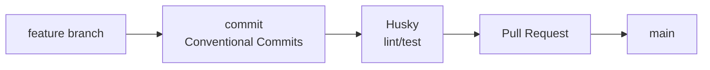

## Git은 저장 도구가 아니라 협업 프로토콜이다

Git을 처음 배울 때는 `add`, `commit`, `push`만 외우기 쉽다.

하지만 실무에서 중요한 것은 **어떤 단위로 작업을 나누고, 어떤 규칙으로 합치고, 어떤 기준으로 릴리즈할 것인가**다.

---

## 브랜치 전략은 팀의 배포 리듬을 반영한다

대표적으로 많이 비교하는 방식은 GitHub Flow와 Gitflow다.

### GitHub Flow

GitHub Flow는 `main` 브랜치를 항상 배포 가능한 상태로 두고, 짧은 기능 브랜치를 만들어 PR로 합치는 방식이다.<a href="https://docs.github.com/en/get-started/using-github/github-flow" target="_blank"><sup>[1]</sup></a>

잘 맞는 경우:

- 배포가 자주 일어난다
- 기능 단위가 작다
- PR 리뷰 중심으로 협업한다

### Gitflow

Gitflow는 `main`, `develop`, `feature`, `release`, `hotfix` 등 여러 브랜치를 나누는 방식이다. Atlassian도 Gitflow를 별도 워크플로로 설명한다.<a href="https://www.atlassian.com/git/tutorials/comparing-workflows/gitflow-workflow" target="_blank"><sup>[2]</sup></a>

잘 맞는 경우:

- 릴리즈 주기가 명확하다
- 버전별 유지보수가 필요하다
- QA/release 브랜치가 따로 필요하다

::: notice
초반 개인 프로젝트나 작은 팀에서는 Gitflow보다 **짧은 브랜치 + PR + main 보호**가 더 단순한 경우가 많다. 전략은 멋있는 이름보다 팀의 배포 리듬에 맞아야 한다.
:::

---

## Conventional Commits는 커밋 메시지의 약속이다

Conventional Commits는 커밋 메시지를 일정한 형식으로 쓰는 규칙이다.<a href="https://www.conventionalcommits.org/en/v1.0.0/" target="_blank"><sup>[3]</sup></a>

```text
feat: add login form
fix: handle empty profile response
docs: update setup guide
refactor: split user service
```

기본 구조는 다음과 같다.

```text
type(scope): description
```

자주 쓰는 type:

- `feat`: 기능 추가
- `fix`: 버그 수정
- `docs`: 문서 수정
- `refactor`: 동작 변화 없는 구조 개선
- `test`: 테스트 추가/수정
- `chore`: 기타 작업

---

## 왜 커밋 메시지 규칙이 중요한가

커밋 메시지는 나중에 읽는 사람에게 "왜 바뀌었는지"를 알려 주는 기록이다.

규칙이 있으면 다음이 쉬워진다.

- 변경 이력 검색
- CHANGELOG 생성
- 버전 관리 자동화
- PR 리뷰 맥락 파악

즉 커밋 메시지는 단순 메모가 아니라 릴리즈 시스템의 입력값이 될 수 있다.

---

## Husky는 Git 훅을 쉽게 관리하게 해 준다

Git 훅은 커밋, 푸시 같은 Git 이벤트 전후에 스크립트를 실행하는 기능이다.

Husky는 이 Git 훅을 프로젝트에서 쉽게 관리하게 해 주는 도구다.<a href="https://typicode.github.io/husky/get-started.html" target="_blank"><sup>[4]</sup></a>

예를 들어 커밋 전에 다음을 실행할 수 있다.

```bash
npm run lint
npm run test
```

이렇게 하면 깨진 코드를 커밋하기 전에 한 번 더 막을 수 있다.

---

## 추천 흐름



Foundation 단계에서는 다음 정도면 충분하다.

1. 작업마다 작은 브랜치를 만든다
2. 커밋 메시지는 Conventional Commits로 쓴다
3. 커밋 전에 lint/format을 자동 실행한다
4. PR에서 변경 이유와 테스트 결과를 남긴다

::: tip
브랜치 전략은 복잡할수록 좋은 것이 아니다. **작게 만들고, 자주 합치고, 자동 검증을 걸어두는 것**이 초반에는 가장 강력하다.
:::

---

## 참고

<ol>
<li><a href="https://docs.github.com/en/get-started/using-github/github-flow" target="_blank">[1] GitHub Docs — GitHub Flow</a></li>
<li><a href="https://www.atlassian.com/git/tutorials/comparing-workflows/gitflow-workflow" target="_blank">[2] Atlassian Git Tutorial — Gitflow Workflow</a></li>
<li><a href="https://www.conventionalcommits.org/en/v1.0.0/" target="_blank">[3] Conventional Commits 1.0.0 Specification</a></li>
<li><a href="https://typicode.github.io/husky/get-started.html" target="_blank">[4] Husky Docs — Get Started</a></li>
<li><a href="https://git-scm.com/book/en/v2" target="_blank">[5] Pro Git Book — git-scm.com</a></li>
</ol>

---

## 관련 글

- [코드 품질 기초 →](/post/code-quality-eslint-prettier-biome)
- [AI 웹개발자 로드맵 — Foundation 01~07 →](/post/ai-webdev-roadmap-foundation)
