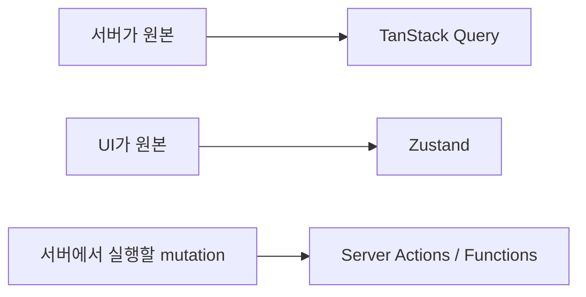

---
title: "상태 & 데이터 페칭 — TanStack Query, Zustand, Server Actions"
slug: state-data-fetching-tanstack-zustand-server-actions
category: study/frontend/data-fetching
tags: [tanstack-query, zustand, server-actions, react, state-management]
author: Seobway
readTime: 12
featured: false
coverImage: /roadmap-thumbnails/step-08-state-data.svg
createdAt: 2026-04-16
excerpt: >
  Building 08 단계. 서버 상태와 클라이언트 상태를 구분하고, TanStack Query,
  Zustand, React Server Functions/Actions를 어떤 역할로 보면 좋은지 정리한다.
---

## 이 시리즈 구성

| 단계 | 포스트 | 내용 |
|---|---|---|
| 08 | [상태 & 데이터 페칭 →](/post/state-data-fetching-tanstack-zustand-server-actions) | TanStack Query, Zustand, Server Actions |
| 09 | [API 설계 →](/post/api-design-rest-openapi-rpc-server-actions) | REST 원칙, OpenAPI, RPC |
| 10 | [인증 & 보안 →](/post/auth-security-authjs-owasp-passkeys) | Auth.js, OWASP, 패스키 |
| 11 | [요구사항 분석 →](/post/requirements-spec-user-story-tradeoff) | Spec, 유저 스토리, 기술 선택 |
| 12 | [테스트 →](/post/testing-vitest-playwright) | 테스트 사고법, Vitest, Playwright |
| 13 | [Context Engineering →](/post/context-engineering-prompts-rules-memory-skills) | 프롬프트, Rules, 메모리, Skill |
| 14 | [빌드 · 성능 · a11y →](/post/build-performance-a11y-vite-turbopack-lighthouse-wcag) | Vite, Turbopack, Lighthouse, WCAG |

---

## 상태를 먼저 나눠야 한다

프론트엔드 상태 관리는 "어떤 라이브러리가 더 좋은가"보다 먼저 **상태의 성격**을 나누는 일이 중요하다.

- 서버 상태: 서버가 원본인 데이터
- 클라이언트 상태: UI가 원본인 데이터
- 서버 실행 액션: 폼 제출이나 mutation을 서버 함수로 처리하는 흐름

::: notice
TanStack Query와 Zustand는 경쟁 관계라기보다 역할이 다르다. 서버에서 온 데이터는 TanStack Query, 모달 열림이나 탭 선택 같은 UI 상태는 Zustand가 자연스럽다.
:::

---

## TanStack Query — 서버 상태

TanStack Query는 서버 상태를 가져오고 캐싱하고 다시 동기화하는 도구다.<a href="https://tanstack.com/query/latest/docs/framework/react/overview" target="_blank"><sup>[1]</sup></a>

```tsx
const { data, isLoading, error } = useQuery({
  queryKey: ['posts'],
  queryFn: fetchPosts,
})
```

핵심은 `fetch`를 감싸는 것이 아니라, stale time, cache, refetch, mutation, optimistic update 같은 서버 상태 문제를 해결한다는 점이다.

기존 심화 글:

- [TanStack Query 개요 →](/post/react-query-overview)
- [useQuery 심층 →](/post/react-query-queries)
- [useMutation 심층 →](/post/react-query-mutations)

---

## Zustand — 클라이언트 상태

Zustand는 가벼운 클라이언트 상태 관리 라이브러리다.<a href="https://zustand.docs.pmnd.rs/getting-started/introduction" target="_blank"><sup>[2]</sup></a>

```ts
const useUIStore = create((set) => ({
  isSidebarOpen: true,
  toggleSidebar: () => set((state) => ({ isSidebarOpen: !state.isSidebarOpen })),
}))
```

서버 데이터 저장소로 쓰기보다, UI 상태나 앱 내부 상태에 쓰는 편이 좋다.

---

## Server Actions / Server Functions

React 문서에서는 Server Functions가 Client Component에서 서버의 async 함수를 호출할 수 있게 한다고 설명한다.<a href="https://react.dev/reference/rsc/server-functions" target="_blank"><sup>[3]</sup></a>

폼 제출, 서버 mutation, 점진적 향상과 잘 맞지만, 프레임워크 지원과 서버 환경을 함께 봐야 한다.

---

## 선택 기준



---

## 조금 더 깊게 보기

### 상태 관리는 저장소 선택 문제가 아니다

초보자는 상태 관리라고 하면 Redux, Zustand, TanStack Query 같은 라이브러리 이름부터 떠올린다. 하지만 실무에서 먼저 해야 할 일은 상태를 분류하는 것이다. 서버가 원본인지, 브라우저 UI가 원본인지, URL이 원본인지, 폼이 잠시 들고 있는 값인지에 따라 답이 달라진다.

### 서버 상태의 어려움

서버 상태는 단순히 `fetch`로 가져온 데이터가 아니다. 오래됐는지, 다시 가져와야 하는지, 실패했는지, 로딩 중인지, 다른 화면에서도 같은 캐시를 써야 하는지 같은 문제가 붙는다. TanStack Query는 이 문제들을 체계적으로 다룬다.

### Zustand를 남용하면 생기는 문제

Zustand는 간단하고 강력하지만, 서버 데이터를 전역 store에 무조건 넣으면 캐싱, refetch, invalidation을 직접 구현해야 한다. 그 순간 TanStack Query가 해결하던 문제를 다시 만들게 된다. Zustand는 UI 상태, 임시 클라이언트 상태, 앱 내부 preference에 더 잘 맞는다.

### Server Actions를 볼 때의 기준

Server Actions는 mutation 흐름을 단순하게 만들 수 있지만, 프레임워크와 서버 환경에 강하게 묶인다. 공개 API가 필요한지, 앱 내부 폼 처리인지, optimistic update가 필요한지에 따라 선택이 달라진다.

---

## 실전 적용 시나리오

게시글 목록 화면을 만든다고 하자. 게시글 목록 데이터는 서버가 원본이므로 TanStack Query가 가져오고 캐싱한다. 검색어는 URL query string에 두면 공유 가능한 화면이 된다. 사이드바 열림 여부나 선택된 탭은 Zustand나 컴포넌트 state로 충분하다.

게시글 작성은 mutation이다. 작성 성공 후에는 `posts` query를 invalidate하거나 새 게시글을 캐시에 반영한다. 이때 폼 제출을 Server Action으로 처리할지, 클라이언트 mutation으로 처리할지는 앱 구조에 따라 다르다. Next.js App Router처럼 서버 액션이 자연스러운 환경이면 Server Action이 좋고, 클라이언트 중심 SPA라면 TanStack Query mutation이 더 직관적일 수 있다.

### 판단 기준

상태의 원본이 어디인지 계속 묻는다. 서버가 원본이면 query, 브라우저 UI가 원본이면 local/client state, URL이 원본이면 router state다. 이 질문 하나가 상태관리 혼란을 크게 줄인다.

## 참고

<ol>
<li><a href="https://tanstack.com/query/latest/docs/framework/react/overview" target="_blank">[1] TanStack Query Docs — Overview</a></li>
<li><a href="https://zustand.docs.pmnd.rs/getting-started/introduction" target="_blank">[2] Zustand Docs — Introduction</a></li>
<li><a href="https://react.dev/reference/rsc/server-functions" target="_blank">[3] React Docs — Server Functions</a></li>
<li><a href="https://react.dev/reference/react/useActionState" target="_blank">[4] React Docs — useActionState</a></li>
</ol>

---

## 관련 글

- [TanStack Query 개요 →](/post/react-query-overview)
- [useMutation 심층 →](/post/react-query-mutations)
- [React 단방향 데이터 흐름 →](/post/react-component-data-flow)
- [AI 웹개발자 로드맵 — Foundation 01~19 →](/post/ai-webdev-roadmap-foundation)
