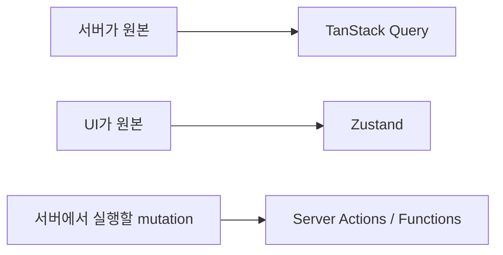

## 상태를 먼저 나눠야 한다

프론트엔드 상태 관리는 "어떤 라이브러리가 더 좋은가"보다 먼저 **상태의 성격**을 나누는 일이 중요하다.

- 서버 상태: 서버가 원본인 데이터
- 클라이언트 상태: UI가 원본인 데이터
- 서버 실행 액션: 폼 제출이나 mutation을 서버 함수로 처리하는 흐름

::: notice
TanStack Query와 Zustand는 경쟁 관계라기보다 역할이 다르다. 서버에서 온 데이터는 TanStack Query, 모달 열림이나 탭 선택 같은 UI 상태는 Zustand가 자연스럽다.
:::

---

## TanStack Query — 서버 상태

TanStack Query는 서버 상태를 가져오고 캐싱하고 다시 동기화하는 도구다.<a href="https://tanstack.com/query/latest/docs/framework/react/overview" target="_blank"><sup>[1]</sup></a>

```tsx
const { data, isLoading, error } = useQuery({
  queryKey: ['posts'],
  queryFn: fetchPosts,
})
```

핵심은 `fetch`를 감싸는 것이 아니라, stale time, cache, refetch, mutation, optimistic update 같은 서버 상태 문제를 해결한다는 점이다.

기존 심화 글:

- [TanStack Query 개요 →](/post/react-query-overview)
- [useQuery 심층 →](/post/react-query-queries)
- [useMutation 심층 →](/post/react-query-mutations)

---

## Zustand — 클라이언트 상태

Zustand는 가벼운 클라이언트 상태 관리 라이브러리다.<a href="https://zustand.docs.pmnd.rs/getting-started/introduction" target="_blank"><sup>[2]</sup></a>

```ts
const useUIStore = create((set) => ({
  isSidebarOpen: true,
  toggleSidebar: () => set((state) => ({ isSidebarOpen: !state.isSidebarOpen })),
}))
```

서버 데이터 저장소로 쓰기보다, UI 상태나 앱 내부 상태에 쓰는 편이 좋다.

---

## Server Actions / Server Functions

React 문서에서는 Server Functions가 Client Component에서 서버의 async 함수를 호출할 수 있게 한다고 설명한다.<a href="https://react.dev/reference/rsc/server-functions" target="_blank"><sup>[3]</sup></a>

폼 제출, 서버 mutation, 점진적 향상과 잘 맞지만, 프레임워크 지원과 서버 환경을 함께 봐야 한다.

---

## 선택 기준



---

## 참고

<ol>
<li><a href="https://tanstack.com/query/latest/docs/framework/react/overview" target="_blank">[1] TanStack Query Docs — Overview</a></li>
<li><a href="https://zustand.docs.pmnd.rs/getting-started/introduction" target="_blank">[2] Zustand Docs — Introduction</a></li>
<li><a href="https://react.dev/reference/rsc/server-functions" target="_blank">[3] React Docs — Server Functions</a></li>
<li><a href="https://react.dev/reference/react/useActionState" target="_blank">[4] React Docs — useActionState</a></li>
</ol>

---

## 관련 글

- [TanStack Query 개요 →](/post/react-query-overview)
- [useMutation 심층 →](/post/react-query-mutations)
- [React 단방향 데이터 흐름 →](/post/react-component-data-flow)
- [AI 웹개발자 로드맵 — Foundation 01~19 →](/post/ai-webdev-roadmap-foundation)
