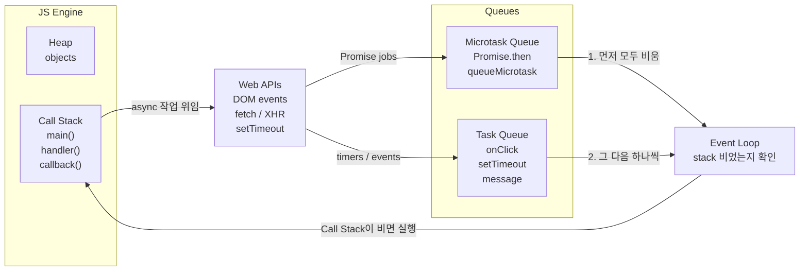

---
title: "JS 이벤트 루프와 비동기 — 콜스택, 큐, 마이크로태스크를 한 번에 이해하기"
slug: js-event-loop-and-async
category: study/frontend/javascript
tags: [javascript, event-loop, async, call-stack, microtask, macrotask, promise]
author: Seobway
readTime: 11
featured: false
coverImage: /roadmap-thumbnails/step-01-browser-client.svg
createdAt: 2026-04-16
excerpt: >
  JavaScript의 콜스택, Web APIs, 태스크 큐, 마이크로태스크 큐가 어떻게 맞물려
  돌아가는지 큰 그림으로 정리한다. 비동기 실행 순서를 예측하기 위한 출발점이다.
---

## 이 시리즈 구성

| 포스트 | 내용 |
|---|---|
| [로드맵 인덱스 →](/post/ai-webdev-roadmap-foundation) | 01~19 전체 학습 경로 |
| [01-1. JS 이벤트 루프와 비동기 →](/post/js-event-loop-and-async) | 콜스택, 큐, 마이크로태스크 |
| [01-2. setTimeout vs Promise →](/post/settimeout-vs-promise) | 비동기 실행 순서 예측 |
| [01-3. React 단방향 데이터 흐름 →](/post/react-component-data-flow) | props/state, state 끌어올리기 |
| [01-4. controlled vs uncontrolled →](/post/react-controlled-vs-uncontrolled) | React 폼 설계 |
| [01-5. TypeScript 타입 시스템 기초 →](/post/typescript-type-system-basics) | any, unknown, union, narrowing |

---

## 왜 이벤트 루프부터 공부해야 하는가

JavaScript는 한 번에 여러 줄을 동시에 실행하는 언어처럼 보일 때가 많다.

하지만 실제로는 **한 시점에 한 작업씩** 처리한다. 그럼에도 `setTimeout`, `fetch`, `Promise`가 동시에 돌아가는 것처럼 보이는 이유는, JavaScript 엔진 밖의 환경과 **이벤트 루프**가 협력하기 때문이다.

이 구조를 모르고 비동기를 다루면 "왜 이 콜백이 먼저 실행됐지?"를 외워서만 풀게 된다.

---

## 큰 그림 — 콜스택과 큐



핵심은 네 가지다.

- **콜스택**: 지금 실행 중인 함수가 쌓이는 곳
- **런타임 API**: 타이머, 네트워크, DOM 이벤트 같은 작업을 처리하는 환경
- **태스크 큐**: `setTimeout`, DOM 이벤트 같은 작업이 대기하는 곳
- **마이크로태스크 큐**: `Promise.then`, `queueMicrotask` 같은 더 우선순위 높은 작업이 대기하는 곳

---

## 콜스택은 지금 실행 중인 일감이다

```js
function a() {
  console.log('a 시작')
  b()
  console.log('a 끝')
}

function b() {
  console.log('b 실행')
}

a()
```

실행 순서는 이렇다.

1. `a()`가 스택에 들어간다
2. `b()`가 스택 위에 추가된다
3. `b()`가 끝나며 빠진다
4. `a()`가 끝나며 빠진다

즉 JavaScript는 **스택 위의 함수가 완전히 끝날 때까지** 다음 일을 하지 않는다.

---

## 비동기 작업은 엔진 밖에서 기다린다

```js
console.log('1')

setTimeout(() => {
  console.log('2')
}, 0)

console.log('3')
```

출력은 `1`, `3`, `2`다.

이유는 `setTimeout` 콜백이 즉시 실행되는 것이 아니라, 타이머 등록만 해 두고 런타임으로 넘어가기 때문이다. 현재 스택이 모두 비워진 뒤에야 큐에 들어온 콜백을 다시 실행할 수 있다.

::: notice
`setTimeout(..., 0)`은 "즉시 실행"이 아니라 **가장 빨리 가능한 다음 턴에 실행**에 가깝다. 현재 스택이 비지 않으면 절대 먼저 끼어들 수 없다.
:::

---

## 마이크로태스크가 태스크보다 먼저다

가장 자주 헷갈리는 부분이 여기다.

```js
console.log('1')

setTimeout(() => console.log('2'), 0)

Promise.resolve().then(() => console.log('3'))

console.log('4')
```

출력은 `1`, `4`, `3`, `2`다.

이유는 다음 순서 때문이다.

1. 동기 코드 실행
2. 콜스택이 빈다
3. **마이크로태스크 큐를 먼저 모두 비운다**
4. 그 다음 태스크 큐에서 하나를 가져온다

즉 `Promise.then()`은 `setTimeout`보다 먼저 실행된다.

---

## 이벤트 루프는 무엇을 반복하는가

이벤트 루프는 단순히 "반복문"이 아니라 다음 규칙으로 이해하면 좋다.

1. 콜스택이 비었는지 확인한다
2. 비었다면 마이크로태스크 큐를 먼저 비운다
3. 그다음 태스크 큐에서 작업 하나를 가져온다
4. 다시 1번으로 돌아간다

이 규칙 하나만 기억해도 대부분의 입문 문제를 설명할 수 있다.

---

## 브라우저에서 자주 보는 비동기 작업

- `setTimeout`, `setInterval`
- `fetch`
- 클릭, 입력, 스크롤 같은 DOM 이벤트
- `Promise.then`, `catch`, `finally`
- `queueMicrotask`

이 중에서 **Promise 계열은 마이크로태스크**, 타이머와 이벤트는 보통 **태스크**로 생각하면 된다.

---

## React와 연결해서 보면 왜 중요한가

React에서도 상태 업데이트, effect, 비동기 데이터 로딩이 전부 이벤트 루프 위에서 움직인다.

예를 들어 어떤 버튼 클릭 핸들러 안에서 동기 로그, Promise 콜백, 타이머가 같이 있다면 실행 순서를 모르면 렌더링 타이밍을 헷갈리기 쉽다. 그래서 React를 배우기 전에 JavaScript 비동기 큰 그림을 먼저 잡는 것이 좋다.

::: tip
이 글을 읽은 뒤에는 바로 [setTimeout vs Promise 실행 순서 →](/post/settimeout-vs-promise)로 넘어가서, 코드를 보고 **출력 순서를 먼저 맞혀 보는 연습**을 해 보는 편이 가장 좋다.
:::

---

## 마치며

비동기는 "동시에 실행된다"가 아니라, **다른 곳에서 기다리다가 적절한 순간 다시 스택에 들어온다**로 이해하면 정리가 된다.

콜스택, 마이크로태스크 큐, 태스크 큐의 우선순위를 머릿속에 두면, 이후 `fetch`, React 상태 업데이트, Node.js 이벤트 루프까지 훨씬 쉽게 이어진다.

## 조금 더 깊게 보기

### 비개발자 관점으로 다시 보기

이벤트 루프는 식당의 주문 처리 방식과 비슷하다. 주방장은 한 번에 한 접시만 만들 수 있지만, 주문을 받는 직원은 예약, 배달, 결제 요청을 따로 받아 둔다. 주방장이 지금 만들던 접시를 끝내면, 대기열에서 다음 일을 꺼낸다. JavaScript의 콜스택은 주방장이 지금 만들고 있는 접시이고, 큐는 기다리는 주문표다.

### 개발자가 실제로 얻어야 할 감각

프론트엔드 버그 중 상당수는 데이터가 틀린 것이 아니라 **타이밍을 잘못 예상해서** 생긴다. 클릭 핸들러 안에서 상태를 바꾸고, Promise 콜백에서 다시 상태를 바꾸고, 타이머로 UI를 닫는 코드가 섞이면 화면은 개발자의 기대와 다르게 움직인다.

### 실무에서 자주 터지는 함정

가장 흔한 함정은 `setTimeout(..., 0)`을 즉시 실행으로 착각하는 것이다. 0ms는 "지금 실행"이 아니라 "현재 콜스택과 먼저 처리할 마이크로태스크가 끝난 뒤 가능한 빨리"라는 뜻이다.

---

## 참고

<ol>
<li><a href="https://developer.mozilla.org/en-US/docs/Web/API/HTML_DOM_API/Microtask_guide/In_depth" target="_blank">[1] MDN — In depth: Microtasks and the JavaScript runtime environment</a></li>
<li><a href="https://nodejs.org/learn/asynchronous-work/the-nodejs-event-loop" target="_blank">[2] Node.js Learn — The Node.js Event Loop</a></li>
</ol>

---

## 관련 글

- [setTimeout vs Promise 실행 순서 →](/post/settimeout-vs-promise)
- [Node.js · Bun · Deno 런타임 비교 →](/post/js-runtime-node-bun-deno)
- [React 단방향 데이터 흐름 →](/post/react-component-data-flow)
- [AI 웹개발자 로드맵 — Foundation 01~19 →](/post/ai-webdev-roadmap-foundation)
