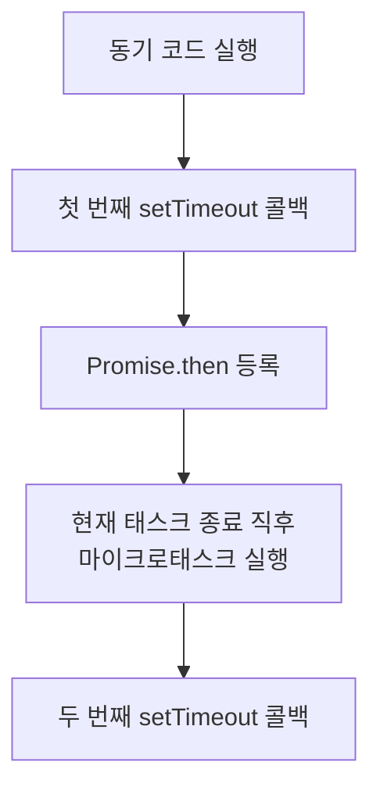

---
title: "setTimeout vs Promise — 실행 순서를 예측하는 가장 중요한 연습"
slug: settimeout-vs-promise
category: study/frontend/javascript
tags: [javascript, setTimeout, promise, microtask, macrotask, event-loop]
author: Seobway
readTime: 10
featured: false
coverImage: /roadmap-thumbnails/step-01-browser-client.svg
createdAt: 2026-04-16
excerpt: >
  setTimeout과 Promise.then이 함께 있을 때 어떤 순서로 실행되는지 예제로 익힌다.
  마이크로태스크와 태스크의 우선순위를 손으로 예측하는 연습용 글이다.
---

## 이 시리즈 구성

| 포스트 | 내용 |
|---|---|
| [로드맵 인덱스 →](/post/ai-webdev-roadmap-foundation) | 01~19 전체 학습 경로 |
| [01-1. JS 이벤트 루프와 비동기 →](/post/js-event-loop-and-async) | 콜스택, 큐, 마이크로태스크 |
| [01-2. setTimeout vs Promise →](/post/settimeout-vs-promise) | 비동기 실행 순서 예측 |
| [01-3. React 단방향 데이터 흐름 →](/post/react-component-data-flow) | props/state, state 끌어올리기 |
| [01-4. controlled vs uncontrolled →](/post/react-controlled-vs-uncontrolled) | React 폼 설계 |
| [01-5. TypeScript 타입 시스템 기초 →](/post/typescript-type-system-basics) | any, unknown, union, narrowing |

---

## 왜 이 문제를 따로 연습해야 하는가

이벤트 루프를 글로 이해했다고 해서, 실제 코드의 실행 순서를 바로 예측할 수 있는 것은 아니다.

특히 많은 사람이 여기서 헷갈린다.

- `setTimeout(..., 0)`이면 바로 실행되는가
- `Promise.then()`은 언제 끼어드는가
- Promise 안의 `setTimeout`과 setTimeout 안의 Promise는 누가 먼저인가

이 글은 그 감각을 짧은 예제로 잡는 데 집중한다.

---

## 규칙 하나 먼저

먼저 이 규칙만 고정해 두자.

1. 동기 코드를 먼저 끝낸다
2. 콜스택이 비면 **마이크로태스크**를 먼저 모두 처리한다
3. 그다음 **태스크**를 처리한다

여기서 보통

- `Promise.then`, `catch`, `finally` → 마이크로태스크
- `setTimeout`, DOM 이벤트 → 태스크

로 보면 된다.

---

## 예제 1 — 가장 기본

```js
console.log('A')

setTimeout(() => {
  console.log('B')
}, 0)

Promise.resolve().then(() => {
  console.log('C')
})

console.log('D')
```

정답은 `A`, `D`, `C`, `B`다.

이유:

- `A`, `D`는 동기 코드라서 먼저 실행
- Promise 콜백 `C`는 마이크로태스크
- 타이머 콜백 `B`는 태스크

---

## 예제 2 — Promise 안에 setTimeout

```js
console.log('1')

Promise.resolve().then(() => {
  console.log('2')
  setTimeout(() => console.log('3'), 0)
})

setTimeout(() => console.log('4'), 0)

console.log('5')
```

정답은 `1`, `5`, `2`, `4`, `3`이다.

왜 그런가:

1. 동기 코드 `1`, `5`
2. 마이크로태스크 `2`
3. 그 안에서 새 `setTimeout`이 등록됨
4. 태스크 큐에는 먼저 등록된 `4`, 그다음 `3`

즉 **태스크끼리는 먼저 들어온 것이 먼저 실행**된다.

---

## 예제 3 — setTimeout 안에 Promise

```js
console.log('a')

setTimeout(() => {
  console.log('b')
  Promise.resolve().then(() => console.log('c'))
}, 0)

setTimeout(() => console.log('d'), 0)

console.log('e')
```

정답은 `a`, `e`, `b`, `c`, `d`다.

핵심은 첫 번째 타이머 콜백 안에서 `Promise.then()`이 등록되면, 그 타이머 콜백이 끝난 직후 **마이크로태스크인 `c`를 먼저 처리**한다는 점이다.



---

## 예제 4 — 마이크로태스크는 모두 비운다

```js
console.log('start')

Promise.resolve().then(() => {
  console.log('m1')
  Promise.resolve().then(() => console.log('m2'))
})

setTimeout(() => console.log('t1'), 0)
```

정답은 `start`, `m1`, `m2`, `t1`이다.

마이크로태스크를 하나만 처리하고 끝내는 것이 아니라, **큐가 빌 때까지** 계속 처리한다.

::: warning
그래서 마이크로태스크를 너무 많이 연쇄 등록하면, 태스크 큐에 있는 작업들이 계속 밀릴 수 있다. "Promise는 가볍다"만 기억하면 이 부분을 놓치기 쉽다.
:::

---

## 실전에서 어떻게 써먹는가

이 연습은 단순 콘솔 문제 풀이가 아니다.

- React 이벤트 핸들러 뒤에 붙는 비동기 흐름 이해
- 테스트 코드에서 비동기 완료 시점 예측
- 타이머와 API 응답, 상태 업데이트가 섞일 때 디버깅

여기서 막히면 "렌더링 버그"처럼 보이는 문제도 사실은 이벤트 루프 이해 부족인 경우가 많다.

---

## 연습 방법

가장 좋은 연습은 다음 순서다.

1. 코드를 본다
2. 출력 순서를 종이에 적는다
3. 이유를 "동기 → 마이크로태스크 → 태스크"로 설명한다
4. 실제 실행 결과와 비교한다

설명을 못 하면 아직 외운 것이다. 설명이 되면 이해한 것이다.

::: tip
다음 단계에서는 각 예제를 Node.js 콘솔이나 브라우저 콘솔에서 직접 돌려 보자. "왜 그런지"를 말로 설명할 수 있을 때 비동기 기초가 훨씬 단단해진다.
:::

## 조금 더 깊게 보기

### 왜 이 문제는 면접 단골인가

`setTimeout`과 `Promise` 실행 순서는 단순 암기 문제가 아니다. 이 문제는 지원자가 JavaScript를 "위에서 아래로만 실행되는 코드"로 보는지, 아니면 런타임과 큐까지 포함한 실행 모델로 이해하는지 확인하기 좋다.

### 개발자가 주의해야 할 포인트

실무에서는 이 순서가 테스트에서 많이 드러난다. 컴포넌트 테스트에서 클릭 직후 바로 값을 확인하면 아직 Promise 콜백이 반영되지 않았을 수 있다. 반대로 타이머 기반 UI는 fake timer를 쓰지 않으면 테스트가 불안정해진다.

### 디버깅 팁

비동기 순서가 헷갈릴 때는 로그에 숫자만 찍지 말고 "sync start", "microtask", "timer"처럼 큐의 성격을 같이 적는다. 등록 순서와 실행 우선순위는 다르다.

---

## 참고

<ol>
<li><a href="https://developer.mozilla.org/en-US/docs/Web/API/HTML_DOM_API/Microtask_guide/In_depth" target="_blank">[1] MDN — In depth: Microtasks and the JavaScript runtime environment</a></li>
<li><a href="https://developer.mozilla.org/en-US/docs/Web/JavaScript/Reference/Global_Objects/Promise" target="_blank">[2] MDN — Promise</a></li>
</ol>

---

## 관련 글

- [JS 이벤트 루프와 비동기 큰 그림 →](/post/js-event-loop-and-async)
- [React 단방향 데이터 흐름 →](/post/react-component-data-flow)
- [Node.js · Bun · Deno 런타임 비교 →](/post/js-runtime-node-bun-deno)
- [AI 웹개발자 로드맵 — Foundation 01~19 →](/post/ai-webdev-roadmap-foundation)
