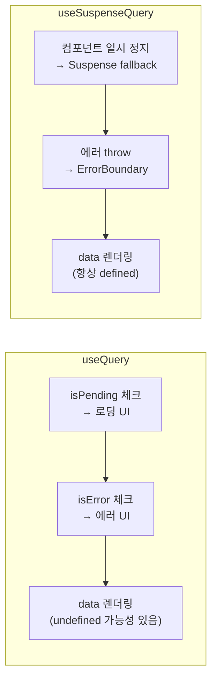
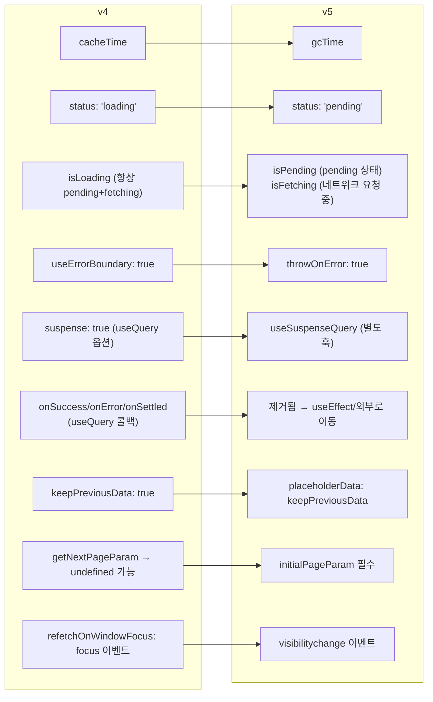

## useInfiniteQuery — 무한 스크롤 / Load More

페이지별 데이터를 순차적으로 로드한다. v5에서 `initialPageParam`이 필수가 됐다.<a href="https://tanstack.com/query/latest/docs/framework/react/guides/infinite-queries" target="_blank"><sup>[1]</sup></a>

```tsx
import { useInfiniteQuery } from '@tanstack/react-query'

function InfiniteTodoList() {
  const {
    data,
    fetchNextPage,
    fetchPreviousPage,
    hasNextPage,
    hasPreviousPage,
    isFetchingNextPage,
    isFetchingPreviousPage,
    status,
  } = useInfiniteQuery({
    queryKey: ['todos', 'infinite'],
    queryFn: ({ pageParam }) =>
      fetch(`/api/todos?cursor=${pageParam}`).then(res => res.json()),

    // v5 필수 — 초기 pageParam 명시 (v4에서는 undefined가 기본값이었음)
    initialPageParam: 0,

    // 다음 페이지 커서 반환 — undefined면 hasNextPage: false
    getNextPageParam: (lastPage, allPages) => lastPage.nextCursor ?? undefined,

    // 이전 페이지 커서 (양방향 페이지네이션)
    getPreviousPageParam: (firstPage) => firstPage.prevCursor ?? undefined,
  })

  if (status === 'pending') return <Spinner />
  if (status === 'error') return <p>에러 발생</p>

  return (
    <div>
      {data.pages.map((page, i) => (
        <Fragment key={i}>
          {page.todos.map(todo => (
            <TodoItem key={todo.id} todo={todo} />
          ))}
        </Fragment>
      ))}

      <button
        onClick={() => fetchNextPage()}
        disabled={!hasNextPage || isFetchingNextPage}
      >
        {isFetchingNextPage ? '로딩 중...' : hasNextPage ? '더 보기' : '끝'}
      </button>
    </div>
  )
}
```

### data 구조

```tsx
// data.pages — 각 페이지 응답의 배열
// data.pageParams — 각 페이지를 fetch할 때 사용된 pageParam 배열

data.pages[0]  // 첫 번째 페이지 응답
data.pages[1]  // 두 번째 페이지 응답
data.pageParams  // [0, 'cursor_abc', 'cursor_def', ...]
```

### maxPages — 메모리 관리 (v5 신규)

```tsx
useInfiniteQuery({
  queryKey: ['todos'],
  queryFn: fetchTodos,
  initialPageParam: 0,
  getNextPageParam: (lastPage) => lastPage.nextCursor,

  // 최대 3페이지만 캐시에 유지 — 메모리 절약
  // 스크롤 뒤로 가면 자동으로 re-fetch
  maxPages: 3,
})
```

### 무한 스크롤 — Intersection Observer

```tsx
function InfiniteList() {
  const { data, fetchNextPage, hasNextPage, isFetchingNextPage } =
    useInfiniteQuery({ /* ... */ })

  const observerRef = useRef<IntersectionObserver>()
  const bottomRef = useCallback((node: HTMLDivElement | null) => {
    if (isFetchingNextPage) return
    if (observerRef.current) observerRef.current.disconnect()

    observerRef.current = new IntersectionObserver(entries => {
      if (entries[0].isIntersecting && hasNextPage) {
        fetchNextPage()
      }
    })
    if (node) observerRef.current.observe(node)
  }, [isFetchingNextPage, hasNextPage, fetchNextPage])

  return (
    <div>
      {data?.pages.flatMap(page => page.items).map(item => (
        <Item key={item.id} item={item} />
      ))}
      <div ref={bottomRef} />
    </div>
  )
}
```

> **주의**: `useQuery`와 `useInfiniteQuery`는 같은 쿼리 키를 공유할 수 없다. 서로 다른 캐시 구조를 가지기 때문이다.

---

## useQueries — 동적 병렬 쿼리

쿼리 수가 런타임에 결정되는 경우. `useQuery`를 루프에서 쓸 수 없으므로 `useQueries`를 사용한다.<a href="https://tanstack.com/query/latest/docs/framework/react/guides/parallel-queries" target="_blank"><sup>[2]</sup></a>

```tsx
import { useQueries } from '@tanstack/react-query'

function TodoDetails({ ids }: { ids: number[] }) {
  const results = useQueries({
    queries: ids.map(id => ({
      queryKey: ['todo', id],
      queryFn: () => fetchTodo(id),
      staleTime: 1000 * 60,
    })),
  })

  // results: QueryObserverResult[]
  const allLoaded = results.every(r => r.status === 'success')
  const hasError = results.some(r => r.status === 'error')

  if (!allLoaded) return <Spinner />

  return (
    <ul>
      {results.map((result, i) => (
        <li key={ids[i]}>{result.data?.title}</li>
      ))}
    </ul>
  )
}
```

### combine 옵션 — 결과 합산

```tsx
const { data, isPending } = useQueries({
  queries: userIds.map(id => ({
    queryKey: ['user', id],
    queryFn: () => fetchUser(id),
  })),
  // v5 — 모든 결과를 하나의 값으로 병합
  combine: (results) => ({
    data: results.map(r => r.data).filter(Boolean),
    isPending: results.some(r => r.isPending),
  }),
})
```

---

## useSuspenseQuery — Suspense 통합 (v5 안정화)

v5에서 `suspense: true` 옵션이 제거되고 `useSuspenseQuery`로 분리됐다. 타입이 더 정확해졌다.<a href="https://tanstack.com/query/latest/docs/framework/react/guides/suspense" target="_blank"><sup>[3]</sup></a>

```tsx
import { useSuspenseQuery } from '@tanstack/react-query'
import { Suspense } from 'react'

// ① data가 항상 defined — isLoading 없음, isPending 없음
function TodoList() {
  const { data } = useSuspenseQuery({
    queryKey: ['todos'],
    queryFn: fetchTodos,
  })

  // data: Todo[] — null/undefined 없음
  return <ul>{data.map(todo => <li key={todo.id}>{todo.title}</li>)}</ul>
}

// ② 부모에서 Suspense + ErrorBoundary로 감싸야 함
function App() {
  return (
    <ErrorBoundary fallback={<p>에러 발생</p>}>
      <Suspense fallback={<Spinner />}>
        <TodoList />
      </Suspense>
    </ErrorBoundary>
  )
}
```



### useSuspenseInfiniteQuery

```tsx
import { useSuspenseInfiniteQuery } from '@tanstack/react-query'

function InfiniteList() {
  const { data, fetchNextPage } = useSuspenseInfiniteQuery({
    queryKey: ['items'],
    queryFn: ({ pageParam }) => fetchItems(pageParam),
    initialPageParam: 0,
    getNextPageParam: (lastPage) => lastPage.nextCursor,
  })

  // data 항상 defined
  return <>{/* ... */}</>
}
```

---

## 커스텀 훅 패턴

쿼리 키와 `queryFn`을 한 곳에서 관리한다. 기능별로 묶어 재사용성을 높인다.

```tsx
// hooks/useTodos.ts
import { useQuery, useMutation, useQueryClient } from '@tanstack/react-query'

// 쿼리 키 팩토리 — 이 파일에서만 관리
const todoKeys = {
  all: ['todos'] as const,
  lists: () => [...todoKeys.all, 'list'] as const,
  list: (filters: string) => [...todoKeys.lists(), { filters }] as const,
  details: () => [...todoKeys.all, 'detail'] as const,
  detail: (id: number) => [...todoKeys.details(), id] as const,
}

// useQuery 래핑
export function useTodos(filters?: string) {
  return useQuery({
    queryKey: filters ? todoKeys.list(filters) : todoKeys.lists(),
    queryFn: () => fetchTodos(filters),
    staleTime: 1000 * 60,
  })
}

export function useTodo(id: number) {
  return useQuery({
    queryKey: todoKeys.detail(id),
    queryFn: () => fetchTodo(id),
    enabled: id > 0,
  })
}

// useMutation 래핑
export function useCreateTodo() {
  const queryClient = useQueryClient()

  return useMutation({
    mutationFn: createTodo,
    onSuccess: () => {
      queryClient.invalidateQueries({ queryKey: todoKeys.lists() })
    },
  })
}

export function useUpdateTodo() {
  const queryClient = useQueryClient()

  return useMutation({
    mutationFn: updateTodo,
    onSuccess: (updatedTodo) => {
      queryClient.setQueryData(todoKeys.detail(updatedTodo.id), updatedTodo)
      queryClient.invalidateQueries({ queryKey: todoKeys.lists() })
    },
  })
}
```

```tsx
// 컴포넌트에서 사용 — queryKey/queryFn 모름, 캐시 구조 모름
function TodoList() {
  const { data, isLoading } = useTodos('active')
  const createMutation = useCreateTodo()

  // ...
}
```

**장점**:
- 쿼리 키가 한 곳에서만 관리됨 → 오타·불일치 불가
- 컴포넌트가 API 구조를 모름 → 관심사 분리
- 테스트 시 훅만 mock하면 됨

---

## v4 → v5 마이그레이션 가이드



### 변경점 코드 예시

```tsx
// ── cacheTime → gcTime ──────────────────────────────────────────────
// v4
useQuery({ queryKey: ['todos'], queryFn: fetchTodos, cacheTime: 1000 * 60 * 5 })
// v5
useQuery({ queryKey: ['todos'], queryFn: fetchTodos, gcTime: 1000 * 60 * 5 })

// ── status: 'loading' → 'pending' ──────────────────────────────────
// v4
if (status === 'loading') { /* ... */ }
// v5
if (status === 'pending') { /* ... */ }

// ── isLoading semantics ─────────────────────────────────────────────
// v4: isLoading = (status === 'loading')
// v5: isLoading = isPending && isFetching (더 구체적)
// 이전 v4 동작이 필요하면:
const isLoading = isPending && isFetching

// ── useErrorBoundary → throwOnError ────────────────────────────────
// v4
useQuery({ queryKey: ['todos'], queryFn: fetchTodos, useErrorBoundary: true })
// v5
useQuery({ queryKey: ['todos'], queryFn: fetchTodos, throwOnError: true })

// ── keepPreviousData → placeholderData ─────────────────────────────
// v4
useQuery({ queryKey: ['todos', page], queryFn: fetchPage, keepPreviousData: true })
// v5
import { keepPreviousData } from '@tanstack/react-query'
useQuery({
  queryKey: ['todos', page],
  queryFn: fetchPage,
  placeholderData: keepPreviousData,
})

// ── useQuery 콜백 제거 ───────────────────────────────────────────────
// v4 (동작함)
useQuery({
  queryKey: ['user'],
  queryFn: fetchUser,
  onSuccess: (data) => { setUser(data) },  // ← v5에서 제거됨
})
// v5 — useEffect로 이동
const { data } = useQuery({ queryKey: ['user'], queryFn: fetchUser })
useEffect(() => {
  if (data) setUser(data)
}, [data])

// ── suspense 옵션 → useSuspenseQuery ──────────────────────────────
// v4
useQuery({ queryKey: ['todos'], queryFn: fetchTodos, suspense: true })
// v5
import { useSuspenseQuery } from '@tanstack/react-query'
useSuspenseQuery({ queryKey: ['todos'], queryFn: fetchTodos })

// ── useInfiniteQuery initialPageParam 필수 ──────────────────────────
// v4 (pageParam이 undefined로 시작)
useInfiniteQuery({
  queryKey: ['pages'],
  queryFn: ({ pageParam = 0 }) => fetchPage(pageParam),
  getNextPageParam: (lastPage) => lastPage.nextCursor,
})
// v5
useInfiniteQuery({
  queryKey: ['pages'],
  queryFn: ({ pageParam }) => fetchPage(pageParam),
  initialPageParam: 0,  // 필수
  getNextPageParam: (lastPage) => lastPage.nextCursor,
})
```

---

## 흔한 실수 모음

### 1. QueryClient를 컴포넌트 안에서 생성

```tsx
// ❌ 잘못됨 — 렌더링마다 새 QueryClient 생성 → 캐시 초기화
function App() {
  const queryClient = new QueryClient()  // 매 렌더링마다 새로 만들어짐
  return <QueryClientProvider client={queryClient}>...</QueryClientProvider>
}

// ✅ 올바름 — 컴포넌트 밖에서 생성
const queryClient = new QueryClient()
function App() {
  return <QueryClientProvider client={queryClient}>...</QueryClientProvider>
}
```

### 2. useQuery 데이터를 useState 초기값으로

```tsx
// ❌ 잘못됨 — data가 undefined일 때 초기값이 undefined로 고정됨
const { data } = useQuery({ queryKey: ['user'], queryFn: fetchUser })
const [user, setUser] = useState(data)  // data가 나중에 업데이트돼도 user는 안 바뀜

// ✅ 올바름 — data를 직접 사용하거나, 파생 상태가 필요하면 useMemo
const { data: user } = useQuery({ queryKey: ['user'], queryFn: fetchUser })
const displayName = useMemo(
  () => user ? `${user.firstName} ${user.lastName}` : '',
  [user]
)
```

### 3. staleTime 0 (기본값) 방치

```tsx
// ❌ 잘못됨 — staleTime: 0이면 마운트마다, 포커스마다 refetch
useQuery({ queryKey: ['config'], queryFn: fetchConfig })

// ✅ 올바름 — 자주 변하지 않는 데이터는 staleTime 설정
useQuery({
  queryKey: ['config'],
  queryFn: fetchConfig,
  staleTime: 1000 * 60 * 10,  // 10분
})
```

### 4. useQuery와 useInfiniteQuery에 같은 키 사용

```tsx
// ❌ 잘못됨 — 캐시 충돌
useQuery({ queryKey: ['todos'], queryFn: fetchTodos })
useInfiniteQuery({ queryKey: ['todos'], queryFn: fetchTodosPage, /* ... */ })

// ✅ 올바름 — 키 구분
useQuery({ queryKey: ['todos', 'list'], queryFn: fetchTodos })
useInfiniteQuery({ queryKey: ['todos', 'infinite'], /* ... */ })
```

### 5. enabled 없이 조건부 queryFn

```tsx
// ❌ 잘못됨 — userId가 undefined일 때 API 호출됨
useQuery({
  queryKey: ['user', userId],
  queryFn: () => fetchUser(userId!),  // userId가 없으면 에러
})

// ✅ 올바름 — enabled로 방어
useQuery({
  queryKey: ['user', userId],
  queryFn: () => fetchUser(userId!),
  enabled: !!userId,
})
```

---

## DevTools 설정

```tsx
// main.tsx
import { ReactQueryDevtools } from '@tanstack/react-query-devtools'

function App() {
  return (
    <QueryClientProvider client={queryClient}>
      <Router />
      {/* 개발 환경에서만 렌더링 */}
      {process.env.NODE_ENV === 'development' && (
        <ReactQueryDevtools
          initialIsOpen={false}
          buttonPosition="bottom-right"  // 위치 조정
        />
      )}
    </QueryClientProvider>
  )
}
```

**DevTools에서 확인할 수 있는 것**:
- 모든 활성 쿼리와 상태 (fresh/stale/fetching/inactive)
- 쿼리 키, 데이터, 에러
- gcTime 타이머
- 쿼리 수동 무효화·삭제·refetch

> **팁**: DevTools에서 특정 쿼리를 클릭하고 "Invalidate" 버튼으로 즉시 refetch 트리거가 가능하다. 로딩 상태 테스트에 유용하다.

---

## 참고

<ol>
<li><a href="https://tanstack.com/query/latest/docs/framework/react/guides/infinite-queries" target="_blank">[1] Infinite Queries — TanStack Query Docs</a></li>
<li><a href="https://tanstack.com/query/latest/docs/framework/react/guides/parallel-queries" target="_blank">[2] Parallel Queries — TanStack Query Docs</a></li>
<li><a href="https://tanstack.com/query/latest/docs/framework/react/guides/suspense" target="_blank">[3] Suspense — TanStack Query Docs</a></li>
<li><a href="https://tanstack.com/query/latest/docs/framework/react/guides/migrating-to-v5" target="_blank">[4] Migrating to v5 — TanStack Query Docs</a></li>
<li><a href="https://tkdodo.eu/blog/react-query-fa-qs" target="_blank">[5] React Query FAQs — TkDodo</a></li>
</ol>

---

## 관련 글

- [TanStack Query 개요 →](/post/react-query-overview)
- [useQuery 심층 →](/post/react-query-queries)
- [useMutation · Optimistic Updates →](/post/react-query-mutations)
- [캐시 · 무효화 · Prefetch →](/post/react-query-cache)
