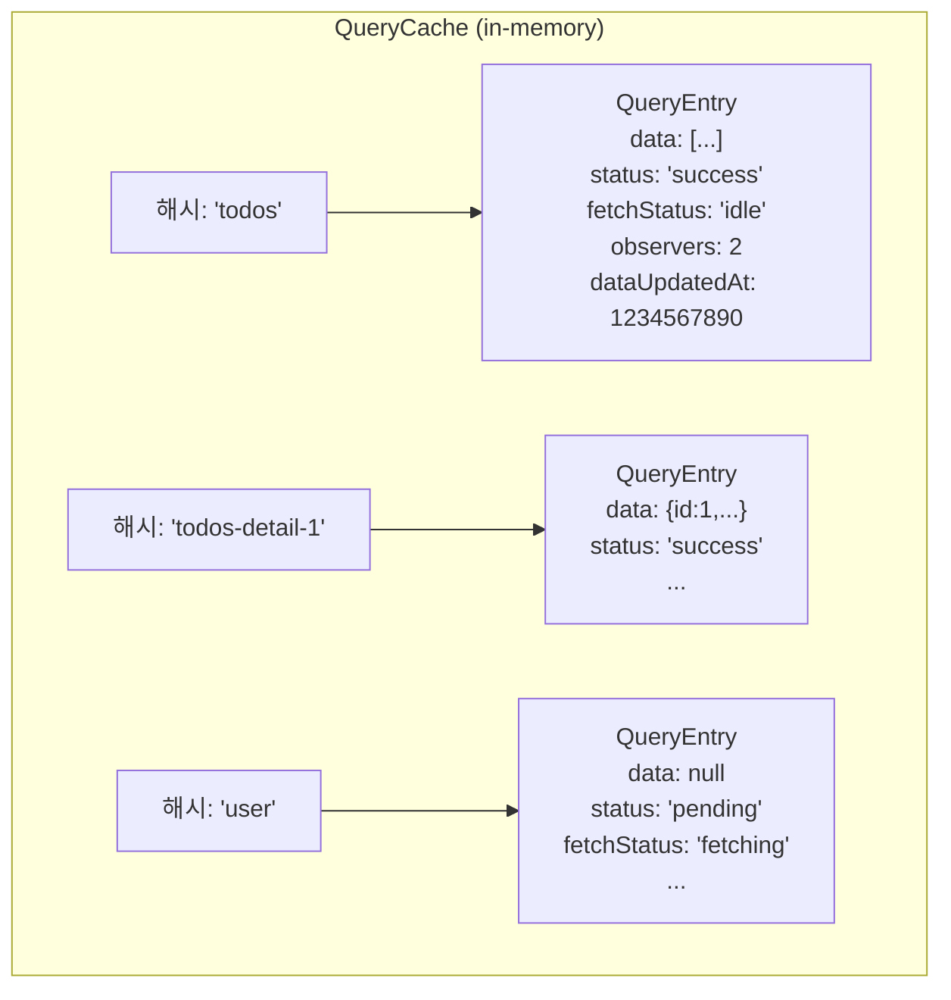
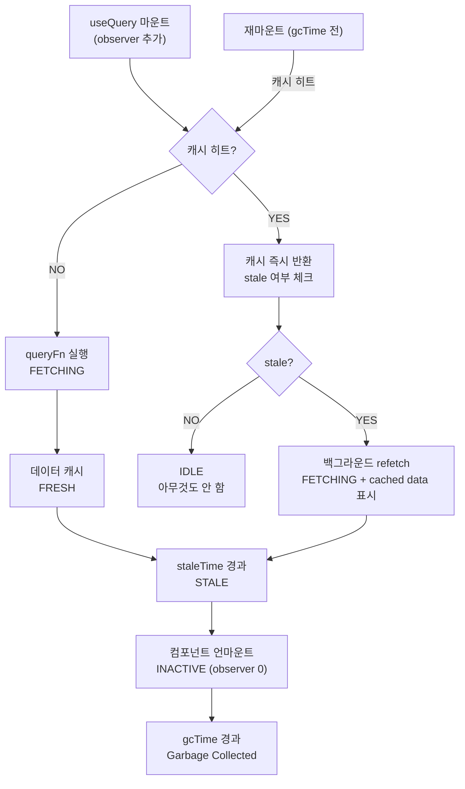
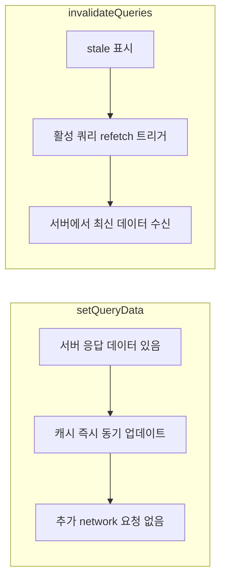
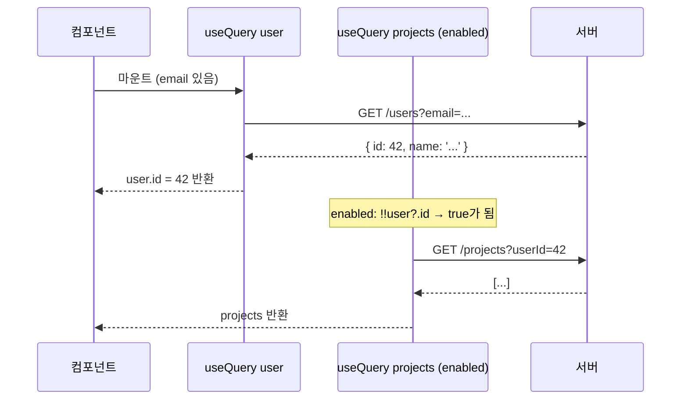

## 캐시 내부 동작

`QueryCache`는 해시된 쿼리 키를 키로 하는 JavaScript 객체다.<a href="https://tanstack.com/query/latest/docs/framework/react/guides/caching" target="_blank"><sup>[1]</sup></a>



**키 해시는 결정론적이다:**

```tsx
// 아래 둘은 동일한 캐시 엔트리를 참조
useQuery({ queryKey: ['todos', { status: 'active', page: 1 }] })
useQuery({ queryKey: ['todos', { page: 1, status: 'active' }] })
// 객체 프로퍼티 순서 무관 → 같은 해시
```

### 캐시 생명주기



---

## 백그라운드 Refetch 트리거

모두 기본값 `true`. 각 트리거가 발생할 때 stale 데이터가 있으면 백그라운드 refetch가 시작된다.<a href="https://tanstack.com/query/latest/docs/framework/react/guides/important-defaults" target="_blank"><sup>[2]</sup></a>

| 트리거 | 옵션 | 조건 | v5 변경점 |
|---|---|---|---|
| 컴포넌트 마운트 | `refetchOnMount` | stale 시 | - |
| 윈도우 포커스 | `refetchOnWindowFocus` | stale 시 | `visibilitychange` 이벤트만 사용 (v5) |
| 네트워크 재연결 | `refetchOnReconnect` | stale 시 | - |
| 수동 무효화 | `invalidateQueries()` | 항상 | - |
| 폴링 | `refetchInterval` | `staleTime`과 무관 | - |

**v5 변경**: `refetchOnWindowFocus`가 `focus` 이벤트 대신 `visibilitychange` 이벤트를 사용한다. 개발 중 불필요한 refetch가 줄었다.

```tsx
// 폴링 — 30초마다 자동 갱신
const { data } = useQuery({
  queryKey: ['status'],
  queryFn: fetchStatus,
  refetchInterval: 1000 * 30,
  // 윈도우가 백그라운드일 때도 폴링하려면:
  refetchIntervalInBackground: true,
})

// 윈도우 포커스 refetch 비활성화 — staleTime을 충분히 크게 설정하는 것을 먼저 고려
const { data } = useQuery({
  queryKey: ['config'],
  queryFn: fetchConfig,
  staleTime: 1000 * 60 * 10,  // 10분 fresh → 포커스 시 refetch 안 됨
  // refetchOnWindowFocus: false 대신 staleTime으로 해결하는 것이 더 명확
})
```

> **흔한 실수**: `refetchOnWindowFocus: false`를 설정하는 것보다 `staleTime`을 늘리는 것이 더 올바른 해결책이다. "윈도우를 다시 활성화했을 때 깜빡임"은 대부분 `staleTime: 0`(기본값)이 원인이다.

---

## invalidateQueries — 캐시 무효화

쿼리를 stale로 표시하고 현재 활성(마운트된) 쿼리를 즉시 refetch한다.<a href="https://tanstack.com/query/latest/docs/framework/react/guides/query-invalidation" target="_blank"><sup>[3]</sup></a>

```tsx
const queryClient = useQueryClient()

// 모든 쿼리 무효화
queryClient.invalidateQueries()

// prefix matching — ['todos']로 시작하는 모든 것
queryClient.invalidateQueries({ queryKey: ['todos'] })
// ['todos']                        ← 무효화됨
// ['todos', 'list', ...]           ← 무효화됨
// ['todos', 'detail', 42]         ← 무효화됨
// ['user']                         ← 무효화 안 됨

// 정확한 키만
queryClient.invalidateQueries({
  queryKey: ['todos', 'detail', 42],
  exact: true,
})

// 활성 쿼리만 즉시 refetch, 비활성은 stale 표시만
queryClient.invalidateQueries({
  queryKey: ['todos'],
  refetchType: 'active',  // 기본값
})

// 비활성 쿼리도 즉시 refetch
queryClient.invalidateQueries({
  queryKey: ['todos'],
  refetchType: 'all',
})

// stale 표시만, refetch 없음
queryClient.invalidateQueries({
  queryKey: ['todos'],
  refetchType: 'none',
})
```

### Mutation 후 invalidation 패턴

```tsx
const mutation = useMutation({
  mutationFn: createTodo,
  onSuccess: () => {
    // todo 생성 성공 → 모든 todo 관련 쿼리 무효화
    queryClient.invalidateQueries({ queryKey: ['todos'] })
  },
})
```

---

## setQueryData — 캐시 직접 수정

서버 응답을 받은 즉시 캐시를 동기적으로 업데이트한다. 추가 network 요청 없이 UI를 즉시 갱신할 수 있다.

```tsx
// 단일 아이템 업데이트 후 캐시 반영
const mutation = useMutation({
  mutationFn: updateTodo,
  onSuccess: (updatedTodo) => {
    // 서버가 업데이트된 전체 객체를 반환하는 경우 — invalidation 없이 바로 반영
    queryClient.setQueryData<Todo>(['todos', updatedTodo.id], updatedTodo)

    // 리스트 캐시에서도 해당 아이템 업데이트
    queryClient.setQueryData<Todo[]>(['todos'], (old) =>
      old?.map(t => t.id === updatedTodo.id ? updatedTodo : t) ?? []
    )
  },
})

// 새 아이템 생성 후 리스트에 추가
const createMutation = useMutation({
  mutationFn: createTodo,
  onSuccess: (newTodo) => {
    queryClient.setQueryData<Todo[]>(['todos'], (old) =>
      [...(old ?? []), newTodo]
    )
  },
})

// 아이템 삭제 후 리스트에서 제거
const deleteMutation = useMutation({
  mutationFn: deleteTodo,
  onSuccess: (_, deletedId) => {
    queryClient.setQueryData<Todo[]>(['todos'], (old) =>
      old?.filter(t => t.id !== deletedId) ?? []
    )
  },
})
```

### setQueryData vs invalidateQueries



| | `setQueryData` | `invalidateQueries` |
|---|---|---|
| 시점 | 동기, 즉시 | 비동기, refetch 후 |
| network | 없음 | 있음 |
| 적합한 경우 | 서버가 완전한 객체 반환 | 서버 상태 확실히 동기화 |

**실전 팁**: mutation 성공 시 `setQueryData`로 캐시를 업데이트한 뒤에도 `invalidateQueries`를 `onSettled`에서 호출하는 것이 안전하다. `setQueryData`의 데이터가 서버와 미묘하게 다를 수 있기 때문이다.

```tsx
useMutation({
  mutationFn: updateTodo,
  onSuccess: (updatedTodo) => {
    queryClient.setQueryData(['todos', updatedTodo.id], updatedTodo) // 즉각 반영
  },
  onSettled: (_, __, variables) => {
    queryClient.invalidateQueries({ queryKey: ['todos', variables.id] }) // 최종 동기화
  },
})
```

---

## prefetchQuery — 사전 로드

컴포넌트가 마운트되기 전에 데이터를 미리 로드한다. 이미 캐시에 있으면 즉시 반환한다.

```tsx
// 라우터 loader — 페이지 진입 전 데이터 준비
// (TanStack Router, React Router v6.4+ loader)
export const loader = async () => {
  await queryClient.prefetchQuery({
    queryKey: ['todos'],
    queryFn: fetchTodos,
  })
  return null
}

// 이후 컴포넌트에서 useQuery → 이미 캐시에 있어 즉시 data 반환
function TodoList() {
  const { data } = useQuery({ queryKey: ['todos'], queryFn: fetchTodos })
  // isLoading: false, data 즉시 사용 가능
}
```

### hover에서 prefetch — 클릭 시 즉각 느낌

```tsx
function TodoLink({ id }: { id: number }) {
  const queryClient = useQueryClient()

  return (
    <Link
      to={`/todos/${id}`}
      onMouseEnter={() => {
        // 마우스를 올리는 순간 로드 시작
        queryClient.prefetchQuery({
          queryKey: ['todo', id],
          queryFn: () => fetchTodo(id),
          staleTime: 1000 * 10, // 10초 내 이미 캐시됐으면 스킵
        })
      }}
    >
      Todo #{id}
    </Link>
  )
}
```

### prefetchQuery vs fetchQuery

```tsx
// prefetchQuery — 에러 throw 없음, 실패해도 조용히 무시
await queryClient.prefetchQuery({ queryKey: ['todos'], queryFn: fetchTodos })

// fetchQuery — Promise 반환, 에러 throw됨
try {
  const data = await queryClient.fetchQuery({ queryKey: ['todos'], queryFn: fetchTodos })
} catch (err) {
  // 에러 처리 가능
}
```

---

## Dependent Queries (의존성 쿼리)

`enabled` 옵션으로 이전 쿼리의 결과를 기다린다.

```tsx
function UserProjects({ email }: { email: string }) {
  // 1단계: email로 user 조회
  const { data: user } = useQuery({
    queryKey: ['user', email],
    queryFn: () => getUserByEmail(email),
  })

  // 2단계: user.id가 있을 때만 실행
  const { data: projects } = useQuery({
    queryKey: ['projects', user?.id],
    queryFn: () => getProjectsByUser(user!.id),
    enabled: !!user?.id,
  })

  return <div>{/* ... */}</div>
}
```



> **성능 주의**: 의존성 쿼리는 순차 실행이므로 두 요청이 각각 500ms면 총 1초가 걸린다. 둘을 합친 백엔드 엔드포인트가 있다면 그것을 우선 고려하라.

---

## 참고

<ol>
<li><a href="https://tanstack.com/query/latest/docs/framework/react/guides/caching" target="_blank">[1] Caching — TanStack Query Docs</a></li>
<li><a href="https://tanstack.com/query/latest/docs/framework/react/guides/important-defaults" target="_blank">[2] Important Defaults — TanStack Query Docs</a></li>
<li><a href="https://tanstack.com/query/latest/docs/framework/react/guides/query-invalidation" target="_blank">[3] Query Invalidation — TanStack Query Docs</a></li>
<li><a href="https://tanstack.com/query/latest/docs/framework/react/guides/prefetching" target="_blank">[4] Prefetching — TanStack Query Docs</a></li>
</ol>

---

## 관련 글

- [TanStack Query 개요 →](/post/react-query-overview)
- [useQuery 심층 →](/post/react-query-queries)
- [useMutation · Optimistic Updates →](/post/react-query-mutations)
- [고급 패턴 · v5 마이그레이션 →](/post/react-query-advanced)
