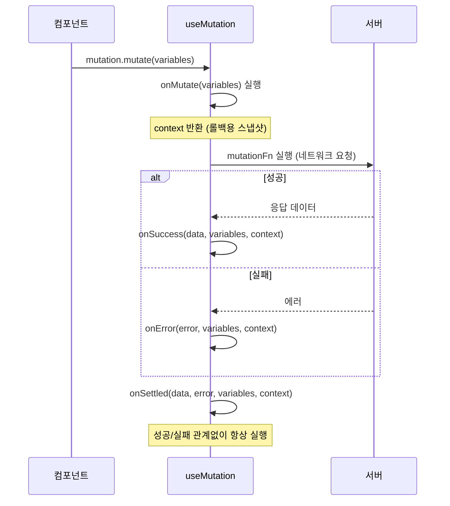
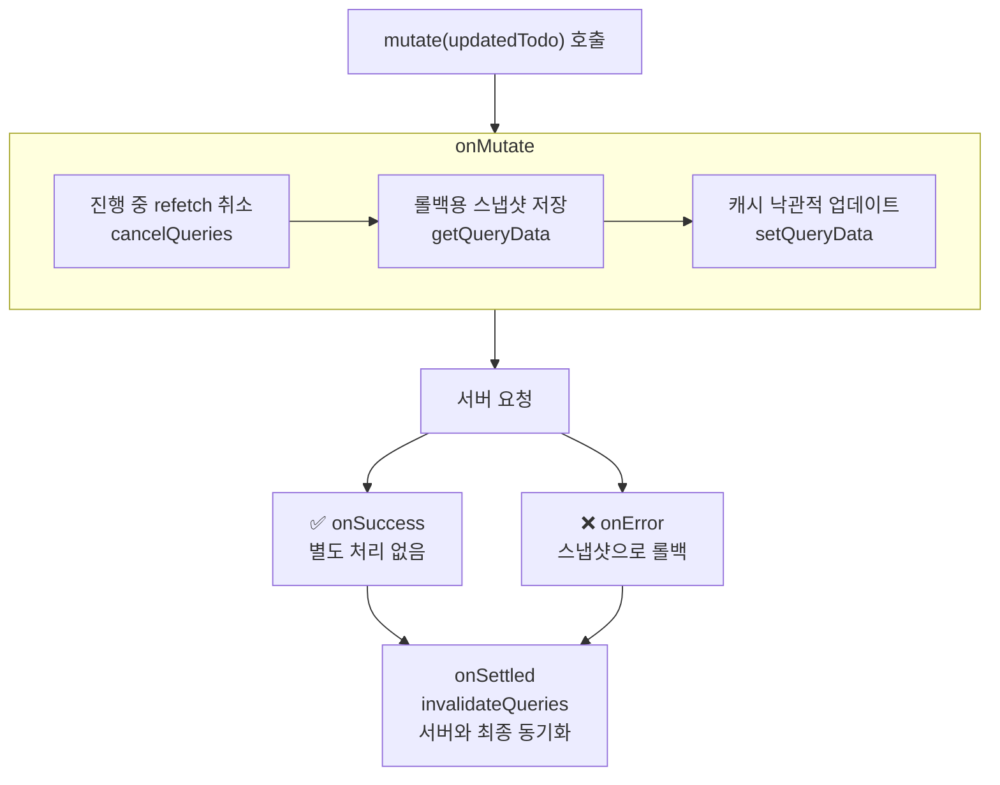

## useMutation 기본

`useQuery`가 서버에서 데이터를 **읽는** 것이라면, `useMutation`은 데이터를 **쓰는** 것이다 — POST, PUT, PATCH, DELETE.<a href="https://tanstack.com/query/latest/docs/framework/react/guides/mutations" target="_blank"><sup>[1]</sup></a>

```tsx
import { useMutation, useQueryClient } from '@tanstack/react-query'

function CreateTodoForm() {
  const queryClient = useQueryClient()

  const mutation = useMutation({
    mutationFn: (newTodo: { title: string }) =>
      fetch('/api/todos', {
        method: 'POST',
        body: JSON.stringify(newTodo),
      }).then(res => res.json()),

    onSuccess: () => {
      // 성공 시 todos 캐시 무효화 → 자동 refetch
      queryClient.invalidateQueries({ queryKey: ['todos'] })
    },
  })

  return (
    <form onSubmit={e => {
      e.preventDefault()
      mutation.mutate({ title: e.currentTarget.title.value })
    }}>
      <input name="title" />
      <button type="submit" disabled={mutation.isPending}>
        {mutation.isPending ? '저장 중...' : '추가'}
      </button>
      {mutation.isError && <p>{mutation.error.message}</p>}
    </form>
  )
}
```

---

## Mutation 라이프사이클 — 4단계 콜백



```tsx
const mutation = useMutation({
  mutationFn: updateTodo,

  // ① 요청 전 — 낙관적 업데이트, 스냅샷 저장
  onMutate: async (variables) => {
    console.log('요청 시작 전', variables)
    return { snapshot: '롤백용 데이터' } // context로 전달됨
  },

  // ② 성공 시 — invalidation, 후속 처리
  onSuccess: (data, variables, context) => {
    console.log('성공', data)
    queryClient.invalidateQueries({ queryKey: ['todos'] })
  },

  // ③ 실패 시 — 롤백
  onError: (error, variables, context) => {
    console.log('실패', error)
    // context.snapshot으로 롤백
  },

  // ④ 항상 실행 — 최종 정리
  onSettled: (data, error, variables, context) => {
    console.log('완료 (성공/실패 무관)')
  },
})
```

---

## 두 레벨 콜백 패턴 (TkDodo)

`useMutation`과 `mutate()` 양쪽에 콜백을 쓸 수 있다. **어디에 뭘 쓰느냐**가 중요하다.<a href="https://tkdodo.eu/blog/mastering-mutations-in-react-query" target="_blank"><sup>[2]</sup></a>

```tsx
// ─── Level 1: useMutation ───────────────────────────────────────────
// 항상 실행되는 로직 — 캐시 조작, invalidation
const mutation = useMutation({
  mutationFn: updateTodo,
  onSuccess: () => {
    queryClient.invalidateQueries({ queryKey: ['todos'] })  // ← 항상 실행
  },
})

// ─── Level 2: mutate() 인라인 콜백 ─────────────────────────────────
// 컴포넌트가 마운트된 경우에만 실행되는 UI 효과
mutation.mutate(todoData, {
  onSuccess: () => {
    router.push('/todos')      // ← 컴포넌트가 언마운트됐으면 실행 안 됨
    toast.success('저장됨!')
  },
  onError: () => {
    toast.error('저장 실패!')
  },
})
```

**규칙 (TkDodo)**:
- 캐시 조작·invalidation → `useMutation` 콜백 (항상 실행됨)
- 내비게이션·토스트 등 UI 사이드 이펙트 → `mutate()` 인라인 콜백 (컴포넌트 마운트 시에만)

`mutate()` 인라인 콜백은 mutation이 완료됐을 때 컴포넌트가 이미 언마운트됐으면 실행되지 않는다. 덕분에 "마운트 해제된 컴포넌트에 setState" 경고를 피할 수 있다.

---

## Mutation 상태

```tsx
const {
  mutate,          // (variables) => void — fire and forget
  mutateAsync,     // (variables) => Promise<TData> — await 가능
  isPending,       // 요청 진행 중 (v4의 isLoading에서 이름 변경)
  isSuccess,
  isError,
  isIdle,          // 아직 실행 전
  data,            // 마지막 성공 결과
  error,           // 마지막 에러
  variables,       // 마지막 mutate()에 전달한 값
  reset,           // 상태를 idle로 초기화
} = useMutation(...)
```

### mutate vs mutateAsync

```tsx
// mutate — 에러가 throw되지 않음, 반환값 없음
mutation.mutate(todo)

// mutateAsync — Promise 반환, 에러가 throw됨
try {
  const result = await mutation.mutateAsync(todo)
  console.log('생성된 todo:', result)
} catch (err) {
  console.error('실패:', err)
}

// mutateAsync는 onSuccess/onError보다 try/catch가 명확한 경우에 사용
// 단독 form 제출, 연속 mutation 등
```

---

## 낙관적 업데이트 (Optimistic Updates)

서버 응답을 기다리지 않고 UI를 먼저 업데이트해 빠른 반응성을 만든다.

### 패턴 1 — 캐시 직접 조작 (완전한 롤백 지원)

```tsx
function useUpdateTodo() {
  const queryClient = useQueryClient()

  return useMutation({
    mutationFn: updateTodo,

    onMutate: async (updatedTodo) => {
      // ① 진행 중인 refetch가 낙관적 업데이트를 덮어쓰지 않도록 취소
      await queryClient.cancelQueries({ queryKey: ['todos', updatedTodo.id] })

      // ② 롤백용 스냅샷 저장
      const previousTodo = queryClient.getQueryData<Todo>(['todos', updatedTodo.id])

      // ③ 캐시를 낙관적으로 업데이트
      queryClient.setQueryData<Todo>(['todos', updatedTodo.id], updatedTodo)

      // ④ context로 스냅샷 반환
      return { previousTodo }
    },

    onError: (err, updatedTodo, context) => {
      // 실패 시 스냅샷으로 롤백
      queryClient.setQueryData(
        ['todos', updatedTodo.id],
        context?.previousTodo
      )
    },

    onSettled: (data, error, variables) => {
      // 성공/실패 후 서버와 동기화
      queryClient.invalidateQueries({ queryKey: ['todos', variables.id] })
    },
  })
}
```



### 패턴 2 — variables 기반 (더 단순)

mutation.variables를 직접 렌더링에 활용한다. 구현이 단순하지만 한 위치에서만 낙관적 표시 가능.

```tsx
const mutation = useMutation({
  mutationFn: (text: string) => createTodo(text),
  onSettled: () =>
    queryClient.invalidateQueries({ queryKey: ['todos'] }),
})

// JSX에서 낙관적 아이템 표시
function TodoList() {
  const { data: todos } = useQuery({ queryKey: ['todos'], queryFn: fetchTodos })

  return (
    <ul>
      {todos?.map(todo => <li key={todo.id}>{todo.title}</li>)}

      {/* 요청 진행 중일 때 낙관적 아이템 표시 */}
      {mutation.isPending && (
        <li style={{ opacity: 0.5 }}>
          {mutation.variables} {/* mutate()에 전달한 값 */}
        </li>
      )}
    </ul>
  )
}
```

**어떤 패턴을 쓸까?**

| | 패턴 1 (캐시 직접 조작) | 패턴 2 (variables) |
|---|---|---|
| 복잡도 | 높음 | 낮음 |
| 롤백 | ✅ 완전한 롤백 | ❌ 없음 |
| 여러 위치 표시 | ✅ 가능 | ❌ 한 위치만 |
| 적합한 경우 | 중요한 데이터 변경 | 단순 리스트 추가 |

---

## 여러 Mutation 동시 실행

`useMutation`은 하나의 mutation 타입에 대한 인스턴스다. 여러 개를 동시에 실행하려면:

```tsx
// 같은 mutationFn이지만 독립적인 인스턴스
function TodoItem({ todo }: { todo: Todo }) {
  const deleteMutation = useMutation({
    mutationFn: (id: number) => deleteTodo(id),
    onSuccess: () => queryClient.invalidateQueries({ queryKey: ['todos'] }),
  })

  return (
    <li>
      {todo.title}
      <button
        onClick={() => deleteMutation.mutate(todo.id)}
        disabled={deleteMutation.isPending}
      >
        삭제
      </button>
    </li>
  )
}
```

각 `TodoItem`이 자신의 `deleteMutation` 인스턴스를 가지므로 독립적으로 `isPending` 상태를 추적한다.

---

## 에러 처리 패턴

```tsx
// 패턴 1 — isError 체크 (로컬 에러)
const mutation = useMutation({ mutationFn: createTodo })

{mutation.isError && (
  <Alert variant="error">{mutation.error.message}</Alert>
)}

// 패턴 2 — throwOnError (Error Boundary로 위임)
const mutation = useMutation({
  mutationFn: createTodo,
  throwOnError: true,   // Error Boundary에서 처리
})

// 패턴 3 — mutate 인라인 onError (토스트 알림)
mutation.mutate(todo, {
  onError: (error) => toast.error(error.message),
})
```

**v5 주의**: `useQuery`의 `onSuccess`/`onError`/`onSettled` 콜백은 v5에서 제거됐다. `useMutation`에서는 여전히 사용 가능하다.

---

## 참고

<ol>
<li><a href="https://tanstack.com/query/latest/docs/framework/react/guides/mutations" target="_blank">[1] Mutations — TanStack Query Docs</a></li>
<li><a href="https://tkdodo.eu/blog/mastering-mutations-in-react-query" target="_blank">[2] Mastering Mutations in React Query — TkDodo</a></li>
<li><a href="https://tanstack.com/query/latest/docs/framework/react/guides/optimistic-updates" target="_blank">[3] Optimistic Updates — TanStack Query Docs</a></li>
</ol>

---

## 관련 글

- [TanStack Query 개요 →](/post/react-query-overview)
- [useQuery 심층 →](/post/react-query-queries)
- [캐시 · 무효화 · Prefetch →](/post/react-query-cache)
