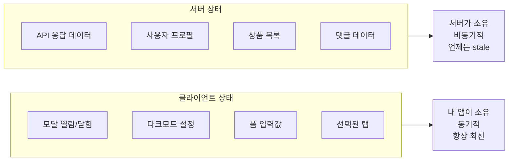
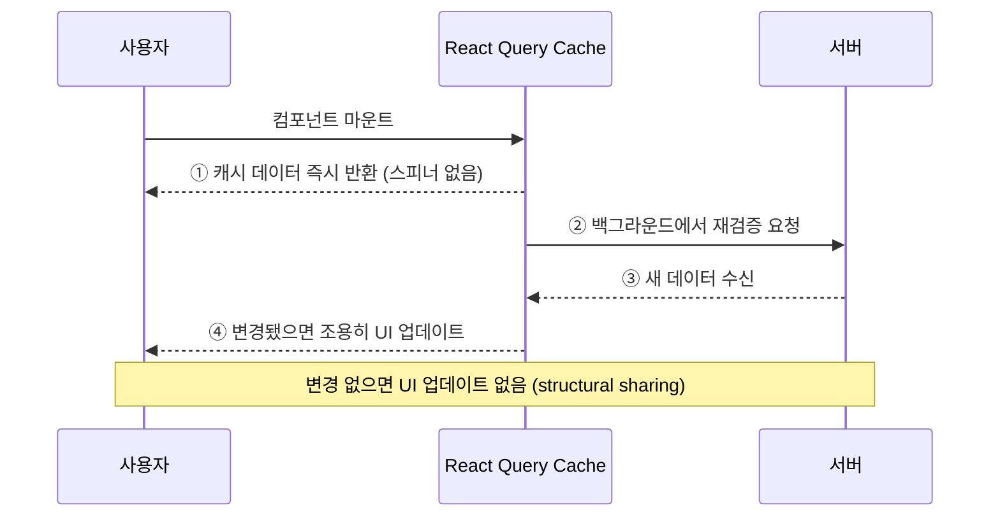
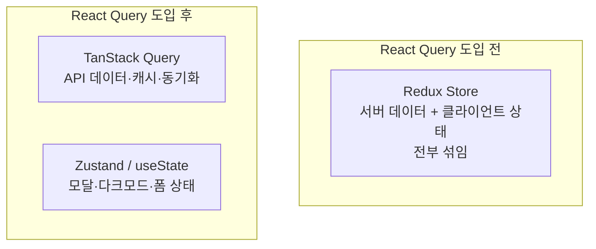

## 이 시리즈 구성

| 포스트 | 내용 |
|---|---|
| **[1편] TanStack Query 개요 (현재 글)** | 왜 React Query인가, 서버/클라이언트 상태, SWR 전략, Zustand 역할 분담 |
| [[2편] QueryClient · Query Keys · useQuery 심층](/post/react-query-queries) | QueryClient 설정, 쿼리 키 팩토리, useQuery 전체 옵션, status vs fetchStatus |
| [[3편] useMutation · Optimistic Updates](/post/react-query-mutations) | mutation 라이프사이클, 두 레벨 콜백, 낙관적 업데이트 |
| [[4편] 캐시 · 무효화 · Prefetch](/post/react-query-cache) | staleTime vs gcTime, invalidateQueries, setQueryData, 백그라운드 트리거 |
| [[5편] 고급 패턴 · v5 마이그레이션](/post/react-query-advanced) | Infinite Query, 병렬 쿼리, Suspense, Custom Hooks, v4→v5 변경점 |

---

## 왜 React Query인가

React로 데이터를 fetching하는 고전적인 방법:

```tsx
function TodoList() {
  const [todos, setTodos] = useState([]);
  const [isLoading, setIsLoading] = useState(false);
  const [error, setError] = useState(null);

  useEffect(() => {
    setIsLoading(true);
    fetch('/api/todos')
      .then(res => res.json())
      .then(data => setTodos(data))
      .catch(setError)
      .finally(() => setIsLoading(false));
  }, []);
  // ...
}
```

이것만으로는 처리되지 않는 것들:
- 컴포넌트가 다시 마운트될 때 재요청?
- 탭을 다시 활성화할 때 갱신?
- 네트워크 재연결 시 갱신?
- 여러 컴포넌트에서 같은 데이터를 요청할 때 중복 제거?
- 캐시 무효화와 재검증?
- 에러 시 자동 재시도?

이 모든 것이 **TanStack Query**가 해결하는 문제다.<a href="https://tanstack.com/query/latest/docs/framework/react/overview" target="_blank"><sup>[1]</sup></a>

---

## 서버 상태 vs 클라이언트 상태

React Query의 핵심 통찰은 상태를 두 종류로 구분하는 것이다.<a href="https://tkdodo.eu/blog/react-query-as-a-state-manager" target="_blank"><sup>[2]</sup></a>



| 차원 | 클라이언트 상태 | 서버 상태 |
|---|---|---|
| 소유권 | 내 앱 | 원격 서버 |
| 지속성 | 메모리 | DB / API |
| 동기화 | 불필요 | 지속적 동기화 필요 |
| Staleness | 항상 최신 | 즉시 outdated 가능 |
| 비동기 | 거의 없음 | 항상 |

서버 상태 관리를 Redux로 하면:
- Action creators, reducers, selectors, middleware(thunk/saga) 전부 직접 작성
- 캐시 무효화 없음, 백그라운드 갱신 없음, stale 추적 없음
- React Query 10줄이 Redux 수백 줄을 대체한다

> **TkDodo**: React Query is not a cache — it's a **synchronization tool**. 서버가 진짜 데이터 소유자이고, React Query는 UI를 그것과 동기화한다.

---

## Stale-While-Revalidate 전략

React Query는 HTTP의 `stale-while-revalidate` 캐싱 원칙을 채택한다.

**실생활 비유**: 카카오톡 채널 피드를 열었을 때, 앱이 이전에 저장해둔 게시글을 **즉시 보여준다**. 동시에 백그라운드에서 서버에 새 글이 있는지 확인하고, 있으면 **조용히 업데이트**한다. 빈 화면 + 스피너를 보여주는 것보다 훨씬 빠른 UX.



1. **캐시 데이터 즉시 반환** — 스피너(로딩 애니메이션) 없음, 빠른 UI
2. **백그라운드에서 재검증** — 네트워크 요청이 진행 중이지만 사용자는 이미 내용을 보고 있음
3. **변경 시 조용히 업데이트** — loading 상태 없이 새 데이터로 교체

> **핵심**: stale(오래된) 데이터가 데이터 없음보다 낫다. 데이터 없음 = 스피너(빈 화면 + 원형 로딩 표시) = 느린 UX.

---

## 설치

<!-- code-tabs:start -->

```npm
npm install @tanstack/react-query
npm install -D @tanstack/react-query-devtools
```

```yarn
yarn add @tanstack/react-query
yarn add -D @tanstack/react-query-devtools
```

```pnpm
pnpm add @tanstack/react-query
pnpm add -D @tanstack/react-query-devtools
```

<!-- code-tabs:end -->

---

## 빠른 시작

```tsx
// main.tsx — QueryClient는 반드시 컴포넌트 밖에서 생성
import { QueryClient, QueryClientProvider } from '@tanstack/react-query'
import { ReactQueryDevtools } from '@tanstack/react-query-devtools'

const queryClient = new QueryClient({
  defaultOptions: {
    queries: {
      staleTime: 1000 * 60,    // 1분 전역 기본값
      retry: 3,
    },
  },
})

function App() {
  return (
    <QueryClientProvider client={queryClient}>
      <TodoApp />
      {/* 개발 환경에서만 표시되는 쿼리 디버거 */}
      <ReactQueryDevtools initialIsOpen={false} />
    </QueryClientProvider>
  )
}
```

```tsx
// components/TodoList.tsx
import { useQuery } from '@tanstack/react-query'

function TodoList() {
  const { data, isLoading, isError, error } = useQuery({
    queryKey: ['todos'],
    queryFn: () => fetch('/api/todos').then(res => res.json()),
  })

  // isLoading: 아직 데이터가 없고 처음 요청 중인 상태
  // → 스피너(Spinner): 원형 로딩 애니메이션 컴포넌트. 데이터가 올 때까지 임시로 표시
  if (isLoading) return <Spinner />

  if (isError) return <Alert message={error.message} />

  return (
    <ul>
      {data.map(todo => <li key={todo.id}>{todo.title}</li>)}
    </ul>
  )
}
```

이게 전부다. 자동으로 처리되는 것들:
- ✅ 로딩/에러/성공 상태 관리
- ✅ 에러 시 자동 재시도 (3회)
- ✅ 윈도우 포커스 복귀 시 백그라운드 갱신
- ✅ 동일 키 중복 요청 자동 dedup
- ✅ 5분간 캐시 유지 (gcTime 기본값)

---

## Redux / Zustand 와의 역할 분담

React Query를 도입한 뒤 남은 진짜 클라이언트 상태는 매우 작다.



| 역할 | 담당 |
|---|---|
| 서버 데이터 (API 응답, 목록, 상세) | **TanStack Query** |
| 전역 UI 상태 (모달, 사이드바, 테마) | **Zustand** |
| 로컬 컴포넌트 상태 (입력값, 토글) | **useState** |

### Zustand — 클라이언트 상태 관리

Zustand는 Redux의 복잡한 boilerplate 없이 전역 상태를 관리하는 경량 라이브러리다. React Query가 서버 상태를 담당하고, Zustand가 클라이언트 UI 상태를 담당하는 조합이 현재 가장 많이 쓰인다.

<!-- code-tabs:start -->

```npm
npm install zustand
```

```yarn
yarn add zustand
```

```pnpm
pnpm add zustand
```

<!-- code-tabs:end -->

```tsx
// store/ui-store.ts — 전역 UI 상태 (React Query와 역할 분리)
import { create } from 'zustand'

interface UIStore {
  // 모달 상태
  isModalOpen: boolean
  openModal: () => void
  closeModal: () => void

  // 사이드바 상태
  isSidebarOpen: boolean
  toggleSidebar: () => void

  // 테마
  theme: 'light' | 'dark'
  toggleTheme: () => void
}

export const useUIStore = create<UIStore>((set) => ({
  isModalOpen: false,
  openModal: () => set({ isModalOpen: true }),
  closeModal: () => set({ isModalOpen: false }),

  isSidebarOpen: true,
  toggleSidebar: () => set((state) => ({ isSidebarOpen: !state.isSidebarOpen })),

  theme: 'dark',
  toggleTheme: () =>
    set((state) => ({ theme: state.theme === 'dark' ? 'light' : 'dark' })),
}))
```

```tsx
// 컴포넌트에서 사용 — 서버 데이터는 React Query, UI 상태는 Zustand
function PostList() {
  // 서버 상태: React Query
  const { data: posts, isLoading } = useQuery({
    queryKey: ['posts'],
    queryFn: fetchPosts,
  })

  // 클라이언트 상태: Zustand
  const { isModalOpen, openModal, closeModal } = useUIStore()

  if (isLoading) return <Spinner />

  return (
    <div>
      {posts?.map(post => (
        <PostCard key={post.id} post={post} onSelect={openModal} />
      ))}
      {isModalOpen && <PostModal onClose={closeModal} />}
    </div>
  )
}
```

**Zustand의 특징**:
- Redux의 Action/Reducer/Dispatch 패턴 없음 → 함수 직접 호출
- `set()`으로 상태 업데이트, `get()`으로 현재 상태 참조
- `persist` 미들웨어로 localStorage 자동 동기화 가능
- 번들 크기 ~1KB (Redux toolkit 대비 매우 가벼움)

> Zustand를 서버 데이터 저장소로 쓰지 말 것. `fetch` 후 `set()`으로 저장하면 캐싱·갱신·에러 처리를 전부 직접 구현해야 한다. 그게 React Query가 해결하는 문제다.

---

## 참고

<ol>
<li><a href="https://tanstack.com/query/latest/docs/framework/react/overview" target="_blank">[1] TanStack Query v5 Overview — 공식 문서</a></li>
<li><a href="https://tkdodo.eu/blog/react-query-as-a-state-manager" target="_blank">[2] React Query as a State Manager — TkDodo</a></li>
<li><a href="https://tkdodo.eu/blog/practical-react-query" target="_blank">[3] Practical React Query — TkDodo</a></li>
<li><a href="https://docs.pmnd.rs/zustand/getting-started/introduction" target="_blank">[4] Zustand 공식 문서</a></li>
</ol>

---

## 관련 글

- [[2편] QueryClient · Query Keys · useQuery 심층 →](/post/react-query-queries)
- [[3편] useMutation · Optimistic Updates →](/post/react-query-mutations)
- [[4편] 캐시 · 무효화 · Prefetch →](/post/react-query-cache)
- [[5편] 고급 패턴 · v5 마이그레이션 →](/post/react-query-advanced)
