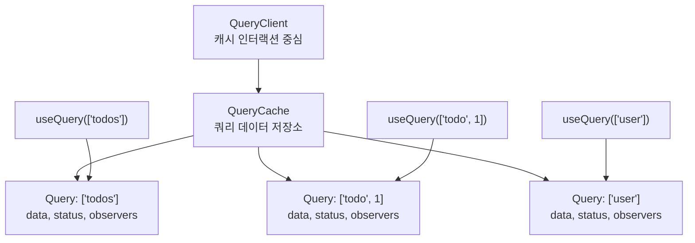
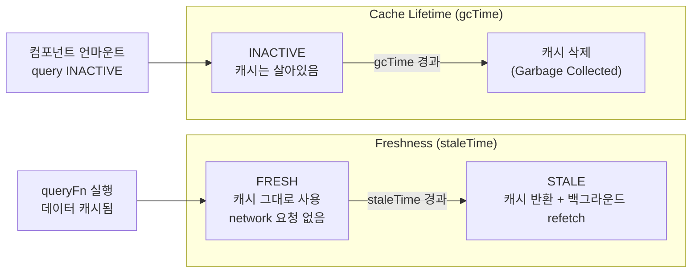
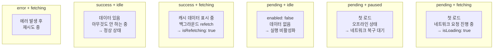

## QueryClient와 QueryClientProvider

`QueryClient`는 `QueryCache`를 보유하고 모든 캐시 인터랙션의 중심이다.<a href="https://tanstack.com/query/latest/docs/framework/react/reference/QueryClient" target="_blank"><sup>[1]</sup></a>

```tsx
import { QueryClient, QueryClientProvider } from '@tanstack/react-query'

// ⚠️ 반드시 컴포넌트 밖에서 생성
// App이 리렌더될 때마다 새 인스턴스를 만들면 캐시가 초기화됨
const queryClient = new QueryClient({
  defaultOptions: {
    queries: {
      staleTime: 1000 * 20,      // 20초 전역 기본값 (TkDodo 최소 권장)
      gcTime: 1000 * 60 * 5,     // 5분 (기본값)
      retry: 3,                   // 에러 시 3회 재시도 (기본값)
      refetchOnWindowFocus: true, // 윈도우 포커스 복귀 시 갱신 (기본값)
    },
  },
})

export function Root() {
  return (
    <QueryClientProvider client={queryClient}>
      <App />
    </QueryClientProvider>
  )
}
```



---

## 쿼리 키 (Query Keys)

쿼리 키는 단순한 식별자가 아니다. 세 가지 역할을 동시에 한다.<a href="https://tkdodo.eu/blog/effective-react-query-keys" target="_blank"><sup>[2]</sup></a>

1. **캐시 조회 키** — 같은 키 = 같은 캐시 엔트리
2. **의존성 배열** — `useEffect`의 deps처럼, 키가 바뀌면 refetch
3. **수동 캐시 조작 타깃** — `invalidateQueries`, `setQueryData`의 기준

### 규칙

```tsx
// ✅ 항상 배열 (v5에서 배열만 허용)
useQuery({ queryKey: ['todos'], ... })

// ✅ 파라미터화 — id가 바뀌면 자동 refetch
useQuery({ queryKey: ['todo', id], queryFn: () => fetchTodo(id) })

// ✅ 객체 포함 — 필터·정렬 파라미터
useQuery({
  queryKey: ['todos', { status: 'active', page: 1 }],
  queryFn: () => fetchTodos({ status: 'active', page: 1 }),
})

// 키 해싱은 결정론적 — 객체 프로퍼티 순서 무관
// { a: 1, b: 2 }  ===  { b: 2, a: 1 }  (같은 캐시 엔트리)
```

### 황금 규칙 — queryFn 안의 모든 변수는 queryKey에 있어야 한다

```tsx
// ❌ filter가 key에 없음 — filter 변경 시 refetch 안 됨, stale data 버그!
useQuery({
  queryKey: ['todos'],
  queryFn: () => fetchTodos(filter),
})

// ✅ 올바른 의존성
useQuery({
  queryKey: ['todos', filter],
  queryFn: () => fetchTodos(filter),
})
```

---

## 쿼리 키 팩토리 패턴

반복 사용되는 키를 중앙에서 관리한다.

```typescript
// lib/queryKeys.ts
export const todoKeys = {
  all: ['todos'] as const,
  lists: () => [...todoKeys.all, 'list'] as const,
  list: (filters: TodoFilters) => [...todoKeys.lists(), filters] as const,
  details: () => [...todoKeys.all, 'detail'] as const,
  detail: (id: number) => [...todoKeys.details(), id] as const,
}

// 사용
useQuery({ queryKey: todoKeys.detail(42), queryFn: () => fetchTodo(42) })

// 계층적 무효화 — fuzzy prefix matching
queryClient.invalidateQueries({ queryKey: todoKeys.all })
//  → ['todos'] 로 시작하는 모든 것 무효화
//    ['todos', 'list', ...], ['todos', 'detail', ...] 전부 포함

queryClient.invalidateQueries({ queryKey: todoKeys.lists() })
//  → 리스트만 무효화, 디테일은 유지
```

### v5 권장 패턴 — queryOptions API

TkDodo가 2024년 업데이트한 권장 방식. 쿼리 키와 queryFn, 옵션을 한 곳에 묶는다.<a href="https://tkdodo.eu/blog/the-query-options-api" target="_blank"><sup>[3]</sup></a>

```typescript
import { queryOptions } from '@tanstack/react-query'

export const todoQueries = {
  all: () => ['todos'] as const,
  lists: () => [...todoQueries.all(), 'list'] as const,

  list: (filters: TodoFilters) =>
    queryOptions({
      queryKey: [...todoQueries.lists(), filters],
      queryFn: () => fetchTodos(filters),
      staleTime: 1000 * 30,
    }),

  detail: (id: number) =>
    queryOptions({
      queryKey: [...todoQueries.all(), 'detail', id],
      queryFn: () => fetchTodo(id),
    }),
}

// 사용 — 타입 안전
useQuery(todoQueries.list({ status: 'active' }))
await queryClient.prefetchQuery(todoQueries.detail(id))

// getQueryData가 타입 안전해짐
const data = queryClient.getQueryData(todoQueries.detail(id).queryKey)
// ^? Todo | undefined  (이전: unknown)
```

---

## useQuery 전체 옵션

```tsx
const result = useQuery({
  // ─── 필수 ───────────────────────────────────────────
  queryKey: ['todos'],
  queryFn: fetchTodos,        // Promise를 반환하는 함수

  // ─── Freshness (신선도) ─────────────────────────────
  staleTime: 0,               // 데이터가 stale 되기까지 ms (기본: 0)
                              // 0 = 마운트마다 백그라운드 refetch

  // ─── Cache (캐시 생명주기) ──────────────────────────
  gcTime: 1000 * 60 * 5,     // inactive 쿼리 캐시 보존 시간 ms (기본: 5분)
                              // v4의 cacheTime이 이름 변경됨

  // ─── Retry (재시도) ─────────────────────────────────
  retry: 3,                   // 에러 시 재시도 횟수 (기본: 3)
  retryDelay: attemptIndex =>
    Math.min(1000 * 2 ** attemptIndex, 30000),  // 기본: 지수 백오프

  // ─── Refetch 트리거 ─────────────────────────────────
  refetchOnMount: true,       // true | false | 'always'
  refetchOnWindowFocus: true, // true | false | 'always'
  refetchOnReconnect: true,   // true | false | 'always'
  refetchInterval: false,     // 폴링 ms, false = 비활성

  // ─── 조건부 실행 ────────────────────────────────────
  enabled: true,              // false = 자동 실행 비활성화

  // ─── 데이터 변환 ────────────────────────────────────
  select: (data) => data.todos,   // 반환 전 변환/부분 선택

  // ─── 초기 데이터 ────────────────────────────────────
  placeholderData: keepPreviousData,  // 키 전환 중 이전 데이터 유지
  initialData: () => cachedValue,    // 캐시에 영구 저장됨 (주의)

  // ─── 에러 처리 ──────────────────────────────────────
  throwOnError: false,        // Error Boundary로 throw (v4: useErrorBoundary)

  // ─── 네트워크 ───────────────────────────────────────
  networkMode: 'online',      // 'online' | 'always' | 'offlineFirst'
})
```

### staleTime vs gcTime — 가장 많이 혼동되는 쌍



| | `staleTime` | `gcTime` |
|---|---|---|
| **역할** | 백그라운드 refetch 여부 결정 | 사용 안 된 캐시 삭제 타이밍 |
| **기본값** | 0 (항상 stale) | 5분 |
| **적용 대상** | 활성 쿼리 | 비활성 쿼리 |
| **비유** | "이 데이터가 유통기한 안인가?" | "냉장고에서 꺼낸 지 얼마나 됐나?" |

**TkDodo 권장**: `staleTime`을 최소 20초로 설정하라. 기본값 0은 모든 마운트에서 백그라운드 refetch를 발생시킨다. "공격적이지만 합리적"인 기본값이지만 중복 요청을 일으킬 수 있다.

---

## status vs fetchStatus — 결정적 차이

v5에서 `status`와 `fetchStatus`는 완전히 독립적인 두 축이다.<a href="https://tanstack.com/query/latest/docs/framework/react/guides/queries" target="_blank"><sup>[4]</sup></a>

```tsx
const {
  // 쿼리가 "무엇을 아는가?"
  status,      // 'pending' | 'error' | 'success'
  isPending,   // 아직 데이터 없음
  isError,
  isSuccess,

  // 쿼리가 "무엇을 하고 있는가?"
  fetchStatus, // 'fetching' | 'paused' | 'idle'
  isFetching,  // queryFn 실행 중

  // 조합 편의 플래그
  isLoading,   // isPending && isFetching (첫 번째 fetch 진행 중)
  isRefetching, // isFetching && !isPending (백그라운드 refetch)
} = useQuery(...)
```

### 4가지 조합이 모두 실제로 발생한다



### 실전 사용법

```tsx
function TodoList() {
  const { data, isLoading, isError, isRefetching, error } = useQuery({
    queryKey: ['todos'],
    queryFn: fetchTodos,
  })

  // 첫 로드 스피너 — isLoading = isPending && isFetching
  if (isLoading) return <Spinner />

  // 에러 처리
  if (isError) return <Alert message={error.message} />

  return (
    <>
      {/* 백그라운드 갱신 중 인디케이터 */}
      {isRefetching && <SmallSpinner />}
      <ul>{data.map(todo => <li key={todo.id}>{todo.title}</li>)}</ul>
    </>
  )
}
```

**주의**: `isPending`만 체크하면 안 된다. `enabled: false`인 쿼리도 `isPending: true`이기 때문이다. 로딩 스피너는 반드시 `isLoading`으로 체크한다.

---

## select — 데이터 변환

서버 응답을 컴포넌트에 필요한 형태로 변환한다.

```tsx
// 전체 데이터 대신 일부만 구독 — 관련 없는 변경 시 리렌더 없음
const { data: todoTitles } = useQuery({
  queryKey: ['todos'],
  queryFn: fetchTodos,
  select: (data) => data.map(t => t.title),
})

// 파생 값 계산
const { data: activeCount } = useQuery({
  queryKey: ['todos'],
  queryFn: fetchTodos,
  select: (data) => data.filter(t => t.status === 'active').length,
})
```

**주의**: 인라인 `select` 함수는 매 렌더마다 새 참조를 만든다. 무거운 변환은 `useCallback`으로 메모이제이션하거나 stable 참조로 추출한다.

```tsx
// ✅ 안정적인 참조
const selectActiveTodos = useCallback(
  (data: Todo[]) => data.filter(t => t.status === 'active'),
  []
)

useQuery({ queryKey: ['todos'], queryFn: fetchTodos, select: selectActiveTodos })
```

---

## placeholderData vs initialData

```tsx
import { keepPreviousData } from '@tanstack/react-query'

// placeholderData: keepPreviousData
// 쿼리 키가 바뀔 때 (예: 페이지 전환) 이전 데이터를 placeholder로 유지
// → 캐시에 저장되지 않음, 페이지네이션에 유용
const { data, isPlaceholderData } = useQuery({
  queryKey: ['todos', page],
  queryFn: () => fetchTodos(page),
  placeholderData: keepPreviousData,
})

// initialData: 캐시에 영구 저장됨
// 다른 쿼리에서 이미 데이터가 있을 때 초기값으로 사용
const { data } = useQuery({
  queryKey: ['todo', id],
  queryFn: () => fetchTodo(id),
  initialData: () =>
    queryClient.getQueryData<Todo[]>(['todos'])?.find(t => t.id === id),
  initialDataUpdatedAt: () =>
    queryClient.getQueryState(['todos'])?.dataUpdatedAt,
})
```

---

## Custom Hooks 패턴

`useQuery`를 항상 커스텀 훅으로 감싸는 것을 권장한다.

```tsx
// hooks/useTodos.ts
export function useTodos(filters: TodoFilters) {
  return useQuery(todoQueries.list(filters))
}

export function useTodo(id: number) {
  return useQuery(todoQueries.detail(id))
}

// 컴포넌트에서
function TodoList() {
  const { data, isLoading } = useTodos({ status: 'active' })
  // queryKey를 컴포넌트에서 직접 쓰지 않음
}
```

장점:
- 데이터 fetching이 UI 컴포넌트 밖으로 분리
- 쿼리 키가 queryFn과 항상 같은 위치에 있음
- 타입 정의 한 곳 관리
- 테스트 용이

---

## 참고

<ol>
<li><a href="https://tanstack.com/query/latest/docs/framework/react/reference/QueryClient" target="_blank">[1] QueryClient — TanStack Query Docs</a></li>
<li><a href="https://tkdodo.eu/blog/effective-react-query-keys" target="_blank">[2] Effective React Query Keys — TkDodo</a></li>
<li><a href="https://tkdodo.eu/blog/the-query-options-api" target="_blank">[3] The Query Options API — TkDodo</a></li>
<li><a href="https://tanstack.com/query/latest/docs/framework/react/guides/queries" target="_blank">[4] Queries — TanStack Query Docs</a></li>
</ol>

---

## 관련 글

- [TanStack Query 개요 →](/post/react-query-overview)
- [useMutation · Optimistic Updates →](/post/react-query-mutations)
- [캐시 · 무효화 · Prefetch →](/post/react-query-cache)
