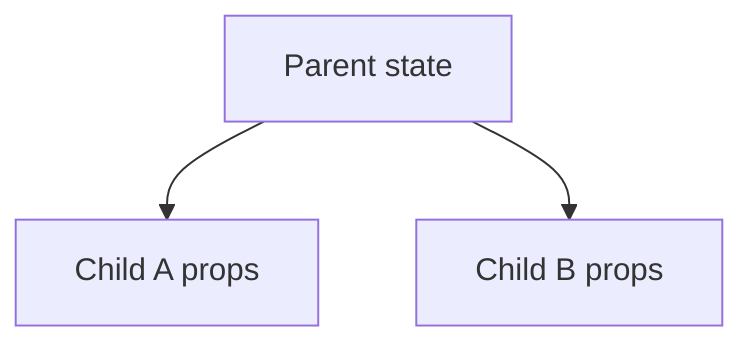

---
title: "React 단방향 데이터 흐름 — props와 state를 어디에 둬야 하는가"
slug: react-component-data-flow
category: study/frontend/react
tags: [react, props, state, data-flow, component-design, lifting-state-up]
author: Seobway
readTime: 11
featured: false
coverImage: /roadmap-thumbnails/step-01-browser-client.svg
createdAt: 2026-04-16
excerpt: >
  React의 props와 state 차이를 분명히 하고, 단방향 데이터 흐름과 state 끌어올리기를
  통해 컴포넌트를 어떻게 설계해야 하는지 정리한다.
---

## 이 시리즈 구성

| 포스트 | 내용 |
|---|---|
| [로드맵 인덱스 →](/post/ai-webdev-roadmap-foundation) | 01~19 전체 학습 경로 |
| [01-1. JS 이벤트 루프와 비동기 →](/post/js-event-loop-and-async) | 콜스택, 큐, 마이크로태스크 |
| [01-2. setTimeout vs Promise →](/post/settimeout-vs-promise) | 비동기 실행 순서 예측 |
| [01-3. React 단방향 데이터 흐름 →](/post/react-component-data-flow) | props/state, state 끌어올리기 |
| [01-4. controlled vs uncontrolled →](/post/react-controlled-vs-uncontrolled) | React 폼 설계 |
| [01-5. TypeScript 타입 시스템 기초 →](/post/typescript-type-system-basics) | any, unknown, union, narrowing |

---

## React에서 가장 먼저 잡아야 할 것

React 입문에서 가장 중요한 질문 중 하나는 이것이다.

**"이 값은 props인가, state인가?"**

이 질문이 흔들리면 컴포넌트 구조도 같이 흔들린다. 같은 값을 여러 군데에서 따로 저장하거나, 자식이 부모 데이터를 직접 바꾸려 들면서 설계가 꼬이기 시작한다.

---

## props와 state는 무엇이 다른가

### props

props는 **부모가 자식에게 내려주는 읽기 전용 값**이다.

```tsx
function ProfileCard({ name }: { name: string }) {
  return <h2>{name}</h2>
}
```

자식 컴포넌트는 props를 받아서 렌더링할 수는 있지만, 그 값을 직접 바꾸면 안 된다.

### state

state는 **컴포넌트가 기억해야 하는 값**이다.

```tsx
function Counter() {
  const [count, setCount] = useState(0)

  return (
    <button onClick={() => setCount(count + 1)}>
      {count}
    </button>
  )
}
```

즉 props는 "외부에서 들어오는 값", state는 "내가 관리하는 값"으로 보면 된다.

---

## React는 왜 단방향 데이터 흐름을 고집하는가

React의 데이터는 보통 **부모 → 자식** 방향으로 흐른다.



이 구조의 장점은 추적이 쉽다는 점이다.

- 값의 출처를 찾기 쉽다
- 어떤 변화가 어디서 시작됐는지 보기 쉽다
- 디버깅이 단순해진다

반대로 자식이 부모 값을 여기저기 직접 바꾸는 구조가 되면, 데이터 출처가 흐려진다.

---

## 자식이 부모 상태를 바꾸고 싶을 때

자식이 부모의 값을 직접 바꾸는 대신, **부모가 함수를 내려준다**.

```tsx
function Parent() {
  const [count, setCount] = useState(0)

  return <Child count={count} onIncrease={() => setCount(count + 1)} />
}

function Child({
  count,
  onIncrease,
}: {
  count: number
  onIncrease: () => void
}) {
  return <button onClick={onIncrease}>{count}</button>
}
```

값은 아래로 내려오고, 이벤트는 위로 올라간다. 이 패턴이 React 설계의 기본 호흡이다.

---

## state는 어디에 둬야 하는가

가장 자주 하는 실수는 **같은 상태를 여러 컴포넌트가 따로 들고 있는 것**이다.

예를 들어 형제 컴포넌트 둘이 같은 선택값을 공유해야 한다면, 각자 state를 갖지 말고 **가장 가까운 공통 부모**로 state를 올려야 한다.

```tsx
function Parent() {
  const [selectedId, setSelectedId] = useState<number | null>(null)

  return (
    <>
      <Sidebar selectedId={selectedId} onSelect={setSelectedId} />
      <Detail selectedId={selectedId} />
    </>
  )
}
```

이것을 흔히 **state 끌어올리기(lifting state up)** 라고 부른다.

::: notice
state를 너무 아래에 두면 동기화가 어렵고, 너무 위에 두면 불필요한 props 전달이 늘어난다. 기준은 간단하다. **그 값을 함께 써야 하는 가장 가까운 공통 부모**에 둔다.
:::

---

## 언제 props로 충분하고, 언제 state가 필요한가

다음 기준으로 생각하면 편하다.

- 부모가 넘겨준 값 그대로 보여주기만 하면 `props`
- 사용자 입력이나 클릭으로 값이 바뀌어야 하면 `state`
- 여러 자식이 함께 써야 하면 공통 부모의 `state`

예를 들어 게시글 목록을 받아서 그리기만 하는 카드는 props 중심이다. 반면 모달 열림 여부, 현재 탭, 입력값은 state가 필요하다.

---

## React Query, Zustand와도 연결된다

나중에 서버 상태와 클라이언트 상태를 분리해 배울 때도 이 감각이 중요하다.

- 서버에서 온 데이터: React Query 같은 도구가 관리
- UI 열림 여부, 입력 중 값: 컴포넌트 state나 Zustand가 관리

즉 React의 props/state 감각이 먼저 잡혀야, 이후 상태 관리 도구도 자연스럽게 이해된다.

---

## 마치며

React 설계의 출발점은 거창한 패턴이 아니다.

- props는 읽기 전용으로 내려온다
- state는 값을 기억한다
- 데이터는 위에서 아래로 흐른다
- 공유 상태는 공통 부모로 올린다

이 네 줄이 정리되면 컴포넌트 구조가 훨씬 단순해진다.

## 조금 더 깊게 보기

### 비개발자 관점으로 보는 props와 state

React 컴포넌트를 작은 부서라고 생각하면 이해가 쉽다. props는 상위 부서에서 내려온 업무 지시서이고, state는 그 부서가 현재 처리 중인 내부 메모다. 지시서는 마음대로 고치면 안 되고, 내부 메모는 상황에 따라 바뀔 수 있다.

### 개발자가 실제로 고민해야 하는 질문

React 설계에서 중요한 질문은 "이 컴포넌트를 어떻게 나눌까"보다 먼저 **이 상태의 주인이 누구인가**다. 상태의 주인이 분명하면 데이터 흐름은 자연스럽게 정리된다.

### 실무에서 자주 하는 실수

서버에서 온 데이터를 다시 로컬 state에 복사해 두거나, 형제 컴포넌트가 같은 값을 각각 state로 갖는 경우가 흔하다. 이런 구조는 원본이 무엇인지 흐리게 만들고 동기화 버그를 만든다.

---

## 참고

<ol>
<li><a href="https://react.dev/learn/passing-props-to-a-component" target="_blank">[1] React Docs — Passing Props to a Component</a></li>
<li><a href="https://react.dev/learn/state-a-components-memory" target="_blank">[2] React Docs — State: A Component's Memory</a></li>
<li><a href="https://react.dev/learn/sharing-state-between-components" target="_blank">[3] React Docs — Sharing State Between Components</a></li>
</ol>

---

## 관련 글

- [controlled vs uncontrolled 컴포넌트 →](/post/react-controlled-vs-uncontrolled)
- [TypeScript 타입 시스템 기초 →](/post/typescript-type-system-basics)
- [TanStack Query 개요 →](/post/react-query-overview)
- [AI 웹개발자 로드맵 — Foundation 01~19 →](/post/ai-webdev-roadmap-foundation)
