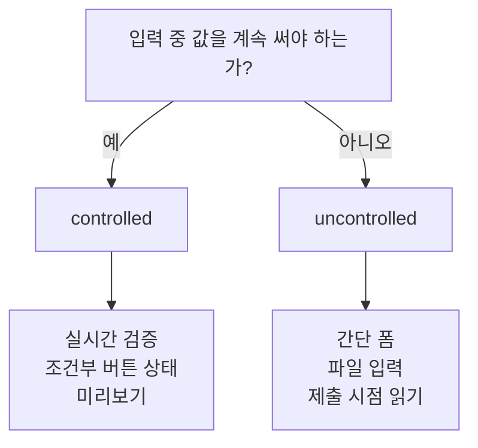

## 왜 폼에서 갑자기 복잡해지는가

React 초반에 많이 헷갈리는 지점이 폼이다.

입력값 하나만 받아도 곧바로 이런 고민이 생긴다.

- 입력값을 state로 관리해야 하나
- DOM에서 직접 읽어도 되나
- 검증과 에러 메시지는 어디서 처리하나

이때 나오는 두 가지 방식이 **controlled** 와 **uncontrolled** 다.

---

## controlled 컴포넌트

controlled 컴포넌트는 입력값의 현재 상태를 **React state가 소유**하는 방식이다.

```tsx
function SignupForm() {
  const [email, setEmail] = useState('')

  return (
    <input
      value={email}
      onChange={(e) => setEmail(e.target.value)}
    />
  )
}
```

여기서는 input의 실제 값과 React state가 항상 같이 움직인다.

### 장점

- 입력값을 항상 코드에서 볼 수 있다
- 실시간 검증이 쉽다
- 조건부 UI와 연결하기 쉽다

### 단점

- 필드가 많아질수록 보일러플레이트가 늘어난다
- 매 입력마다 state 업데이트가 일어난다

---

## uncontrolled 컴포넌트

uncontrolled 컴포넌트는 입력값을 DOM이 들고 있고, 필요할 때만 읽는 방식이다.

```tsx
function SignupForm() {
  const emailRef = useRef<HTMLInputElement>(null)

  function handleSubmit(e: React.FormEvent) {
    e.preventDefault()
    console.log(emailRef.current?.value)
  }

  return (
    <form onSubmit={handleSubmit}>
      <input ref={emailRef} defaultValue="" />
      <button type="submit">전송</button>
    </form>
  )
}
```

여기서는 React state가 아니라 input DOM이 값을 들고 있다.

### 장점

- 단순 폼에서는 코드가 짧다
- 기존 HTML 폼 방식과 가깝다
- 파일 입력처럼 DOM 중심인 경우에 자연스럽다

### 단점

- 입력 중 값을 React 트리에서 바로 다루기 어렵다
- 실시간 검증이나 UI 연동이 불편해질 수 있다

---

## 어떤 상황에서 무엇을 선택할까

### controlled가 잘 맞는 경우

- 실시간 유효성 검사
- 입력값으로 즉시 UI를 바꾸는 경우
- 여러 필드 상태를 함께 다뤄야 하는 경우

### uncontrolled가 잘 맞는 경우

- 제출 시점에만 값이 필요할 때
- 아주 단순한 폼
- 파일 업로드처럼 ref 접근이 자연스러운 경우



---

## React Hook Form이 인기 있는 이유

폼 라이브러리를 배우다 보면, 왜 React Hook Form이 자주 언급되는지 이해하게 된다.

이 라이브러리는 기본적으로 uncontrolled 성격을 활용하면서도, 검증과 에러 관리 같은 개발 편의를 잘 붙여 준다. 즉 controlled와 uncontrolled의 trade-off를 실무 친화적으로 풀어낸 셈이다.

---

## 실무에서는 이렇게 생각하면 편하다

- 단순 검색창, 제출 시점 읽기 중심 → uncontrolled도 충분
- 회원가입, 실시간 검증, 조건부 렌더링 → controlled 쪽이 안정적

::: tip
입문 단계에서는 "무조건 controlled가 정답"처럼 외우지 않는 편이 좋다. 핵심은 **누가 현재 값을 소유하느냐**를 분명히 아는 것이다.
:::

---

## 마치며

controlled와 uncontrolled는 둘 중 하나만 옳은 문제가 아니다.

중요한 것은 다음 질문이다.

- 입력값을 React가 계속 알고 있어야 하는가
- 아니면 제출 시점에만 읽으면 되는가

그 기준이 분명하면 폼 설계도 훨씬 단순해진다.

## 참고

<ol>
<li><a href="https://react.dev/reference/react-dom/components/input" target="_blank">[1] React Docs — input</a></li>
<li><a href="https://react.dev/learn/referencing-values-with-refs" target="_blank">[2] React Docs — Referencing Values with Refs</a></li>
</ol>

---

## 관련 글

- [React 단방향 데이터 흐름 →](/post/react-component-data-flow)
- [TypeScript 타입 시스템 기초 →](/post/typescript-type-system-basics)
- [TanStack Query 개요 →](/post/react-query-overview)
- [AI 웹개발자 로드맵 — Foundation 01~19 →](/post/ai-webdev-roadmap-foundation)
