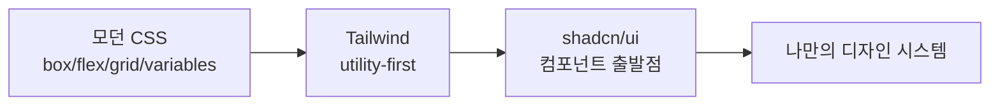

---
title: "UI & 스타일링 기초 — 모던 CSS, Tailwind, shadcn/ui를 어떻게 볼 것인가"
slug: modern-css-tailwind-shadcn
category: study/frontend/styling
tags: [css, modern-css, css-nesting, tailwindcss, shadcn-ui, ui]
author: Seobway
readTime: 12
featured: false
coverImage: /roadmap-thumbnails/step-05-ui-styling.svg
createdAt: 2026-04-16
excerpt: >
  Foundation 05 단계의 UI & 스타일링 학습 순서를 정리한다. 모던 CSS의 기본기,
  Tailwind의 utility-first 사고방식, shadcn/ui를 컴포넌트 출발점으로 쓰는 법을 다룬다.
---

## 이 시리즈 구성

| 단계 | 포스트 | 내용 |
|---|---|---|
| 01 | [브라우저 & 클라이언트 →](/post/js-event-loop-and-async) | JS 비동기, React 설계, TypeScript |
| 02 | [서버 & 데이터 →](/post/js-runtime-node-bun-deno) | 런타임, HTTP, Hono, SQL |
| 03 | [코드 품질 →](/post/code-quality-eslint-prettier-biome) | 가독성, 리팩토링, ESLint, Prettier, Biome |
| 04 | [Git & 릴리즈 →](/post/git-branching-conventional-commits-husky) | 브랜치 전략, Conventional Commits, Husky |
| 05 | [UI & 스타일링 →](/post/modern-css-tailwind-shadcn) | 모던 CSS, Tailwind, shadcn/ui |
| 06 | [AI 코딩 도구 →](/post/ai-coding-tools-cursor-copilot-claude-code-mcp) | Cursor, Copilot, Claude Code, MCP |
| 07 | [DB & ORM →](/post/db-orm-postgres-drizzle-neon-supabase) | PostgreSQL, Drizzle, Neon, Supabase |

---

## 스타일링은 도구보다 CSS 감각이 먼저다

Tailwind나 shadcn/ui를 쓰더라도 CSS의 기본 감각이 없으면 금방 막힌다.

먼저 알아야 할 것은 다음이다.

- 박스 모델
- cascade와 specificity
- flex/grid 레이아웃
- 반응형 단위
- CSS 변수
- nesting 같은 모던 CSS 기능

도구는 이 감각 위에서 속도를 올려 준다.

---

## 모던 CSS — 이제 CSS 자체가 꽤 강하다

예전에는 Sass가 필요했던 기능 일부가 CSS에 직접 들어왔다. 대표적으로 CSS Nesting은 선택자를 중첩해서 쓸 수 있게 해 준다.<a href="https://developer.mozilla.org/en-US/docs/Web/CSS/CSS_nesting" target="_blank"><sup>[1]</sup></a>

```css
.card {
  padding: 16px;
  border: 1px solid var(--border);

  &:hover {
    border-color: var(--accent);
  }
}
```

CSS 변수도 디자인 토큰을 표현하기 좋다.

```css
:root {
  --color-bg: #faf7ef;
  --color-text: #27231f;
  --space-4: 16px;
}
```

::: notice
모던 CSS를 배운다는 것은 "라이브러리 없이 다 만들자"가 아니다. **도구가 생성하는 CSS를 읽을 수 있는 상태**가 되는 것이다.
:::

---

## Tailwind — utility-first로 빠르게 조합한다

Tailwind CSS는 미리 정의된 utility class를 조합해서 UI를 만드는 방식이다.<a href="https://tailwindcss.com/docs/styling-with-utility-classes" target="_blank"><sup>[2]</sup></a>

```tsx
function Card() {
  return (
    <article className="rounded-xl border bg-white p-6 shadow-sm">
      <h2 className="text-lg font-semibold">제목</h2>
      <p className="mt-2 text-sm text-neutral-600">본문 설명</p>
    </article>
  )
}
```

장점:

- CSS 파일 이동이 줄어든다
- 디자인 토큰 기반으로 일관성을 유지하기 쉽다
- 빠르게 프로토타이핑할 수 있다

주의할 점:

- className이 길어질 수 있다
- 디자인 기준 없이 쓰면 화면이 산만해진다
- 재사용 단위를 컴포넌트로 잘 나눠야 한다

---

## shadcn/ui — 복붙 가능한 컴포넌트 출발점

shadcn/ui는 패키지처럼 숨겨진 컴포넌트를 가져오는 방식이 아니라, Radix UI와 Tailwind 기반 컴포넌트 코드를 프로젝트에 가져와 직접 소유하는 방식이다.<a href="https://ui.shadcn.com/docs" target="_blank"><sup>[3]</sup></a>

이 방식의 장점은 명확하다.

- 컴포넌트 코드를 직접 수정할 수 있다
- 디자인 시스템 출발점으로 쓰기 좋다
- 접근성 기반 primitive를 활용할 수 있다

단점도 있다.

- 가져온 코드를 프로젝트가 직접 관리해야 한다
- 디자인 기준 없이 가져오면 UI가 조각난다

---

## 추천 학습 순서



1. CSS 기본 레이아웃을 먼저 익힌다
2. Tailwind로 같은 UI를 빠르게 조합해 본다
3. shadcn/ui 컴포넌트를 가져와 구조를 읽는다
4. 색상, spacing, radius, typography 기준을 정한다

::: tip
shadcn/ui는 완성품이라기보다 **좋은 출발점**에 가깝다. 가져온 뒤 프로젝트 톤에 맞춰 색, 간격, 컴포넌트 API를 다듬어야 진짜 내 UI가 된다.
:::

---

## 조금 더 깊게 보기

### UI 도구를 쓰기 전에 시각 기준이 필요하다

Tailwind나 shadcn/ui를 쓰면 화면을 빨리 만들 수 있다. 하지만 기준 없이 빠르게 만들면 더 빨리 어수선해진다. 색상, 간격, radius, typography, shadow의 기준이 먼저 있어야 도구가 생산성으로 작동한다.

### 모던 CSS를 알아야 하는 이유

Tailwind를 쓰더라도 결국 브라우저가 해석하는 것은 CSS다. cascade, specificity, layout, stacking context를 모르면 class를 아무리 조합해도 문제가 생겼을 때 해결하기 어렵다. CSS 변수와 nesting은 디자인 토큰과 컴포넌트 스타일을 이해하는 데 특히 중요하다.

### shadcn/ui의 진짜 장점

shadcn/ui는 완제품 UI 키트라기보다 좋은 컴포넌트 출발점이다. 코드를 프로젝트 안으로 가져오기 때문에 수정 권한이 생긴다. 이 말은 곧 책임도 생긴다는 뜻이다. 가져온 컴포넌트를 그대로 쌓기보다, 프로젝트의 톤과 접근성 기준에 맞게 정리해야 한다.

### 개발자 인사이트

UI 품질은 예쁜 색보다 일관성에서 나온다. 같은 간격, 같은 버튼 상태, 같은 폼 에러 표현이 반복되면 사용자는 제품을 안정적으로 느낀다. 디자인 시스템은 거창한 문서가 아니라 이런 반복 규칙을 코드로 고정하는 과정이다.

## 참고

<ol>
<li><a href="https://developer.mozilla.org/en-US/docs/Web/CSS/CSS_nesting" target="_blank">[1] MDN — CSS Nesting</a></li>
<li><a href="https://tailwindcss.com/docs/styling-with-utility-classes" target="_blank">[2] Tailwind CSS Docs — Styling with utility classes</a></li>
<li><a href="https://ui.shadcn.com/docs" target="_blank">[3] shadcn/ui Docs</a></li>
<li><a href="https://developer.mozilla.org/en-US/docs/Web/CSS/Cascade" target="_blank">[4] MDN — Cascade, specificity, and inheritance</a></li>
<li><a href="https://www.w3.org/WAI/fundamentals/accessibility-intro/" target="_blank">[5] W3C WAI — Introduction to Web Accessibility</a></li>
</ol>

---

## 관련 글

- [React 단방향 데이터 흐름 →](/post/react-component-data-flow)
- [controlled vs uncontrolled 컴포넌트 →](/post/react-controlled-vs-uncontrolled)
- [AI 웹개발자 로드맵 — Foundation 01~07 →](/post/ai-webdev-roadmap-foundation)
