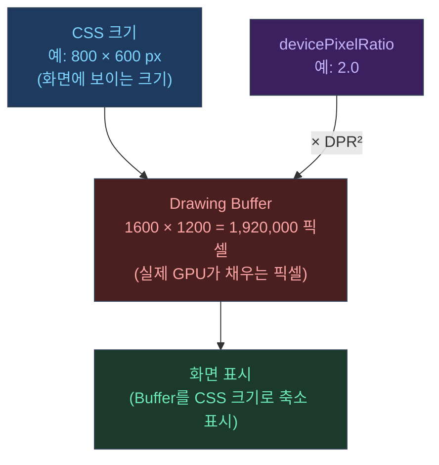

## 결론부터: DPR은 픽셀 수를 DPR² 배로 만든다

고DPI 환경에서 `devicePixelRatio`가 2라면, 같은 화면 크기라도 내부 픽셀 수는 4배가 된다.  
그래서 DPR은 사실상 "선명도 스위치"이자 "GPU 부하 스위치"다.

---

## 1) 캔버스는 크기가 2개다: CSS 크기 vs drawing buffer 크기

Three.js 공식 매뉴얼은 "캔버스는 2가지 크기가 있다"고 명확히 말한다.<a href="https://threejs.org/manual/en/responsive.html" target="_blank"><sup>[1]</sup></a>



- **CSS 크기**: 페이지에서 보이는 크기(`clientWidth/clientHeight`)
- **drawing buffer 크기**: 실제로 렌더링되는 픽셀 수(`canvas.width/canvas.height`)

CSS로 캔버스를 크게 늘렸는데 drawing buffer가 작으면, "이미지를 확대해서 보여주는 것"과 같아서 **블러/블록감**이 생긴다.<a href="https://threejs.org/manual/en/responsive.html" target="_blank"><sup>[1]</sup></a>

---

## 2) 리사이즈에서 해야 하는 최소 2가지

매뉴얼이 제시하는 기본 패턴은 이렇다.<a href="https://threejs.org/manual/en/responsive.html" target="_blank"><sup>[1]</sup></a>

```javascript
function resizeRendererToDisplaySize(renderer) {
  const canvas = renderer.domElement;
  const width = canvas.clientWidth;
  const height = canvas.clientHeight;
  const needResize = canvas.width !== width || canvas.height !== height;
  if (needResize) {
    // false: CSS 크기는 그대로, drawing buffer만 맞춤
    renderer.setSize(width, height, false);
  }
  return needResize;
}

function animate() {
  if (resizeRendererToDisplaySize(renderer)) {
    // drawing buffer가 바뀌었으면 카메라 aspect도 맞춰야 함
    camera.aspect = canvas.clientWidth / canvas.clientHeight;
    camera.updateProjectionMatrix();
  }
  renderer.render(scene, camera);
  requestAnimationFrame(animate);
}
```

- `renderer.setSize(width, height, false)` — drawing buffer를 디스플레이 크기에 맞춘다
- `camera.updateProjectionMatrix()` — aspect 변경을 projection에 반영한다

---

## 3) HD-DPI 처리: "그냥 안 한다"도 정답일 수 있다

Three.js는 HD-DPI에서 내부 픽셀 수가 폭증하므로, "아무것도 하지 않는" 선택이 오히려 현실적인 경우가 많다고 설명한다.<a href="https://threejs.org/manual/en/responsive.html" target="_blank"><sup>[1]</sup></a>

특히 모바일은 DPR이 3인 경우도 있어, 내부 픽셀 수가 9배가 된다.  
이건 정말로 "프레임이 죽는 지름길"이다.

---

## 4) setPixelRatio에 대한 공식 매뉴얼의 톤(중요)

Three.js 매뉴얼은 `renderer.setPixelRatio(window.devicePixelRatio)` 방식에 대해 **강하게 비추천**한다.<a href="https://threejs.org/manual/en/responsive.html" target="_blank"><sup>[1]</sup></a>

요지는 이거다.

- `setPixelRatio`를 쓰면, `setSize`에 넣은 값과 실제 drawing buffer 크기가 달라져서
- 후처리(render target), `gl_FragCoord`, 픽셀 읽기(readPixels) 같은 작업에서
- "내가 요청한 크기"와 "실제 크기"가 어긋나 추론이 어려워진다

대신 매뉴얼은 "직접 계산해서 원하는 drawing buffer 크기를 정확히 통제하라"는 패턴을 제시한다.<a href="https://threejs.org/manual/en/responsive.html" target="_blank"><sup>[1]</sup></a>

```javascript
// 권장: DPR을 직접 계산해서 setSize에 넣기
function resizeWithDPR(renderer, dprCap = 2) {
  const canvas = renderer.domElement;
  const dpr = Math.min(window.devicePixelRatio, dprCap);
  const w = Math.floor(canvas.clientWidth * dpr);
  const h = Math.floor(canvas.clientHeight * dpr);
  if (canvas.width !== w || canvas.height !== h) {
    renderer.setSize(w, h, false); // setPixelRatio 없이 직접 제어
  }
}
```

---

## 5) DPR을 "제한(cap)"하는 이유

Three.js 매뉴얼은 HD-DPI 환경에서 과도한 내부 해상도가 GPU 부하를 키울 수 있어, **최대 internal resolution을 제한하는 방법**까지 예시로 제공한다.<a href="https://threejs.org/manual/en/responsive.html" target="_blank"><sup>[1]</sup></a>

이게 우리 포트폴리오 최적화에서 했던 일과 연결된다.

- DPR을 낮추거나
- 내부 픽셀 수(=width×height)를 상한으로 두는 방식

---

## 6) 인터랙티브 데모: DPR 슬라이더

슬라이더로 DPR을 바꾸면서 선명도와 내부 픽셀 수의 변화를 직접 확인할 수 있다.

- DPR ↑: TorusKnot 엣지가 선명해지지만 GPU 픽셀 수가 급증
- DPR ↓: 픽셀 수가 크게 줄지만 엣지/글로우가 흐릿해짐

<iframe
  src="/threejs-demos/dpr-slider.html"
  width="100%"
  height="400"
  style="border:none; border-radius:12px; display:block; margin:1.5rem 0;"
  loading="lazy"
  title="DPR vs 성능 인터랙티브 데모"
></iframe>

---

## 7) 실전 체크리스트

- **선명도가 떨어졌다**: 거의 항상 drawing buffer 픽셀이 줄어든 것이다(대개 DPR 때문)
- **프레임이 갑자기 좋아졌다**: 픽셀 수가 줄어 GPU가 숨통이 트였을 가능성이 크다
- **정지 화면은 선명, 움직일 때만 성능**을 원한다:
  - "항상 DPR 다운"이 아니라
  - 상태 기반(Interaction vs Idle)으로 DPR/렌더 루프를 제어하는 게 더 좋은 설계다

---

## 관련 글

- [렌더링 파이프라인: Scene → Camera → Renderer →](/post/threejs-rendering-pipeline)
- [Frustum Culling: 보이는 것만 그리기 →](/post/threejs-frustum-culling)
- [Three.js 포트폴리오 최적화 실전기 →](/post/threejs-portfolio-rendering-optimization-story)

---

## 참고

<a href="https://threejs.org/manual/en/responsive.html" target="_blank">[1] Responsive Design — Three.js Manual</a>
