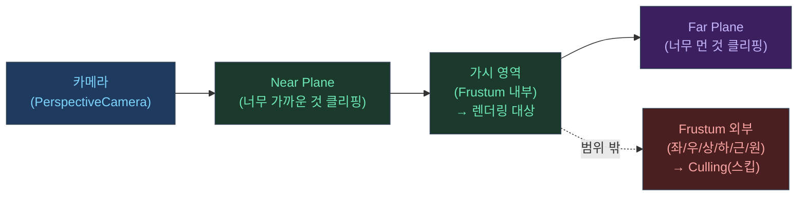

## 이 글에서 다룰 것

- 프러스텀(Frustum)이란 무엇인가
- 컬링(Culling)이 왜 "렌더 최적화의 첫 번째 레버"인지
- Three.js에서 컬링이 어떻게 작동하는지(개념 + 코드)

---

## 1) 프러스텀(Frustum) = 카메라가 보는 절두체

원근 카메라는 "원뿔"이 아니라 **절두체(Frustum)** 형태로 공간을 잘라서 본다.



- near plane보다 가까운 건 잘린다
- far plane보다 먼 것도 잘린다
- 좌/우/상/하도 시야 밖이면 잘린다

이 절두체 밖의 오브젝트는 **애초에 그릴 필요가 없다**.

---

## 2) 컬링이 왜 그렇게 중요한가

렌더링 비용은 크게 2단계로 볼 수 있다.

- **그릴지 말지 결정**(CPU 쪽 판단)
- **실제로 그리기**(GPU가 픽셀을 채우는 비용)

컬링은 "그릴지 말지" 단계에서 오브젝트를 빼버리니까,

- 드로우콜
- 셰이더 실행
- 픽셀 채우기(fill-rate)

같은 비용을 통째로 줄이는 효과가 있다.

---

## 3) Three.js의 자동 Frustum Culling

Three.js는 **기본적으로 모든 Mesh에 frustum culling을 켜둔다**.<a href="https://threejs.org/manual/en/fundamentals.html" target="_blank"><sup>[1]</sup></a>

내부적으로 Mesh마다 `BoundingSphere`(바운딩 구)를 계산하고, 매 프레임 렌더 전에 카메라 절두체와 교차 여부를 확인한다. 절두체 밖이면 드로우콜 자체를 건너뛴다.

```javascript
// 기본값: frustumCulled = true (자동 컬링 활성)
const mesh = new THREE.Mesh(geo, mat);
console.log(mesh.frustumCulled); // true

// 컬링을 끄고 싶을 때 (항상 그려야 하는 오브젝트 — 예: 전체화면 후처리용 쿼드)
mesh.frustumCulled = false;
```

바운딩 볼륨이 geometry와 맞지 않을 때(예: 버텍스 셰이더에서 위치를 동적으로 바꾸는 경우)는 수동으로 갱신해야 한다.

```javascript
// geometry가 변경된 후 바운딩 구 재계산
geo.computeBoundingSphere();
geo.computeBoundingBox();
```

---

## 4) 실전 팁(최적화 글과 연결)

컬링은 특히 이런 경우에 체감이 크다.

- 씬에 오브젝트가 많다(수백~수천)
- 카메라가 이동한다(가시 영역이 계속 바뀐다)
- 포스트프로세싱/고DPR로 픽셀 비용이 크다

다만, "내 포트폴리오 키보드 씬"처럼 오브젝트 수가 제한적이고 화면에 대부분 들어오는 경우에는 컬링이 병목이 아닐 수도 있다.  
그럴 때는 DPR, rAF 루프, 입력 이벤트(Raycaster) 쪽이 더 큰 레버가 된다.

---

## 관련 글

- [DPR과 캔버스 해상도: 선명도/성능의 본질 →](/post/threejs-dpr-and-canvas-resolution)
- [glTF 로딩: 씬 그래프, 렌더 타이밍 →](/post/threejs-gltf-loading)
- [Three.js 포트폴리오 최적화 실전기 →](/post/threejs-portfolio-rendering-optimization-story)

---

## 참고

<a href="https://threejs.org/manual/en/fundamentals.html" target="_blank">[1] Fundamentals — Three.js Manual</a>

<a href="https://threejs.org/manual/en/tips.html" target="_blank">[2] Tips on Optimizing — Three.js Manual</a>
