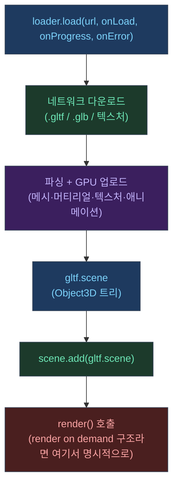

## 왜 glTF가 기준 포맷인가

웹에서 3D 모델을 전달할 때 glTF는 사실상 표준에 가깝다.  
Three.js도 공식 매뉴얼에서 glTF 로딩을 별도 글로 다룬다.<a href="https://threejs.org/manual/en/load-gltf.html" target="_blank"><sup>[1]</sup></a>

---

## 로딩 전체 흐름



---

## 1) 로딩의 결과는 "Mesh 하나"가 아니라 "Scene 그래프"다

glTF는 한 파일 안에 다음이 같이 들어갈 수 있다.

- 노드 트리(부모/자식 변환)
- 여러 Mesh
- 머티리얼/텍스처
- 애니메이션
- 카메라/라이트(있을 수도)

그래서 `GLTFLoader`가 주는 결과에서 실제로 많이 쓰는 건 `gltf.scene`이다.<a href="https://threejs.org/manual/en/load-gltf.html" target="_blank"><sup>[1]</sup></a>

---

## 2) 기본 코드 패턴(load / loadAsync)

매뉴얼 기준 패턴은 다음과 같다.<a href="https://threejs.org/manual/en/load-gltf.html" target="_blank"><sup>[1]</sup></a>

```javascript
import { GLTFLoader } from "three/addons/loaders/GLTFLoader.js";

const loader = new GLTFLoader();

// 콜백 방식: load(url, onLoad, onProgress, onError)
loader.load(
  "path/to/model.gltf",
  (gltf) => {
    scene.add(gltf.scene);
    render(); // render on demand라면 명시적으로 한 번 호출
  },
  (xhr) => {
    console.log(`${(xhr.loaded / xhr.total * 100).toFixed(1)}% loaded`);
  },
  (error) => {
    console.error("GLTFLoader error:", error);
  }
);
```

또는 `loadAsync()`를 쓰면 async/await로 정리할 수 있다.<a href="https://threejs.org/manual/en/load-gltf.html" target="_blank"><sup>[1]</sup></a>

```javascript
async function loadModel(url) {
  try {
    const gltf = await loader.loadAsync(url);
    scene.add(gltf.scene);
    render();
  } catch (err) {
    console.error("모델 로딩 실패:", err);
  }
}
```

---

## 3) Draco 압축 모델 사용 시

실무에서는 파일 크기를 줄이기 위해 Draco 압축을 쓰는 경우가 많다.  
이때는 `DRACOLoader`를 `GLTFLoader`에 연결해야 한다.

```javascript
import { GLTFLoader }   from "three/addons/loaders/GLTFLoader.js";
import { DRACOLoader }  from "three/addons/loaders/DRACOLoader.js";

const dracoLoader = new DRACOLoader();
// Draco 디코더 WASM을 제공하는 경로 (three.js examples/jsm/libs/draco/)
dracoLoader.setDecoderPath("https://cdn.jsdelivr.net/npm/three@0.169.0/examples/jsm/libs/draco/");

const loader = new GLTFLoader();
loader.setDRACOLoader(dracoLoader);
```

---

## 4) "모델을 올렸는데 화면이 안 바뀌는" 이유

Three.js는 "렌더 함수가 호출되었을 때"만 화면이 갱신된다.

즉 모델 로딩이 끝나서 `scene.add()`를 해도,

- 계속 rAF 루프를 돌리고 있다면: 다음 프레임에 자연히 그려짐
- **render on demand** 구조라면: 로딩 완료 시점에 `render()`를 한 번 호출해야 한다

이건 Three.js 매뉴얼의 "Rendering on Demand"가 말하는 핵심이다.<a href="https://threejs.org/manual/en/rendering-on-demand.html" target="_blank"><sup>[2]</sup></a>

---

## 5) 실전 최적화 연결 포인트

모델 로딩이 큰 프로젝트에서 "초반 버벅임/흰 화면"은 보통 다음과 연결된다.

- 텍스처가 크다(다운로드/디코드/GPU 업로드 비용)
- 드로잉 버퍼가 크다(DPR이 높다)
- 로딩 완료 직후 바로 애니메이션 루프를 풀로 돌린다

그래서 "로딩 완료 → 첫 렌더 → 필요할 때만 렌더" 패턴이 UI 친화적이다.

---

## 참고

<a href="https://threejs.org/manual/en/load-gltf.html" target="_blank">[1] Loading a .GLTF File — Three.js Manual</a>

<a href="https://threejs.org/manual/en/rendering-on-demand.html" target="_blank">[2] Rendering on Demand — Three.js Manual</a>

---

## 관련 글

- [Frustum Culling: 보이는 것만 그리기 →](/post/threejs-frustum-culling)
- [Raycaster & Picking 성능 →](/post/threejs-raycaster-picking-performance)
- [Three.js 포트폴리오 최적화 실전기 →](/post/threejs-portfolio-rendering-optimization-story)
