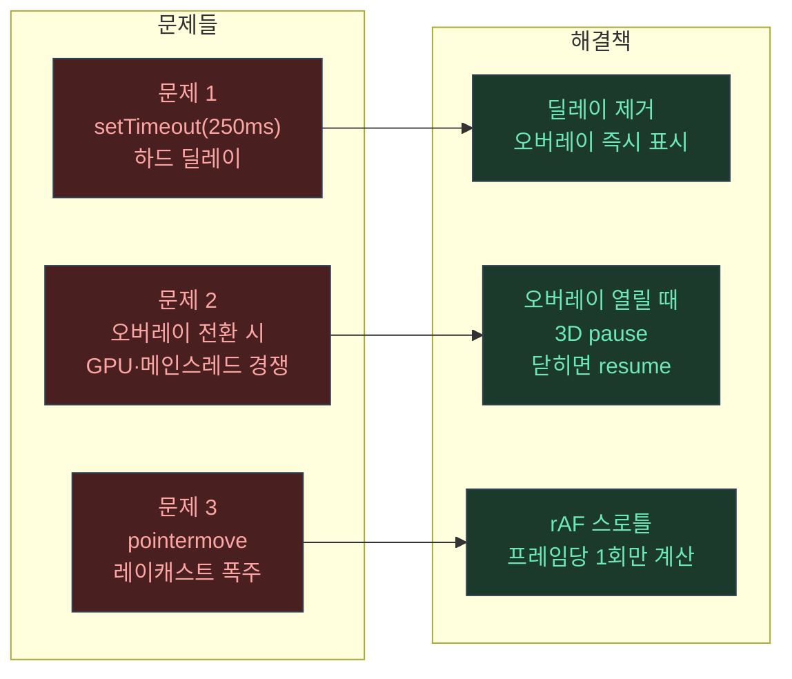
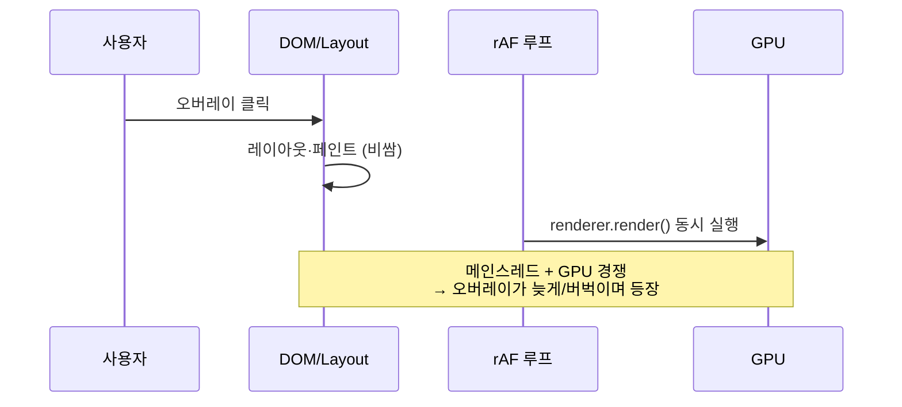
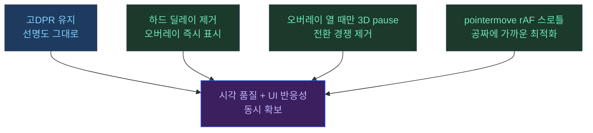

## 이 글은 튜토리얼이 아니다

Three.js "사용법"을 설명하지 않는다.  
대신 실제로 겪은 최적화 시행착오를 **스토리라인(문제→가설→측정→실험→결론)**으로 정리한다.

핵심은 하나다.

> 버벅임은 단순히 "3D가 무거워서"가 아니라, **UI 전환 순간**에 메인스레드/GPU가 동시에 바빠지는 "경쟁"에서 터진다.

---

## 문제 → 해결 전체 구조



---

## 0) 재현 가능한 실험 환경부터 만든다 (이게 포인트)

말로 "빨라졌다"는 설득력이 약하다.  
그래서 비교 케이스 3개를 고정했다.

- **Before**: baseline
- **After**: 최적화 버전
- **Hybrid(실사용)**: 선명도는 유지하면서 오버레이 UX는 개선

그리고 독자가 직접 눌러서 측정할 수 있도록 "실험 페이지"를 만들었다.

- `public/portfolio/perf-lab.html`
  - 3개를 동시에 띄우고
  - 버튼 한 번으로 지표 표를 뽑는다

이 한 페이지로 "주관적 체감"을 "재현 가능한 실험"으로 바꿀 수 있다.

---

## 1) 첫 번째 병목: 오버레이가 늦게 뜬다

처음엔 "Three.js가 무거워서 UI가 늦게 뜨는 것"처럼 보였는데, 실제로는 더 단순했다.

- 오버레이 열기 함수에 `setTimeout(250ms)`가 들어 있었다
- 그래서 최소 250ms는 무조건 늦게 뜬다

**Before (문제 코드)**

```javascript
// ❌ 하드 딜레이
function openOverlay(id) {
  setTimeout(() => {
    overlay.classList.add('active');
    loadContent(id);
  }, 250); // 왜 있었는지 불명... 애니메이션 의도였던 것 같음
}
```

**After (해결)**

```javascript
// ✅ 즉시 표시, 애니메이션은 CSS transition에 위임
function openOverlay(id) {
  loadContent(id);              // 콘텐츠 즉시 세팅
  overlay.classList.add('active'); // CSS transition으로 페이드인
  pause3D();                    // 3D 루프는 pause (다음 병목 해결과 연결)
}
```

> 포인트: "렌더링 최적화"가 아니라 **UI 반응성 문제**였다.

---

## 2) 두 번째 병목: 오버레이 전환 순간의 '경쟁'

오버레이가 뜨는 순간엔 DOM 업데이트/레이아웃/페인트가 들어간다.  
그런데 3D가 계속 풀로 돌아가면(특히 고DPI) GPU/메인스레드가 바빠서 UI가 눌리는 순간이 나온다.



**해결**

```javascript
let rafId = null;

function pause3D() {
  if (rafId !== null) {
    cancelAnimationFrame(rafId);
    rafId = null;
  }
}

function resume3D() {
  if (rafId === null) {
    animate(); // 루프 재시작
  }
}

function openOverlay(id) {
  loadContent(id);
  overlay.classList.add('active');
  pause3D(); // ← 오버레이가 뜨는 동안 3D는 쉰다
}

function closeOverlay() {
  overlay.classList.remove('active');
  resume3D(); // ← 닫히면 다시 시작
}
```

이건 "프레임을 낮추는 최적화"가 아니라, **전환 순간에 우선순위를 UI로 양보**하는 설계다.

---

## 3) 세 번째 병목: pointermove + Raycaster

`pointermove`는 이벤트가 많이 온다.  
여기서 매번 레이캐스트를 돌리면 메인스레드가 계속 바쁘다.

Three.js 매뉴얼도 picking(raycasting)이 CPU를 많이 먹는다고 경고한다.<a href="https://threejs.org/manual/en/picking.html" target="_blank"><sup>[1]</sup></a>

**해결**

```javascript
// 이벤트에서 바로 계산하지 않고, 마지막 포인터 위치만 저장
let pendingPointer = null;

canvas.addEventListener('pointermove', (e) => {
  const rect = canvas.getBoundingClientRect();
  pendingPointer = {
    x:  ((e.clientX - rect.left) / rect.width)  * 2 - 1,
    y: -((e.clientY - rect.top)  / rect.height) * 2 + 1,
  };
});

// rAF에서 프레임당 1회만 레이캐스트 실행
function animate() {
  rafId = requestAnimationFrame(animate);

  if (pendingPointer) {
    pointer.set(pendingPointer.x, pendingPointer.y);
    pendingPointer = null;
    raycaster.setFromCamera(pointer, camera);
    const hits = raycaster.intersectObjects(pickTargets);
    updateHover(hits);
  }

  renderer.render(scene, camera);
}
```

---

## 4) 트레이드오프: 선명도(DPR) vs 성능

여기서 가장 큰 "체감"이 갈린다.

- DPR을 낮추면 프레임은 살아나지만
- 모델/글로우/엣지 선명도가 떨어진다

Three.js 매뉴얼은 HD-DPI에서 내부 픽셀 수 폭증을 설명하면서, "그냥 안 하는 선택"도 현실적이라고 말한다.<a href="https://threejs.org/manual/en/responsive.html" target="_blank"><sup>[2]</sup></a>

그래서 최종 결론은 이렇게 갔다.

### Hybrid(실사용)



- **선명도는 이전처럼**(고DPR 유지)
- **오버레이는 즉시 표시**(하드 딜레이 제거)
- **오버레이 열 때만 3D pause**(전환 경쟁 제거)
- **pointermove는 rAF 스로틀**(공짜에 가까운 최적화)

> 이 조합이 "눈으로 보는 품질"과 "UI 반응성"을 동시에 잡았다.

---

## 참고

<a href="https://threejs.org/manual/en/picking.html" target="_blank">[1] Picking — Three.js Manual</a>

<a href="https://threejs.org/manual/en/responsive.html" target="_blank">[2] Responsive Design — Three.js Manual</a>

<a href="https://threejs.org/manual/en/rendering-on-demand.html" target="_blank">[3] Rendering on Demand — Three.js Manual</a>

---

## 관련 글

- [Three.js는 왜 만들어졌나 →](/post/why-threejs-exists)
- [렌더링 파이프라인: Scene → Camera → Renderer →](/post/threejs-rendering-pipeline)
- [DPR과 캔버스 해상도: 선명도/성능의 본질 →](/post/threejs-dpr-and-canvas-resolution)
- [Frustum Culling: 보이는 것만 그리기 →](/post/threejs-frustum-culling)
- [glTF 로딩: 씬 그래프, 렌더 타이밍 →](/post/threejs-gltf-loading)
- [Raycaster & Picking 성능 →](/post/threejs-raycaster-picking-performance)
