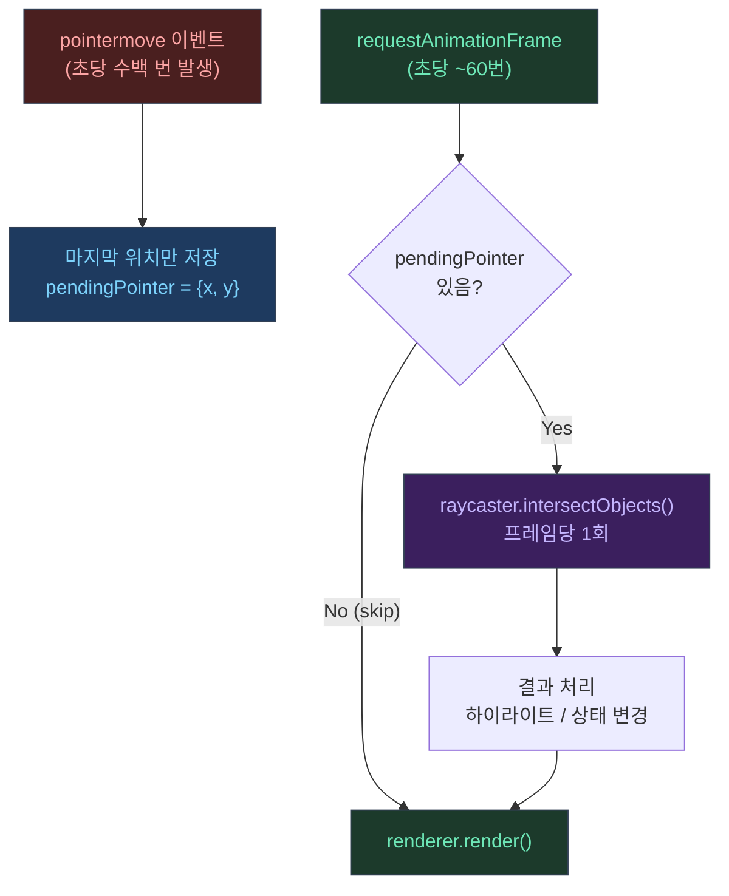

## 1) Picking(피킹)이란

Three.js 매뉴얼은 picking을 "사용자가 클릭/터치한 오브젝트를 알아내는 과정"이라고 정의한다.<a href="https://threejs.org/manual/en/picking.html" target="_blank"><sup>[1]</sup></a>

가장 흔한 방식은 레이캐스팅이다.

- 마우스 위치에서 카메라 절두체 방향으로 Ray를 쏜다
- 그 Ray가 어떤 오브젝트와 교차하는지 계산한다

---

## 2) 왜 비싼가: "삼각형을 다 검사"하는 문제가 된다

매뉴얼은 아주 직설적으로 말한다.<a href="https://threejs.org/manual/en/picking.html" target="_blank"><sup>[1]</sup></a>

> 1000개 오브젝트 × 오브젝트당 1000 triangle이면, 100만 triangle을 검사할 수 있다.

물론 실제 구현은 바운딩 볼륨(구/박스) 같은 "빠른 거"로 먼저 걸러서 최적화하지만,<a href="https://threejs.org/manual/en/picking.html" target="_blank"><sup>[1]</sup></a>  
씬이 커지면 결국 병목이 될 수 있다.

---

## 3) 흔한 실수: pointermove 이벤트마다 바로 레이캐스트

`pointermove`는 초당 수백 번도 쉽게 발생한다.  
여기에 `intersectObjects()`를 바로 붙이면, 사용자가 마우스를 살짝만 움직여도 CPU가 계속 바쁘다.

```javascript
// ❌ 나쁜 패턴: 이벤트마다 즉시 계산
canvas.addEventListener('pointermove', (e) => {
  const pointer = getPointerNDC(e); // Normalized Device Coordinates
  raycaster.setFromCamera(pointer, camera);
  const hits = raycaster.intersectObjects(scene.children); // 매 이벤트마다 실행!
  handleHits(hits);
});
```

이게 "버벅임"으로 체감되는 이유:

- 메인스레드는 레이캐스트 계산을 한다
- 동시에 렌더 루프도 돌고 있다
- UI(오버레이/레이아웃)까지 들어오면 경쟁이 겹친다

---

## 4) 실전 해법: rAF 스로틀(프레임당 1회만)

핵심 아이디어는 이거다.

- 이벤트는 "마지막 값만 저장"한다
- 실제 계산은 `requestAnimationFrame`에서 1번만 한다

```javascript
// ✅ 좋은 패턴: rAF 스로틀
const pointer   = new THREE.Vector2();
const raycaster = new THREE.Raycaster();
let   pendingPointer = null; // 이벤트에서 받은 마지막 위치

// 이벤트 핸들러: 위치만 저장
canvas.addEventListener('pointermove', (e) => {
  const rect = canvas.getBoundingClientRect();
  pendingPointer = {
    x:  ((e.clientX - rect.left)  / rect.width)  * 2 - 1,
    y: -((e.clientY - rect.top)   / rect.height) * 2 + 1,
  };
});

// rAF 루프: 프레임당 1회만 레이캐스트
function animate() {
  requestAnimationFrame(animate);

  // 저장된 포인터가 있을 때만 레이캐스트
  if (pendingPointer) {
    pointer.set(pendingPointer.x, pendingPointer.y);
    pendingPointer = null; // 소비 처리

    raycaster.setFromCamera(pointer, camera);
    const hits = raycaster.intersectObjects(pickTargets); // 대상 배열 분리
    handleHits(hits);
  }

  renderer.render(scene, camera);
}
```

이 패턴이 효과적인 이유:

- `pointermove`가 초당 200번 와도 → 레이캐스트는 초당 60번(60fps 기준)만 실행
- `pendingPointer`에 덮어쓰기만 하므로 "마지막 위치"가 항상 반영됨
- GC 부담을 줄이려면 `pendingPointer` 객체를 재사용하거나 `{x, y}` 대신 두 숫자 변수를 사용

---

## 5) 실전 해법 2: "피킹 대상"을 줄여라

매뉴얼에서도 picking의 한계를 보여주면서, 상황에 따라 GPU picking 같은 대안을 언급한다.<a href="https://threejs.org/manual/en/picking.html" target="_blank"><sup>[1]</sup></a>

일반적인 CPU Raycaster 최적화 방향은 보통 다음이다.

```javascript
// ✅ 피킹 대상 배열 따로 관리
const pickTargets = [mesh1, mesh2, btn3D]; // 클릭 가능한 것만

// scene.children 전체 넘기지 말고
raycaster.intersectObjects(pickTargets);

// ✅ 오버레이가 열려 있을 때는 피킹 자체를 끔
if (overlayOpen) return; // 불필요한 레이캐스트 완전 생략
```

---

## 6) 이벤트 흐름 한눈에



---

## 7) 인터랙티브 데모

아래 데모에서 두 모드를 직접 비교할 수 있다.

- **pointermove 직접**: 이벤트마다 즉시 `intersectObjects()` → "이벤트/초"와 "레이캐스트/초"가 같음
- **rAF 스로틀**: 위치만 저장 → "레이캐스트/초"가 프레임 수(~60)로 제한됨

마우스를 빠르게 흔들면서 두 수치의 차이를 확인해 보자.

<iframe
  src="/threejs-demos/raycaster-demo.html"
  width="100%"
  height="420"
  style="border:none; border-radius:12px; display:block; margin:1.5rem 0;"
  loading="lazy"
  title="Raycaster rAF 스로틀 vs 직접 비교 데모"
></iframe>

---

## 참고

<a href="https://threejs.org/manual/en/picking.html" target="_blank">[1] Picking — Three.js Manual</a>

---

## 관련 글

- [glTF 로딩: 씬 그래프, 렌더 타이밍 →](/post/threejs-gltf-loading)
- [Frustum Culling: 보이는 것만 그리기 →](/post/threejs-frustum-culling)
- [Three.js 포트폴리오 최적화 실전기 →](/post/threejs-portfolio-rendering-optimization-story)
