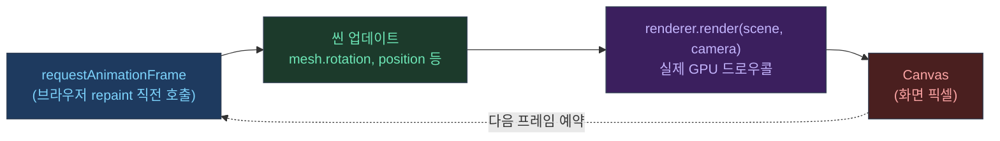

## 이 글의 목표

Three.js를 처음 접하면 코드가 대개 이렇게 시작한다.

- `Scene` 만들고
- `Camera` 만들고
- `WebGLRenderer` 만들고
- `requestAnimationFrame`으로 루프를 돌리고

이 글은 "어떻게 쓰는지"보다 **왜 이런 모양인지(내부 동작/역할 분리)**를 설명한다. 이후 최적화 글에서 _무엇을 멈추고( pause ), 무엇을 줄이고(DPR), 무엇을 스로틀(rAF)_ 해야 하는지 판단할 수 있게 만드는 게 목적이다.

---

## 전체 흐름 한눈에



---

## 1) Scene: "렌더링 대상"을 담는 그래프(컨테이너)

Three.js의 `Scene`은 실제로 "화면"이 아니라 **렌더링할 오브젝트들을 담는 컨테이너**다.  
Mesh/Light/Group 같은 것들이 트리 형태로 붙고, 그 결과가 렌더러에 전달된다.

핵심 포인트:

- **Scene은 데이터 구조**다(오브젝트의 관계/변환/머티리얼 등).
- "무엇을 그릴지"는 Scene에, "어떻게 볼지"는 Camera에, "어떻게 실제 픽셀로 만들지"는 Renderer에 분리된다.

---

## 2) Camera: "어떤 시점으로 볼지" + "어디까지 보이는지(절두체)"

카메라는 2가지를 동시에 결정한다.

- **뷰(view)**: 카메라 위치/방향에서 "어떻게 바라보는지"
- **프로젝션(projection)**: 3D를 2D 화면에 "어떻게 투영하는지"

실전에서 가장 많이 쓰는 건 `PerspectiveCamera`다. (원근감이 생김)

```javascript
// fov: 수직 시야각(도), aspect: 가로/세로 비율, near/far: 렌더 범위
const camera = new THREE.PerspectiveCamera(
  75, // fov
  canvas.clientWidth / canvas.clientHeight, // aspect
  0.1, // near
  100, // far
);
camera.position.set(0, 2, 5);
```

이 지점이 최적화와 연결된다:

- 카메라의 **near/far** 범위가 너무 넓으면 depth precision 문제가 생길 수 있고
- 프러스텀(카메라가 보는 절두체) 바깥의 오브젝트는 **culling**으로 제외될 수 있다 (다음 글에서 다룸)

---

## 3) WebGLRenderer: "Scene+Camera를 캔버스 픽셀로 바꾸는 엔진"

Three.js에서 실제로 GPU(WebGL) 호출을 담당하는 쪽이 `WebGLRenderer`다.

가장 중요한 1줄은 이거다.

```javascript
renderer.render(scene, camera);
```

`render()`는 **"지금 이 순간의 Scene을, 지금 이 Camera로 봤을 때의 결과를" 캔버스에 그린다**.

즉, 렌더링 비용은 대체로 다음으로 구성된다.

- Scene 안에 있는 **오브젝트 수/복잡도**
- 머티리얼/라이트/텍스처/쉐이더의 비용
- 캔버스 내부 해상도(DPR로 결정되는 픽셀 수)
- "초당 몇 번 render()를 호출하느냐"(프레임 루프)

---

## 4) requestAnimationFrame(rAF): "프레임 타이밍에 맞추는 루프"

브라우저는 화면을 계속 repaint 한다. `requestAnimationFrame()`은 "다음 repaint 직전에 콜백을 호출해 달라"는 API다.<a href="https://developer.mozilla.org/en-US/docs/Web/API/Window/requestAnimationFrame" target="_blank"><sup>[1]</sup></a>

가장 단순한 형태는 이렇게 생겼다.

```javascript
function animate() {
  // 씬 업데이트
  mesh.rotation.y += 0.01;

  // 실제 렌더
  renderer.render(scene, camera);

  // 다음 프레임 예약 (one-shot이므로 반드시 재호출)
  requestAnimationFrame(animate);
}
requestAnimationFrame(animate);
```

중요한 디테일:

- `requestAnimationFrame()`은 **one-shot**이다. 계속 돌리고 싶으면 콜백에서 다시 호출해야 한다.<a href="https://developer.mozilla.org/en-US/docs/Web/API/Window/requestAnimationFrame" target="_blank"><sup>[1]</sup></a>
- 대체로 디스플레이 주사율(보통 60Hz)에 맞춰 호출되지만, 환경에 따라 120/144Hz일 수도 있다.<a href="https://developer.mozilla.org/en-US/docs/Web/API/Window/requestAnimationFrame" target="_blank"><sup>[1]</sup></a>
- **백그라운드 탭/숨겨진 iframe**에서는 rAF가 멈추거나 줄어드는 최적화가 걸린다.<a href="https://developer.mozilla.org/en-US/docs/Web/API/Window/requestAnimationFrame" target="_blank"><sup>[1]</sup></a>

루프를 멈추고 싶을 때는 `cancelAnimationFrame(rafId)`를 쓴다.

```javascript
let rafId = null;

function startLoop() {
  function tick() {
    renderer.render(scene, camera);
    rafId = requestAnimationFrame(tick);
  }
  rafId = requestAnimationFrame(tick);
}

function stopLoop() {
  if (rafId !== null) {
    cancelAnimationFrame(rafId);
    rafId = null;
  }
}
```

---

## 5) "항상 루프"가 답은 아니다: Rendering on Demand

Three.js 공식 매뉴얼은 "움직이지 않는 화면을 굳이 매 프레임 렌더링하는 건 낭비"라고 말한다.<a href="https://threejs.org/manual/en/rendering-on-demand.html" target="_blank"><sup>[2]</sup></a>

핵심은 이거다.

- 애니메이션이 없다면: **처음 1번 렌더하고, 변화가 있을 때만 렌더하라**
- 변화란: 모델/텍스처 로딩 완료, UI 입력, 카메라 변경, 리사이즈 등

이 관점은 "UI가 뜨는 순간" 최적화와 직결된다.

- UI(오버레이)가 올라오는 순간은 레이아웃/페인트가 필요한데
- 3D가 동시에 풀로 렌더링되고 있으면(특히 고DPR) **메인스레드/GPU 경쟁**이 생기고
- 그 결과 "내용이 늦게 뜬다/버벅인다" 같은 체감이 나온다

그래서 최적화 글에서는 "오버레이 열릴 때 3D pause" 같은 기술이 자연스럽게 등장한다.

---

## 6) 인터랙티브 데모

아래 데모에서 파이프라인을 직접 체험할 수 있다.

- **Pause rAF** 버튼 → `cancelAnimationFrame()` 으로 루프를 멈춤
- **Wireframe** 버튼 → 머티리얼을 wireframe 모드로 전환
- Draw Calls 수치 → `renderer.render()` 1회가 실제로 몇 번의 GPU 드로우콜을 만드는지

<iframe
  src="/threejs-demos/rendering-pipeline.html"
  width="100%"
  height="420"
  style="border:none; border-radius:12px; display:block; margin:1.5rem 0;"
  loading="lazy"
  title="Three.js 렌더링 파이프라인 데모"
></iframe>

---

## 관련 글

- [Three.js는 왜 만들어졌나 →](/post/why-threejs-exists)
- [DPR과 캔버스 해상도: 선명도/성능의 본질 →](/post/threejs-dpr-and-canvas-resolution)
- [Three.js 포트폴리오 최적화 실전기 →](/post/threejs-portfolio-rendering-optimization-story)

---

## 참고

<a href="https://developer.mozilla.org/en-US/docs/Web/API/Window/requestAnimationFrame" target="_blank">[1] Window: requestAnimationFrame() — MDN Web Docs</a>

<a href="https://threejs.org/manual/en/rendering-on-demand.html" target="_blank">[2] Rendering on Demand — Three.js Manual</a>

<a href="https://threejs.org/manual/en/responsive.html" target="_blank">[3] Responsive Design — Three.js Manual</a>
