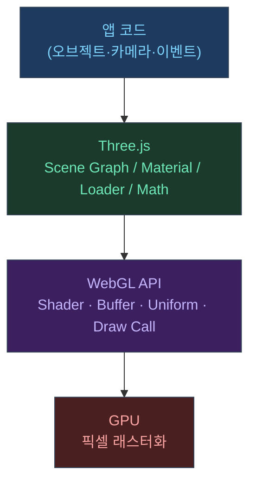

## 이 글의 관점

Three.js를 "코드 몇 줄로 3D 보여주는 도구"로만 보면 최적화에서 막힌다.  
대신 Three.js를 **WebGL 위의 추상화(엔진)**로 보면 답이 빨리 나온다.

---

## 1) WebGL은 강력하지만, 너무 저수준이다

WebGL을 직접 쓰면 해야 할 일이 폭발한다.

```javascript
// ── 순수 WebGL로 삼각형 하나를 그리는 최소 코드
const canvas = document.getElementById("c");
const gl = canvas.getContext("webgl2");

// 1) 셰이더 소스 작성 (GLSL)
const vertSrc = `
  attribute vec4 a_position;
  void main() { gl_Position = a_position; }
`;
const fragSrc = `
  precision mediump float;
  void main() { gl_FragColor = vec4(1, 0.5, 0, 1); }
`;

// 2) 셰이더 컴파일 + 링크
function compile(type, src) {
  const shader = gl.createShader(type);
  gl.shaderSource(shader, src);
  gl.compileShader(shader);
  return shader;
}
const prog = gl.createProgram();
gl.attachShader(prog, compile(gl.VERTEX_SHADER, vertSrc));
gl.attachShader(prog, compile(gl.FRAGMENT_SHADER, fragSrc));
gl.linkProgram(prog);
gl.useProgram(prog);

// 3) 버텍스 버퍼 수동 생성 + 업로드
const buf = gl.createBuffer();
gl.bindBuffer(gl.ARRAY_BUFFER, buf);
gl.bufferData(
  gl.ARRAY_BUFFER,
  new Float32Array([-0.5, -0.5, 0.5, -0.5, 0, 0.5]),
  gl.STATIC_DRAW,
);

// 4) 어트리뷰트 수동 연결
const loc = gl.getAttribLocation(prog, "a_position");
gl.enableVertexAttribArray(loc);
gl.vertexAttribPointer(loc, 2, gl.FLOAT, false, 0, 0);

// 5) 그리기
gl.drawArrays(gl.TRIANGLES, 0, 3);
// ↑ 이게 "삼각형 1개"를 그리는 데 필요한 코드 전부
```

여기서 행렬/카메라/모델 로딩/머티리얼/라이트를 전부 직접 구현해야 한다면 얼마나 걸릴까.  
Three.js는 그 모든 것을 "바로 쓸 수 있는 단위"로 묶어준다.<a href="https://threejs.org/manual/en/fundamentals.html" target="_blank"><sup>[1]</sup></a>

```javascript
// ── Three.js: 큐브 하나 추가
const geometry = new THREE.BoxGeometry(1, 1, 1);
const material = new THREE.MeshStandardMaterial({ color: 0x7dd3fc });
const mesh = new THREE.Mesh(geometry, material);
scene.add(mesh);
```

---

## 2) Three.js가 제공하는 핵심 추상화 3종 세트



- **Scene 그래프**: 오브젝트 트리/변환/계층
- **Camera**: 뷰/프로젝션/프러스텀
- **Renderer(WebGLRenderer)**: 실제 GPU 호출(그리기)

이 구조 덕분에 "UI 상태가 바뀌면 렌더를 멈춘다/재개한다" 같은 제어가 가능해진다.

---

## 3) 왜 최적화가 '렌더링'에서만 끝나지 않나

Three.js 앱이 버벅이는 원인은 보통 3가지가 섞여 나온다.

- **픽셀 비용**(고DPR, 후처리, 큰 캔버스)
- **CPU 비용**(Raycaster, 애니메이션 업데이트, 오브젝트 많음)
- **UI/레이아웃 비용**(오버레이/DOM 업데이트, 폰트/이미지 로딩)

그래서 "Three.js 최적화 글"은 결국 **브라우저 앱 최적화 글**이 된다.

---

## 관련 글

- [렌더링 파이프라인: Scene → Camera → Renderer →](/post/threejs-rendering-pipeline)
- [Three.js 포트폴리오 최적화 실전기 →](/post/threejs-portfolio-rendering-optimization-story)

---

## 참고

<a href="https://threejs.org/manual/en/fundamentals.html" target="_blank">[1] Fundamentals — Three.js Manual</a>
