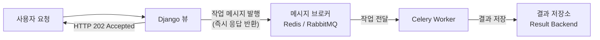
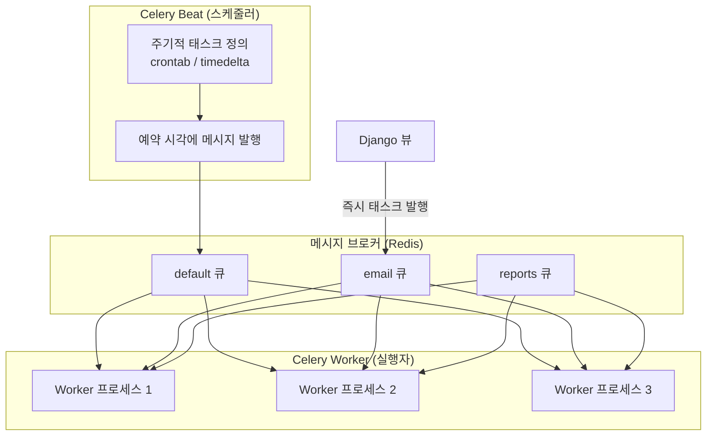
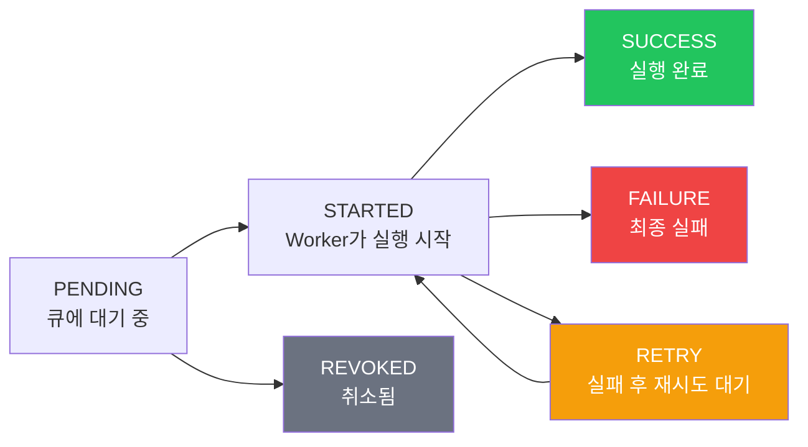

## 왜 Celery가 필요한가

Django는 요청-응답 사이클로 동작한다.
브라우저가 요청을 보내면 뷰가 처리하고 응답을 돌려준다.

문제는 **시간이 오래 걸리는 작업**이다.

- 이메일 10,000건 일괄 발송
- 외부 결제 API 호출
- 리포트 PDF 생성
- 이미지 리사이즈·썸네일 생성

이 작업들을 뷰 안에서 처리하면 브라우저는 응답을 받을 때까지 기다려야 한다.
사용자 경험이 나빠지고, 타임아웃이 발생하고, 서버 스레드가 점유된다.

**해결책**: 작업을 큐에 넣고 별도 프로세스(Worker)가 처리한다.



사용자는 즉시 응답을 받고, 실제 처리는 백그라운드에서 진행된다.

## Celery란

**Celery**는 Python으로 작성된 분산 태스크 큐 라이브러리다.[^celery-docs]
2009년 Ask Solem Hoel이 만들었으며, Django를 위해 시작됐지만 지금은 Flask, FastAPI 등에서도 쓰인다.

핵심 구성 요소 네 가지:

| 구성 요소 | 역할 | 예시 |
|----------|------|------|
| **Producer** | 태스크를 큐에 넣는 주체 | Django 뷰, 관리 명령어 |
| **Broker** | 메시지를 보관·전달하는 중간 저장소 | Redis, RabbitMQ |
| **Worker** | 큐에서 태스크를 꺼내 실행 | `celery worker` 프로세스 |
| **Result Backend** | 태스크 실행 결과 저장 | Redis, PostgreSQL, Django ORM |

## Worker vs Beat — 역할이 다르다

흔히 혼동하는 두 프로세스다.



| | Celery Worker | Celery Beat |
|--|---------------|-------------|
| **역할** | 태스크 실행 | 태스크 예약·발행 |
| **언제 실행** | 큐에 메시지가 오면 | 설정된 시각이 되면 |
| **여러 개 실행** | 가능 (권장) | 반드시 하나만 |
| **없으면** | 태스크가 쌓임 | 주기적 작업이 안 됨 |

> Beat는 **클락(시계)**이다. 스스로 태스크를 실행하지 않는다.
> 정해진 시각에 메시지를 브로커에 발행하고, Worker가 그것을 가져가 실행한다.

## 설치 및 Django 연결

```bash
pip install celery redis django-celery-beat django-celery-results
```

### 프로젝트 구조

```
myproject/
├── myproject/
│   ├── __init__.py      ← Celery app 자동 로드
│   ├── settings.py
│   └── celery.py        ← Celery 앱 정의
├── myapp/
│   └── tasks.py         ← 태스크 정의
└── manage.py
```

### celery.py 설정

```python
# myproject/celery.py
import os
from celery import Celery

os.environ.setdefault("DJANGO_SETTINGS_MODULE", "myproject.settings")

app = Celery("myproject")
app.config_from_object("django.conf:settings", namespace="CELERY")
app.autodiscover_tasks()
```

```python
# myproject/__init__.py
from .celery import app as celery_app

__all__ = ("celery_app",)
```

### settings.py — 브로커와 결과 저장소 설정

```python
# settings.py
CELERY_BROKER_URL = "redis://localhost:6379/0"
CELERY_RESULT_BACKEND = "django-db"     # django-celery-results 사용

CELERY_ACCEPT_CONTENT = ["json"]
CELERY_TASK_SERIALIZER = "json"
CELERY_RESULT_SERIALIZER = "json"
CELERY_TIMEZONE = "Asia/Seoul"

# Beat 스케줄러 (django-celery-beat)
CELERY_BEAT_SCHEDULER = "django_celery_beat.schedulers:DatabaseScheduler"

INSTALLED_APPS = [
    ...
    "django_celery_beat",
    "django_celery_results",
]
```

## 태스크 작성 — 실제 예시

### 기본 태스크

```python
# myapp/tasks.py
from celery import shared_task
from django.core.mail import send_mail

@shared_task
def send_welcome_email(user_id: int) -> str:
    from .models import User
    user = User.objects.get(pk=user_id)
    send_mail(
        subject="가입을 환영합니다",
        message=f"안녕하세요 {user.username}님",
        from_email="no-reply@example.com",
        recipient_list=[user.email],
    )
    return f"Email sent to {user.email}"
```

```python
# myapp/views.py
from .tasks import send_welcome_email

def register_view(request):
    user = User.objects.create(...)
    send_welcome_email.delay(user.id)   # 비동기 실행
    return JsonResponse({"status": "registered"})
```

`.delay()`는 태스크를 큐에 넣고 즉시 반환한다.
실제 이메일 발송은 Worker가 처리한다.

### 재시도 설정

```python
@shared_task(
    bind=True,
    autoretry_for=(Exception,),
    retry_kwargs={"max_retries": 3},
    retry_backoff=True,          # 지수 백오프: 1s → 2s → 4s
    retry_backoff_max=60,
)
def call_payment_api(self, order_id: int):
    response = requests.post("https://pay.example.com/charge", ...)
    response.raise_for_status()
    return response.json()
```

### 주기적 태스크 (Beat)

```python
# settings.py
from celery.schedules import crontab

CELERY_BEAT_SCHEDULE = {
    "send-daily-report": {
        "task": "myapp.tasks.generate_daily_report",
        "schedule": crontab(hour=8, minute=0),   # 매일 오전 8시
    },
    "cleanup-old-sessions": {
        "task": "myapp.tasks.cleanup_sessions",
        "schedule": 3600.0,                       # 1시간마다 (초 단위)
    },
}
```

## Worker 실행

```bash
# 개발 환경
celery -A myproject worker --loglevel=info

# Beat 실행 (별도 터미널)
celery -A myproject beat --loglevel=info

# 개발 편의를 위해 Worker + Beat 함께 실행 (운영 환경 비권장)
celery -A myproject worker --beat --loglevel=info

# 운영 환경: 큐별 전용 Worker
celery -A myproject worker -Q default --concurrency=4
celery -A myproject worker -Q email --concurrency=8
```

## 태스크 상태 추적

```python
# 태스크 ID로 상태 확인
result = send_welcome_email.delay(user_id=1)
print(result.id)        # "3d3b7a2c-..."
print(result.status)    # "PENDING" / "SUCCESS" / "FAILURE"
print(result.get())     # 결과값 (블로킹)
```

상태 흐름:



## 운영 환경 — Supervisor / systemd

```ini
# /etc/supervisor/conf.d/celery-worker.conf
[program:celery-worker]
command=celery -A myproject worker -Q default -c 4 --loglevel=info
directory=/var/www/myproject
user=www-data
autostart=true
autorestart=true
stopwaitsecs=600

[program:celery-beat]
command=celery -A myproject beat --scheduler django_celery_beat.schedulers:DatabaseScheduler
directory=/var/www/myproject
user=www-data
autostart=true
autorestart=true
```

## 관련 글

- [Celery Worker — 내부 구조와 동시성 모델 →](/post/celery-worker) — Worker 프로세스·스레드 모델, Prefetch, 태스크 생명주기
- [Celery Beat — 주기적 태스크 스케줄링 →](/post/celery-beat) — crontab 문법, django-celery-beat 동적 스케줄 관리
- [Celery Broker — Redis vs RabbitMQ →](/post/celery-broker) — 메시지 브로커 선택 기준과 AMQP 개념

---

[^celery-docs]: Celery Project, <a href="https://docs.celeryq.dev/en/stable/" target="_blank">공식 문서</a>
[^celery-github]: Ask Solem Hoel, Celery repository, <a href="https://github.com/celery/celery" target="_blank">GitHub</a>
[^django-celery]: Celery Django integration, <a href="https://docs.celeryq.dev/en/stable/django/first-steps-with-django.html" target="_blank">Celery Docs</a>
[^celery-beat]: Celery Beat scheduler, <a href="https://docs.celeryq.dev/en/stable/userguide/periodic-tasks.html" target="_blank">Celery Docs</a>
[^django-celery-beat]: django-celery-beat, <a href="https://github.com/celery/django-celery-beat" target="_blank">GitHub</a>
[^celery-results]: django-celery-results, <a href="https://github.com/celery/django-celery-results" target="_blank">GitHub</a>
