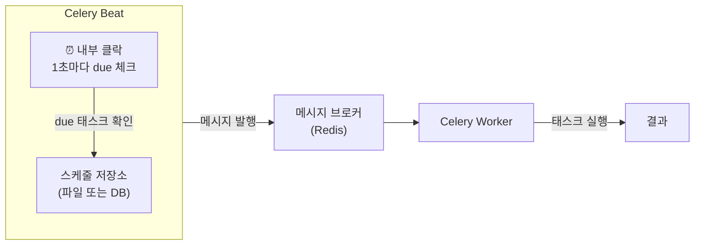
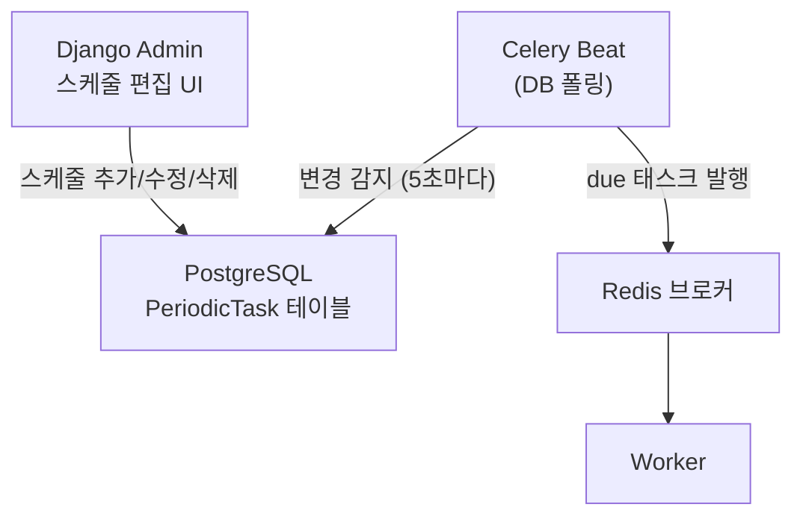

## Beat란 무엇인가

**Celery Beat**는 주기적 태스크를 예약하고 발행하는 스케줄러 프로세스다.[^beat-docs]

Beat 자체는 태스크를 실행하지 않는다.
정해진 시각이 되면 브로커에 메시지를 발행하고, 실제 실행은 [Worker](/post/celery-worker)가 담당한다.



> **중요**: Beat는 항상 **단 하나**만 실행해야 한다.
> 두 개 이상 실행하면 같은 태스크가 중복 발행된다.

## 스케줄 유형

### 1. timedelta — 일정 간격 반복

```python
from datetime import timedelta

CELERY_BEAT_SCHEDULE = {
    "check-health-every-30s": {
        "task": "myapp.tasks.health_check",
        "schedule": timedelta(seconds=30),
    },
    "cleanup-every-hour": {
        "task": "myapp.tasks.cleanup_expired_sessions",
        "schedule": timedelta(hours=1),
    },
}
```

### 2. crontab — 특정 시각 지정

```python
from celery.schedules import crontab

CELERY_BEAT_SCHEDULE = {
    # 매일 오전 8시
    "daily-report": {
        "task": "myapp.tasks.generate_daily_report",
        "schedule": crontab(hour=8, minute=0),
    },
    # 월요일 오전 9시
    "weekly-digest": {
        "task": "myapp.tasks.send_weekly_digest",
        "schedule": crontab(hour=9, minute=0, day_of_week="monday"),
    },
    # 매월 1일 자정
    "monthly-invoice": {
        "task": "myapp.tasks.generate_invoices",
        "schedule": crontab(hour=0, minute=0, day_of_month="1"),
    },
    # 평일 오전 9~18시, 매 15분마다
    "business-hours-sync": {
        "task": "myapp.tasks.sync_data",
        "schedule": crontab(
            minute="*/15",
            hour="9-18",
            day_of_week="mon-fri",
        ),
    },
}
```

### crontab 파라미터

| 파라미터 | 의미 | 예시 |
|---------|------|------|
| `minute` | 분 (0-59) | `"*/15"` → 15분마다 |
| `hour` | 시 (0-23) | `"9-18"` → 9시~18시 |
| `day_of_week` | 요일 (0=일, mon-fri) | `"monday"` |
| `day_of_month` | 날짜 (1-31) | `"1,15"` → 1일, 15일 |
| `month_of_year` | 월 (1-12) | `"1,7"` → 1월, 7월 |

### 3. solar — 일출/일몰 기반

```python
from celery.schedules import solar

CELERY_BEAT_SCHEDULE = {
    "at-sunrise": {
        "task": "myapp.tasks.morning_task",
        "schedule": solar("sunrise", latitude=37.5665, longitude=126.9780),
    },
}
```

## 스케줄 저장 방식

Beat는 마지막 실행 시각을 저장해 재시작 후에도 중복 실행을 방지한다.

### 기본 방식 — 파일

```bash
celery -A myproject beat --schedule=/var/run/celerybeat-schedule
```

`celerybeat-schedule` 파일에 마지막 실행 시각을 저장한다.
설정을 변경하려면 Beat를 재시작해야 한다.

### django-celery-beat — DB 기반 동적 스케줄

```bash
pip install django-celery-beat
python manage.py migrate
```

```python
# settings.py
CELERY_BEAT_SCHEDULER = "django_celery_beat.schedulers:DatabaseScheduler"
```

장점:[^django-celery-beat-docs]
- Django Admin에서 스케줄을 **실시간 수정** 가능
- Beat 재시작 없이 태스크 추가/삭제/수정
- 다중 서버 환경에서도 스케줄 공유



```python
# 코드에서 동적으로 스케줄 추가
from django_celery_beat.models import PeriodicTask, CrontabSchedule
import json

schedule, _ = CrontabSchedule.objects.get_or_create(
    minute="0",
    hour="9",
    day_of_week="mon-fri",
    day_of_month="*",
    month_of_year="*",
    timezone="Asia/Seoul",
)

PeriodicTask.objects.create(
    crontab=schedule,
    name="매일 아침 리포트",
    task="myapp.tasks.generate_daily_report",
    args=json.dumps([]),
    kwargs=json.dumps({"send_email": True}),
    enabled=True,
)
```

## 태스크에 인자 전달

```python
CELERY_BEAT_SCHEDULE = {
    "weekly-report-kr": {
        "task": "myapp.tasks.generate_report",
        "schedule": crontab(hour=8, minute=0, day_of_week="monday"),
        "args": ("weekly",),
        "kwargs": {"region": "KR", "format": "pdf"},
    },
}
```

## Beat 실행 명령

```bash
# 기본 실행
celery -A myproject beat --loglevel=info

# 파일 기반 스케줄 저장 위치 지정
celery -A myproject beat \
  --scheduler celery.beat:PersistentScheduler \
  --schedule /var/run/celerybeat-schedule

# django-celery-beat (DB 기반)
celery -A myproject beat \
  --scheduler django_celery_beat.schedulers:DatabaseScheduler \
  --loglevel=info
```

## 자주 하는 실수

### Beat를 여러 개 실행

```bash
# 잘못된 예: 두 서버에서 동시 실행
server1$ celery -A myproject beat &
server2$ celery -A myproject beat &   # 태스크 중복 발행!
```

해결: Beat는 반드시 단일 프로세스. 고가용성이 필요하면 Redis 분산 락을 활용한 `redbeat` 사용을 검토한다.[^redbeat]

### Worker 없이 Beat만 실행

Beat가 발행하는 메시지를 처리할 Worker가 없으면 메시지가 큐에 쌓인다.
Beat와 Worker는 항상 함께 실행해야 한다.

## 관련 글

- [Django + Celery 개요 →](/post/celery-django) — Celery 전체 설정과 주기적 태스크 기본 예시
- [Celery Worker — 내부 구조와 동시성 모델 →](/post/celery-worker) — Beat가 발행한 태스크를 실행하는 Worker
- [Celery Broker — Redis vs RabbitMQ →](/post/celery-broker) — Beat가 메시지를 발행하는 브로커

---

[^beat-docs]: Celery Periodic Tasks, <a href="https://docs.celeryq.dev/en/stable/userguide/periodic-tasks.html" target="_blank">Celery Docs</a>
[^crontab-docs]: Celery crontab schedules, <a href="https://docs.celeryq.dev/en/stable/reference/celery.schedules.html#celery.schedules.crontab" target="_blank">Celery Docs</a>
[^django-celery-beat-docs]: django-celery-beat documentation, <a href="https://django-celery-beat.readthedocs.io/en/latest/" target="_blank">Read the Docs</a>
[^redbeat]: redbeat — Redis-based Celery Beat scheduler, <a href="https://github.com/sibson/redbeat" target="_blank">GitHub</a>
